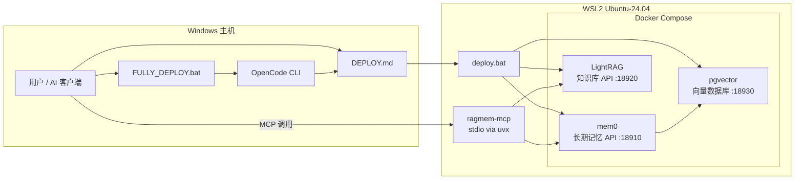
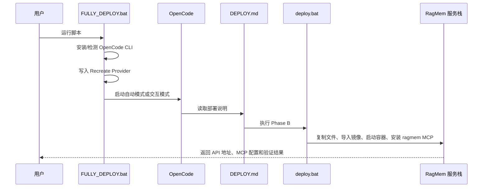

# RagMem

> 面向团队 AI 的沙盘记忆基础设施。
> 它把长期记忆、项目知识库、MCP 接入和自动部署流程打包成一套可在 Windows + WSL2 中落地的系统。

## 一眼看懂

RagMem 不是单个服务，而是一条完整的交付链路：

```text
FULLY_DEPLOY.bat
  -> 安装/配置 OpenCode CLI
  -> 启动 AI 执行 DEPLOY.md
  -> DEPLOY.md 调用 deploy.bat 完成 Phase B 部署
  -> WSL2 + Docker 启动 mem0 / LightRAG / pgvector
  -> ragmem-mcp 通过 MCP 把能力暴露给 AI 客户端
```

这意味着它交付的不只是后端，而是一个“让 AI 自己把记忆系统部署起来”的可执行方案。

## 它解决什么问题

| 问题 | RagMem 的做法 | 结果 |
|------|---------------|------|
| AI 会话结束就失忆 | 用 `mem0` 保存偏好、决策和项目上下文 | AI 能跨会话延续记忆 |
| 文档很多但检索困难 | 用 `LightRAG` 建立知识库与查询接口 | AI 能基于项目资料回答问题 |
| 沙盘环境部署麻烦 | 用 WSL2、Docker、离线镜像和批处理脚本封装流程 | 可在受限环境中复制部署 |
| AI 客户端接入不统一 | 用 `ragmem-mcp` 暴露统一 MCP 工具 | Roo、Cursor、Claude、OpenCode 都能接入 |

## 从 `DEPLOY.md` 与 `FULLY_DEPLOY.bat` 看系统

| 文件 | 系统角色 | 实际职责 | 结论 |
|------|----------|----------|------|
| `FULLY_DEPLOY.bat` | 最外层启动器 | 安装 OpenCode CLI、写入默认 Provider、选择自动或交互模式启动 OpenCode | 它解决“先把 AI 部署入口准备好” |
| `DEPLOY.md` | 部署剧本 | 定义 Phase A 联网准备、Phase B 沙盘内部署、MCP 配置、端到端验证、可选 Unity 扩展 | 它是整个系统的标准操作说明 |
| `local-ragmem/stack/deploy.bat` | 真正执行器 | 检查 WSL2/Docker、复制文件到 WSL2、加载镜像、启动 Compose、安装 Python/uv/ragmem MCP | 它才是真正把 RagMem 落到机器上的脚本 |

> 设计关键点
>
> `FULLY_DEPLOY.bat` 负责“让 AI 能开始部署”，`DEPLOY.md` 负责“告诉 AI 怎么部署”，`deploy.bat` 负责“真的把服务部署出来”。

## 系统架构



## 部署链路



## 运行时组件

| 组件 | 技术 | 职责 | 关键依赖 |
|------|------|------|----------|
| `mem0` | FastAPI | 保存用户偏好、决策和会话记忆 | LiteLLM、Embedding、pgvector |
| `LightRAG` | FastAPI | 索引文本/文件并提供 RAG 查询 | LiteLLM、Embedding |
| `pgvector` | PostgreSQL + vector | 为 mem0 提供向量检索与持久化 | Docker volume |
| `ragmem-mcp` | Python + FastMCP | 向 AI 客户端暴露 `memory_*` 与 `rag_*` 工具 | mem0、LightRAG |
| `FULLY_DEPLOY.bat` | Windows Batch | 配好 OpenCode 与默认 Provider | Windows 终端环境 |
| `DEPLOY.md` | Markdown Runbook | 统一 AI 与人工的部署流程 | LLM 或人工执行 |
| `deploy.bat` | Windows Batch | 完成 WSL2 内部的实际部署 | WSL2、Ubuntu-24.04、Docker |

## 为什么它适合沙盘环境

| 设计点 | 作用 |
|--------|------|
| Phase A / Phase B 分离 | 联网机器负责准备镜像，沙盘机器负责离线部署 |
| `images/*.tar` 预构建镜像 | 避免沙盘内临时拉镜像 |
| WSL2 内运行 `ragmem-mcp` | 规避沙盘里 Windows 无法稳定访问 WSL2 `localhost` 的问题 |
| `.env.example` 预置团队标准值 | 让 LLM 可以直接生成 `.env` 并继续部署 |
| `FULLY_DEPLOY.bat` 自动装 OpenCode | 新机器不需要先手动准备 AI CLI |

## 部署完成后能得到什么

### 1. 长期记忆能力

- `memory_add`
- `memory_search`
- `memory_list`
- `memory_delete`

### 2. 知识库能力

- `rag_index_text`
- `rag_index_file`
- `rag_query`
- `rag_list_documents`

### 3. 系统健康检查

- `ragmem_health`

## 推荐使用方式

| 场景 | 推荐入口 |
|------|----------|
| 新机器，希望从零开始自动装好 AI CLI 和 RagMem | 运行 `FULLY_DEPLOY.bat` |
| 已有任意 AI 客户端，只想让 AI 接管部署 | 在项目根目录中让 AI 执行 `DEPLOY.md` |
| 只需要重跑后端部署流程 | 运行 `local-ragmem\stack\deploy.bat` |

## 仓库结构

```text
.
├── FULLY_DEPLOY.bat              # OpenCode 安装与自动部署入口
├── DEPLOY.md                     # 标准部署剧本
├── local-ragmem/
│   ├── prepare-images.sh         # 联网环境镜像准备
│   ├── mcp-server/               # ragmem-mcp 源码
│   └── stack/
│       ├── deploy.bat            # RagMem 后端实际部署
│       ├── docker-compose.yml    # mem0 + LightRAG + pgvector
│       └── .env.example          # 环境变量模板
├── unity-agent-rules/            # Unity 项目的 AI 规则与技能
└── unity-mcp-setup/              # Unity MCP 安装工具与离线包
```

## 文档入口

- [DEPLOY.md](DEPLOY.md): 完整部署流程
- [MCP-MANUAL-CONNECT.md](MCP-MANUAL-CONNECT.md): 手动接入 MCP
- [local-ragmem/stack/README.md](local-ragmem/stack/README.md): RagMem 服务栈说明
- [local-ragmem/mcp-server/README.md](local-ragmem/mcp-server/README.md): ragmem MCP 说明

## 未来规划与路线图

以下内容描述的是 RagMem 的后续演进方向，不代表当前版本已经完整实现。

当前版本仍以单机/单栈部署为主。记忆层虽然已经按 `user_id`/`agent_id` 做逻辑分域，但 MCP 默认只挂一个 `RAGMEM_USER_ID`，知识库也还是单份 `LightRAG` 本地目录，因此还没有形成真正的云端多租户架构。

| 方向 | 可行性 | 当前基础 | 主要缺口 |
|------|--------|----------|----------|
| 云端 Docker 部署 + 多人共享知识库 + 租户隔离记忆 | 高 | 已有 Docker 化服务、mem0 分域字段、MCP 统一入口 | 缺少 `tenant_id/workspace_id` 路由、共享库/私有库分层、对象存储或数据库级隔离、鉴权与配额 |
| 多层记忆沉淀 + 自动强化/清理 | 中高 | mem0 已有 `metadata`、`run_id`、`memory_type` 这类可扩展字段基础 | 缺少记忆生命周期任务、强化评分、去重归并、TTL/归档和低价值知识淘汰策略 |

推荐顺序是先把“租户/工作区”作为一等数据模型做出来，再在其上叠加“短期记忆 → 摘要记忆 → 稳定事实”的多层沉淀流程。前者更偏工程架构，难点明确；后者更偏策略与产品调优，适合在单租户环境先验证，再逐步推广到云端。

## 一句话总结

RagMem 的本质不是“把 mem0 和 LightRAG 放进 Docker”这么简单，而是把部署入口、执行脚本、运行时服务和 AI 接入协议整合成一套可复制、可交付、可由 LLM 自主执行的团队记忆系统。
