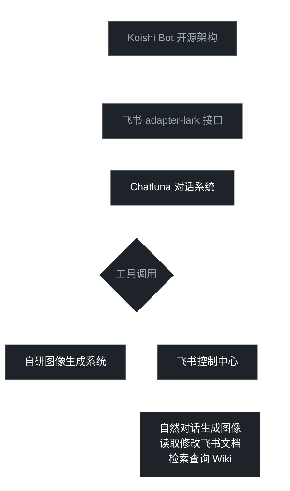

# AI 能力全景概览

  <strong>当前能力矩阵 · 应用成果 · 未来演进</strong>

---

 

## 飞书 AI 会议总结

### 知识问答

飞书基于自有数据库权限体系，可访问用户全部聊天数据（含私聊）。该能力依赖飞书底层数据架构，第三方开发无法达到同等效果。

### 会议总结

<table>
<tr>
<th width="20%">场景</th>
<th width="15%">状态</th>
<th width="65%">说明</th>
</tr>
<tr>
<td>网络会议</td>
<td>已上线</td>
<td>自动生成会议纪要与待办事项</td>
</tr>
<tr>
<td>线下会议</td>
<td>需人工记录</td>
<td>当前版本暂不支持自动识别</td>
</tr>
<tr>
<td>硬件方案</td>
<td>可采购测试</td>
<td>飞书 × Anker AI录音豆，支持线下会议自动转写与总结</td>
</tr>
</table>

---

 

## RagMem 系统

> LightRAG + Mem0 双开源引擎组合

### 核心能力状态

| 模块 | 成熟度 | 说明 |
|------|:------:|------|
| 知识库 | 生产级 | 已完成跨平台读取验证 |
| 记忆库 | 验证中 | 需长期使用验证可靠性 |
| 部署框架 | 生产级 | 支持从零开始的一键部署 |
| 云端存储 | 规划中 | 需产品化开发，参考 LLMLite 域内云服务模式 |

### 可选组件：Unity MCP

- **用途**：Unity Debug / 性能监测
- **状态**：待验证，需实际项目检验可靠性与实用性

---

 

## 自研飞书 Bot

### 架构分层

> **核心技术栈**：Koishi Bot 框架 + 飞书 Lark 适配器 + Chatluna 对话引擎  
> **调用方式**：图像生成与飞书控制以工具形式注入对话上下文，实现多轮对话衔接

### 图像生成能力

| 特性 | 实现 |
|------|------|
| 模型切换 | GPT / Gemini 实时切换，可扩展其他图像/视频模型 |
| 交互方式 | 类 Gemini 对话窗口，自然语言驱动生成 |

### 应用成果

<table>
<tr>
<th width="18%">应用领域</th>
<th width="82%">应用场景</th>
</tr>
<tr>
<td><strong>3D场景</strong></td>
<td>图像生成已小规模应用，形成较为稳定的工作流，搭配 Tripo 3D 已有图像 → 模型的生产链路</td>
</tr>
</table>

> 注：如需统计使用用户及用量查询，可开发统计层插件对接

---

 

## AI 游戏产品：极速开发验证

### 效率对比

<table>
<tr>
<th width="25%">维度</th>
<th width="37%">历史方案</th>
<th width="38%">当前能力</th>
</tr>
<tr>
<td>原型周期</td>
<td>6 个月</td>
<td><strong>1 周</strong></td>
</tr>
<tr>
<td>美术资产</td>
<td>人工制作</td>
<td>AI 迭代生成</td>
</tr>
<tr>
<td>功能开发</td>
<td>3~5人外包团队</td>
<td>1人 + Claude + Kimi Code</td>
</tr>
</table>

**预览地址**：[https://akawg.baka-akari.zone:18443/games/eovoy/dev.html](https://akawg.baka-akari.zone:18443/games/eovoy/dev.html)

---

 

## AI 流程推进瓶颈

### 工具本质与学习门槛

AI 仍是工具，部署简化不等于使用零成本。用户需要：

| 层面 | 具体内容 |
|------|----------|
| 使用理解 | 掌握 Prompt 工程、多轮对话技巧、结果筛选与修正 |
| 规则建立 | 明确 LLM 的适用边界、输出审核机制、人机分工标准 |
| 信任条件 | 在反复试错中建立对 AI 能力边界的准确预期，形成可靠协作关系 |

> 一键部署解决的是技术门槛，不是认知门槛。

### 惯性与路径依赖

**案例**：图像生成已支持 Gemini/GPT 手动切换，但仍有需求要求接入 Midjourney —— 理由并非性能或效果，而是"用惯了"。工具迭代再快，也难以打破已形成的工作惯性。

> 技术可以满足需求，但无法替代用户迈出第一步的意愿。

### 核心障碍

| 表象 | 本质 |
|------|------|
| "不可靠" "能力差" "不如人类准确" | 缺乏对 AI 能力边界与适用场景的系统认知 |

> 工具开发得再便捷，也无法替代使用意愿。流程优化最终是人的问题，不是技术问题。

---

 

## 未来演进路线

### RagMem 产品化

| 方向 | 目标 |
|------|------|
| 企业级身份 | 降低使用门槛，统一知识库与记忆库管理 |
| 商业化 | 填补市场空白：跨 Agent 的统一知识记忆库产品 |

### 飞书 Bot 强化

<table>
<tr>
<th width="12%">优先级</th>
<th width="35%">功能</th>
<th width="53%">说明</th>
</tr>
<tr>
<td>P1</td>
<td>3D 生成 API + 聊天窗口 3D 预览</td>
<td>深化美术协作流程</td>
</tr>
<tr>
<td>P2</td>
<td>扩展飞书文档编辑类型</td>
<td>通用能力提升</td>
</tr>
<tr>
<td>P3</td>
<td>飞书项目接入（项目管理协作）</td>
<td>跨系统打通</td>
</tr>
<tr>
<td><strong>高频需求</strong></td>
<td>SVN 自动 Review</td>
<td rowspan="2">据反馈，当前团队最迫切的两项功能</td>
</tr>
<tr>
<td><strong>高频需求</strong></td>
<td>TeamCity 错误精准定位</td>
</tr>
</table>

### 飞书生态整合

> **当前痛点**：飞书聊天与飞书项目分属不同部门，生态割裂
>
> **解决路径**：自研飞书 Bot → Claude → MCP 协议 → 飞书项目，实现流程自动化衔接

### AI 游戏产品

> **核心目标**：从「局部 AI 补丁」转向「全流程 AI 驱动」

- 极小团队快速迭代验证新产品路线
- 极低成本拓展产品矩阵
- 真正落地 AI 推进项目开发的可行性验证

---

 

## 术语表

| 术语 | 全称 | 说明 |
|------|------|------|
| RAG | Retrieval-Augmented Generation | 检索增强生成 |
| Mem0 | Memory System | 记忆系统，开源方案 |
| MCP | Model Context Protocol | 模型上下文协议 |
