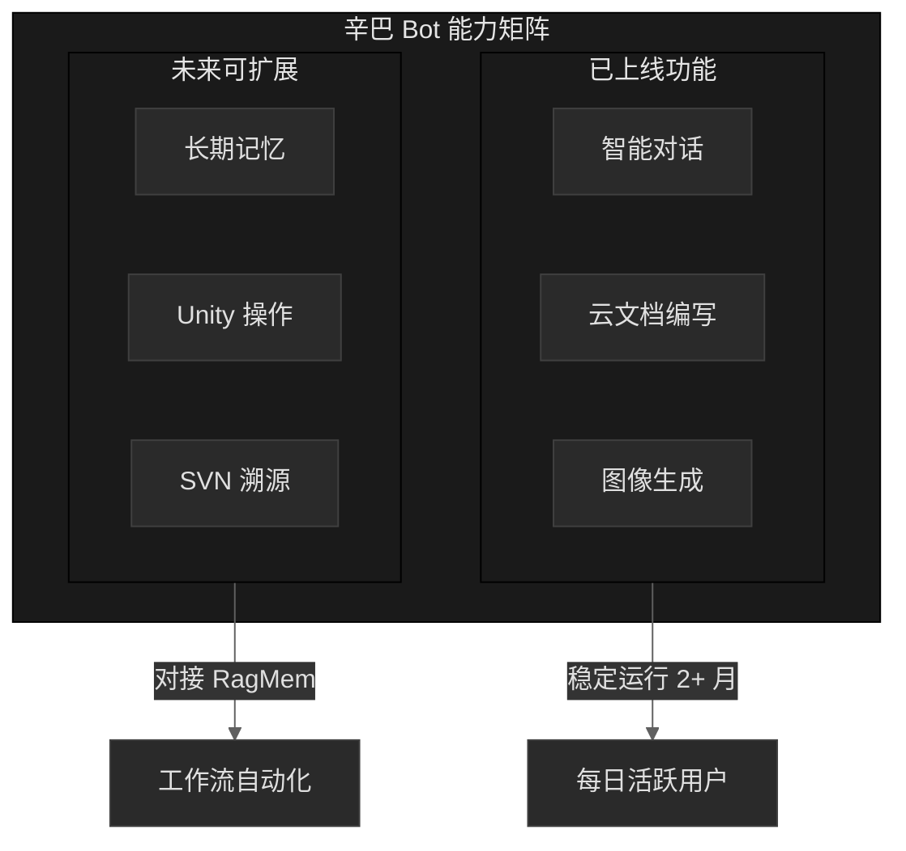
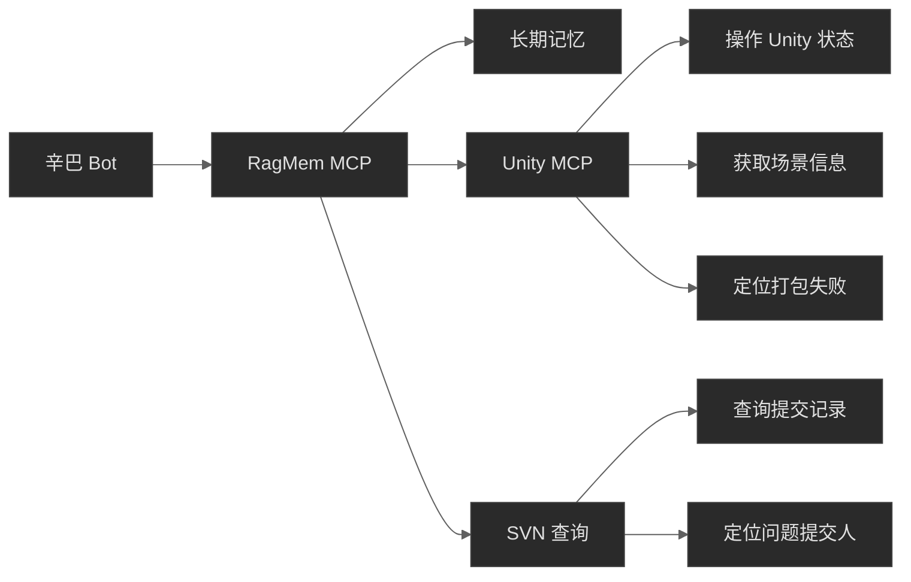

# 辛巴飞书 Bot 技术架构与使用情况报告

---

## 辛巴能力概览

---

## 一、辛巴是什么

**一句话定义**：辛巴是运行在团队虚拟机上的飞书智能 Bot，不依赖飞书官方 AI，具备高度可定制能力。

**核心特点**：

| 特点 | 说明 |
|:-----|:-----|
| 自托管 | 运行在团队自有虚拟机，数据可控 |
| 多模型 | 支持 OpenAI、Deepseek、Claude 等多种 LLM |
| 可扩展 | 通过 Tool Calling 机制可开发任意功能 |
| 已验证 | 核心功能已稳定运行超过 2 个月 |

---

## 二、当前功能与使用情况

### 2.1 功能列表

| 功能 | 描述 | 使用状态 | 运行时长 |
|:-----|:-----|:--------:|:--------:|
| **智能对话** | 多模型 AI 对话，支持上下文理解 | 每日使用 | 2+ 月 |
| **云文档编写** | 读取、创建、编辑飞书文档 | 每日使用 | 2+ 月 |
| **图像生成** | GPT-4o / Banana 图像生成 | 每日使用 | 2+ 月 |

### 2.2 功能详解

#### 智能对话
- 支持私聊和群聊
- 分用户保存对话记忆
- 支持多种模型切换

#### 云文档编写
- 根据对话内容自动生成文档
- 读取已有文档进行编辑
- 支持多轮交互完善文档

#### 图像生成
- 支持 GPT-4o 原生图像生成
- 支持 Banana 图像服务
- 可通过对话方式描述需求

---

## 三、与飞书官方 AI 的对比

### 3.1 核心差异

| 维度 | 辛巴 Bot | 飞书官方 AI |
|:-----|:---------|:------------|
| **使用范围** | 飞书内可用，未来可扩展到其他平台 | 仅限飞书 App 内 |
| **模型选择** | OpenAI、Deepseek、Claude 等多模型 | 仅限豆包/部分国产模型 |
| **功能扩展** | 可开发任意自定义功能 | 固定功能，无法扩展 |
| **记忆能力** | 分用户中期记忆，可升级长期记忆 | 基础记忆能力 |
| **部署方式** | 团队自托管，数据可控 | 飞书云端，不可控 |

### 3.2 辛巴的独特优势

> **开放性**：不受限于飞书平台，核心是虚拟机自托管，可灵活对接其他系统。

> **可定制性**：可根据团队需求开发任意功能，如云文档编写、图像生成等。

> **模型灵活性**：可根据场景选择最优模型，不受限于单一供应商。

---

## 四、未来规划与可能性

### 4.1 对接 RagMem 系统

辛巴可对接 **RagMem**（团队记忆基础设施），实现：

| 能力 | 价值 |
|:-----|:-----|
| 长期记忆 | 跨会话持久化，不再"每次从零开始" |
| 知识库 | 访问团队项目知识库，基于 RAG 回答问题 |
| 统一记忆层 | 多用户、多场景共享记忆 |

### 4.2 Unity MCP Server 集成

通过 RagMem 对接 **Unity MCP Server**，实现游戏开发工作流自动化：

| 场景 | 能力 |
|:-----|:-----|
| Unity 操作 | 通过 Bot 指令操作 Unity 编辑器 |
| 场景查询 | 获取 Unity 场景对象、组件信息 |
| 打包失败定位 | 分析日志，定位到具体提交人和提交记录 |
| SVN 溯源 | 查询文件历史、比对版本 |

### 4.3 技术路径

---

## 五、总结

> **辛巴的核心价值**：团队自有的、可控的、可扩展的智能助手，不依赖飞书官方 AI，可根据团队需求持续进化。

**当前状态**：
- ✅ 已稳定运行 2+ 月
- ✅ 每日活跃用户在使用
- ✅ 云文档编写、图像生成等功能已验证有效

**未来潜力**：
- 🔄 对接 RagMem 系统，获得长期记忆能力
- 🔄 集成 Unity MCP，实现游戏开发工作流自动化
- 🔄 成为团队 AI 基础设施的关键入口

---

*辛巴 — 团队自有的飞书智能助手*  
*持续进化中*

