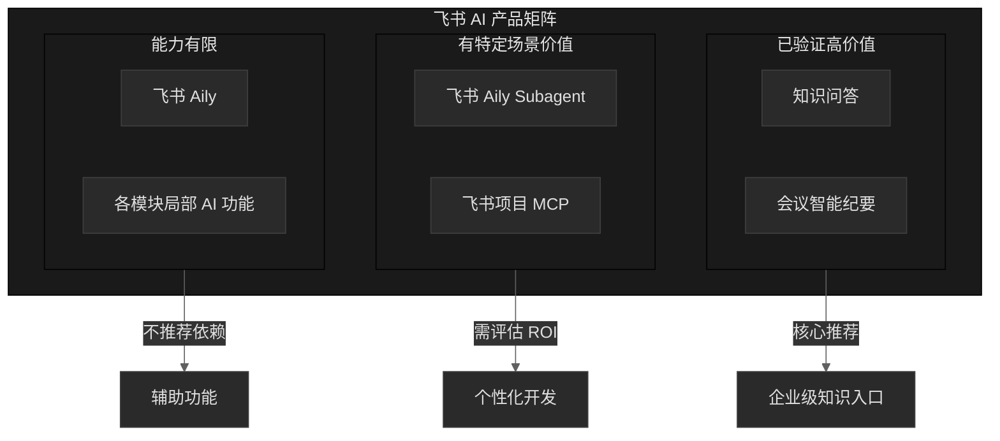
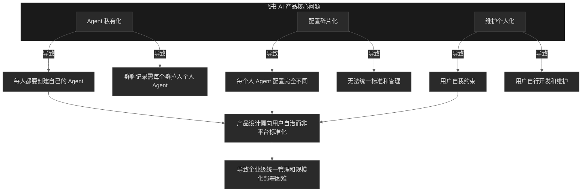

# 飞书 AI 功能产品调研报告

---

## 飞书 AI 产品矩阵概览

---

## 一、知识问答

**产品定位**：企业级知识查询入口

**核心能力**：
- 自动聚合企业内用户职权范围内的所有信息
- **包含私聊信息**，实现真正的全域知识检索
- 无需配置，开箱即用

**产品评价**：
> 目前飞书**最有用的 AI 产品**，作为个人可访问的企业级知识查询入口体验良好。

**使用建议**：
- 已购买用户应充分利用，作为日常信息检索首选入口
- 适合快速了解企业内已有信息，减少重复沟通

---

## 二、会议智能纪要

**产品定位**：会议内容自动记录与归档

**核心能力**：
- 实时语音转文字（STT）
- 自动提炼会议纪要
- 生成可供追溯和审阅的会议文档
- 准确率较高

**限制条件**：
- **必须使用飞书会议功能**才能记录
- 线下会议无法直接记录

**使用体验**：
> 飞书会议自带的智能纪要功能已验证，准确率和实用性均达标，是会议场景的刚需功能。

**线下扩展方案**：
> 对于线下会议场景，市场上有集成飞书会议的智能麦克风硬件，可实现：
> - 点按开始录音
> - 结束后自动汇总会议纪要
> 
> **建议**：可采购几个试用，验证物理设备与飞书会议纪要的整合效果

---

## 三、飞书 Aily Subagent

**产品定位**：个人自定义 Agent 应用

**技术本质**：套壳的云端 Claw

**模型选择**：
- 可选几个国产云端 LLM（含 Kimi-2.5k）
- **无法配置本地 LLM**

**能力边界**：
- 可做一些简单的文本处理和飞书文档操作
- 因可使用 Kimi-2.5k，专业能力比原生飞书 Aily 略好
- 可靠性一般

**适用场景**：
- 个人轻量级自动化任务
- 对数据安全要求不高的场景

---

## 四、飞书项目 MCP

**产品定位**：飞书项目的标准化接口能力

**接入方式**：
- 可接入飞书 Bot
- 可接入飞书 Claw
- 可接入支持 MCP 的终端

**使用成本**：
- **需要每个用户自己搭建和维护**
- 个性化开发工作量大
- 维护成本极高

**使用建议**：
> 需根据项目管理组的**具体问题和场景**评估开发价值和 ROI，非开箱即用方案。

---

## 五、飞书 Aily

**产品定位**：飞书官方云端 Agent

**模型限制**：
- **只能使用豆包 LLM**
- 无其他模型可选

**能力边界**：
- 简单的文本文字处理
- 基础的飞书文档功能调用和编辑
- 可靠性一般偏下

**配置限制**：
- **没有配置选项可以调整**
- 灵活性极低

**产品评价**：
> 能力有限，可靠性不足，不推荐作为生产环境依赖。

---

## 六、各模块局部 AI 功能

**产品形态**：
- 自动填充
- 自动文案生成
- 表单智能识别等

**产品评价**：
> 零散的小型辅助功能，**用处不大**，属于锦上添花而非核心能力。

---

## 核心产品问题诊断

### 系统性设计缺陷

### 具体问题表现

| 问题 | 表现 | 影响 |
|:-----|:-----|:-----|
| **Agent 私有化** | 每个用户必须创建属于自己的 Agent | 重复造轮子，资源浪费 |
| **群聊接入成本** | 想要记录群聊内容，每个群每个人都要拉自己的 Agent 机器人 | 边际成本极高，无法规模化 |
| **配置碎片化** | 每个人 Agent 的配置情况完全不同 | 无法统一规范和质量标准 |
| **维护个人化** | 只能让用户自我约束和自行开发维护 | 技术门槛高，可靠性差 |

### 总结

> 飞书 AI 产品的设计理念偏向"**用户自治**"而非"**平台标准化**
> 
> 这种设计导致：
> - 个人用户需自行维护 Agent
> - 企业级统一配置实现困难
> - 规模化使用成本较高
> 
> 企业在引入时需评估运维投入产出比。

---

## 产品选型建议

| 产品 | 推荐度 | 适用场景 | 注意事项 |
|:-----|:------:|:---------|:---------|
| **知识问答** | ▓▓▓ | 企业知识检索首选 | 已购买则充分利用 |
| **会议智能纪要** | ▓▓▓ | 会议记录刚需 | 飞书会议功能已验证有效；物理智能麦克风待试用评估 |
| **Aily Subagent** | ▓▓ | 个人轻量自动化 | 无法使用本地 LLM，数据安全需评估 |
| **项目 MCP** | ▓ | 特定项目管理场景 | 需评估个性化开发 ROI |
| **Aily** | ▓ | 简单文本处理 | 可靠性低，不推荐生产依赖 |
| **局部 AI 功能** | ▓ | 偶尔使用 | 非核心能力，期望值放低 |

> **推荐度图例**：▓▓▓ 强烈推荐 · ▓▓ 可用 · ▓ 不推荐依赖

---

*本文档基于飞书 AI 产品实际调研整理*  
*产品能力和限制以飞书官方最新版本为准*

