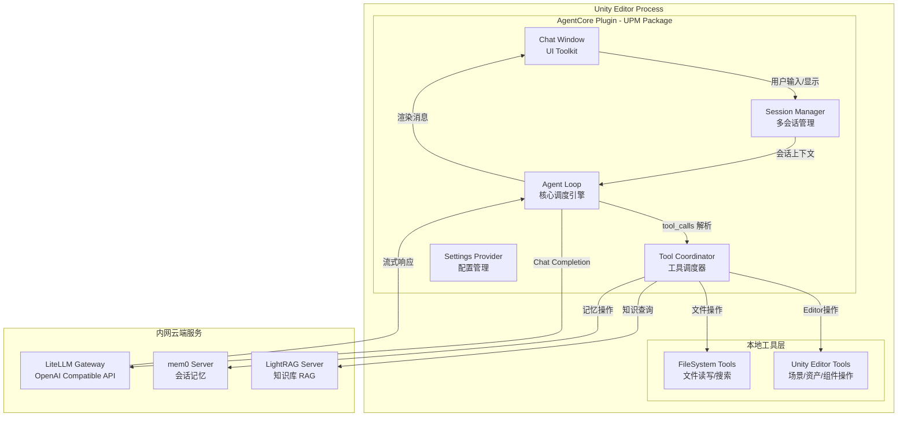
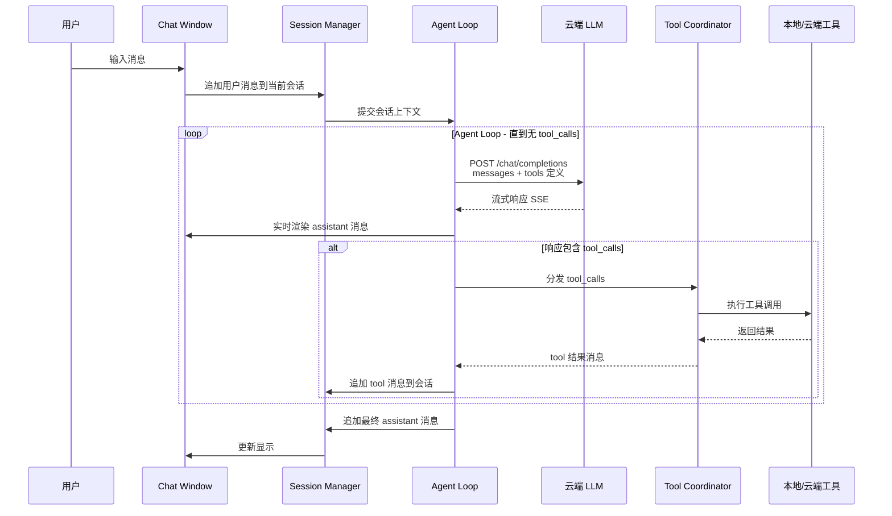
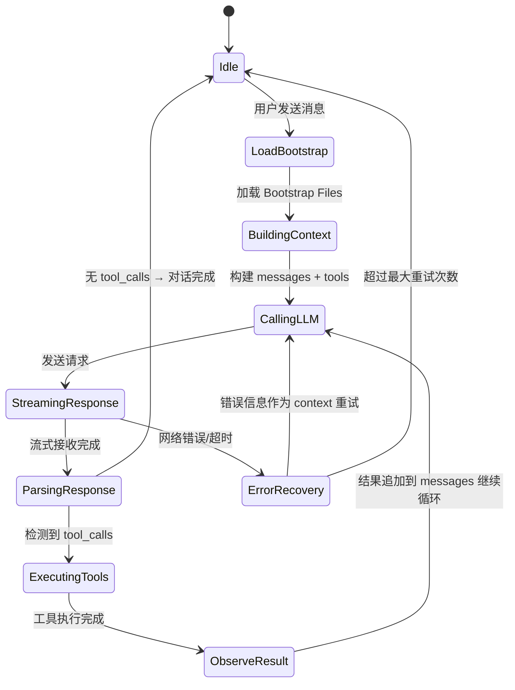
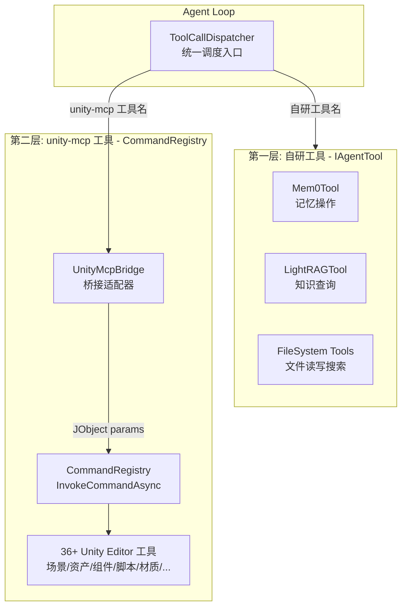
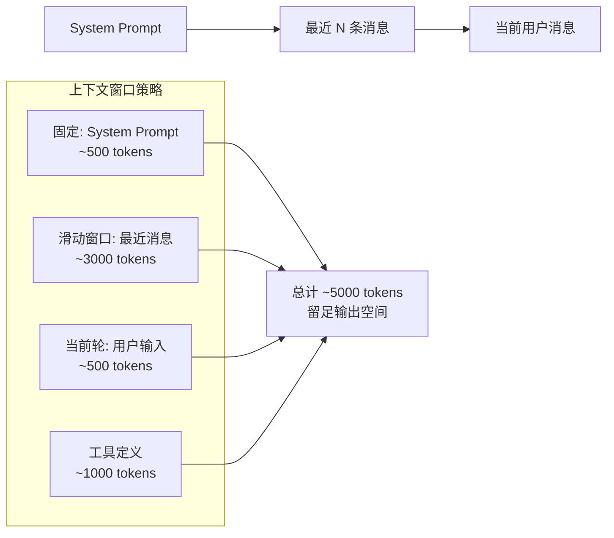
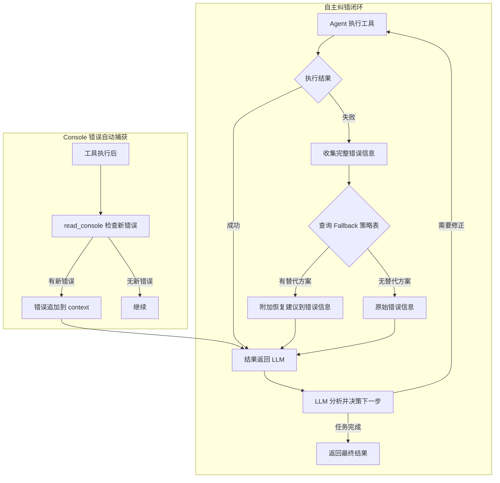
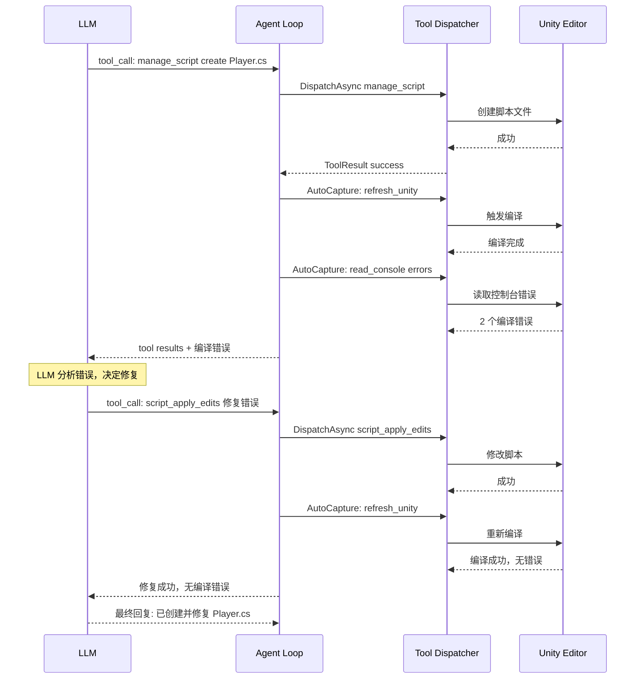
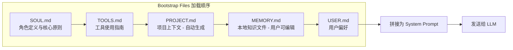
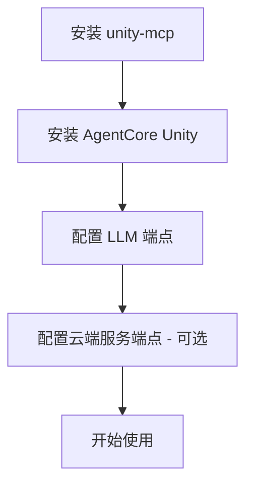
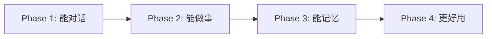

# Unity Agent Plugin — 完整架构设计

> **版本**: 1.0.0-draft | **日期**: 2026-04-20
>
> 将 agentcore-unity 工作区重构为一个 Unity Editor 内的 AI Agent 插件，
> 提供 ChatGPT 风格的对话窗口，通过云端 LLM + MCP 服务辅助 Unity 开发。

---

## 1. 设计目标与约束

### 1.1 核心目标

| # | 目标 | 说明 |
|---|------|------|
| G1 | **对话式 AI 助手** | Unity Editor 内嵌 ChatGPT 风格对话窗口 |
| G2 | **多会话管理** | 支持多个独立对话标签页，可切换/归档 |
| G3 | **云端服务集成** | LLM、mem0、LightRAG 均由管理员部署在内网云端 |
| G4 | **本地工具调用** | 文件系统操作 + Unity Editor 操作（通过 MCP） |
| G5 | **零运维用户体验** | 用户只需配置云端端点，无需本地 Docker/WSL2 |
| G6 | **UPM 包分发** | 标准 Unity Package Manager 格式，一键安装 |

### 1.2 已确认的架构决策

| 决策 | 选择 | 理由 |
|------|------|------|
| 客户端模式 | **厚客户端** | Agent 循环在 Unity Editor 进程中运行，避免多用户会话记忆混杂 |
| LLM 调用 | **OpenAI 兼容 API** | 通过 LiteLLM 网关，支持任意后端模型 |
| 云端服务 | **HTTP REST 直连** | mem0/LightRAG 已有 REST API，无需 MCP 协议包装 |
| Unity 工具 | **复用 CoplayDev/unity-mcp** | 作为依赖包安装，直接调用 CommandRegistry API |
| UI 框架 | **UI Toolkit** | 现代 Unity Editor UI 方案，支持 USS 样式 |
| 会话持久化 | **本地 JSON 文件** | 存储在 `Library/AgentCore/` 下，不进版本控制 |

### 1.3 约束条件

- Unity 2021.3 LTS+ 兼容（UI Toolkit 在 2021.3 已可用于 Editor）
- 纯 Editor 插件，不影响 Runtime 构建
- 所有网络请求异步执行，不阻塞 Unity 主线程
- 敏感信息（API Key）不进版本控制
- 依赖 CoplayDev/unity-mcp 包（v9.5.3 for Unity 2021-2023, v9.6.2 for Unity 6+）

---

## 2. 系统架构总览

### 2.1 架构图



### 2.2 数据流序列图



---

## 3. UPM 包结构

```text
com.agentcore.unity/
├── package.json                          # UPM 包描述
├── CHANGELOG.md
├── LICENSE.md
├── README.md
│
├── Editor/
│   ├── AgentCore.Editor.asmdef           # Editor 程序集定义
│   │
│   ├── Core/                             # 核心引擎
│   │   ├── AgentLoop.cs                  # Agent 循环调度器（B1: 错误即信息模式）
│   │   ├── AgentContext.cs               # 会话上下文构建器
│   │   ├── MessageTypes.cs              # 消息数据模型
│   │   ├── ToolCallDispatcher.cs         # tool_calls 解析与分发
│   │   ├── ErrorInfoCollector.cs         # B1: 工具失败错误信息收集器
│   │   ├── AutoCapturePolicy.cs          # B4: 自动编译检查策略
│   │   ├── ConsoleErrorCapture.cs        # B7: Console 错误自动捕获
│   │   └── FallbackRouter.cs             # B6: 工具失败恢复策略路由
│   │
│   ├── LLM/                              # LLM 客户端
│   │   ├── ILLMClient.cs                 # LLM 客户端接口
│   │   ├── OpenAICompatibleClient.cs     # OpenAI 兼容 API 实现
│   │   ├── StreamingResponseParser.cs    # SSE 流式解析器
│   │   └── ChatCompletionModels.cs       # 请求/响应数据模型
│   │
│   ├── Tools/                            # 工具系统
│   │   ├── IAgentTool.cs                 # 自研工具接口
│   │   ├── ToolRegistry.cs              # 统一工具注册表
│   │   ├── ToolDefinitionBuilder.cs      # OpenAI function schema 生成
│   │   ├── UnityMcpBridge.cs            # unity-mcp CommandRegistry 桥接
│   │   │
│   │   ├── Cloud/                        # 云端服务工具（自研）
│   │   │   ├── Mem0Tool.cs              # mem0 记忆操作
│   │   │   ├── Mem0Client.cs            # mem0 HTTP 客户端
│   │   │   ├── LightRAGTool.cs          # LightRAG 知识查询
│   │   │   └── LightRAGClient.cs        # LightRAG HTTP 客户端
│   │   │
│   │   └── FileSystem/                   # 文件系统工具（自研）
│   │       ├── ReadFileTool.cs          # 读取文件
│   │       ├── WriteFileTool.cs         # 写入文件
│   │       ├── SearchFilesTool.cs       # 搜索文件
│   │       ├── ListDirectoryTool.cs     # 列出目录
│   │       └── FileSystemSandbox.cs     # 路径安全沙箱
│   │   # Unity Editor 工具由 unity-mcp 包提供（36+ 工具）
│   │   # 通过 UnityMcpBridge → CommandRegistry.InvokeCommandAsync() 调用
│   │
│   ├── Session/                          # 会话管理
│   │   ├── SessionManager.cs            # 会话生命周期管理
│   │   ├── SessionData.cs               # 会话数据模型
│   │   ├── SessionStorage.cs            # 本地 JSON 持久化
│   │   └── ConversationHistory.cs       # 对话历史与上下文窗口
│   │
│   ├── Config/                           # 配置系统
│   │   ├── AgentCoreSettings.cs         # ScriptableSingleton 设置（含纠错配置）
│   │   ├── AgentCoreSettingsProvider.cs # Project Settings UI
│   │   ├── ConnectionProfiles.cs        # 连接配置档案
│   │   ├── SecureKeyStorage.cs          # API Key 安全存储
│   │   └── FallbackRoutes.cs            # B6: Fallback 策略表数据模型
│   │
│   ├── Bootstrap/                        # B3: Bootstrap Files 系统
│   │   ├── BootstrapLoader.cs           # Bootstrap 文件加载与编译
│   │   ├── BootstrapContext.cs          # Bootstrap 上下文数据模型
│   │   ├── ProjectContextCollector.cs   # 自动收集项目信息
│   │   └── Resources/                   # 内置 Bootstrap 文件
│   │       ├── SOUL.md                  # 角色定义与核心原则
│   │       └── TOOLS.md.template        # 工具指南模板（运行时填充）
│   │
│   ├── UI/                               # 用户界面
│   │   ├── ChatWindow.cs                # 主对话窗口 EditorWindow
│   │   ├── ChatWindow.uxml             # 窗口布局
│   │   ├── ChatWindow.uss              # 窗口样式
│   │   │
│   │   ├── Components/                   # UI 组件
│   │   │   ├── MessageBubble.cs         # 消息气泡
│   │   │   ├── MessageBubble.uxml
│   │   │   ├── MessageBubble.uss
│   │   │   ├── SessionTabBar.cs         # 会话标签栏
│   │   │   ├── SessionTabBar.uxml
│   │   │   ├── ToolCallCard.cs          # 工具调用展示卡片
│   │   │   ├── ToolCallCard.uxml
│   │   │   ├── CodeBlock.cs             # 代码块渲染
│   │   │   ├── MarkdownRenderer.cs      # Markdown 渲染器
│   │   │   └── StreamingTextElement.cs  # 流式文本显示
│   │   │
│   │   └── Settings/                     # 设置面板
│   │       ├── SettingsPanel.cs
│   │       ├── SettingsPanel.uxml
│   │       └── SettingsPanel.uss
│   │
│   └── Utils/                            # 工具类
│       ├── AsyncHelper.cs               # 异步→主线程桥接
│       ├── JsonHelper.cs                # JSON 序列化工具
│       ├── HttpClientFactory.cs         # HTTP 客户端工厂
│       └── EditorCoroutineRunner.cs     # Editor 协程运行器
│
├── Tests/
│   ├── Editor/
│   │   ├── AgentCore.Tests.Editor.asmdef
│   │   ├── AgentLoopTests.cs
│   │   ├── ToolRegistryTests.cs
│   │   ├── StreamingParserTests.cs
│   │   └── SessionStorageTests.cs
│   │
│   └── .tests.asmdef
│
├── Documentation~/
│   ├── index.md                          # 文档首页
│   ├── getting-started.md               # 快速开始
│   ├── configuration.md                 # 配置指南
│   ├── tools-reference.md               # 工具参考
│   └── architecture.md                  # 架构说明
│
└── Samples~/
    └── BasicSetup/
        ├── README.md
        └── SampleSettings.asset
```

---

## 4. 核心模块详细设计

### 4.1 Agent Loop — 核心调度引擎（借鉴 OpenClaw Brain Loop）

Agent Loop 是插件的心脏，实现 **"Loop until final answer"** 模式：
调用 LLM → 解析 tool_calls → 执行工具 → 将结果（含错误）追加到 messages → 再次调用 LLM，
直到 LLM 返回纯文本回复（无 tool_calls）为止。

> **核心理念（来自 OpenClaw）**：工具执行失败**不是**错误终止条件，
> 而是 LLM 自我纠正的**信息输入**。所有失败信息（编译错误、异常堆栈、
> 控制台报错）都作为 `role=tool` 的结果返回给 LLM，让它自主决定下一步。



**关键设计点**：

| 特性 | 实现方式 | 借鉴来源 |
|------|----------|----------|
| 异步不阻塞 | `async/await` + `EditorApplication.update` 回调主线程 | — |
| 流式显示 | SSE 解析器逐 token 推送到 UI | — |
| 工具循环 | 最大迭代次数限制（默认 25 轮），防止无限循环 | OpenClaw 默认无限循环，我们加安全上限 |
| 上下文窗口 | 滑动窗口 + 摘要策略，控制 token 消耗 | — |
| 取消支持 | `CancellationToken` 贯穿整个调用链 | — |
| **错误即信息** | 工具失败时，完整错误信息（含堆栈/编译错误）作为 tool result 返回 LLM | **B1: OpenClaw 核心模式** |
| **Observe-Act** | 执行 → 观察输出 → LLM 决策 → 修正 → 再执行 | **B4: OpenClaw 编码循环** |
| **Bootstrap Files** | 首轮对话加载 AGENTS.md + 项目上下文 + 用户偏好 | **B3: OpenClaw 启动文件** |
| **Fallback Routing** | 工具失败时查询恢复策略表，提供替代方案 | **B6: OpenClaw RFC** |

**核心接口**：

```csharp
// Agent Loop 核心接口
public interface IAgentLoop
{
    // 提交用户消息，启动 Agent 循环
    Task RunAsync(
        SessionData session,
        string userMessage,
        CancellationToken ct = default
    );
    
    // 流式回调
    event Action<string> OnTokenReceived;       // 逐 token
    event Action<ChatMessage> OnMessageComplete; // 完整消息
    event Action<ToolCallInfo> OnToolCallStart;  // 工具调用开始
    event Action<ToolCallResult> OnToolCallEnd;  // 工具调用结束（含成功/失败）
    event Action<AgentError> OnError;            // 不可恢复的错误
    
    // 控制
    void Cancel();
    bool IsRunning { get; }
    int CurrentIteration { get; }  // 当前循环轮次
}
```

**Agent Loop 伪代码**（展示 B1/B4 错误即信息模式）：

```csharp
public async Task RunAsync(SessionData session, string userMessage, CancellationToken ct)
{
    // B3: 首轮对话加载 Bootstrap Files
    if (session.Messages.Count == 0)
    {
        var bootstrap = await _bootstrapLoader.LoadAsync();
        session.Messages.Insert(0, new ChatMessage
        {
            Role = "system",
            Content = bootstrap.CompileSystemPrompt()
        });
    }
    
    session.Messages.Add(new ChatMessage { Role = "user", Content = userMessage });
    
    for (int i = 0; i < _settings.maxToolCallRounds; i++)
    {
        ct.ThrowIfCancellationRequested();
        CurrentIteration = i + 1;
        
        // 调用 LLM
        var response = await _llmClient.ChatCompletionAsync(
            session.Messages, _dispatcher.GetAllToolDefinitions(), ct);
        
        // 无 tool_calls → 对话完成
        if (response.ToolCalls == null || response.ToolCalls.Count == 0)
        {
            session.Messages.Add(response.ToAssistantMessage());
            OnMessageComplete?.Invoke(response.ToAssistantMessage());
            return;
        }
        
        // 有 tool_calls → 执行工具
        session.Messages.Add(response.ToAssistantMessage());
        
        foreach (var toolCall in response.ToolCalls)
        {
            OnToolCallStart?.Invoke(toolCall);
            
            // B1: 执行工具，失败不抛异常，错误信息作为结果返回
            var result = await ExecuteToolSafely(toolCall, ct);
            
            // B6: 如果失败，查询 Fallback 策略
            if (!result.Success)
                result = await TryFallback(toolCall, result, ct);
            
            // B1: 无论成功失败，都作为 tool result 追加到 messages
            session.Messages.Add(new ChatMessage
            {
                Role = "tool",
                ToolCallId = toolCall.Id,
                Content = result.ToJson()  // 包含完整错误信息
            });
            
            OnToolCallEnd?.Invoke(new ToolCallResult(toolCall, result));
        }
        
        // B7: 每轮工具执行后，自动检查 Unity Console 错误
        await AutoCaptureConsoleErrors(session, ct);
    }
    
    // 超过最大轮次，通知用户
    OnError?.Invoke(new AgentError("达到最大工具调用轮次限制"));
}

// B1: 安全执行工具 — 任何异常都转为 ToolResult
private async Task<ToolResult> ExecuteToolSafely(ToolCall toolCall, CancellationToken ct)
{
    try
    {
        return await _dispatcher.DispatchAsync(toolCall.Name, toolCall.Arguments, ct);
    }
    catch (Exception ex)
    {
        // 完整异常信息返回给 LLM，让它自主纠错
        return new ToolResult
        {
            Success = false,
            Content = $"Tool execution failed:\n{ex.GetType().Name}: {ex.Message}\n\nStack trace:\n{ex.StackTrace}",
            ErrorMessage = ex.Message
        };
    }
}
```

### 4.2 LLM 客户端 — OpenAI 兼容 API

直接使用 `System.Net.Http.HttpClient` 调用 OpenAI 兼容 API，不引入第三方 SDK。

**请求格式**：

```json
{
  "model": "deepseek-chat",
  "messages": [
    {"role": "system", "content": "你是 Unity 开发助手..."},
    {"role": "user", "content": "帮我查看场景中所有的 Camera"},
    {"role": "assistant", "content": null, "tool_calls": [...]},
    {"role": "tool", "tool_call_id": "call_xxx", "content": "..."}
  ],
  "tools": [
    {
      "type": "function",
      "function": {
        "name": "search_scene_objects",
        "description": "搜索场景中的 GameObject",
        "parameters": { "type": "object", "properties": {...} }
      }
    }
  ],
  "stream": true,
  "temperature": 0.7
}
```

**流式解析**：

```text
data: {"choices":[{"delta":{"content":"我来"},"index":0}]}
data: {"choices":[{"delta":{"content":"帮你"},"index":0}]}
data: {"choices":[{"delta":{"tool_calls":[{"index":0,"function":{"name":"search","arguments":"{\"q\":"}}]},"index":0}]}
data: [DONE]
```

SSE 解析器需要处理：
1. 普通文本 token 的逐步拼接
2. `tool_calls` 的增量 JSON 拼接（arguments 可能跨多个 chunk）
3. 多个并行 tool_calls 的索引追踪
4. `[DONE]` 信号处理

### 4.3 工具系统 — 双层架构

工具系统采用**双层架构**：自研工具处理云端服务和文件系统，unity-mcp 提供完整的 Unity Editor 操作能力。



#### 4.3.1 自研工具接口

```csharp
// 自研工具实现此接口（云端服务 + 文件系统）
public interface IAgentTool
{
    string Name { get; }
    string Description { get; }
    JsonSchema ParametersSchema { get; }
    
    Task<ToolResult> ExecuteAsync(
        JObject arguments,
        CancellationToken ct = default
    );
}

// 统一工具结果
public class ToolResult
{
    public bool Success { get; set; }
    public string Content { get; set; }     // 返回给 LLM 的文本
    public string ErrorMessage { get; set; } // 错误信息
}
```

#### 4.3.2 unity-mcp 桥接层

直接调用 `CommandRegistry.InvokeCommandAsync()` — 进程内调用，无网络开销：

```csharp
using MCPForUnity.Editor.Tools;
using MCPForUnity.Editor.Helpers;

/// <summary>
/// 桥接 unity-mcp 的 CommandRegistry，将其 36+ 工具暴露给 Agent Loop。
/// 不需要 MCP 协议/Socket 传输 — 纯 C# 进程内调用。
/// </summary>
public class UnityMcpBridge
{
    /// <summary>
    /// 调用 unity-mcp 工具
    /// </summary>
    public async Task<ToolResult> InvokeAsync(
        string toolName, JObject parameters, CancellationToken ct)
    {
        try
        {
            // 直接调用 CommandRegistry — 核心集成点
            object result = await CommandRegistry.InvokeCommandAsync(
                toolName, parameters);
            
            // 将 unity-mcp 的 Response 转换为我们的 ToolResult
            return ConvertResponse(result);
        }
        catch (Exception ex)
        {
            return new ToolResult
            {
                Success = false,
                ErrorMessage = $"unity-mcp tool '{toolName}' failed: {ex.Message}"
            };
        }
    }
    
    private ToolResult ConvertResponse(object response)
    {
        if (response is SuccessResponse success)
        {
            return new ToolResult
            {
                Success = true,
                Content = JsonConvert.SerializeObject(success.Data ?? success.Message)
            };
        }
        if (response is ErrorResponse error)
        {
            return new ToolResult
            {
                Success = false,
                Content = error.Error,
                ErrorMessage = $"[{error.Code}] {error.Error}"
            };
        }
        // PendingResponse 等其他类型
        return new ToolResult
        {
            Success = true,
            Content = JsonConvert.SerializeObject(response)
        };
    }
    
    /// <summary>
    /// 获取 unity-mcp 已注册的所有工具名称
    /// </summary>
    public List<string> GetRegisteredToolNames()
    {
        // CommandRegistry 在初始化时通过反射自动发现
        // 所有标记了 [McpForUnityTool] 的工具类
        CommandRegistry.Initialize();
        return CommandRegistry.GetRegisteredCommands();
    }
}
```

#### 4.3.3 统一工具调度器

```csharp
public class ToolCallDispatcher
{
    private readonly Dictionary<string, IAgentTool> _selfBuiltTools;
    private readonly UnityMcpBridge _mcpBridge;
    private readonly HashSet<string> _mcpToolNames;
    
    /// <summary>
    /// 统一分发 tool_calls — 自动路由到自研工具或 unity-mcp
    /// </summary>
    public async Task<ToolResult> DispatchAsync(
        string toolName, JObject arguments, CancellationToken ct)
    {
        // 优先查找自研工具
        if (_selfBuiltTools.TryGetValue(toolName, out var tool))
            return await tool.ExecuteAsync(arguments, ct);
        
        // 其次查找 unity-mcp 工具
        if (_mcpToolNames.Contains(toolName))
            return await _mcpBridge.InvokeAsync(toolName, arguments, ct);
        
        return new ToolResult
        {
            Success = false,
            ErrorMessage = $"Unknown tool: {toolName}"
        };
    }
    
    /// <summary>
    /// 生成完整的 OpenAI tools 定义数组（自研 + unity-mcp）
    /// </summary>
    public List<ToolDefinition> GetAllToolDefinitions()
    {
        var definitions = new List<ToolDefinition>();
        
        // 自研工具的 schema
        foreach (var tool in _selfBuiltTools.Values)
            definitions.Add(ToolDefinitionBuilder.Build(tool));
        
        // unity-mcp 工具的 schema
        // 从 [McpForUnityTool] 属性和 HandleCommand 参数推导
        definitions.AddRange(_mcpBridge.GetToolDefinitions());
        
        return definitions;
    }
}
```

#### 4.3.4 完整工具清单

**第一层：自研工具**（6 个）

| 类别 | 工具名 | 说明 | 实现方式 |
|------|--------|------|----------|
| **记忆** | `memory_add` | 存储跨会话记忆 | HTTP → mem0 |
| **记忆** | `memory_search` | 搜索相关记忆 | HTTP → mem0 |
| **记忆** | `memory_list` | 列出所有记忆 | HTTP → mem0 |
| **知识库** | `rag_query` | 查询知识库 | HTTP → LightRAG |
| **知识库** | `rag_index_text` | 索引文本到知识库 | HTTP → LightRAG |
| **文件** | `read_file` | 读取项目文件 | 本地文件 I/O |
| **文件** | `write_file` | 写入/创建文件 | 本地文件 I/O |
| **文件** | `search_files` | 正则搜索文件内容 | 本地文件 I/O |
| **文件** | `list_directory` | 列出目录结构 | 本地文件 I/O |

**第二层：unity-mcp 工具**（36+ 个，通过 CommandRegistry 桥接）

| 工具组 | 工具名 | 说明 |
|--------|--------|------|
| **core** | `manage_scene` | 场景 CRUD、层级查询、截图 |
| **core** | `manage_gameobject` | GameObject 创建/修改/删除 |
| **core** | `find_gameobjects` | 按名称/标签/层/组件搜索 |
| **core** | `manage_components` | 组件添加/移除/属性设置 |
| **core** | `manage_asset` | 资产导入/创建/搜索/删除 |
| **core** | `manage_editor` | 编辑器状态控制 |
| **core** | `manage_material` | 材质创建/属性设置 |
| **core** | `manage_script` | C# 脚本 CRUD |
| **core** | `manage_shader` | Shader 脚本管理 |
| **core** | `manage_texture` | 程序化纹理生成 |
| **core** | `manage_packages` | UPM 包管理 |
| **core** | `manage_prefabs` | Prefab 管理 |
| **core** | `manage_scriptable_object` | ScriptableObject 管理 |
| **core** | `manage_physics` | 物理系统配置 |
| **core** | `manage_graphics` | 渲染/后处理/光照烘焙 |
| **core** | `manage_camera` | 相机/Cinemachine 管理 |
| **core** | `manage_build` | 构建管理 |
| **core** | `manage_ui` | UI Toolkit 管理 |
| **core** | `read_console` | 控制台日志读取 |
| **core** | `refresh_unity` | 资产刷新/编译 |
| **core** | `execute_code` | 运行时 C# 代码执行 |
| **core** | `batch_execute` | 批量命令执行 |
| **animation** | `manage_animation` | 动画控制器/剪辑管理 |
| **vfx** | `manage_vfx` | 粒子/特效/线渲染器 |
| **probuilder** | `manage_probuilder` | ProBuilder 3D 建模 |
| **testing** | `run_tests` / `get_test_job` | 单元测试运行 |
| **scripting_ext** | `script_apply_edits` | 结构化 C# 编辑 |
| **scripting_ext** | `apply_text_edits` | 精确文本编辑 |
| **scripting_ext** | `validate_script` | 脚本验证 |

> **关键优势**：通过 `CommandRegistry.InvokeCommandAsync()` 进程内调用，
> 零网络开销，完整复用 unity-mcp 的 60+ 个 C# 源文件和 36+ 个工具实现。

### 4.4 会话管理

#### 4.4.1 数据模型

```csharp
public class SessionData
{
    public string Id { get; set; }           // GUID
    public string Title { get; set; }        // 自动生成或用户命名
    public DateTime CreatedAt { get; set; }
    public DateTime UpdatedAt { get; set; }
    public List<ChatMessage> Messages { get; set; }
    public SessionMetadata Metadata { get; set; }
}

public class ChatMessage
{
    public string Role { get; set; }         // system/user/assistant/tool
    public string Content { get; set; }
    public List<ToolCall> ToolCalls { get; set; }
    public string ToolCallId { get; set; }   // for role=tool
    public DateTime Timestamp { get; set; }
}

public class SessionMetadata
{
    public string UserId { get; set; }
    public string ModelName { get; set; }
    public int TotalTokens { get; set; }
    public string ProjectPath { get; set; }
}
```

#### 4.4.2 存储策略

```text
<ProjectRoot>/
└── Library/
    └── AgentCore/
        ├── settings.json              # 用户配置（不含 API Key）
        ├── sessions/
        │   ├── <session-id-1>.json    # 会话数据
        │   ├── <session-id-2>.json
        │   └── ...
        └── cache/
            └── tool-schemas.json      # 工具 schema 缓存
```

- `Library/` 目录不进版本控制（Unity 默认 .gitignore）
- API Key 使用 `EditorPrefs` 存储（操作系统级别加密）
- 会话文件按需加载，不全部常驻内存

#### 4.4.3 上下文窗口管理



**策略**：
1. System Prompt 始终包含（项目上下文 + 角色定义）
2. 最近消息使用滑动窗口，超出时截断最早的消息
3. 可选：超出窗口的历史消息通过 mem0 存储摘要
4. token 计数使用近似算法（中文 ~1.5 token/字，英文 ~0.75 token/word）

### 4.5 配置系统

#### 4.5.1 配置项

```csharp
// 通过 Project Settings > AgentCore 访问
public class AgentCoreSettings : ScriptableSingleton<AgentCoreSettings>
{
    // --- LLM 配置 ---
    public string llmEndpoint = "http://localhost:4000/v1";
    public string llmModel = "deepseek-chat";
    public float temperature = 0.7f;
    public int maxTokens = 4096;
    
    // --- mem0 配置 ---
    public string mem0Endpoint = "http://localhost:18910";
    public bool mem0Enabled = true;
    
    // --- LightRAG 配置 ---
    public string lightragEndpoint = "http://localhost:18920";
    public bool lightragEnabled = true;
    
    // --- 用户标识 ---
    public string userId = "";  // 自动生成或手动设置
    
    // --- Agent 行为 ---
    public int maxToolCallRounds = 25;          // B1: 增大默认值，支持纠错循环
    public int contextWindowTokens = 8000;
    
    // --- 自主纠错配置（B1/B4/B6/B7）---
    public bool autoCompileCheck = true;         // B4: 脚本修改后自动编译检查
    public bool autoConsoleCapture = true;       // B7: 每轮工具执行后自动捕获 Console 错误
    public bool fallbackRoutingEnabled = true;   // B6: 启用 Fallback 策略路由
    public int maxConsecutiveErrors = 5;         // 连续错误上限，超过后请求用户介入
    
    // --- Bootstrap Files 配置（B3/B5）---
    public bool bootstrapEnabled = true;         // B3: 启用 Bootstrap Files 系统
    public bool autoProjectContext = true;       // B3: 自动收集项目上下文
    public string memoryFilePath = "AgentCore/MEMORY.md";  // B5: 本地知识文件路径
    public string userFilePath = "AgentCore/USER.md";      // B5: 用户偏好文件路径
    
    // --- UI 偏好 ---
    public bool streamingEnabled = true;
    public bool showToolCallDetails = true;
    public string theme = "dark";
}
```

#### 4.5.2 API Key 安全存储

```csharp
// API Key 不存储在 ScriptableObject 中，使用 EditorPrefs
public static class SecureKeyStorage
{
    private const string LLM_KEY = "AgentCore_LLM_ApiKey";
    
    public static void SetApiKey(string key)
        => EditorPrefs.SetString(LLM_KEY, key);
    
    public static string GetApiKey()
        => EditorPrefs.GetString(LLM_KEY, "");
    
    public static bool HasApiKey()
        => !string.IsNullOrEmpty(GetApiKey());
}
```

### 4.6 UI 设计

#### 4.6.1 主窗口布局

```text
┌─────────────────────────────────────────────────────────┐
│  AgentCore                                    [⚙️] [➕]  │
├─────────────────────────────────────────────────────────┤
│  [会话1] [会话2] [会话3]                        [...]    │
├─────────────────────────────────────────────────────────┤
│                                                         │
│  ┌─────────────────────────────────────────────────┐   │
│  │ 🤖 System                                       │   │
│  │ 我是你的 Unity 开发助手，可以帮你...             │   │
│  └─────────────────────────────────────────────────┘   │
│                                                         │
│  ┌─────────────────────────────────────────────────┐   │
│  │ 👤 User                                         │   │
│  │ 帮我查看场景中所有的 Camera 组件                  │   │
│  └─────────────────────────────────────────────────┘   │
│                                                         │
│  ┌─────────────────────────────────────────────────┐   │
│  │ 🤖 Assistant                                    │   │
│  │ 我来帮你搜索场景中的 Camera 组件。               │   │
│  │                                                   │   │
│  │ ┌─ 🔧 search_scene_objects ──────────────────┐  │   │
│  │ │ component_type: Camera                      │  │   │
│  │ │ ✅ 找到 3 个结果                            │  │   │
│  │ └────────────────────────────────────────────┘  │   │
│  │                                                   │   │
│  │ 场景中有 3 个 Camera 组件：                       │   │
│  │ 1. Main Camera (position: 0,1,-10)               │   │
│  │ 2. UI Camera (overlay mode)                      │   │
│  │ 3. Minimap Camera (orthographic)                 │   │
│  └─────────────────────────────────────────────────┘   │
│                                                         │
├─────────────────────────────────────────────────────────┤
│  [📎] 输入消息...                              [发送 ▶] │
│                                                [⏹ 停止] │
└─────────────────────────────────────────────────────────┘
```

#### 4.6.2 设置面板

通过 `Edit > Project Settings > AgentCore` 或窗口右上角齿轮图标访问：

```text
┌─────────────────────────────────────────────────────────┐
│  AgentCore Settings                                      │
├─────────────────────────────────────────────────────────┤
│                                                         │
│  ▼ LLM Configuration                                    │
│    Endpoint:  [http://10.0.1.100:4000/v1          ]    │
│    API Key:   [••••••••••••••••] [Show] [Test]          │
│    Model:     [deepseek-chat                      ]    │
│    Temperature: [====●=====] 0.7                        │
│    Max Tokens:  [4096        ]                          │
│                                                         │
│  ▼ Memory Service - mem0                                │
│    ☑ Enabled                                            │
│    Endpoint:  [http://10.0.1.100:18910            ]    │
│    User ID:   [akari.pu                           ]    │
│    [Test Connection]  ✅ Connected                       │
│                                                         │
│  ▼ Knowledge Base - LightRAG                            │
│    ☑ Enabled                                            │
│    Endpoint:  [http://10.0.1.100:18920            ]    │
│    [Test Connection]  ✅ Connected                       │
│                                                         │
│  ▼ Agent Behavior                                       │
│    Max Tool Rounds:    [10  ]                           │
│    Context Window:     [8000] tokens                    │
│    System Prompt:      [Default ▼]                      │
│    Show Tool Details:  ☑                                │
│    Streaming:          ☑                                │
│                                                         │
│  ▼ About                                                │
│    Version: 1.0.0                                       │
│    [View Documentation]  [Report Issue]                 │
│                                                         │
└─────────────────────────────────────────────────────────┘
```

### 4.7 自主纠错工作流（B1 + B2 + B4 + B6 + B7）

> **设计目标**：Agent 在执行任务时遇到错误能自主诊断和修复，
> 无需用户手动干预，实现类似 OpenClaw 的"写代码 → 编译 → 看报错 → 修复 → 再编译"闭环。

#### 4.7.1 纠错架构总览



#### 4.7.2 错误即信息模式（B1）

**核心原则**：工具执行失败**永远不会**导致 Agent Loop 终止。
所有错误信息都作为 `role=tool` 的内容返回给 LLM。

**错误信息格式**（返回给 LLM 的 tool result）：

```json
{
  "success": false,
  "error_type": "CompilationError",
  "error_message": "Assets/Scripts/Player.cs(42,15): error CS1002: ; expected",
  "full_output": "... 完整编译输出 ...",
  "stack_trace": "... 如果有异常堆栈 ...",
  "fallback_hint": "建议: 使用 read_file 查看 Player.cs 第 42 行附近的代码，修复语法错误后重新保存",
  "context": {
    "tool_name": "manage_script",
    "arguments": { "action": "create", "name": "Player", "path": "Assets/Scripts" },
    "duration_ms": 1250
  }
}
```

**关键实现**：

```csharp
public class ErrorInfoCollector
{
    /// <summary>
    /// 将工具执行异常转为结构化错误信息，供 LLM 分析
    /// </summary>
    public static ToolResult CollectError(
        string toolName, JObject arguments, Exception ex)
    {
        var errorInfo = new JObject
        {
            ["success"] = false,
            ["error_type"] = ex.GetType().Name,
            ["error_message"] = ex.Message,
            ["stack_trace"] = ex.StackTrace,
            ["context"] = new JObject
            {
                ["tool_name"] = toolName,
                ["arguments"] = arguments
            }
        };
        
        // 特殊处理编译错误 — 提取行号和文件路径
        if (ex.Message.Contains("error CS"))
            errorInfo["parsed_errors"] = ParseCompilationErrors(ex.Message);
        
        return new ToolResult
        {
            Success = false,
            Content = errorInfo.ToString(),
            ErrorMessage = ex.Message
        };
    }
}
```

#### 4.7.3 Observe-Act 编码循环（B2 + B4）

当 Agent 需要编写或修改 C# 代码时，利用 unity-mcp 的 `execute_code` 和 `refresh_unity` 工具
实现"写 → 编译 → 观察 → 修复"闭环：



**自动编译检查触发规则**：

| 触发工具 | 自动后续操作 | 说明 |
|----------|-------------|------|
| `manage_script` (create/delete) | `refresh_unity` + `read_console` | 脚本变更后自动编译检查 |
| `script_apply_edits` | `refresh_unity` + `read_console` | 结构化编辑后自动编译检查 |
| `apply_text_edits` | `refresh_unity` + `read_console` | 文本编辑后自动编译检查 |
| `create_script` | `refresh_unity` + `read_console` | 新建脚本后自动编译检查 |
| `execute_code` | `read_console` | 运行时代码执行后检查错误 |

```csharp
public class AutoCapturePolicy
{
    // 需要自动触发编译检查的工具名集合
    private static readonly HashSet<string> ScriptModifyingTools = new()
    {
        "manage_script", "script_apply_edits", "apply_text_edits", "create_script"
    };
    
    private static readonly HashSet<string> RuntimeExecutionTools = new()
    {
        "execute_code"
    };
    
    /// <summary>
    /// 判断工具执行后是否需要自动捕获 Console 错误
    /// </summary>
    public static AutoCaptureAction GetPostAction(string toolName)
    {
        if (ScriptModifyingTools.Contains(toolName))
            return AutoCaptureAction.RefreshAndReadConsole;
        if (RuntimeExecutionTools.Contains(toolName))
            return AutoCaptureAction.ReadConsoleOnly;
        return AutoCaptureAction.None;
    }
}
```

#### 4.7.4 Fallback Routing 策略表（B6）

当工具执行失败时，Agent 可以查询配置驱动的恢复策略表，
获取替代方案建议附加到错误信息中，帮助 LLM 更快找到正确路径。

```csharp
// 配置文件: Library/AgentCore/fallback-routes.json
public class FallbackRoute
{
    public string ToolName { get; set; }        // 失败的工具
    public string ErrorPattern { get; set; }    // 错误匹配正则
    public string FallbackHint { get; set; }    // 给 LLM 的恢复建议
    public string AlternativeTool { get; set; } // 可选的替代工具
}
```

**默认 Fallback 策略表**：

| 失败工具 | 错误模式 | 恢复建议 |
|----------|----------|----------|
| `manage_script` create | 文件已存在 | 使用 `script_apply_edits` 修改现有文件 |
| `script_apply_edits` | 方法未找到 | 先用 `manage_script` read 查看文件内容，确认方法名 |
| `manage_gameobject` modify | 对象未找到 | 先用 `find_gameobjects` 搜索确认对象存在 |
| `manage_components` set_property | 属性不存在 | 使用 `mcpforunity://scene/gameobject/{id}/components` 查看可用属性 |
| `refresh_unity` | 编译错误 | 使用 `read_console` 获取详细错误，然后修复脚本 |
| `execute_code` | 运行时异常 | 检查代码逻辑，使用 `read_console` 查看完整堆栈 |
| 任意工具 | 超时 | 简化操作参数，拆分为多个小步骤 |
| 任意工具 | Unknown tool | 检查工具名拼写，使用 `manage_tools` list_groups 确认工具组已激活 |

#### 4.7.5 Console 错误自动捕获（B7）

Agent 在每轮工具执行后主动检查 Unity Console，
捕获运行时错误、编译错误和警告，作为额外上下文提供给 LLM。

```csharp
public class ConsoleErrorCapture
{
    private int _lastConsoleCheckIndex = 0;
    
    /// <summary>
    /// 捕获自上次检查以来的新 Console 错误
    /// </summary>
    public async Task<string> CaptureNewErrors(
        UnityMcpBridge bridge, CancellationToken ct)
    {
        var result = await bridge.InvokeAsync("read_console", new JObject
        {
            ["types"] = new JArray("error", "warning"),
            ["count"] = 20,
            ["cursor"] = _lastConsoleCheckIndex
        }, ct);
        
        if (!result.Success) return null;
        
        var entries = JArray.Parse(result.Content);
        if (entries.Count == 0) return null;
        
        _lastConsoleCheckIndex += entries.Count;
        
        return $"[Unity Console 新增 {entries.Count} 条错误/警告]\n{result.Content}";
    }
}
```

**Console 捕获策略**：

| 场景 | 行为 |
|------|------|
| 脚本修改后编译 | 自动捕获，编译错误追加到 tool result |
| `execute_code` 执行后 | 自动捕获，运行时错误追加到 tool result |
| 用户主动提问"为什么报错" | Agent 主动调用 `read_console` 获取最新错误 |
| 每轮工具执行后 | 可配置是否自动检查（默认开启） |

---

## 5. 关键技术实现方案

### 5.1 异步与主线程桥接

Unity Editor 的 UI 操作必须在主线程执行，但网络请求需要异步。

```csharp
public static class AsyncHelper
{
    // 将异步回调调度回主线程
    public static void RunOnMainThread(Action action)
    {
        EditorApplication.delayCall += () => action();
    }
    
    // 在 Editor 中运行 async Task
    // 使用 SynchronizationContext 确保 await 后回到主线程
    public static async void RunAsync(Func<Task> asyncFunc)
    {
        var ctx = SynchronizationContext.Current;
        try
        {
            await asyncFunc();
        }
        catch (Exception ex)
        {
            Debug.LogError($"[AgentCore] Async error: {ex}");
        }
    }
}
```

### 5.2 SSE 流式解析

```csharp
public class StreamingResponseParser
{
    // 解析 SSE 流，逐 token 回调
    public async IAsyncEnumerable<StreamChunk> ParseStreamAsync(
        Stream responseStream,
        [EnumeratorCancellation] CancellationToken ct)
    {
        using var reader = new StreamReader(responseStream);
        
        while (!reader.EndOfStream && !ct.IsCancellationRequested)
        {
            var line = await reader.ReadLineAsync();
            
            if (string.IsNullOrEmpty(line)) continue;
            if (!line.StartsWith("data: ")) continue;
            
            var data = line.Substring(6);
            if (data == "[DONE]") yield break;
            
            var chunk = JsonSerializer.Deserialize<ChatCompletionChunk>(data);
            yield return ParseChunk(chunk);
        }
    }
}
```

### 5.3 文件系统安全沙箱

```csharp
public class FileSystemSandbox
{
    private readonly string _projectRoot;
    private readonly HashSet<string> _blockedPaths = new()
    {
        "Library", "Temp", "Logs", "obj", "Build"
    };
    
    // 验证路径在项目根目录内且不在黑名单中
    public bool ValidatePath(string relativePath, out string fullPath)
    {
        fullPath = Path.GetFullPath(
            Path.Combine(_projectRoot, relativePath)
        );
        
        // 防止路径遍历攻击
        if (!fullPath.StartsWith(_projectRoot))
            return false;
        
        // 检查黑名单目录
        var firstSegment = relativePath.Split('/','\\')[0];
        return !_blockedPaths.Contains(firstSegment);
    }
}
```

### 5.4 Bootstrap Files 系统（B3 + B5）

> **借鉴 OpenClaw**：OpenClaw 在每次会话启动时加载 AGENTS.md、TOOLS.md、MEMORY.md、
> USER.md、SOUL.md 等文件作为 System Prompt 的一部分。我们采用类似设计，
> 将 System Prompt 从单一模板升级为**多文件组合**的 Bootstrap Files 系统。

#### 5.4.1 Bootstrap Files 架构



#### 5.4.2 Bootstrap Files 存储位置

```text
<ProjectRoot>/
├── AgentCore/                          # 用户可编辑的 Agent 配置（进版本控制）
│   ├── MEMORY.md                       # B5: 本地知识文件（团队共享）
│   └── USER.md                         # 用户偏好和自定义指令
│
└── Library/
    └── AgentCore/
        ├── bootstrap-cache/            # 编译后的 Bootstrap 缓存
        │   └── compiled-prompt.txt
        └── project-context.json        # 自动生成的项目上下文
```

#### 5.4.3 各 Bootstrap File 内容

**SOUL.md** — 角色定义（内置于插件，不可修改）

```markdown
你是 AgentCore，一个嵌入在 Unity Editor 中的 AI 开发助手。

## 核心原则
1. **错误即信息**：工具执行失败时，分析错误信息并自主修复，不要放弃
2. **先观察再行动**：修改文件前先读取确认当前内容
3. **完整性**：给出的代码必须完整可用，不使用省略号
4. **验证闭环**：修改代码后主动触发编译，检查是否有错误
5. **工具优先**：遇到不确定的情况，使用工具查证而非猜测
6. **最小变更**：只修改与任务直接相关的内容

## 自主纠错工作流
当你修改了 C# 脚本后：
1. 触发 refresh_unity 编译
2. 使用 read_console 检查编译错误
3. 如果有错误，分析错误信息并修复
4. 重复直到编译通过

当工具执行失败时：
1. 仔细阅读错误信息
2. 分析失败原因
3. 尝试替代方案或修复后重试
4. 如果多次失败，向用户说明情况并请求指导
```

**TOOLS.md** — 工具使用指南（内置于插件，自动生成）

```markdown
## 可用工具概览

### 文件操作
- read_file: 读取项目文件内容
- write_file: 写入或创建文件
- search_files: 正则搜索文件内容
- list_directory: 列出目录结构

### Unity Editor 操作（通过 unity-mcp）
- manage_scene: 场景管理
- manage_gameobject: GameObject CRUD
- find_gameobjects: 搜索 GameObject
- manage_components: 组件管理
- manage_script / script_apply_edits: 脚本编辑
- execute_code: 在 Unity Editor 中执行 C# 代码
- read_console: 读取控制台日志
- refresh_unity: 触发资产刷新和编译
... 共 36+ 个工具

### 记忆与知识
- memory_add / memory_search: 跨会话记忆
- rag_query / rag_index_text: 知识库查询

## 工具使用最佳实践
- 修改脚本后始终 refresh_unity + read_console 验证
- 操作 GameObject 前先 find_gameobjects 确认目标存在
- 批量操作使用 batch_execute 提高效率
```

**PROJECT.md** — 项目上下文（自动生成，每次会话启动时刷新）

```markdown
## 当前项目信息
- 项目路径: {{PROJECT_PATH}}
- Unity 版本: {{UNITY_VERSION}}
- 渲染管线: {{RENDER_PIPELINE}}
- 脚本后端: {{SCRIPTING_BACKEND}}
- 目标平台: {{BUILD_TARGET}}

## 项目结构摘要
{{AUTO_GENERATED_DIRECTORY_TREE}}

## 已安装的关键包
{{INSTALLED_PACKAGES_SUMMARY}}
```

**MEMORY.md** — 本地知识文件（B5，用户/团队可编辑）

```markdown
# 项目知识库

> 在此文件中记录项目特定的知识、约定和注意事项。
> AgentCore 会在每次对话开始时读取此文件。
> 此文件会进入版本控制，团队成员共享。

## 项目约定
<!-- 例如：
- 所有 MonoBehaviour 脚本放在 Assets/Scripts/ 下
- 使用 PascalCase 命名 C# 类
- UI 使用 UI Toolkit，不使用 UGUI
-->

## 已知问题
<!-- 例如：
- PlayerController.cs 的 Jump() 方法有已知 bug，等待修复
- 不要修改 ThirdParty/ 目录下的任何文件
-->

## 架构决策
<!-- 例如：
- 使用 ScriptableObject 作为数据容器
- 事件系统使用 C# events，不使用 UnityEvent
-->
```

**USER.md** — 用户偏好（用户可编辑）

```markdown
# 用户偏好

## 语言偏好
- 回复语言: 中文
- 代码注释语言: 中文

## 编码风格
<!-- 例如：
- 偏好使用 var 关键字
- 使用 #region 组织代码
- 每个公开方法都要有 XML 文档注释
-->

## 自定义指令
<!-- 例如：
- 创建新脚本时自动添加命名空间 MyGame
- 优先使用 async/await 而非协程
-->
```

#### 5.4.4 Bootstrap Loader 实现

```csharp
public class BootstrapLoader
{
    private readonly string _projectRoot;
    private readonly AgentCoreSettings _settings;
    
    /// <summary>
    /// 加载并编译所有 Bootstrap Files 为完整的 System Prompt
    /// </summary>
    public async Task<BootstrapContext> LoadAsync()
    {
        var context = new BootstrapContext();
        
        // 1. SOUL.md — 内置角色定义
        context.Soul = LoadEmbeddedResource("SOUL.md");
        
        // 2. TOOLS.md — 自动生成工具指南
        context.Tools = GenerateToolsGuide();
        
        // 3. PROJECT.md — 自动收集项目信息
        context.Project = await CollectProjectContext();
        
        // 4. MEMORY.md — 用户本地知识文件（B5）
        var memoryPath = Path.Combine(_projectRoot, "AgentCore", "MEMORY.md");
        if (File.Exists(memoryPath))
            context.Memory = File.ReadAllText(memoryPath);
        
        // 5. USER.md — 用户偏好
        var userPath = Path.Combine(_projectRoot, "AgentCore", "USER.md");
        if (File.Exists(userPath))
            context.User = File.ReadAllText(userPath);
        
        return context;
    }
    
    /// <summary>
    /// 将所有 Bootstrap 内容编译为单一 System Prompt
    /// </summary>
    public string CompileSystemPrompt(BootstrapContext ctx)
    {
        var sb = new StringBuilder();
        sb.AppendLine(ctx.Soul);
        sb.AppendLine("\n---\n");
        sb.AppendLine(ctx.Tools);
        sb.AppendLine("\n---\n");
        sb.AppendLine(ctx.Project);
        
        if (!string.IsNullOrEmpty(ctx.Memory))
        {
            sb.AppendLine("\n---\n");
            sb.AppendLine("## 项目知识（来自 MEMORY.md）");
            sb.AppendLine(ctx.Memory);
        }
        
        if (!string.IsNullOrEmpty(ctx.User))
        {
            sb.AppendLine("\n---\n");
            sb.AppendLine("## 用户偏好（来自 USER.md）");
            sb.AppendLine(ctx.User);
        }
        
        return sb.ToString();
    }
}
```

> **与 mem0 的关系**：MEMORY.md 是**本地静态知识**（团队共享的项目约定），
> mem0 是**动态记忆**（Agent 在对话中自动学习的上下文）。两者互补：
> - MEMORY.md → 用户主动编写，确定性高，每次会话都加载
> - mem0 → Agent 自动存储，语义搜索，按需检索

---

## 6. 依赖关系与技术栈

### 6.1 直接依赖

| 依赖 | 版本 | 用途 | 引入方式 |
|------|------|------|----------|
| Unity | 2021.3+ | 宿主环境 | 前置条件 |
| **CoplayDev/unity-mcp** | **v9.5.3+** | **36+ Unity Editor 工具** | **UPM git/tgz** |
| Newtonsoft.Json | 13.0+ | JSON 序列化 | unity-mcp 传递依赖 |
| System.Net.Http | .NET Standard 2.1 | HTTP 请求 | Unity 内置 |

> **unity-mcp 版本选择**：
> - Unity 2021.3 ~ 2023.x → `com.coplaydev.unity-mcp@9.5.3`
> - Unity 6+ → `com.coplaydev.unity-mcp@9.6.2`
>
> 在 `package.json` 中声明依赖：
> ```json
> "dependencies": {
>   "com.coplaydev.unity-mcp": "9.5.3",
>   "com.unity.nuget.newtonsoft-json": "3.0.2"
> }
> ```

### 6.2 无外部 NuGet 依赖

**设计决策**：除 unity-mcp（UPM 包）外，不引入 MCP C# SDK 或 OpenAI SDK 等 NuGet 包。

**理由**：
1. Unity 的 NuGet 生态不成熟，包管理容易冲突
2. OpenAI 兼容 API 的 HTTP 调用非常简单，自实现 ~200 行代码
3. 云端 mem0/LightRAG 使用 REST API 直连，不需要 MCP 协议
4. Unity Editor 工具通过 unity-mcp 的 `CommandRegistry` 进程内调用，不需要额外 SDK
5. 减少依赖 = 减少维护成本 + 提高兼容性

### 6.3 unity-mcp 集成关键点

| 关键点 | 说明 |
|--------|------|
| **集成 API** | `CommandRegistry.InvokeCommandAsync(toolName, JObject)` |
| **工具发现** | `[McpForUnityTool]` 属性 + 反射自动注册 |
| **响应类型** | `SuccessResponse` / `ErrorResponse` / `PendingResponse` |
| **命名空间** | `MCPForUnity.Editor.Tools` / `MCPForUnity.Editor.Helpers` |
| **asmdef 引用** | 需要在 `AgentCore.Editor.asmdef` 中引用 unity-mcp 的 Editor asmdef |
| **工具分组** | core / animation / vfx / ui / probuilder / testing / scripting_ext |

### 6.4 可选集成

| 集成 | 说明 | 优先级 |
|------|------|--------|
| Roslyn Analyzers | 更深度的 C# 代码分析 | P3 |
| Unity Search API | 利用 Unity 内置搜索引擎 | P3 |

---

## 7. 打包、安装与分发

### 7.1 打包流程

AgentCore Unity 以标准 UPM 包格式分发。打包使用 `npm pack` 命令生成 `.tgz` 文件：

```bash
# 在 UPM 包根目录执行
cd com.agentcore.unity
npm pack
# 输出: com.agentcore.unity-0.1.0.tgz
```

**打包前检查清单**：
- [ ] `package.json` 中 `version` 字段已更新
- [ ] `CHANGELOG.md` 已记录本版本变更
- [ ] 所有 `Tests/` 通过
- [ ] `Documentation~/` 文档已同步更新
- [ ] 无多余的临时文件或 `.meta` 文件遗漏

### 7.2 安装方式

支持三种安装方式，按推荐优先级排列：

#### 方式 A：Git URL 安装（推荐）

适用于有内部 Git 仓库访问权限的团队：

```
Unity Editor → Window → Package Manager → + → Add package from git URL...
```

输入格式：
```
https://your-git-server.com/agentcore-unity.git?path=com.agentcore.unity
```

指定版本标签：
```
https://your-git-server.com/agentcore-unity.git?path=com.agentcore.unity#v0.1.0
```

> **注意**：Git URL 安装要求目标机器能访问 Git 仓库。对于无外网的环境，使用方式 B 或 C。

#### 方式 B：.tgz 文件安装（离线环境推荐）

适用于无法访问 Git 仓库的环境：

1. 将 `.tgz` 文件放到共享目录或随项目分发
2. Unity Editor → Window → Package Manager → + → Add package from tarball...
3. 选择 `.tgz` 文件

或手动编辑 `Packages/manifest.json`：
```json
{
  "dependencies": {
    "com.agentcore.unity": "file:../path/to/com.agentcore.unity-0.1.0.tgz"
  }
}
```

#### 方式 C：本地目录安装（开发调试用）

适用于开发者本地调试：

```
Unity Editor → Window → Package Manager → + → Add package from disk...
```

选择 `com.agentcore.unity/package.json` 文件。

或手动编辑 `Packages/manifest.json`：
```json
{
  "dependencies": {
    "com.agentcore.unity": "file:../../agentcore-unity/com.agentcore.unity"
  }
}
```

### 7.3 前置依赖安装

AgentCore Unity 依赖 `com.coplaydev.unity-mcp`，需要先安装：



**unity-mcp 安装**：
```
Unity Editor → Window → Package Manager → + → Add package from tarball...
→ 选择 com.coplaydev.unity-mcp-9.5.3.tgz
```

> **自动依赖解析**：`package.json` 中声明了对 unity-mcp 的依赖，如果使用 Git URL 安装且 unity-mcp 已在项目中，UPM 会自动解析。但由于 unity-mcp 不在公共 registry 中，首次安装需要手动安装 unity-mcp。

### 7.4 首次配置

安装完成后的配置步骤：

1. **打开设置面板**：Edit → Project Settings → AgentCore
2. **配置 LLM 端点**：
   - API Endpoint: `http://your-litellm-server:4000/v1`
   - API Key: 由管理员提供
   - Model: 选择可用模型
3. **配置云端服务**（可选）：
   - mem0 Endpoint: `http://your-mem0-server:8080`
   - LightRAG Endpoint: `http://your-lightrag-server:9621`
4. **测试连接**：点击 "Test Connection" 按钮验证连通性
5. **打开对话窗口**：Window → AgentCore → Chat

### 7.5 版本管理策略

| 项目 | 策略 |
|------|------|
| 版本号格式 | [SemVer 2.0](https://semver.org/)：`MAJOR.MINOR.PATCH` |
| 初始版本 | `0.1.0`（Phase 1 完成时） |
| MINOR 递增 | 每个 Phase 完成时（0.1.0 → 0.2.0 → 0.3.0 → 0.4.0） |
| PATCH 递增 | Bug 修复和小改进 |
| MAJOR 递增 | 破坏性 API 变更（1.0.0 = 正式发布） |
| Git 标签 | 每次发版打 `v{version}` 标签 |
| CHANGELOG | 每次发版更新，记录 Added/Changed/Fixed/Removed |

### 7.6 升级流程

用户升级到新版本的步骤：

| 安装方式 | 升级方法 |
|----------|----------|
| Git URL | 修改 URL 中的版本标签，或 Package Manager 点击 "Update" |
| .tgz | 替换新的 .tgz 文件，重新 Add package from tarball |
| 本地目录 | 拉取最新代码，Unity 自动检测变更 |

**升级注意事项**：
- 升级前备份 `AgentCore/MEMORY.md` 和 `AgentCore/USER.md`（用户数据）
- 检查 CHANGELOG 中的 Breaking Changes
- 确认 unity-mcp 版本兼容性

### 7.7 分发渠道

| 渠道 | 适用场景 | 说明 |
|------|----------|------|
| 内部 Git 仓库 | 团队日常开发 | 推荐，支持版本追踪和自动更新 |
| 共享目录 .tgz | 离线/受限网络 | 将 .tgz 放到团队共享目录 |
| 项目内嵌入 | 锁定版本 | 将包放入项目的 `Packages/` 目录 |

> **暂不考虑**：私有 npm registry（如 Verdaccio）。当团队规模扩大或需要管理多个内部包时再引入。

---

## 8. 开发阶段规划

> 每个 Phase 都有明确的**验收演示场景**，确保交付物可被验证。



### Phase 1: 能对话

**目标**：最小可用的对话窗口 + LLM 调用 + Bootstrap Files 系统

**✅ 验收演示**：打开 Unity Editor → 菜单打开 AgentCore Chat Window → 输入"你好，介绍一下你自己" → 看到 LLM 流式回复 → 回复内容体现 SOUL.md 中定义的角色人设 → Bootstrap 系统提示词生效

| # | 任务 | 说明 |
|---|------|------|
| 1.1 | UPM 包结构搭建 | package.json, asmdef, 引用 unity-mcp asmdef |
| 1.2 | 配置系统 | Settings Provider + ScriptableObject，含所有配置项 |
| 1.3 | LLM 客户端 | OpenAI 兼容 API + SSE 流式解析 + 取消支持 |
| 1.4 | B3: Bootstrap Files 系统 | SOUL.md + TOOLS.md + PROJECT.md 自动加载 |
| 1.5 | B3: BootstrapLoader | 编译多文件为 System Prompt |
| 1.6 | Agent Loop 基础版 | 单轮对话，无工具调用，支持流式输出 |
| 1.7 | Chat Window 基础 UI | 单会话，消息气泡显示，输入框，发送/取消按钮 |
| 1.8 | 流式文本显示 | SSE token 逐字显示，打字机效果 |

**验收检查清单**：
- [ ] 插件通过 UPM 安装后无编译错误
- [ ] Settings 面板可配置 LLM endpoint 和 API key
- [ ] Chat Window 可通过菜单打开
- [ ] 输入消息后 LLM 流式回复正常显示
- [ ] SOUL.md 角色人设在回复中体现
- [ ] 取消按钮可中断流式回复

### Phase 2: 能做事

**目标**：Agent 能调用工具完成实际 Unity 任务，并具备自主纠错能力

**✅ 验收演示**：在对话中说"在场景中创建一个红色立方体，位置在 0,1,0" → Agent 调用 manage_gameobject 创建立方体 → 调用 manage_material 设置红色 → 场景中出现红色立方体 → 再说"把这个立方体的脚本改成会旋转的" → Agent 写代码 → 编译出错 → 自动检测错误 → 修复代码 → 编译通过 → 立方体开始旋转

| # | 任务 | 说明 |
|---|------|------|
| 2.1 | IAgentTool 接口与 ToolRegistry | 统一工具注册表，自动发现 |
| 2.2 | UnityMcpBridge 桥接层 | CommandRegistry.InvokeCommandAsync 适配 |
| 2.3 | ToolCallDispatcher 统一调度器 | 自研工具 + unity-mcp 工具路由 |
| 2.4 | ToolDefinitionBuilder | 生成 OpenAI function schema |
| 2.5 | 文件系统工具 | read/write/search/list + 安全沙箱 |
| 2.6 | B1: ErrorInfoCollector | 工具失败时收集完整错误信息 |
| 2.7 | B1: ExecuteToolSafely | 异常捕获包装，错误作为 tool result 返回 LLM |
| 2.8 | B4: AutoCapturePolicy | 脚本修改后自动 refresh_unity + read_console |
| 2.9 | B7: ConsoleErrorCapture | 每轮工具执行后自动捕获 Unity Console 新错误 |
| 2.10 | B6: FallbackRouter | 配置驱动的工具失败恢复策略表 |
| 2.11 | B6: 默认 Fallback 策略表 | 内置常见错误的恢复建议 |
| 2.12 | Agent Loop 完整版 | 多轮工具调用循环 + 纠错闭环 |
| 2.13 | 工具调用 UI 展示 | ToolCallCard，区分成功/失败/纠错状态 |
| 2.14 | 验证 unity-mcp 工具 | 36+ 工具通过桥接层正常工作 |
| 2.15 | B2: 验证 execute_code | 确认 Agent 可在 Unity Editor 中执行 C# 代码 |
| 2.16 | B4: 端到端纠错测试 | 故意写错代码 → 自动编译检查 → 修复 → 通过 |

**验收检查清单**：
- [ ] Agent 能通过自然语言创建/修改 GameObject
- [ ] Agent 能通过自然语言编写和修改 C# 脚本
- [ ] 工具调用过程在 UI 中清晰展示（工具名、参数、结果）
- [ ] 工具失败时错误信息完整返回给 LLM，LLM 能理解并重试
- [ ] 脚本修改后自动触发编译检查，编译错误自动反馈给 Agent
- [ ] Agent 能在 3 轮内自主修复常见编译错误
- [ ] unity-mcp 核心工具（manage_gameobject, manage_scene, execute_code, manage_script）正常工作

### Phase 3: 能记忆

**目标**：Agent 具备跨会话记忆能力，支持多会话管理和持久化

**✅ 验收演示**：在会话 A 中告诉 Agent"我们的项目用 URP 渲染管线" → 关闭 Unity → 重新打开 → 新建会话 B → 问"我们项目用什么渲染管线？" → Agent 通过 mem0 检索到答案 → 切换回会话 A → 历史消息完整恢复 → 会话列表显示所有会话

| # | 任务 | 说明 |
|---|------|------|
| 3.1 | mem0 HTTP 客户端 | 异步 HTTP 调用 mem0 API |
| 3.2 | mem0 工具 | memory_add / memory_search / memory_list |
| 3.3 | LightRAG HTTP 客户端 | 异步 HTTP 调用 LightRAG API |
| 3.4 | LightRAG 工具 | rag_query / rag_index_text |
| 3.5 | 连接测试功能 | Settings 面板中一键测试 mem0/LightRAG 连通性 |
| 3.6 | 自动记忆策略 | 会话结束时自动摘要存储到 mem0 |
| 3.7 | B5: MEMORY.md + USER.md | 用户可编辑的本地知识文件支持 |
| 3.8 | 多会话标签页 | 标签页式多会话切换 |
| 3.9 | 会话持久化 | JSON 存储/加载会话历史 |
| 3.10 | 会话管理 | 重命名/删除/归档会话 |
| 3.11 | 上下文窗口管理 | token 计数、滑动窗口截断策略 |

**验收检查清单**：
- [ ] mem0 连接测试通过，能存储和检索记忆
- [ ] LightRAG 连接测试通过，能索引和查询知识
- [ ] Agent 在对话中自动调用 memory_search 获取相关记忆
- [ ] 会话结束时自动生成摘要并存储
- [ ] MEMORY.md 中的内容出现在 System Prompt 中
- [ ] 多会话标签页可切换，历史消息完整恢复
- [ ] 会话可重命名、删除、归档
- [ ] 长对话自动截断，不超过 token 上限

### Phase 4: 更好用

**目标**：打磨用户体验，提升专业度和可扩展性

**✅ 验收演示**：Agent 回复的代码块有语法高亮 → 表格正确渲染 → Ctrl+Enter 快速发送 → 工具管理面板可按组启用/禁用工具 → Fallback 策略表可视化编辑 → 对话可导出为 Markdown 文件

| # | 任务 | 说明 |
|---|------|------|
| 4.1 | Markdown 渲染 | 代码块语法高亮、列表、表格、链接 |
| 4.2 | 错误处理与重试 UI | 纠错过程可视化，重试按钮 |
| 4.3 | 键盘快捷键 | Ctrl+Enter 发送、Esc 取消、Ctrl+N 新会话 |
| 4.4 | 工具启用/禁用管理 | 按组控制 unity-mcp 工具可见性 |
| 4.5 | Fallback 策略表 UI 编辑器 | 可视化配置恢复策略 |
| 4.6 | MEMORY.md / USER.md 编辑器集成 | 在 Settings 面板中直接编辑 |
| 4.7 | 导出对话记录 | 导出为 Markdown / JSON 格式 |
| 4.8 | 完善文档和示例 | 用户指南、API 文档、示例对话 |

**验收检查清单**：
- [ ] 代码块有语法高亮，表格正确渲染
- [ ] 纠错过程在 UI 中有清晰的视觉反馈
- [ ] 键盘快捷键正常工作
- [ ] 工具管理面板可按组启用/禁用
- [ ] Fallback 策略表可在 UI 中编辑
- [ ] 对话可导出为 Markdown 文件
- [ ] 用户文档完整，新用户可独立上手

---

## 9. 风险与缓解

| 风险 | 影响 | 缓解措施 |
|------|------|----------|
| Unity 主线程阻塞 | Editor 卡顿 | 所有 I/O 异步化，UI 更新通过 delayCall |
| LLM 响应延迟高 | 用户体验差 | 流式显示 + 取消按钮 + 超时设置 |
| tool_calls JSON 解析失败 | Agent 循环中断 | 容错解析 + 错误作为 tool result 返回 |
| 上下文窗口溢出 | LLM 报错或截断 | token 近似计数 + 自动截断策略 |
| API Key 泄露 | 安全风险 | EditorPrefs 存储，不进 ScriptableObject |
| Unity 版本兼容性 | 编译错误 | 条件编译 + 最低版本 2021.3 |
| 大文件读取 | 内存溢出 | 文件大小限制 + 分片读取 |
| **unity-mcp 版本升级** | API 不兼容 | 桥接层隔离，版本锁定，升级时集中适配 |
| **unity-mcp 工具 schema 获取** | 无法生成 OpenAI tools 定义 | 从属性元数据推导 + 手动维护 schema 映射 |
| **工具数量过多** | LLM token 消耗大 | 按工具组动态启用/禁用，只发送相关工具 |
| **纠错死循环** | Agent 反复尝试修复同一错误，消耗大量 token | maxConsecutiveErrors 上限 + 连续失败检测 + 请求用户介入 |
| **自动编译检查延迟** | refresh_unity 编译耗时长，拖慢 Agent 响应 | 异步等待编译完成 + 超时机制 + UI 显示编译状态 |
| **Bootstrap Files 过大** | System Prompt token 消耗过多 | 限制各文件最大长度 + 自动截断 + token 预算分配 |
| **MEMORY.md 内容质量** | 用户写入错误信息误导 Agent | 提供模板和示例 + Agent 可通过工具验证 MEMORY.md 中的声明 |
| **Fallback 策略误导** | 恢复建议不适用于当前场景 | Fallback hint 仅作为建议，LLM 自主判断是否采纳 |

---

## 10. 与原项目的关系

### 10.1 保留的资产

| 原模块 | 新用途 | 变化 |
|--------|--------|------|
| `local-ragmem/mcp-server/` 的 API 设计 | 工具接口参考 | Python → C# 重写 |
| `local-ragmem/stack/` 的服务架构 | 云端部署参考 | 保持不变，由管理员部署 |
| `unity-agent-rules/AGENTS.md` | System Prompt 素材 | 精简后嵌入 |
| `unity-agent-rules/.agents/skills/` | 工具设计参考 | 转化为工具实现 |
| `unity-mcp-setup/docs/` | 架构参考文档 | 归档 |

### 10.2 废弃的部分

| 原模块 | 原因 |
|--------|------|
| `build-dist.bat` | 不再需要分发包打包 |
| `clean-ragmem.bat` | 用户不再本地部署 |
| `FULLY_DEPLOY.bat` | 用户不再本地部署 |
| `deploy.bat` | 云端部署由管理员负责 |
| `prepare-images.sh` | Docker 镜像构建由管理员负责 |
| `unity-mcp-setup/packages/` | 不再需要离线安装包 |
| `unity-mcp-setup/tools/` | 不再需要安装脚本 |

### 10.3 新项目仓库结构

```text
agentcore-unity/                    # 重构后的仓库
├── com.agentcore.unity/            # UPM 包（核心产品）
│   ├── package.json
│   ├── Editor/
│   ├── Tests/
│   ├── Documentation~/
│   └── Samples~/
│
├── cloud-services/                 # 云端服务部署（管理员用）
│   ├── docker-compose.yml          # mem0 + LightRAG + pgvector
│   ├── .env.example
│   ├── prepare-images.sh
│   └── README.md
│
├── docs/                           # 项目文档
│   ├── architecture.md
│   ├── admin-deployment.md
│   └── user-guide.md
│
├── AGENTS.md                       # AI Agent 工作规则
├── .agents/                        # AI 技能和上下文
├── README.md
└── CHANGELOG.md
```

---

## 11. 开放问题

以下问题需要在实现过程中进一步确认：

| # | 问题 | 影响范围 | 建议 |
|---|------|----------|------|
| Q1 | `HttpClient` 在 Unity Editor 中的 SSL/TLS 支持？ | HTTPS 连接 | 需要测试，可能需要 UnityWebRequest 作为后备 |
| Q2 | 是否需要支持代理服务器？ | 企业网络环境 | 配置中预留 proxy 设置 |
| Q3 | unity-mcp 的 `CommandRegistry.GetRegisteredCommands()` 是否公开？ | 工具发现 | 如不公开需通过反射或手动维护工具列表 |
| Q4 | unity-mcp 工具的 OpenAI function schema 如何生成？ | LLM 工具定义 | `[McpForUnityTool]` 属性有 Description，但参数 schema 需从代码推导或手动维护 |
| Q5 | 36+ 工具全部发送给 LLM 是否 token 消耗过大？ | 成本/性能 | 按场景动态选择工具子集，或使用工具分组策略 |
| Q6 | unity-mcp 的 asmdef 名称和 GUID？ | 编译依赖 | 安装后从包中读取确认 |
| Q7 | 是否需要支持多 LLM 模型切换？ | 用户灵活性 | 配置中支持，UI 中提供下拉选择 |

> **已解决的问题**：
> - ~~JSON 序列化选型~~ → 统一使用 Newtonsoft.Json（unity-mcp 传递依赖）
> - ~~Unity Editor 工具的权限模型~~ → 由 unity-mcp 工具自身控制，我们只做桥接
