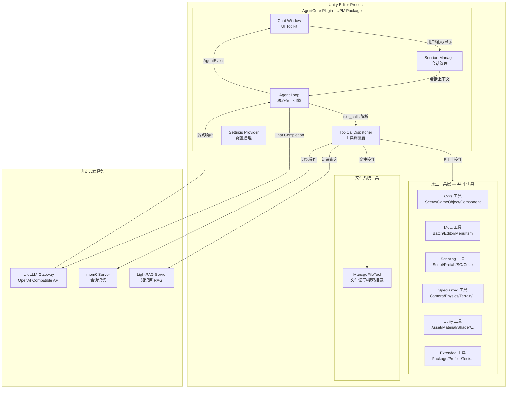
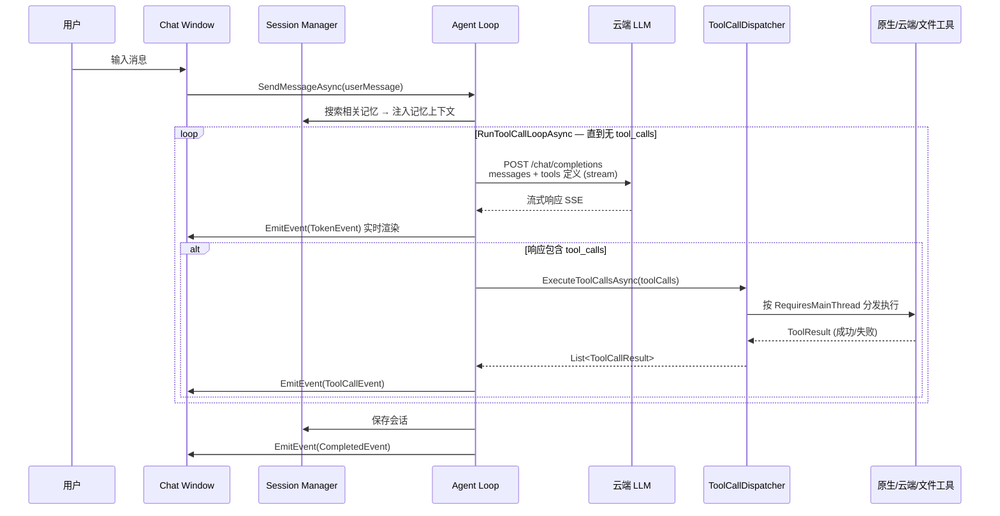
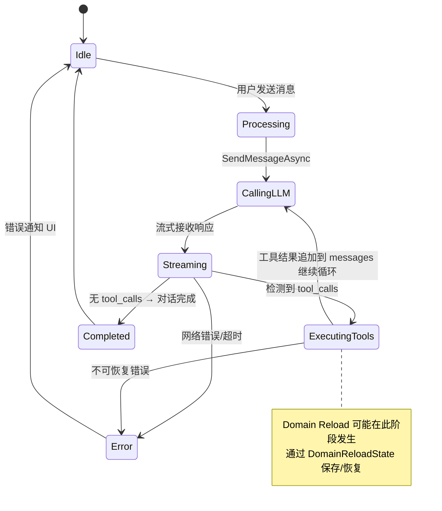
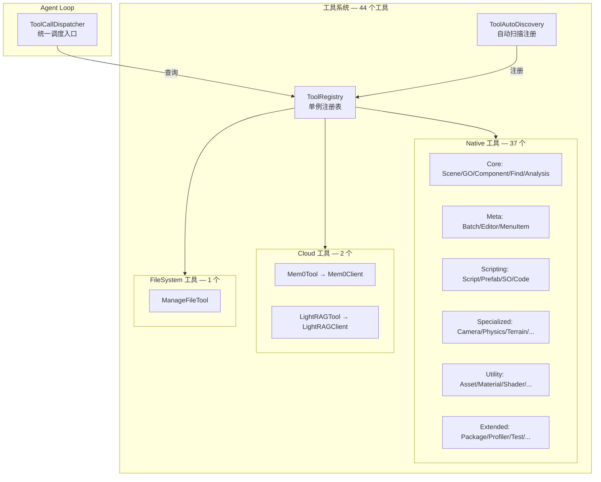
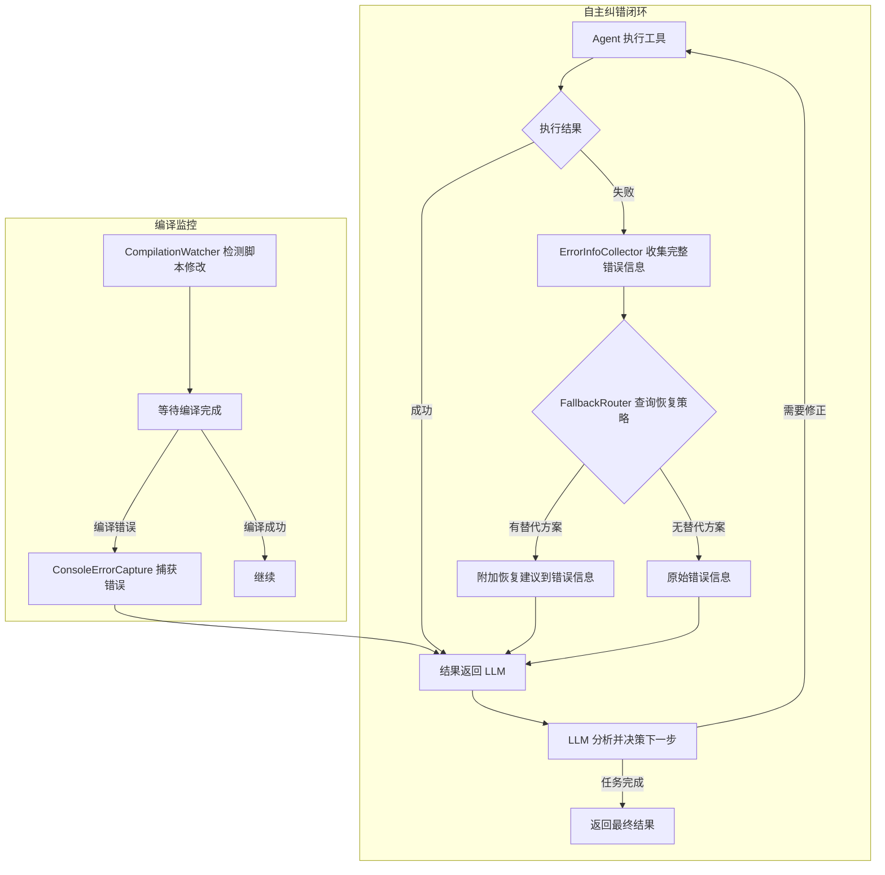
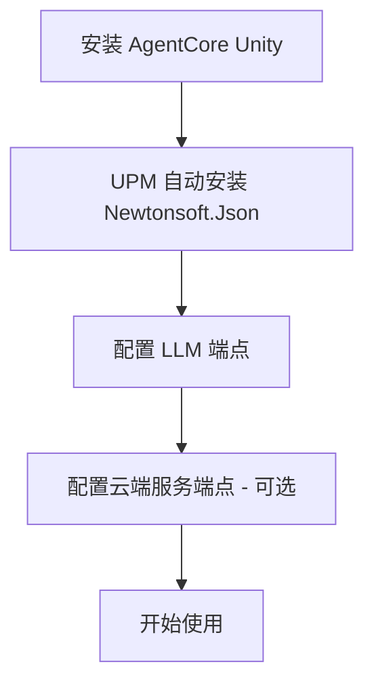
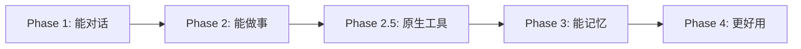

# Unity Agent Plugin — 完整架构设计

> **版本**: 0.4.8 | **日期**: 2026-05-13
>
> AgentCore Unity 是一个 Unity Editor 内嵌的 AI Agent 插件，
> 通过 Chat 窗口与 LLM 交互，使用自研原生工具系统操作 Unity Editor。

---

## 1. 设计目标与约束

### 1.1 核心目标

| # | 目标 | 说明 |
|---|------|------|
| G1 | **对话式 AI 助手** | Unity Editor 内嵌 ChatGPT 风格对话窗口 |
| G2 | **会话管理** | 支持会话持久化、自动记忆、导出 |
| G3 | **云端服务集成** | LLM、mem0、LightRAG 均由管理员部署在内网云端 |
| G4 | **自研原生工具** | 44 个工具、340+ 个 action，直接调用 Unity Editor API |
| G5 | **零运维用户体验** | 用户只需配置云端端点，无需本地 Docker/WSL2 |
| G6 | **UPM 包分发** | 标准 Unity Package Manager 格式，一键安装 |

### 1.2 已确认的架构决策

| 决策 | 选择 | 理由 |
|------|------|------|
| 客户端模式 | **厚客户端** | Agent 循环在 Unity Editor 进程中运行，避免多用户会话记忆混杂 |
| LLM 调用 | **OpenAI 兼容 API** | 通过 LiteLLM 网关，支持任意后端模型 |
| 云端服务 | **HTTP REST 直连** | mem0/LightRAG 已有 REST API，无需 MCP 协议包装 |
| Unity 工具 | **自研原生工具系统** | 通过 `[AgentTool]` + `IAgentTool` 自动发现注册，直接调用 Unity API |
| UI 框架 | **UI Toolkit** | 现代 Unity Editor UI 方案，支持 USS 样式 |
| 会话持久化 | **本地 JSON 文件** | 存储在 `Library/AgentCore/` 下，不进版本控制 |
| 程序集隔离 | **零外部 asmdef 引用** | `AgentCore.Editor.asmdef` 不引用任何外部程序集 |

### 1.3 约束条件

- Unity 2021.3 LTS+ 兼容（UI Toolkit 在 2021.3 已可用于 Editor）
- 纯 Editor 插件，不影响 Runtime 构建
- 所有网络请求异步执行，不阻塞 Unity 主线程
- 敏感信息（API Key）不进版本控制
- 唯一外部依赖：`com.unity.nuget.newtonsoft-json`（通过 UPM）
- 零外部 asmdef 引用（`references: []`）

---

## 2. 系统架构总览

### 2.1 架构图



### 2.2 数据流序列图



---

## 3. UPM 包结构

> 以下为实际文件结构（截至 v0.3.3）。

```text
com.agentcore.unity/
├── package.json                          # UPM 包描述 (v0.3.3)
├── AGENTS.md                             # LLM 开发规范
├── CHANGELOG.md                          # 版本变更日志
├── LICENSE.md
├── README.md
│
├── Editor/
│   ├── AgentCore.Editor.asmdef           # Editor 程序集定义 (零外部引用)
│   │
│   ├── Bootstrap/                        # 启动引导系统
│   │   ├── BootstrapContext.cs           # Bootstrap 上下文数据模型
│   │   ├── BootstrapLoader.cs           # Bootstrap 文件加载与编译
│   │   ├── ProjectContextCollector.cs   # 自动收集项目信息
│   │   └── Resources/                   # 内置 Bootstrap 文件
│   │       ├── SOUL.md                  # 角色定义与核心原则
│   │       └── TOOLS.md.template        # 工具指南模板（运行时填充）
│   │
│   ├── Config/                           # 配置系统
│   │   ├── AgentCoreSettings.cs         # ScriptableSingleton 设置
│   │   ├── AgentCoreSettingsProvider.cs # Project Settings UI
│   │   └── SecureKeyStorage.cs          # API Key 安全存储
│   │
│   ├── Core/                             # 核心运行时
│   │   ├── AgentLoop.cs                 # Agent 循环调度器（核心）
│   │   ├── MessageTypes.cs              # 消息数据模型 + AgentState + AgentEvent
│   │   ├── CompilationWatcher.cs        # 编译监控（Domain Reload 感知）
│   │   ├── ConsoleErrorCapture.cs       # Console 错误自动捕获
│   │   ├── ContextWindowManager.cs      # 上下文窗口管理
│   │   ├── DomainReloadState.cs         # Domain Reload 状态保存/恢复
│   │   ├── ErrorInfoCollector.cs        # 工具失败错误信息收集器
│   │   ├── FallbackRouter.cs            # 工具失败恢复策略路由
│   │   ├── FileChangeTracker.cs         # 文件变更追踪
│   │   └── TokenCounter.cs             # Token 计数器
│   │
│   ├── LLM/                              # LLM 客户端
│   │   ├── ILLMClient.cs                # LLM 客户端接口
│   │   ├── OpenAICompatibleClient.cs    # OpenAI 兼容 API 实现
│   │   ├── StreamingResponseParser.cs   # SSE 流式解析器
│   │   └── ChatCompletionModels.cs      # 请求/响应数据模型
│   │
│   ├── Session/                          # 会话管理
│   │   ├── SessionManager.cs            # 会话生命周期管理
│   │   ├── SessionData.cs               # 会话数据模型
│   │   ├── SessionStorage.cs            # 本地 JSON 持久化
│   │   ├── SessionExporter.cs           # 会话导出（Markdown/JSON）
│   │   └── AutoMemoryStrategy.cs        # 自动记忆策略
│   │
│   ├── Tools/                            # 工具系统
│   │   ├── IAgentTool.cs                # 工具接口 + ToolMetadata + ToolResult
│   │   ├── ToolRegistry.cs              # 统一工具注册表（单例）
│   │   ├── ToolCallDispatcher.cs        # tool_calls 解析与分发
│   │   ├── ToolDefinitionBuilder.cs     # OpenAI function schema 生成
│   │   │
│   │   ├── Infrastructure/              # 工具基础设施
│   │   │   ├── AgentToolAttribute.cs    # [AgentTool] 特性
│   │   │   ├── ToolAutoDiscovery.cs     # 自动扫描注册
│   │   │   ├── ToolHelpers.cs           # 参数解析辅助方法
│   │   │   └── ToolResponse.cs          # ToolResponse 构建器
│   │   │
│   │   ├── Native/                      # 原生工具（直接调用 Unity API）
│   │   │   ├── Core/                    # 核心工具 (5)
│   │   │   │   ├── ManageSceneTool.cs
│   │   │   │   ├── ManageGameObjectTool.cs
│   │   │   │   ├── ManageComponentTool.cs
│   │   │   │   ├── FindGameObjectsTool.cs
│   │   │   │   └── SceneAnalysisTool.cs
│   │   │   │
│   │   │   ├── Meta/                    # 元操作工具 (3)
│   │   │   │   ├── BatchExecuteTool.cs
│   │   │   │   ├── ExecuteMenuItemTool.cs
│   │   │   │   └── ManageEditorTool.cs
│   │   │   │
│   │   │   ├── Scripting/              # 脚本工具 (4)
│   │   │   │   ├── ManageScriptTool.cs
│   │   │   │   ├── ManagePrefabTool.cs
│   │   │   │   ├── ManageScriptableObjectTool.cs
│   │   │   │   └── ExecuteCodeTool.cs
│   │   │   │
│   │   │   ├── Specialized/            # 专业领域工具 (11)
│   │   │   │   ├── ManageAudioTool.cs
│   │   │   │   ├── ManageCameraTool.cs
│   │   │   │   ├── ManageCinemachineTool.cs
│   │   │   │   ├── ManageEventTool.cs
│   │   │   │   ├── ManageGraphicsTool.cs
│   │   │   │   ├── ManageLightingTool.cs
│   │   │   │   ├── ManagePhysicsTool.cs
│   │   │   │   ├── ManageProBuilderTool.cs
│   │   │   │   ├── ManageTerrainTool.cs
│   │   │   │   ├── ManageTimelineTool.cs
│   │   │   │   └── ManageUITool.cs
│   │   │   │
│   │   │   ├── Utility/                # 通用工具 (8)
│   │   │   │   ├── ManageAnimationTool.cs
│   │   │   │   ├── ManageAssetTool.cs
│   │   │   │   ├── ManageAssetImportTool.cs
│   │   │   │   ├── ManageMaterialTool.cs
│   │   │   │   ├── ManageModelImportTool.cs
│   │   │   │   ├── ManageShaderTool.cs
│   │   │   │   ├── ManageTextureImportTool.cs
│   │   │   │   └── ReadConsoleTool.cs
│   │   │   │
│   │   │   └── Extended/               # 扩展工具 (6)
│   │   │       ├── ManagePackageTool.cs
│   │   │       ├── ManageProfilerTool.cs
│   │   │       ├── ManageTagsLayersTool.cs
│   │   │       ├── ManageTestTool.cs
│   │   │       ├── OptimizationTool.cs
│   │   │       └── SmartOperationsTool.cs
│   │   │
│   │   ├── Cloud/                       # 云端工具 (4: 2 Tool + 2 Client)
│   │   │   ├── Mem0Tool.cs
│   │   │   ├── Mem0Client.cs
│   │   │   ├── LightRAGTool.cs
│   │   │   └── LightRAGClient.cs
│   │   │
│   │   └── FileSystem/                  # 文件系统工具 (1)
│   │       └── ManageFileTool.cs
│   │
│   ├── UI/                               # 用户界面
│   │   ├── ChatWindow.cs                # 主对话窗口 EditorWindow
│   │   ├── ChatWindow.uxml             # 窗口布局
│   │   ├── ChatWindow.uss              # 窗口样式
│   │   │
│   │   ├── Components/                   # UI 组件
│   │   │   ├── MessageBubble.cs         # 消息气泡
│   │   │   ├── MessageBubble.uxml
│   │   │   ├── MessageBubble.uss
│   │   │   ├── StreamingTextElement.cs  # 流式文本显示
│   │   │   ├── ToolCallCard.cs          # 工具调用展示卡片
│   │   │   ├── ToolCallGroup.cs         # 工具调用分组
│   │   │   └── FileChangeSummaryPanel.cs # 文件变更摘要面板
│   │   │
│   │   └── Settings/                     # 设置面板（预留）
│   │
│   └── Utils/                            # 工具类
│       ├── AsyncHelper.cs               # 异步→主线程桥接
│       ├── JsonHelper.cs                # JSON 序列化工具
│       └── HttpClientFactory.cs         # HTTP 客户端工厂
│
└── plans/                                # 设计文档（仅参考）
    ├── ARCHITECTURE.md                  # 本文件
    └── ...                              # 其他计划文档
```

---

## 4. 核心模块详细设计

### 4.1 Agent Loop — 核心调度引擎

Agent Loop 是插件的心脏，实现 **"Loop until final answer"** 模式：
调用 LLM → 解析 tool_calls → 执行工具 → 将结果（含错误）追加到 messages → 再次调用 LLM，
直到 LLM 返回纯文本回复（无 tool_calls）为止。

> **核心理念**：工具执行失败**不是**错误终止条件，
> 而是 LLM 自我纠正的**信息输入**。所有失败信息（编译错误、异常堆栈、
> 控制台报错）都作为 `role=tool` 的结果返回给 LLM，让它自主决定下一步。



**关键设计点**：

| 特性 | 实现方式 |
|------|----------|
| 异步不阻塞 | `async/await` + `EditorApplication.delayCall` 回调主线程 |
| 流式显示 | SSE 解析器逐 token 推送到 UI（通过 `AgentEvent.TokenEvent`） |
| 工具循环 | 最大迭代次数限制（`maxToolCallRounds`），防止无限循环 |
| 上下文窗口 | `ContextWindowManager` 管理 token 预算，自动截断 |
| 取消支持 | `CancellationToken` 贯穿整个调用链 |
| 错误即信息 | 工具失败时，完整错误信息作为 tool result 返回 LLM |
| Domain Reload | `DomainReloadState` 保存中断状态，重载后自动恢复 |
| 事件驱动 UI | 通过 `EmitEvent(AgentEvent)` 通知 UI，不直接操作 UI |
| 文件变更追踪 | `FileChangeTracker` 记录工具执行期间的文件变更 |

**AgentState 状态机**（定义在 `MessageTypes.cs`）：

```
Idle → Processing → Streaming → ExecutingTools → (循环回 Streaming)
                                                → Completed → Idle
任何状态 → Error → Idle
任何状态 → Cancelled → Idle
```

**Domain Reload 恢复机制**：

```
脚本修改 → 触发 Domain Reload
  → OnBeforeAssemblyReload()
    → 保存 DomainReloadState (InterruptPhase, 待处理的 tool calls, 对话历史)
  → Unity 重新编译 → 所有静态状态丢失
  → ChatWindow.CreateGUI() 重新执行
    → TryRestoreSession()
      → AgentLoop.TryResumeAfterReload()
        → 读取 DomainReloadState
        → 根据 InterruptPhase 恢复到对应阶段
        → TriggerResumeLLMCall()
```

### 4.2 LLM 客户端 — OpenAI 兼容 API

直接使用 `System.Net.Http.HttpClient` 调用 OpenAI 兼容 API，不引入第三方 SDK。

**请求格式**：

```json
{
  "model": "deepseek-chat",
  "messages": [
    {"role": "system", "content": "你是 Unity 开发助手..."},
    {"role": "user", "content": "帮我查看场景中所有的 Camera"},
    {"role": "assistant", "content": null, "tool_calls": [...]},
    {"role": "tool", "tool_call_id": "call_xxx", "content": "..."}
  ],
  "tools": [
    {
      "type": "function",
      "function": {
        "name": "manage_gameobject",
        "description": "管理 Unity 场景中的 GameObject",
        "parameters": { "type": "object", "properties": {...} }
      }
    }
  ],
  "stream": true,
  "temperature": 0.7
}
```

**流式解析**（`StreamingResponseParser`）：

SSE 解析器需要处理：
1. 普通文本 token 的逐步拼接
2. `tool_calls` 的增量 JSON 拼接（arguments 可能跨多个 chunk）
3. 多个并行 tool_calls 的索引追踪
4. `[DONE]` 信号处理

### 4.3 工具系统 — 自研单层架构

工具系统采用**统一的单层架构**：所有工具（原生/云端/文件系统）都实现 `IAgentTool` 接口，
通过 `[AgentTool]` 特性标记，由 `ToolAutoDiscovery` 自动扫描注册。



#### 4.3.1 工具接口

```csharp
/// <summary>
/// Agent 工具接口 — 所有工具的统一契约。
/// </summary>
public interface IAgentTool
{
    /// <summary>工具元数据（名称、描述、分类、参数 Schema）</summary>
    ToolMetadata Metadata { get; }

    /// <summary>执行工具调用</summary>
    Task<ToolResult> ExecuteAsync(JObject parameters, CancellationToken cancellationToken = default);
}

/// <summary>工具元数据</summary>
public class ToolMetadata
{
    public string Name { get; }
    public string Description { get; }
    public string Category { get; }
    public JObject ParametersSchema { get; }
    public bool RequiresMainThread { get; }
}

/// <summary>工具执行结果</summary>
public class ToolResult
{
    public bool Success { get; }
    public string Output { get; }
    public string Error { get; }
    public double ExecutionTimeMs { get; }
}
```

#### 4.3.2 工具自动发现

```
ToolAutoDiscovery.DiscoverAndRegisterAll()
  → 扫描所有已加载的程序集
  → 查找标记了 [AgentTool] 的类
  → 验证类实现了 IAgentTool 接口
  → 通过 Activator.CreateInstance() 创建实例
  → 注册到 ToolRegistry.Instance
```

#### 4.3.3 统一工具调度器

```csharp
// ToolCallDispatcher — 统一分发 tool_calls
public async Task<List<ToolCallResult>> ExecuteToolCallsAsync(
    List<ToolCall> toolCalls, CancellationToken ct)
{
    var results = new List<ToolCallResult>();
    foreach (var toolCall in toolCalls)
    {
        var tool = ToolRegistry.Instance.GetTool(toolCall.Function.Name);
        if (tool == null)
        {
            // 未知工具 → 返回错误信息给 LLM
            results.Add(CreateErrorResult(toolCall, "Unknown tool"));
            continue;
        }
        
        ToolResult result;
        if (tool.Metadata.RequiresMainThread)
            result = await ExecuteOnMainThread(tool, parameters, ct);
        else
            result = await tool.ExecuteAsync(parameters, ct);
        
        results.Add(new ToolCallResult(toolCall, result, ...));
    }
    return results;
}
```

#### 4.3.4 完整工具清单（44 个工具，335+ 个 action）

**Native/Core — 核心工具 (5)**

| 工具名 | 说明 | Actions |
|--------|------|---------|
| `manage_scene` | 场景管理 | list, get_info, create, load, save, set_active, get_hierarchy, screenshot |
| `manage_gameobject` | GameObject CRUD | create, modify, delete, duplicate, get_info, set_parent, find_by_path, get_children, set_layer, set_tag, set_static, create_primitive |
| `manage_component` | 组件管理 | add, remove, get, set_property, get_properties, list, copy, enable, disable, get_serialized, set_serialized |
| `find_gameobjects` | 搜索 GameObject | by_name, by_tag, by_layer, by_component, by_name_contains, all, by_path_pattern |
| `scene_analysis` | 场景分析 | overview, hierarchy_tree, component_usage, find_missing_references, layer_usage, tag_usage, performance_stats |

**Native/Meta — 元操作工具 (3)**

| 工具名 | 说明 | Actions |
|--------|------|---------|
| `batch_execute` | 批量执行 | execute |
| `execute_menu_item` | 执行菜单项 | execute, list, search |
| `manage_editor` | 编辑器控制 | get_info, refresh, play, pause, stop, step, compile, get_selection, set_selection, focus, screenshot |

**Native/Scripting — 脚本工具 (4)**

| 工具名 | 说明 | Actions |
|--------|------|---------|
| `manage_script` | C# 脚本 CRUD | create, read, update, delete, list, search, apply_edits, validate |
| `manage_prefab` | Prefab 管理 | create, instantiate, get_info, apply, revert, unpack, list, modify, add_component, remove_component |
| `manage_scriptable_object` | ScriptableObject 管理 | create, read, update, delete, list, get_fields, set_field |
| `execute_code` | C# 代码执行 | execute |

**Native/Specialized — 专业领域工具 (11)**

| 工具名 | 说明 | Actions |
|--------|------|---------|
| `manage_audio` | 音频系统 | create_source, set_source, create_listener, get_info, play, stop, set_mixer, list_sources |
| `manage_camera` | 相机管理 | create, configure, set_target, get_info, list, set_viewport, set_culling, screenshot |
| `manage_cinemachine` | Cinemachine | create_brain, create_vcam, configure_vcam, set_follow, set_look_at, list, create_dolly_track, set_blend |
| `manage_event` | 事件系统 | add_trigger, add_raycaster, configure_event_system, get_info, list_triggers, add_event_handler |
| `manage_graphics` | 图形渲染 | get_render_pipeline, set_quality, configure_post_processing, set_fog, set_ambient, get_info, set_shadows |
| `manage_lighting` | 光照系统 | create, configure, bake, get_info, list, set_environment, create_probe, set_lightmap_settings |
| `manage_physics` | 物理系统 | add_rigidbody, add_collider, set_physics, get_info, create_joint, set_layer_collision, raycast, configure_gravity |
| `manage_probuilder` | ProBuilder | create_shape, extrude, boolean_op, set_material, get_info, merge, subdivide |
| `manage_terrain` | 地形系统 | create, set_heightmap, paint_texture, place_trees, place_details, get_info, set_size, add_layer |
| `manage_timeline` | Timeline | create, add_track, add_clip, set_bindings, get_info, play, set_duration, delete_track |
| `manage_ui` | UI 系统 | create_canvas, create_element, set_property, get_info, list, set_layout, add_event, set_style |

**Native/Utility — 通用工具 (8)**

| 工具名 | 说明 | Actions |
|--------|------|---------|
| `manage_animation` | 动画系统 | create_controller, add_state, add_transition, set_parameter, get_info, create_clip, set_curve, list |
| `manage_asset` | 资产管理 | create, import, delete, move, copy, find, get_info, get_dependencies, set_labels, refresh |
| `manage_asset_import` | 资产导入设置 | get_settings, set_settings, reimport, get_platform_settings, set_platform_settings |
| `manage_material` | 材质管理 | create, set_property, get_info, set_shader, list, copy, set_texture, set_keyword |
| `manage_model_import` | 模型导入 | get_settings, set_settings, reimport, get_animations, set_animation_settings |
| `manage_shader` | Shader 管理 | create, get_info, list, get_properties, find_by_keyword, set_global_property |
| `manage_texture_import` | 纹理导入 | get_settings, set_settings, reimport, set_platform_settings, get_preview |
| `read_console` | 控制台读取 | read, clear, get_count |

**Native/Extended — 扩展工具 (6)**

| 工具名 | 说明 | Actions |
|--------|------|---------|
| `manage_package` | UPM 包管理 | list, add, remove, search, get_info, update |
| `manage_profiler` | 性能分析 | start, stop, get_data, analyze, get_stats |
| `manage_tags_layers` | 标签/层管理 | list_tags, add_tag, list_layers, add_layer, get_sorting_layers, add_sorting_layer |
| `manage_test` | 测试运行 | run, get_results, list, run_category |
| `optimization` | 优化清理 | find_unused_assets, analyze_textures, find_duplicate_materials, analyze_mesh_complexity, get_build_size |
| `smart_operations` | 智能操作 | smart_create, smart_fix, analyze_scene, suggest_improvements |

**Cloud — 云端工具 (2)**

| 工具名 | 说明 | Actions |
|--------|------|---------|
| `mem0_memory` | mem0 记忆 | add, search, list, delete, update |
| `lightrag_knowledge` | LightRAG 知识库 | query, insert, get_status |

**FileSystem — 文件系统工具 (1)**

| 工具名 | 说明 | Actions |
|--------|------|---------|
| `manage_file` | 文件操作 | read, write, search, list_directory, exists, delete, move, copy |

### 4.4 会话管理

#### 4.4.1 数据模型

`SessionData` 是可序列化的会话数据，包含完整的对话历史和元数据。
`ChatMessage` 支持 system/user/assistant/tool 四种角色。

#### 4.4.2 存储策略

```text
<ProjectRoot>/
└── Library/
    └── AgentCore/
        ├── sessions/
        │   ├── <session-id-1>.json    # 会话数据
        │   ├── <session-id-2>.json
        │   └── ...
        └── domain-reload-state.json   # Domain Reload 恢复状态
```

- `Library/` 目录不进版本控制（Unity 默认 .gitignore）
- API Key 使用 `EditorPrefs` + 加密存储（`SecureKeyStorage`）
- 会话文件按需加载，不全部常驻内存

#### 4.4.3 上下文窗口管理

`ContextWindowManager` 负责管理 token 预算：

| 组件 | 预算分配 |
|------|----------|
| System Prompt (SOUL + TOOLS + PROJECT) | 动态计算 |
| 记忆上下文 (mem0 检索结果) | 可配置 |
| 对话历史 (滑动窗口) | 剩余空间 |
| 工具定义 | 动态计算 |

`TokenCounter` 使用近似算法估算 token 数量。

#### 4.4.4 自动记忆策略

`AutoMemoryStrategy` 在会话结束时：
1. 调用 LLM 生成会话摘要
2. 将摘要存储到 mem0
3. 关键信息自动提取为记忆条目

### 4.5 配置系统

`AgentCoreSettings` 使用 `ScriptableSingleton<AgentCoreSettings>` 模式，
通过 `AgentCoreSettingsProvider` 在 Project Settings 中提供 UI。

主要配置分组：
- **LLM 配置**：endpoint, apiKey, model, temperature, maxTokens
- **mem0 配置**：endpoint, enabled, userId
- **LightRAG 配置**：endpoint, enabled
- **Agent 行为**：maxToolCallRounds, contextWindowTokens
- **Bootstrap 配置**：bootstrapEnabled, autoProjectContext
- **UI 偏好**：streamingEnabled, showToolCallDetails

> 具体字段列表请查阅 `Editor/Config/AgentCoreSettings.cs`。
> 设置版本迁移通过 `MigrateSettings()` 方法实现。

### 4.6 UI 设计

#### 4.6.1 主窗口布局

```text
┌─────────────────────────────────────────────────────────┐
│  AgentCore                                    [] []  │
├─────────────────────────────────────────────────────────┤
│                                                         │
│  ┌─────────────────────────────────────────────────┐   │
│  │  User                                         │   │
│  │ 帮我查看场景中所有的 Camera 组件                  │   │
│  └─────────────────────────────────────────────────┘   │
│                                                         │
│  ┌─────────────────────────────────────────────────┐   │
│  │  Assistant                                    │   │
│  │ 我来帮你搜索场景中的 Camera 组件。               │   │
│  │                                                   │   │
│  │ ┌─  find_gameobjects ────────────────────┐    │   │
│  │ │ action: by_component                      │    │   │
│  │ │ component_type: Camera                    │    │   │
│  │ │  找到 3 个结果                          │    │   │
│  │ └──────────────────────────────────────────┘    │   │
│  │                                                   │   │
│  │ 场景中有 3 个 Camera 组件：                       │   │
│  │ 1. Main Camera (position: 0,1,-10)               │   │
│  │ 2. UI Camera (overlay mode)                      │   │
│  │ 3. Minimap Camera (orthographic)                 │   │
│  └─────────────────────────────────────────────────┘   │
│                                                         │
│  ┌─  文件变更摘要 ──────────────────────────────┐   │
│  │ 修改: Assets/Scripts/Player.cs                   │   │
│  │ 新增: Assets/Scripts/Enemy.cs                    │   │
│  └──────────────────────────────────────────────────┘   │
│                                                         │
├─────────────────────────────────────────────────────────┤
│  [] 输入消息...                              [发送 ] │
│                                                [ 停止] │
└─────────────────────────────────────────────────────────┘
```

**UI 组件**：
- `ChatWindow` — 主窗口 EditorWindow，事件驱动响应 `AgentEvent`
- `MessageBubble` — 消息气泡（user/assistant/system）
- `StreamingTextElement` — 流式文本显示（打字机效果）
- `ToolCallCard` — 工具调用展示卡片（参数、结果、耗时）
- `ToolCallGroup` — 工具调用分组（折叠/展开）
- `FileChangeSummaryPanel` — 文件变更摘要面板

### 4.7 自主纠错工作流

> **设计目标**：Agent 在执行任务时遇到错误能自主诊断和修复，
> 无需用户手动干预，实现"写代码 → 编译 → 看报错 → 修复 → 再编译"闭环。

#### 4.7.1 纠错架构



#### 4.7.2 错误即信息模式

**核心原则**：工具执行失败**永远不会**导致 Agent Loop 终止。
所有错误信息都作为 `role=tool` 的内容返回给 LLM。

`ErrorInfoCollector` 将异常转为结构化错误信息：
- 错误类型和消息
- 完整堆栈跟踪
- 编译错误的行号和文件路径解析
- 工具名称和参数上下文

#### 4.7.3 编译监控与 Console 捕获

`CompilationWatcher` 监控脚本修改触发的编译：
- 检测 `MayModifyScripts = true` 的工具执行
- 等待 Unity 编译完成
- 通过 `ConsoleErrorCapture` 捕获编译错误
- 错误信息自动追加到工具结果中

`ConsoleErrorCapture` 捕获 Unity Console 中的新增错误/警告：
- 使用游标追踪已读取的日志条目
- 每轮工具执行后自动检查
- 新增错误作为额外上下文提供给 LLM

#### 4.7.4 Fallback 策略路由

`FallbackRouter` 提供配置驱动的恢复策略：

| 失败场景 | 恢复建议 |
|----------|----------|
| 脚本创建 → 文件已存在 | 使用 `manage_script` update 修改现有文件 |
| 组件操作 → 对象未找到 | 先用 `find_gameobjects` 搜索确认 |
| 编译错误 | 使用 `read_console` 获取详细错误，修复脚本 |
| 工具超时 | 简化操作参数，拆分为多个小步骤 |

---

## 5. 关键技术实现方案

### 5.1 异步与主线程桥接

Unity Editor 的 UI 操作必须在主线程执行，但网络请求需要异步。

`AsyncHelper` 提供：
- `RunOnMainThread(Action)` — 通过 `EditorApplication.delayCall` 调度
- `RunAsync(Func<Task>)` — 在 Editor 中安全运行 async Task

`ToolCallDispatcher` 根据 `RequiresMainThread` 属性决定执行方式：
- `true` → 通过 `EditorApplication.delayCall` + `TaskCompletionSource` 在主线程执行
- `false` → 直接 `await tool.ExecuteAsync()`

### 5.2 SSE 流式解析

`StreamingResponseParser` 解析 OpenAI SSE 流：

```text
data: {"choices":[{"delta":{"content":"我来"},"index":0}]}
data: {"choices":[{"delta":{"content":"帮你"},"index":0}]}
data: {"choices":[{"delta":{"tool_calls":[{"index":0,"function":{"name":"find_gameobjects","arguments":"{\"action\":"}}]},"index":0}]}
data: [DONE]
```

处理要点：
1. 普通文本 token 的逐步拼接
2. `tool_calls` 的增量 JSON 拼接（arguments 可能跨多个 chunk）
3. 多个并行 tool_calls 的索引追踪
4. `[DONE]` 信号处理

### 5.3 Bootstrap Files 系统

Bootstrap 加载顺序是固定的：`SOUL → TOOLS → PROJECT → MEMORY → USER`

```mermaid
graph LR
    subgraph BootstrapFiles[Bootstrap Files 加载顺序]
        A[SOUL.md<br/>角色定义与核心原则] --> B[TOOLS.md<br/>工具使用指南 - 模板渲染]
        B --> C[PROJECT<br/>项目上下文 - 自动生成]
        C --> D[MEMORY.md<br/>本地知识文件 - 用户可编辑]
        D --> E[USER.md<br/>用户偏好]
    end
    
    E --> F[BootstrapContext.CompileSystemPrompt()]
    F --> G[发送给 LLM 作为 System Prompt]
```

**各 Bootstrap 组件**：

| 组件 | 来源 | 说明 |
|------|------|------|
| SOUL.md | 内置资源 | AI 角色定义与核心原则 |
| TOOLS.md.template | 内置资源 | 工具使用指南模板，运行时填充工具列表 |
| PROJECT | `ProjectContextCollector` 自动生成 | Unity 版本、渲染管线、目标平台、项目结构 |
| MEMORY.md | 用户项目 `AgentCore/MEMORY.md` | 团队共享的项目知识 |
| USER.md | 用户项目 `AgentCore/USER.md` | 个人偏好和自定义指令 |

> **与 mem0 的关系**：MEMORY.md 是**本地静态知识**（团队共享的项目约定），
> mem0 是**动态记忆**（Agent 在对话中自动学习的上下文）。两者互补。

### 5.4 HTTP 客户端工厂

`HttpClientFactory` 提供共享的 `HttpClient` 实例（带连接池）：

```csharp
var client = HttpClientFactory.GetClient();
var request = HttpClientFactory.CreateRequest(HttpMethod.Post, url, apiKey);
```

所有 HTTP 请求（LLM、mem0、LightRAG）都通过此工厂创建，确保连接复用和统一配置。

### 5.5 JSON 工具

`JsonHelper` 提供安全的 JSON 操作：
- 序列化/反序列化（基于 Newtonsoft.Json）
- 安全解析（失败返回 null）
- 安全取值（带默认值）

---

## 6. 依赖关系与技术栈

### 6.1 直接依赖

| 依赖 | 版本 | 用途 | 引入方式 |
|------|------|------|----------|
| Unity | 2021.3+ | 宿主环境 | 前置条件 |
| Newtonsoft.Json | 3.0.2+ | JSON 序列化 | UPM: `com.unity.nuget.newtonsoft-json` |
| System.Net.Http | .NET Standard 2.1 | HTTP 请求 | Unity 内置 |

### 6.2 无外部 asmdef 引用

**设计决策**：`AgentCore.Editor.asmdef` 的 `references` 数组为空。

```json
{
    "name": "AgentCore.Editor",
    "references": [],
    "includePlatforms": ["Editor"],
    "autoReferenced": true
}
```

**理由**：
1. 零外部依赖 = 零兼容性问题
2. 所有 Unity Editor 操作通过反射或直接 API 调用
3. 不依赖任何第三方工具包（如 unity-mcp）
4. Newtonsoft.Json 通过 UPM 包依赖自动解析

### 6.3 无外部 NuGet 依赖

**设计决策**：不引入 MCP C# SDK 或 OpenAI SDK 等 NuGet 包。

**理由**：
1. Unity 的 NuGet 生态不成熟，包管理容易冲突
2. OpenAI 兼容 API 的 HTTP 调用非常简单，自实现即可
3. 云端 mem0/LightRAG 使用 REST API 直连
4. 减少依赖 = 减少维护成本 + 提高兼容性

---

## 7. 打包、安装与分发

### 7.1 打包流程

AgentCore Unity 以标准 UPM 包格式分发。打包使用 `npm pack` 命令生成 `.tgz` 文件：

```bash
cd com.agentcore.unity
npm pack
# 输出: com.agentcore.unity-0.3.3.tgz
```

**打包前检查清单**：
- [ ] `package.json` 中 `version` 字段已更新
- [ ] `CHANGELOG.md` 已记录本版本变更
- [ ] Unity Console 无编译错误
- [ ] 无多余的临时文件或 `.meta` 文件遗漏

### 7.2 安装方式

支持三种安装方式：

#### 方式 A：Git URL 安装（推荐）

```
Unity Editor → Window → Package Manager → + → Add package from git URL...
→ https://your-git-server.com/agentcore-unity.git?path=Packages/com.agentcore.unity
```

#### 方式 B：.tgz 文件安装（离线环境推荐）

```
Unity Editor → Window → Package Manager → + → Add package from tarball...
→ 选择 com.agentcore.unity-0.3.3.tgz
```

#### 方式 C：本地目录安装（开发调试用）

```
Unity Editor → Window → Package Manager → + → Add package from disk...
→ 选择 com.agentcore.unity/package.json
```

### 7.3 前置依赖

AgentCore Unity 唯一的 UPM 依赖是 `com.unity.nuget.newtonsoft-json`，
在 `package.json` 中声明，UPM 会自动解析安装。



### 7.4 首次配置

安装完成后的配置步骤：

1. **打开设置面板**：Edit → Project Settings → AgentCore
2. **配置 LLM 端点**：
   - API Endpoint: `http://your-litellm-server:4000/v1`
   - API Key: 由管理员提供
   - Model: 选择可用模型
3. **配置云端服务**（可选）：
   - mem0 Endpoint: `http://your-mem0-server:8080`
   - LightRAG Endpoint: `http://your-lightrag-server:9621`
4. **测试连接**：点击 "Test Connection" 按钮验证连通性
5. **打开对话窗口**：Window → AgentCore → Chat

### 7.5 版本管理策略

| 项目 | 策略 |
|------|------|
| 版本号格式 | [SemVer 2.0](https://semver.org/)：`MAJOR.MINOR.PATCH` |
| 当前版本 | `0.3.6` |
| MINOR 递增 | 每个 Phase 完成时 |
| PATCH 递增 | Bug 修复和小改进 |
| MAJOR 递增 | 破坏性 API 变更（1.0.0 = 正式发布） |
| Git 标签 | 每次发版打 `v{version}` 标签 |
| CHANGELOG | 每次发版更新，记录 Added/Changed/Fixed/Removed |

---

## 8. 开发阶段规划与完成状态

> 每个 Phase 都有明确的**验收演示场景**，确保交付物可被验证。



### Phase 1: 能对话  (v0.1.0)

**目标**：最小可用的对话窗口 + LLM 调用 + Bootstrap Files 系统

| # | 任务 | 状态 |
|---|------|------|
| 1.1 | UPM 包结构搭建 |  |
| 1.2 | 配置系统 (Settings + SecureKeyStorage) |  |
| 1.3 | LLM 客户端 (OpenAI 兼容 + SSE 流式) |  |
| 1.4 | Bootstrap Files 系统 (SOUL + TOOLS + PROJECT) |  |
| 1.5 | Agent Loop 基础版 (单轮对话) |  |
| 1.6 | Chat Window 基础 UI |  |
| 1.7 | 流式文本显示 |  |

### Phase 2: 能做事  (v0.2.0)

**目标**：Agent 能调用工具完成实际 Unity 任务，并具备自主纠错能力

| # | 任务 | 状态 |
|---|------|------|
| 2.1 | IAgentTool 接口与 ToolRegistry |  |
| 2.2 | ToolCallDispatcher 统一调度器 |  |
| 2.3 | ToolDefinitionBuilder (OpenAI function schema) |  |
| 2.4 | ToolAutoDiscovery 自动发现注册 |  |
| 2.5 | ErrorInfoCollector 错误信息收集 |  |
| 2.6 | ConsoleErrorCapture 控制台捕获 |  |
| 2.7 | FallbackRouter 恢复策略 |  |
| 2.8 | CompilationWatcher 编译监控 |  |
| 2.9 | Agent Loop 完整版 (多轮工具循环) |  |
| 2.10 | ToolCallCard UI 展示 |  |

### Phase 2.5: 原生工具系统  (v0.3.0)

**目标**：自研完整的 Unity Editor 原生工具，替代外部依赖

| # | 任务 | 状态 |
|---|------|------|
| 2.5.1 | Core 工具 (Scene/GO/Component/Find/Analysis) |  5 个工具 |
| 2.5.2 | Meta 工具 (Batch/Editor/MenuItem) |  3 个工具 |
| 2.5.3 | Scripting 工具 (Script/Prefab/SO/Code) |  4 个工具 |
| 2.5.4 | Specialized 工具 (Camera/Physics/Terrain/...) |  11 个工具 |
| 2.5.5 | Utility 工具 (Asset/Material/Shader/...) |  8 个工具 |
| 2.5.6 | Extended 工具 (Package/Profiler/Test/...) |  6 个工具 |
| 2.5.7 | FileSystem 工具 (ManageFileTool) |  1 个工具 |

### Phase 3: 能记忆  (v0.3.1)

**目标**：Agent 具备跨会话记忆能力，支持会话管理和持久化

| # | 任务 | 状态 |
|---|------|------|
| 3.1 | mem0 HTTP 客户端 + Mem0Tool |  |
| 3.2 | LightRAG HTTP 客户端 + LightRAGTool |  |
| 3.3 | 自动记忆策略 (AutoMemoryStrategy) |  |
| 3.4 | 会话持久化 (SessionStorage) |  |
| 3.5 | 会话导出 (SessionExporter) |  |
| 3.6 | 上下文窗口管理 (ContextWindowManager) |  |
| 3.7 | Token 计数 (TokenCounter) |  |

### Phase 4: 更好用  (v0.3.2 ~ v0.3.6, 已完成)

**目标**：打磨用户体验，提升专业度和可扩展性

| # | 任务 | 状态 |
|---|------|------|
| 4.1 | Domain Reload 恢复机制 |  |
| 4.2 | ToolCallGroup 分组展示 |  |
| 4.3 | FileChangeTracker 文件变更追踪 |  |
| 4.4 | FileChangeSummaryPanel UI |  |
| 4.5 | Markdown 渲染增强 |  已决定不实现（当前段落可视化满足需求） |
| 4.6 | 键盘快捷键 |  |
| 4.7 | 工具启用/禁用管理 |  |
| 4.8 | 完善文档和示例 |  |
| 4.9 | 重试 UI (RetryLastMessage + FallbackRouter) |  |
| 4.10 | 新增工具：ManageUIToolkitTool (20 actions) |  |
| 4.11 | 新增工具：ValidationTool (10 actions) |  |
| 4.12 | 新增工具：WorkflowTool (15 actions) |  |
| 4.13 | 增强：ManageCinemachineTool (+11 actions) |  |
| 4.14 | 增强：ManageUITool (+9 actions) |  |
| 4.15 | 增强：ManageProBuilderTool (+8 actions) |  |
| 4.16 | 增强：ReadConsoleTool (+5 actions) |  |

---

## 9. 风险与缓解

| 风险 | 影响 | 缓解措施 |
|------|------|----------|
| Unity 主线程阻塞 | Editor 卡顿 | 所有 I/O 异步化，UI 更新通过 delayCall |
| LLM 响应延迟高 | 用户体验差 | 流式显示 + 取消按钮 + 超时设置 |
| tool_calls JSON 解析失败 | Agent 循环中断 | 容错解析 + 错误作为 tool result 返回 |
| 上下文窗口溢出 | LLM 报错或截断 | ContextWindowManager 自动截断 |
| API Key 泄露 | 安全风险 | SecureKeyStorage 加密存储 |
| Unity 版本兼容性 | 编译错误 | 条件编译 + 最低版本 2021.3 |
| 大文件读取 | 内存溢出 | 文件大小限制 + 分片读取 |
| Domain Reload 中断 | 对话状态丢失 | DomainReloadState 保存/恢复 |
| 工具数量过多 | LLM token 消耗大 | 按工具组动态启用/禁用（计划中） |
| 纠错死循环 | 消耗大量 token | maxToolCallRounds 上限 + 连续失败检测 |
| Bootstrap Files 过大 | System Prompt token 过多 | 限制各文件最大长度 + 自动截断 |

---

## 10. 与原项目的关系

### 10.1 架构演进

AgentCore 经历了以下架构演进：

| 阶段 | 架构 | 说明 |
|------|------|------|
| 初始设计 | 依赖 unity-mcp 桥接 | 计划通过 `CommandRegistry` 调用 unity-mcp 的 36+ 工具 |
| Phase 2.5 | **自研原生工具** | 完全移除 unity-mcp 依赖，自研 37 个原生工具 |
| 当前 (v0.3.6) | **零外部依赖** | 49 个工具、400+ 个 action，唯一依赖 Newtonsoft.Json |

### 10.2 保留的资产

| 原模块 | 新用途 | 变化 |
|--------|--------|------|
| `local-ragmem/` 的 API 设计 | 工具接口参考 | Python → C# 重写 |
| `unity-agent-rules/AGENTS.md` | System Prompt 素材 | 精简后嵌入 SOUL.md |
| `unity-agent-rules/.agents/skills/` | 工具设计参考 | 转化为原生工具实现 |

### 10.3 仓库结构

```text
agentcore-unity/                    # 仓库根目录
├── Packages/
│   └── com.agentcore.unity/        # UPM 包（核心产品）
│       ├── package.json
│       ├── Editor/
│       └── plans/
│
├── Assets/                          # Unity 项目（开发测试用）
├── ProjectSettings/
└── README.md
```

---

## 11. 开放问题

以下问题需要在后续版本中进一步确认：

| # | 问题 | 影响范围 | 状态 |
|---|------|----------|------|
| Q1 | `HttpClient` 在 Unity Editor 中的 SSL/TLS 支持？ | HTTPS 连接 | 已验证可用 |
| Q2 | 是否需要支持代理服务器？ | 企业网络环境 | 配置中预留 |
| Q3 | 44 个工具全部发送给 LLM 是否 token 消耗过大？ | 成本/性能 | 计划实现工具分组启用/禁用 |
| Q4 | 是否需要支持多 LLM 模型切换？ | 用户灵活性 | 配置已支持 |
| Q5 | 是否需要 Markdown 完整渲染（代码高亮、表格）？ | 用户体验 |  已决定不实现，当前段落可视化满足需求 |
| Q6 | 缺失的工具类别（UIToolkit/Validation/Workflow/XR）是否需要补充？ | 功能覆盖率 |  UIToolkit/Validation/Workflow 已补充，XR 暂不实现 |

> **已解决的问题**：
> - ~~JSON 序列化选型~~ → 统一使用 Newtonsoft.Json（UPM 包依赖）
> - ~~Unity Editor 工具如何实现~~ → 自研原生工具，通过 `[AgentTool]` + `IAgentTool` 自动发现
> - ~~是否依赖 unity-mcp~~ → 不依赖，完全自研，零外部 asmdef 引用
> - ~~Domain Reload 如何处理~~ → `DomainReloadState` + `InterruptPhase` 恢复机制
> - ~~Markdown 渲染~~ → 已决定不实现，当前段落可视化满足需求
> - ~~缺失工具类别~~ → UIToolkit/Validation/Workflow 已在 v0.3.6 补充完成
