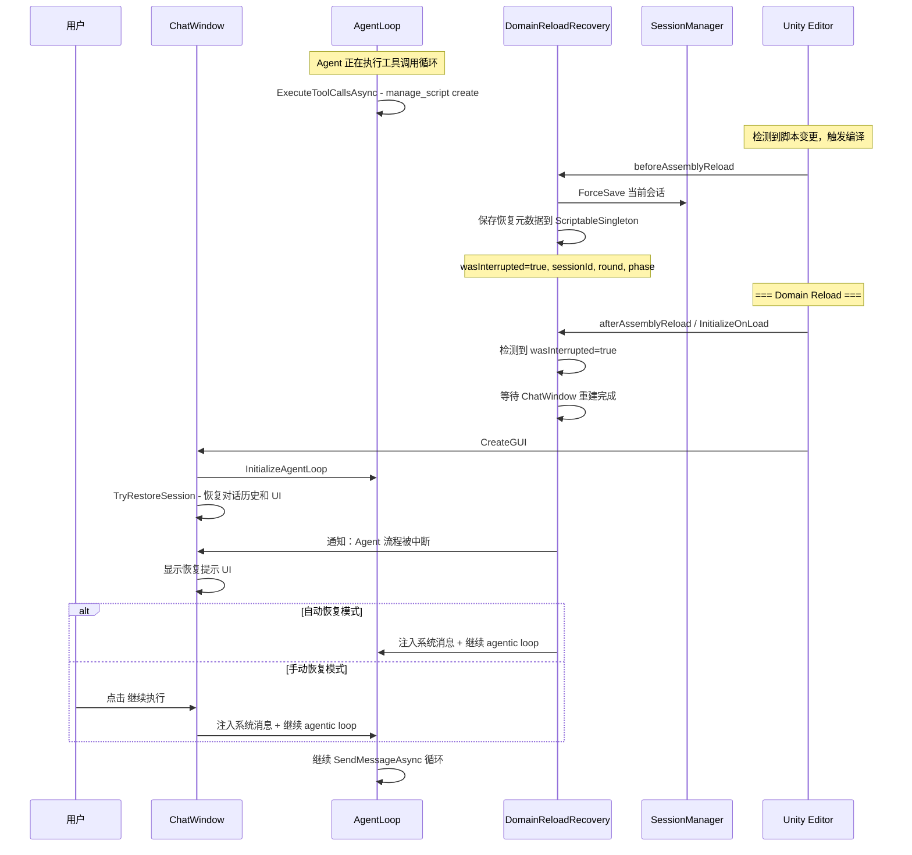

# Domain Reload 期间 Agent 流程恢复方案分析

## 1. 问题背景

### 1.1 什么是 Domain Reload

Unity Editor 在检测到 C# 脚本变更后会触发编译，编译完成后执行 **Domain Reload**（程序域重载）。这个过程会：

1. **卸载当前 AppDomain** — 销毁所有非序列化的 C# 对象
2. **加载新的 AppDomain** — 重新加载编译后的程序集
3. **重建 Editor 状态** — 通过 Unity 序列化系统恢复 `ScriptableObject`、`EditorWindow` 等

### 1.2 对 AgentCore 的影响

当 Agent 执行 `manage_script`（创建/修改 C# 脚本）等工具时，会触发编译和 Domain Reload，导致以下问题：

| 组件 | 影响 | 严重程度 |
|------|------|----------|
| `AgentLoop` 实例 | 完全销毁，所有内存状态丢失 |  严重 |
| `_messages` 列表 | 丢失，LLM 对话上下文消失 |  严重 |
| `_conversationTurns` 列表 | 丢失，UI 轮次记录消失 |  严重 |
| `_currentCts` (CancellationTokenSource) | 销毁，进行中的异步操作被中断 |  严重 |
| `SendMessageAsync` 的 Task | 销毁，agentic loop 被打断 |  严重 |
| LLM 流式 HTTP 请求 | 连接中断 |  中等 |
| `CompilationWatcher._compilationTcs` | Task 销毁，等待编译的逻辑失效 |  中等 |
| `ChatWindow` (EditorWindow) | Unity 自动重建，但 `_agentLoop` 引用丢失 |  中等 |
| `SessionManager.Instance` | 静态单例重建，`CurrentSessionId` 丢失 |  中等 |
| `AgentCoreSettings.instance` | `ScriptableSingleton` 自动恢复  |  无影响 |
| 磁盘上的 Session JSON 文件 | 不受影响  |  无影响 |
| `EditorPrefs` 中的 `LastSessionId` | 不受影响  |  无影响 |

### 1.3 当前已有的恢复机制

项目已有部分恢复能力，但不完整：

```
Domain Reload 后的恢复链路（当前）：

ChatWindow.CreateGUI()
  → InitializeAgentLoop()        // 创建新的 AgentLoop + LLM Client
  → TryRestoreSession()          // 从 EditorPrefs 读取 LastSessionId
    → SessionManager.TryRestoreLastSession()
      → SessionStorage.Load()    // 从 JSON 文件加载会话数据
    → AgentLoop.LoadSession()    // 恢复 _messages + _conversationTurns
    → RebuildMessageBubbles()    // 重建 UI
```

**当前恢复能力**：对话历史和 UI 可以恢复（前提是 Domain Reload 前已保存）。

**当前缺失**：
- Domain Reload 前没有主动保存当前进行中的状态
- 不知道 Reload 前 Agent 正在执行什么操作
- 无法自动继续被中断的 agentic loop
- 工具执行结果可能丢失（工具已执行但结果未追加到消息历史）

### 1.4 典型中断场景

```
用户: "请创建一个 PlayerController 脚本"

AgentLoop.SendMessageAsync()
  → Round 1: LLM 返回 tool_call: manage_script(create, PlayerController.cs)
    → ToolCallDispatcher 执行工具  脚本已创建
    → 等待编译... 
      → Unity 检测到新脚本 → 触发编译 → Domain Reload 
        → AgentLoop 销毁
        → 工具执行结果未追加到 _messages
        → LLM 不知道工具执行成功了
        → 用户看到窗口重建，但 Agent 停止了
```

---

## 2. 方案分析

### 2.1 方案 A：序列化 Agent 状态到 EditorPrefs / SessionState

#### 思路

在 Domain Reload 前，将 `AgentLoop` 的关键运行时状态序列化到 `EditorPrefs` 或 `SessionState`，Reload 后读取并恢复。

#### 需要保存的状态

```csharp
[Serializable]
class AgentLoopSnapshot {
    AgentState currentState;           // 当前状态
    int currentRound;                  // 当前轮次
    int maxRounds;                     // 最大轮次
    List<ChatMessage> messages;        // 完整消息历史
    List<ConversationTurn> turns;      // UI 轮次
    string pendingToolCallId;          // 正在执行的 tool_call ID
    string pendingToolName;            // 正在执行的工具名
    string pendingToolArguments;       // 工具参数
    bool toolExecutionCompleted;       // 工具是否已执行完成
    string toolExecutionResult;        // 工具执行结果
    string originalUserMessage;        // 原始用户消息（用于重试）
}
```

#### 优点

- 理论上可以精确恢复到中断点
- 不需要重新发送 LLM 请求

#### 缺点

- **复杂度极高**：需要序列化整个 Agent 状态机，包括异步流程的中间状态
- **EditorPrefs 容量限制**：`EditorPrefs` 基于注册表（Windows），不适合存储大量数据；消息历史可能很大
- **SessionState 限制**：`SessionState` 仅在 Editor 会话内有效，且同样有大小限制
- **状态一致性风险**：Domain Reload 的时机不可控，可能在任何代码行中断，难以保证快照的一致性
- **异步流程不可恢复**：`Task`、`CancellationTokenSource`、HTTP 连接等无法序列化
- **工具副作用问题**：工具可能已执行了一半（如创建了文件但还没返回结果），恢复后如何处理？

#### 可行性评估

| 维度 | 评分 |
|------|------|
| 实现复杂度 |  极高 |
| 可靠性 |  中等（状态一致性难保证） |
| 维护成本 |  高（每次修改 AgentLoop 都需同步更新序列化逻辑） |
| 用户体验 |  好（理想情况下无缝恢复） |

**结论：不推荐。** 投入产出比极低，且存在根本性的技术障碍（异步流程不可序列化）。

---

### 2.2 方案 B：利用 AssemblyReloadEvents

#### 思路

使用 Unity 提供的 `AssemblyReloadEvents` 在 Domain Reload 前后执行保存/恢复逻辑：

```csharp
[InitializeOnLoad]
static class DomainReloadHandler {
    static DomainReloadHandler() {
        AssemblyReloadEvents.beforeAssemblyReload += OnBeforeReload;
        AssemblyReloadEvents.afterAssemblyReload += OnAfterReload;
    }
}
```

#### 与方案 A 的区别

方案 B 的核心区别在于**时机确定性**：`beforeAssemblyReload` 保证在 Reload 前被调用，可以执行同步保存操作。

#### 可保存的内容

在 `beforeAssemblyReload` 中：
1. 强制保存当前会话到磁盘（`SessionManager.ForceSave`）
2. 将"Agent 正在运行中"的标记写入 `SessionState`
3. 记录当前轮次、最后一条消息的角色等元信息

在 `afterAssemblyReload` 中：
1. 检查标记，判断是否需要恢复
2. 加载会话数据
3. 决定恢复策略（重新发送 / 通知用户）

#### 优点

- **时机可控**：`beforeAssemblyReload` 保证在 Reload 前执行
- **与现有架构兼容**：利用已有的 `SessionManager.ForceSave` 机制
- **增量改动小**：只需添加一个静态类

#### 缺点

- **`beforeAssemblyReload` 中不能执行异步操作**：无法等待 LLM 响应完成
- **仍然无法恢复异步流程**：只能保存"快照"，不能恢复 Task
- **需要与方案 C 或 D 结合**：单独使用只能保存状态，还需要恢复策略

#### 可行性评估

| 维度 | 评分 |
|------|------|
| 实现复杂度 |  低 |
| 可靠性 |  高（Unity 官方 API，时机确定） |
| 维护成本 |  低 |
| 用户体验 |  取决于恢复策略 |

**结论：推荐作为基础设施层。** 但需要与恢复策略（方案 C 或 D）结合使用。

---

### 2.3 方案 C：简化方案 — 恢复对话上下文 + 重新发送

#### 思路

不尝试恢复中间状态，而是：
1. Domain Reload 前保存当前对话历史
2. Reload 后检测到有未完成的 Agent 流程
3. 恢复对话上下文（消息历史）
4. 自动重新发送最后一条用户消息，或将已执行的工具结果注入后继续 LLM 调用

#### 恢复策略细分

**策略 C1：重新发送最后一条用户消息**

```
Reload 后：
1. 加载会话历史
2. 检测到 Agent 被中断（标记）
3. 找到最后一条 role="user" 的消息
4. 重新调用 SendMessageAsync(lastUserMessage)
```

- 优点：实现最简单
- 缺点：LLM 可能重复执行已完成的工具调用（如重复创建脚本）

**策略 C2：注入工具结果后继续**

```
Reload 后：
1. 加载会话历史
2. 检测到 Agent 被中断
3. 检查最后一条消息的角色：
   - 如果是 assistant（含 tool_calls）且没有对应的 tool result
     → 说明工具可能已执行但结果未记录
     → 注入一条 tool result: "工具执行后发生了 Domain Reload，请检查结果并继续"
   - 如果是 tool result
     → 说明工具结果已记录，直接继续 LLM 调用
4. 继续 agentic loop
```

- 优点：避免重复执行工具
- 缺点：实现稍复杂，需要判断中断点

**策略 C3：通知用户并提供"继续"按钮**

```
Reload 后：
1. 加载会话历史
2. 检测到 Agent 被中断
3. 在 ChatWindow 中显示提示：
   " 脚本编译导致 Agent 流程中断。上一次操作的对话上下文已恢复。"
   [继续执行] [放弃]
4. 用户点击"继续执行"后，注入系统消息并继续
```

- 优点：用户有控制权，最安全
- 缺点：需要用户手动操作

#### 优点

- **实现复杂度适中**：不需要序列化复杂的异步状态
- **利用 LLM 的自我纠错能力**：即使重复调用，LLM 通常能识别"文件已存在"等错误并调整策略
- **与现有架构高度兼容**：复用 `SessionManager`、`SessionStorage`、`TryRestoreSession` 等已有机制

#### 缺点

- **可能浪费 LLM token**：重新发送消息意味着额外的 API 调用
- **策略 C1 有重复执行风险**：虽然 LLM 通常能处理，但不是 100% 安全
- **用户体验有短暂中断**：窗口重建 + 恢复需要几秒钟

#### 可行性评估

| 维度 | 评分 |
|------|------|
| 实现复杂度 |  低-中 |
| 可靠性 |  高（不依赖复杂的状态恢复） |
| 维护成本 |  低 |
| 用户体验 |  中等（有短暂中断，但可自动恢复） |

**结论：强烈推荐。** 特别是策略 C2 + C3 的组合（自动恢复 + 用户确认）。

---

### 2.4 方案 D：使用 `[Serializable]` + `ScriptableSingleton<T>`

#### 思路

创建一个 `ScriptableSingleton<DomainReloadState>` 来跨 Domain Reload 保持状态。Unity 的 `ScriptableSingleton` 使用 Unity 序列化系统，能在 Domain Reload 后自动恢复 `[SerializeField]` 标记的字段。

```csharp
[FilePath("AgentCore/DomainReloadState.asset", FilePathAttribute.Location.PreferencesFolder)]
public class DomainReloadState : ScriptableSingleton<DomainReloadState>
{
    [SerializeField] private bool _wasRunning;
    [SerializeField] private string _sessionId;
    [SerializeField] private int _interruptedAtRound;
    [SerializeField] private string _lastAssistantMessageJson;
    [SerializeField] private List<string> _pendingToolCallIds;
    // ...
}
```

#### 与方案 A 的区别

- 使用 Unity 原生序列化而非手动 JSON
- `ScriptableSingleton` 自动处理 Domain Reload 的保存/恢复
- 但受限于 Unity 序列化系统的能力（不支持 `Dictionary`、接口、多态等）

#### 优点

- **Unity 原生支持**：`ScriptableSingleton` 专为跨 Domain Reload 设计
- **自动序列化/反序列化**：不需要手动管理保存时机
- **项目已有先例**：`AgentCoreSettings` 已使用此模式

#### 缺点

- **Unity 序列化限制**：
  - 不支持 `Dictionary<K,V>`
  - 不支持接口类型字段
  - 不支持多态（`List<ChatMessage>` 中的不同子类型）
  - 嵌套深度限制（7 层）
  - 不支持 `null`（会被替换为默认值）
- **数据模型适配成本**：现有的 `ChatMessage`、`ConversationTurn` 等类型不满足 Unity 序列化要求，需要创建专门的序列化适配层
- **大数据量问题**：消息历史可能很大，全部放在 `ScriptableSingleton` 中不合适
- **与 `SessionStorage` 功能重叠**：已有 JSON 文件持久化，再加一层 Unity 序列化是冗余的

#### 可行性评估

| 维度 | 评分 |
|------|------|
| 实现复杂度 |  中等 |
| 可靠性 |  中等（受 Unity 序列化限制） |
| 维护成本 |  中等（需维护两套序列化模型） |
| 用户体验 |  好（自动恢复） |

**结论：部分推荐。** 适合存储轻量级的恢复元数据（如"是否被中断"、"中断时的轮次"），但不适合存储完整的消息历史。

---

## 3. 推荐方案：B + C + D 混合方案

### 3.1 方案概述

结合三种方案的优势，分层实现：

```
┌─────────────────────────────────────────────────────┐
│                   恢复策略层（方案 C）                  │
│  检测中断 → 恢复对话 → 注入上下文 → 自动/手动继续       │
├─────────────────────────────────────────────────────┤
│                 状态持久化层（方案 D）                   │
│  ScriptableSingleton 存储轻量恢复元数据                 │
├─────────────────────────────────────────────────────┤
│                 事件钩子层（方案 B）                     │
│  AssemblyReloadEvents 触发保存/恢复                    │
├─────────────────────────────────────────────────────┤
│              已有基础设施（不变）                        │
│  SessionManager + SessionStorage + EditorPrefs        │
└─────────────────────────────────────────────────────┘
```

### 3.2 架构设计



### 3.3 核心组件设计

#### 3.3.1 `DomainReloadState` — 恢复元数据（ScriptableSingleton）

```csharp
// 仅存储轻量级恢复元数据，不存储完整消息历史
[FilePath("AgentCore/DomainReloadState.asset", 
          FilePathAttribute.Location.PreferencesFolder)]
public class DomainReloadState : ScriptableSingleton<DomainReloadState>
{
    // 是否有被中断的 Agent 流程
    [SerializeField] private bool _wasInterrupted;
    
    // 被中断时的会话 ID
    [SerializeField] private string _interruptedSessionId;
    
    // 被中断时的 Agent 状态
    [SerializeField] private string _interruptedPhase; 
    // "thinking" | "executing_tool" | "streaming"
    
    // 被中断时的轮次
    [SerializeField] private int _interruptedAtRound;
    
    // 最后执行的工具名称（如果在工具执行阶段被中断）
    [SerializeField] private string _lastToolName;
    
    // 最后执行的工具是否已完成
    [SerializeField] private bool _lastToolCompleted;
    
    // 中断时间戳
    [SerializeField] private string _interruptedAtUtc;
}
```

#### 3.3.2 `DomainReloadRecovery` — 恢复协调器

```csharp
[InitializeOnLoad]
static class DomainReloadRecovery
{
    static DomainReloadRecovery()
    {
        AssemblyReloadEvents.beforeAssemblyReload += OnBeforeReload;
        AssemblyReloadEvents.afterAssemblyReload += OnAfterReload;
    }
    
    static void OnBeforeReload()
    {
        // 1. 检查是否有活跃的 AgentLoop
        // 2. 如果 Agent 正在运行（非 Idle），保存恢复元数据
        // 3. ForceSave 当前会话
    }
    
    static void OnAfterReload()
    {
        // 1. 检查 DomainReloadState 是否有中断标记
        // 2. 如果有，等待 ChatWindow 重建后触发恢复流程
    }
}
```

#### 3.3.3 恢复流程集成到 `ChatWindow`

在 `ChatWindow.TryRestoreSession()` 中增加中断恢复逻辑：

```csharp
private void TryRestoreSession()
{
    // ... 现有的会话恢复逻辑 ...
    
    // 新增：检查是否有被中断的 Agent 流程
    var reloadState = DomainReloadState.instance;
    if (reloadState.WasInterrupted)
    {
        ShowRecoveryPrompt(reloadState);
        reloadState.ClearInterruptState();
    }
}
```

### 3.4 恢复策略详细设计

#### 中断点分析与恢复策略

| 中断阶段 | 消息历史状态 | 恢复策略 |
|----------|-------------|---------|
| Thinking（等待 LLM 首响应） | 用户消息已添加，无 assistant 响应 | 重新发送 LLM 请求 |
| Streaming（LLM 流式输出中） | 用户消息已添加，assistant 消息不完整 | 移除不完整的 assistant 消息，重新发送 LLM 请求 |
| ExecutingTool（工具执行中） | assistant 消息含 tool_calls，tool result 可能缺失 | 注入 tool result 说明 Domain Reload 发生，继续 LLM 调用 |
| ExecutingTool 后等待编译 | 工具已执行完成，结果可能未追加 | 同上 |

#### 恢复时注入的系统消息

```
[SYSTEM] 由于脚本编译触发了 Unity Domain Reload，Agent 的执行流程被中断。
当前对话上下文已恢复。上一次操作的工具调用 '{toolName}' 可能已经执行成功
（脚本文件已创建/修改），但执行结果未能记录。
请检查当前项目状态，确认上一步操作的结果，然后继续完成用户的请求。
不要重复执行已经成功的操作。
```

---

## 4. 实施步骤概要

### Phase 1：基础设施（事件钩子 + 元数据存储）

1. 创建 `DomainReloadState : ScriptableSingleton<DomainReloadState>`
   - 定义恢复元数据字段
   - 提供 `MarkInterrupted()` / `ClearInterruptState()` 方法

2. 创建 `DomainReloadRecovery` 静态类
   - 注册 `AssemblyReloadEvents.beforeAssemblyReload`
   - 注册 `AssemblyReloadEvents.afterAssemblyReload`
   - `beforeAssemblyReload` 中：检查 AgentLoop 状态，保存元数据，ForceSave 会话

3. 为 `AgentLoop` 添加静态引用
   - 添加 `static AgentLoop ActiveInstance` 属性
   - 供 `DomainReloadRecovery` 在 `beforeAssemblyReload` 中访问

### Phase 2：恢复逻辑

4. 在 `ChatWindow.TryRestoreSession()` 中集成恢复检测
   - 检查 `DomainReloadState.instance.WasInterrupted`
   - 根据中断阶段选择恢复策略

5. 实现恢复 UI
   - 在消息区域显示恢复提示（黄色提示条）
   - 提供"继续执行"和"放弃"按钮
   - 或根据配置自动恢复

6. 实现消息历史修复逻辑
   - 检查最后一条消息的角色和完整性
   - 移除不完整的 assistant 消息
   - 为缺失的 tool result 注入占位消息

### Phase 3：增强

7. 在 `AgentLoop.ExecuteToolCallsAsync` 中增加中间保存点
   - 每个工具执行完成后立即保存结果到会话
   - 减少 Domain Reload 时的数据丢失窗口

8. 添加配置项到 `AgentCoreSettings`
   - `domainReloadAutoRecovery`：是否自动恢复（默认 true）
   - 用户可选择手动确认模式

9. 测试与边界情况处理
   - 测试连续多次 Domain Reload 的情况
   - 测试 Reload 发生在不同阶段的恢复效果
   - 处理恢复失败的降级策略

---

## 5. 风险评估

### 5.1 技术风险

| 风险 | 概率 | 影响 | 缓解措施 |
|------|------|------|----------|
| `beforeAssemblyReload` 中 ForceSave 失败 | 低 | 高 — 无法恢复 | 添加 try-catch，降级为"通知用户重新发送" |
| 恢复后 LLM 重复执行已完成的工具 | 中 | 中 — 可能创建重复文件 | 注入明确的系统消息告知 LLM 不要重复操作 |
| `ScriptableSingleton` 数据损坏 | 低 | 低 — 仅丢失恢复元数据 | 添加数据校验，损坏时静默跳过恢复 |
| 连续快速 Domain Reload | 低 | 中 — 恢复逻辑可能递归触发 | 添加防抖机制，限制恢复频率 |
| `ChatWindow` 未打开时发生 Reload | 中 | 低 — 无 UI 可恢复 | 元数据保留，下次打开窗口时提示 |

### 5.2 用户体验风险

| 风险 | 缓解措施 |
|------|----------|
| 恢复提示打断用户操作 | 使用非模态提示（消息区域内的提示条），不使用弹窗 |
| 自动恢复导致意外行为 | 提供配置开关，默认显示确认提示 |
| 恢复后 LLM 上下文不连贯 | 注入清晰的系统消息，告知 LLM 发生了什么 |

### 5.3 架构风险

| 风险 | 缓解措施 |
|------|----------|
| `AgentLoop` 静态引用导致内存泄漏 | 使用 `WeakReference` 或在 `Dispose` 时清除 |
| 恢复逻辑与正常启动逻辑耦合 | 将恢复逻辑封装在独立的 `DomainReloadRecovery` 类中 |
| 未来 AgentLoop 状态变更需同步更新恢复逻辑 | 保持恢复逻辑简单（只保存元数据，不保存完整状态） |

---

## 6. 总结

### 方案对比矩阵

| 维度 | 方案 A: EditorPrefs 全状态 | 方案 B: AssemblyReloadEvents | 方案 C: 重新发送 | 方案 D: ScriptableSingleton |
|------|--------------------------|------------------------------|-----------------|---------------------------|
| 实现复杂度 |  极高 |  低 |  低-中 |  中 |
| 可靠性 |  中 |  高 |  高 |  中 |
| 维护成本 |  高 |  低 |  低 |  中 |
| 用户体验 |  好 | — |  中 |  好 |
| 独立可用 |  |  |  |  |

### 最终推荐

**采用 B + C2/C3 + D（轻量）混合方案**：

1. **方案 B** 提供事件钩子（`AssemblyReloadEvents`），在 Reload 前触发保存
2. **方案 D（轻量）** 使用 `ScriptableSingleton` 仅存储恢复元数据（~100 字节），不存储消息历史
3. **方案 C2 + C3** 提供恢复策略：自动注入上下文 + 用户确认后继续

这个组合方案的核心理念是：**不尝试恢复不可恢复的东西（异步流程），而是利用 LLM 的理解能力来"接续"被中断的任务。**
