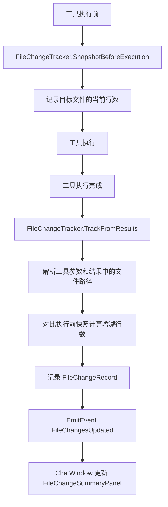

# 文件变更追踪与展示机制 设计方案

## 1. 问题描述

AgentCore 在执行工具调用时会修改用户项目中的文件（脚本、资源等），但用户无法直观看到：
- 哪些文件被修改了
- 每个文件的增减行数
- 无法快速跳转到被修改的文件

参考 Roo (Cline) 的设计：在输入栏上方永久显示一个可折叠的"文件变更面板"，汇总当前对话中所有被修改的文件。

## 2. 设计目标

- 自动追踪所有工具调用产生的文件变更
- 在 Chat 窗口输入栏上方显示文件变更汇总面板
- 支持单击定位文件（Project 窗口高亮）、双击打开文件（IDE 中打开）
- 显示每个文件的增减行数（+N -N）
- 会话级汇总：标题显示"此对话中已更改 N 个文件" + 总增减行数

## 3. 架构设计

### 3.1 整体流程



### 3.2 数据模型

```csharp
// Editor/Core/FileChangeTracker.cs

public enum FileChangeType
{
    Created,    // 新建文件
    Modified,   // 修改文件
    Deleted,    // 删除文件
    Moved,      // 移动/重命名
    Copied      // 复制
}

public class FileChangeRecord
{
    public string FilePath;          // 相对路径
    public FileChangeType ChangeType;
    public string ToolName;          // 执行工具名
    public string Action;            // 具体 action
    public int LinesAdded;           // 新增行数
    public int LinesRemoved;         // 删除行数
    public DateTime Timestamp;
}
```

### 3.3 增减行数计算策略

**核心思路**：在工具执行前记录目标文件的行数快照，执行后对比。

| 场景 | LinesAdded | LinesRemoved |
|------|-----------|-------------|
| 新建文件 | 新文件总行数 | 0 |
| 修改文件 | max(0, newLines - oldLines) | max(0, oldLines - newLines) |
| 删除文件 | 0 | 旧文件总行数 |
| 移动文件 | 0 | 0 |
| 复制文件 | 新文件总行数 | 0 |

**快照时机**：在 `AgentLoop.ExecuteToolCallsAsync()` 调用 `_dispatcher.DispatchAllAsync()` 之前，解析所有 tool_calls 的参数，提取可能被修改的文件路径，记录当前行数。

**注意**：这是一个近似计算（不是 git diff 级别的精确统计），但对于用户体验来说足够了。

### 3.4 需要追踪的工具和 action

| 工具名 | Action | ChangeType | 文件路径来源 |
|--------|--------|-----------|-------------|
| `manage_script` | write | Created/Modified | 参数 `path` |
| `manage_script` | create | Created | 参数 `path` |
| `manage_script` | delete | Deleted | 参数 `path` |
| `manage_script` | add_method | Modified | 参数 `path` |
| `manage_script` | add_field | Modified | 参数 `path` |
| `manage_file` | write_file | Created/Modified | 参数 `path` |
| `manage_file` | delete | Deleted | 参数 `path` |
| `manage_file` | move | Moved | 参数 `source` + `destination` |
| `manage_file` | copy | Copied | 参数 `source` + `destination` |
| `manage_asset` | delete | Deleted | 参数 `path` |
| `manage_asset` | move | Moved | 参数 `path` + `new_path` |
| `manage_asset` | copy | Copied | 参数 `path` + `new_path` |

### 3.5 UI 设计

面板位置：`chat-area` 中，`message-scroll-view` 和 `input-area` 之间。

```
┌─────────────────────────────────────────────────────┐
│                 message-scroll-view                  │
│                    (消息列表)                         │
└─────────────────────────────────────────────────────┘
┌─────────────────────────────────────────────────────┐  ← FileChangeSummaryPanel (新增)
│ v  此对话中已更改 3 个文件              +95  -12     │  ← 可折叠头部
│ ┌─────────────────────────────────────────────────┐ │
│ │ [+] Assets/Scripts/Player.cs          +42  -0   │ │  ← 单击定位，双击打开
│ │ [~] Assets/Scripts/Enemy.cs           +18  -12  │ │
│ │ [+] Assets/Scripts/Utils/Helper.cs    +35  -0   │ │
│ └─────────────────────────────────────────────────┘ │
└─────────────────────────────────────────────────────┘
┌─────────────────────────────────────────────────────┐
│                    input-area                        │
│                   (输入框+按钮)                       │
└─────────────────────────────────────────────────────┘
```

变更类型图标：
- `[+]` 新建 — 绿色
- `[~]` 修改 — 橙色
- `[-]` 删除 — 红色
- `[>]` 移动 — 蓝色
- `[=]` 复制 — 灰色

交互行为：
- **单击文件行**：在 Project 窗口中高亮定位 (`EditorGUIUtility.PingObject`)
- **双击文件行**：在 IDE 中打开文件 (`AssetDatabase.OpenAsset`)
- **折叠/展开**：点击头部切换
- **默认状态**：有变更时展开，无变更时隐藏整个面板
- **会话切换/重置时**：清空面板

### 3.6 事件系统扩展

在 `AgentEventType` 中新增：

```csharp
FileChangesUpdated = 20  // 文件变更列表更新
```

在 `AgentEvent` 中新增：

```csharp
public List<FileChangeRecord> FileChanges { get; }

public static AgentEvent FileChangesUpdated(List<FileChangeRecord> changes)
```

### 3.7 会话持久化

FileChangeTracker 的变更记录是**会话级别**的（跟随当前对话），但**不需要持久化到 SessionData**。原因：
- 文件变更信息主要用于实时展示
- 会话恢复后，文件可能已经被外部修改，旧的变更记录不再准确
- 保持简单，避免 SessionData 结构变更的向后兼容问题

会话切换/重置时，清空 FileChangeTracker。

## 4. 实现计划

### 4.1 新建文件

| 文件 | 说明 |
|------|------|
| `Editor/Core/FileChangeTracker.cs` | 文件变更追踪器 + FileChangeRecord + FileChangeType |
| `Editor/UI/Components/FileChangeSummaryPanel.cs` | 文件变更汇总 UI 面板 |

### 4.2 修改文件

| 文件 | 修改内容 |
|------|----------|
| `Editor/Core/MessageTypes.cs` | 新增 `FileChangesUpdated` 事件类型 + AgentEvent 工厂方法 + FileChanges 属性 |
| `Editor/Core/AgentLoop.cs` | 初始化 FileChangeTracker；ExecuteToolCallsAsync 中调用快照和追踪；ResetConversation 中清空 |
| `Editor/UI/ChatWindow.cs` | CreateGUI 中创建面板并插入到 input-area 之前；HandleAgentEvent 中处理 FileChangesUpdated |
| `CHANGELOG.md` | 记录新功能 |

### 4.3 实施步骤

1. 新建 `FileChangeTracker.cs` — 数据模型 + 快照 + 追踪逻辑
2. 修改 `MessageTypes.cs` — 新增事件类型和属性
3. 修改 `AgentLoop.cs` — 集成 FileChangeTracker
4. 新建 `FileChangeSummaryPanel.cs` — UI 面板组件
5. 修改 `ChatWindow.cs` — 插入面板 + 处理事件
6. 更新 `CHANGELOG.md`
