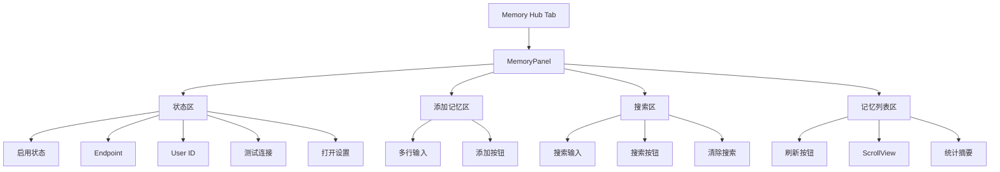

# MemoryPanel UI 详细设计方案

> 状态：已完成。MemoryPanel 已接入 Hub 的 Memory 模块；本文为历史设计参考，当前实现以 `Editor/UI/Components/MemoryPanel.cs` 和 `Editor/UI/ChatWindow*.cs` 为准。
> 目标版本：`0.4.2`  
> 关联路线图：`ROADMAP.md` Phase 6.2.1 提前实施

---

## 1. 目标

为 AgentCore 的 Memory 模块实现可视化管理面板，让用户可以在 Unity Editor 内直接查看、搜索、添加、删除 mem0 长期记忆。

当前记忆能力已经具备后端基础：

- `Mem0Client` 已支持连接测试、用户检查、创建用户、添加记忆、搜索记忆、列出记忆、删除记忆。
- `Mem0Tool` 已支持 LLM 通过 `manage_memory` 工具执行 `add`、`search`、`list`、`delete`。
- `SOUL.md` 已定义 LLM 何时主动搜索或存储记忆。
- `ChatWindow.uxml` 已存在 `memory-panel` 占位容器。
- `HubRail` 已存在 `Memory` 模块入口。

本次目标是补齐 UI 层，使 Memory 与 Knowledge 在产品体验上对称。

---

## 2. 非目标

本次不做以下内容：

- 不新增或替换第三方依赖。
- 不修改 mem0 / OpenMemory 服务端 API。
- 不实现记忆编辑功能，除非当前服务端 API 已明确支持 update。
- 不实现复杂的记忆重要性评分算法。
- 不改动 AgentLoop 的自动记忆触发策略。
- 不引入新的 Context Sidebar 子面板。
- 不改变现有 `manage_memory` 工具名称和已有 action 行为。

---

## 3. 设计原则

1. **复用 Knowledge 面板模式**  
   MemoryPanel 的布局、状态区、刷新按钮、列表滚动区域、结果提示都应尽量复用 KnowledgeBasePanel 的结构与视觉语言。

2. **UI 不阻塞用户操作**  
   添加、搜索、刷新、删除均使用 async/await，按钮可局部禁用，但不使用全屏遮罩。

3. **面板只做管理，不替代 LLM 自动记忆**  
   MemoryPanel 是用户可视化管理入口；LLM 的自动记忆仍通过 AgentLoop / SessionManager / `manage_memory` 完成。

4. **使用纯文本符号**  
   遵守 `SOUL.md` 的 UI 字符限制，不在 C# UI 字符串中使用 emoji 或特殊 Unicode 图标。

5. **最小变更**  
   新增 `MemoryPanel.cs`，少量改动 `ChatWindow.cs` 和 `ChatWindow.uss`，尽量不触碰核心对话链路。

---

## 4. 用户界面结构



### 4.1 状态区

显示内容：

- Mem0 是否启用。
- Endpoint 是否配置。
- Effective User ID。
- 连接状态：未测试、测试中、已连接、连接失败、用户不存在。

操作按钮：

- `测试连接`：调用 `Mem0Client.TestConnectionAsync`，随后可调用 `CheckUserExistsAsync` 获取用户状态。
- `打开设置`：打开 `Project/AgentCore` 设置页。
- 可选：`创建用户`，仅在用户不存在时显示，调用 `Mem0Client.CreateUserAsync`。

### 4.2 添加记忆区

元素：

- 多行 `TextField`，用于输入用户希望手动保存的记忆。
- `添加记忆` 按钮。
- 简短提示：适合存储用户偏好、项目约定、长期决策，不适合存储大段技术文档。

行为：

- 空内容时不允许添加。
- 添加成功后清空输入框并刷新列表。
- 添加失败时在结果提示区域显示原因。

### 4.3 搜索区

元素：

- 单行 `TextField`，输入搜索关键词或语义查询。
- `搜索` 按钮。
- `清除` 按钮。

行为：

- 搜索时调用 `Mem0Client.SearchMemoryAsync`。
- 清除搜索后恢复 `ListMemoriesAsync` 列表。
- 搜索结果与普通列表复用同一渲染方法，但摘要文字显示为搜索结果数量。

### 4.4 记忆列表区

元素：

- 标题行：`长期记忆` + `刷新` 按钮。
- `ScrollView` 列表。
- 统计摘要。

单条记忆显示：

- 记忆内容。
- 创建时间。
- 更新时间。
- 来源 app / 分类信息，如果返回数据中存在。
- 搜索分数，如果当前为搜索结果且 score 存在。
- `删除` 按钮。

删除行为：

- 使用 `EditorUtility.DisplayDialog` 确认。
- 调用 `Mem0Client.DeleteMemoryAsync`。
- 删除成功后刷新当前视图。

---

## 5. 涉及文件

### 5.1 新增文件

| 文件 | 目的 |
|---|---|
| `Editor/UI/Components/MemoryPanel.cs` | 新增 MemoryPanel UI 组件，负责状态、添加、搜索、列表、删除逻辑 |

### 5.2 修改文件

| 文件 | 修改内容 |
|---|---|
| `Editor/UI/ChatWindow.cs` | 新增 `_memoryPanelComponent` 字段；初始化并插入 `MemoryPanel`；切换 Hub 时调用 `OnActivated` / `OnDeactivated`；窗口销毁时释放资源 |
| `Editor/UI/ChatWindow.uxml` | 移除 `memory-panel` 占位内容，保留空容器供 C# 动态插入 |
| `Editor/UI/ChatWindow.uss` | 新增或复用 `.memory-panel-*` 样式；建议大部分复用 `.kb-panel-*` 的视觉规范 |
| `plans/ROADMAP.md` | 将 MemoryPanel UI 任务标记为提前实施或新增到 Phase 5.2 后续项 |
| `CHANGELOG.md` | 增加 `0.4.2` 版本条目 |
| `package.json` | 版本号更新到 `0.4.2` |

### 5.3 可选修改文件

| 文件 | 触发条件 |
|---|---|
| `Editor/Bootstrap/Resources/TOOLS.md.template` | 如果希望面向 LLM 增加 MemoryPanel 使用说明，可追加简短说明 |
| `Editor/Bootstrap/Resources/SOUL.md` | 当前 §11 已足够，本次默认不改 |

---

## 6. 类设计

### 6.1 `MemoryPanel`

职责：

- 构建 Memory 模块 UI。
- 读取 `AgentCoreSettings` 显示 mem0 配置状态。
- 调用 `Mem0Client` 执行连接测试、用户检查、添加、搜索、列表、删除。
- 在面板激活时自动刷新状态与列表。
- 在面板停用或销毁时取消非必要的请求。

建议字段：

```csharp
private Label _statusEnabledLabel;
private Label _statusEndpointLabel;
private Label _statusUserIdLabel;
private Label _statusConnectionLabel;
private Button _testConnectionButton;
private Button _createUserButton;
private Button _openSettingsButton;

private TextField _addMemoryField;
private Button _addMemoryButton;
private Label _lastResultLabel;

private TextField _searchField;
private Button _searchButton;
private Button _clearSearchButton;

private VisualElement _memoriesSection;
private Button _refreshMemoriesButton;
private ScrollView _memoriesScrollView;
private Label _memoriesSummaryLabel;

private CancellationTokenSource _connectionCts;
private CancellationTokenSource _refreshCts;
private CancellationTokenSource _addCts;
private CancellationTokenSource _searchCts;
```

建议方法：

```csharp
public MemoryPanel();
public void RefreshStatus();
public void OnActivated();
public void OnDeactivated();
public void Dispose();

private void BuildUI();
private async void OnTestConnectionClicked();
private async void OnCreateUserClicked();
private async void OnAddMemoryClicked();
private async void OnSearchClicked();
private async void OnRefreshMemoriesClicked();
private async Task RefreshMemoriesAsync();
private async Task SearchMemoriesAsync(string query);
private void RenderMemoryList(List<Mem0Memory> memories, bool isSearchResult);
private VisualElement BuildMemoryItem(Mem0Memory memory, bool isSearchResult);
private async void OnDeleteMemoryClicked(string memoryId, string previewText);
```

---

## 7. ChatWindow 接入方案

当前 `ChatWindow` 已经有：

- `memory-panel` 容器。
- `HubModule.Memory` 模块。
- `SwitchToModule` 中已有 Memory 容器显示逻辑。

需要补齐：

```csharp
private MemoryPanel _memoryPanelComponent;
```

在 `CreateGUI` 中：

```csharp
if (_memoryPanel != null)
{
    _memoryPanel.Clear();
    _memoryPanelComponent = new MemoryPanel();
    _memoryPanel.Add(_memoryPanelComponent);
}
```

在 `SwitchToModule` 中：

```csharp
if (_memoryPanelComponent != null)
{
    if (module == HubModule.Memory)
        _memoryPanelComponent.OnActivated();
    else
        _memoryPanelComponent.OnDeactivated();
}
```

在 `OnDestroy` 中：

```csharp
_memoryPanelComponent?.Dispose();
_memoryPanelComponent = null;
```

---

## 8. 样式方案

优先复用 Knowledge 面板已有样式：

- `.knowledge-panel-content`
- `.kb-panel__title`
- `.kb-panel__section`
- `.kb-panel__section-title`
- `.kb-panel__button`
- `.kb-panel__button--primary`
- `.kb-panel__button--secondary`
- `.kb-panel__button--danger`
- `.kb-panel__button--small`
- `.kb-panel__hint`
- `.kb-panel__result-label`

新增 Memory 专属样式只处理列表项差异：

```css
.memory-panel__memories-scroll
.memory-panel__memory-item
.memory-panel__memory-content
.memory-panel__memory-meta
.memory-panel__memory-score
.memory-panel__input
.memory-panel__search-row
```

同时为 `#memory-panel` 增加与 `#knowledge-panel` 类似的布局：

```css
#memory-panel {
    flex-grow: 1;
    flex-shrink: 1;
    flex-direction: column;
    display: none;
    overflow: auto;
}
```

---

## 9. 数据与错误处理

### 9.1 空状态

- mem0 未启用：提示用户打开设置启用。
- Endpoint 未配置：提示用户配置 Endpoint。
- 用户不存在：显示 `创建用户` 按钮。
- 无记忆：显示 `暂无长期记忆`。
- 搜索无结果：显示 `未找到相关记忆`。

### 9.2 错误处理

- 所有异步方法外层使用 try/catch。
- 取消请求显示为超时或被取消，不输出异常堆栈到 UI。
- Debug 日志仅用于诊断，不作为主要用户反馈。
- UI 中错误信息保持简洁，例如 `加载失败：服务返回错误`。

### 9.3 取消策略

- 切换离开 Memory 模块时取消连接测试、刷新、搜索。
- 添加记忆操作可以取消，但不需要后台继续执行。
- 删除操作使用局部 `CancellationTokenSource`，不与刷新 token 复用。

---

## 10. 版本与变更日志草稿

### 10.1 版本号

建议从当前版本升级到 `0.4.2`。

原因：新增用户可见功能，按 SemVer 属于 Minor 线内的新功能交付。

### 10.2 CHANGELOG 草稿

```markdown
## [0.4.2] - 2026-05-11

### Added
- 新增 MemoryPanel UI，可在 Hub 的 Memory 模块中查看、搜索、添加和删除 mem0 长期记忆。
- 新增 Memory 模块连接状态检查与用户存在性提示。
- 新增手动创建 OpenMemory 用户入口，仅在用户不存在时显示。

### Changed
- Memory Hub 不再显示占位页，改为完整的长期记忆管理界面。

### Fixed
- 无。
```

---

## 11. 验收标准

1. 点击 Hub Rail 的 `Mem` 后显示 MemoryPanel，而不是占位文本。
2. mem0 未启用或 Endpoint 未配置时，面板显示清晰提示，操作按钮不会误触发请求。
3. 点击 `测试连接` 能显示连接成功、失败或用户不存在等状态。
4. 用户不存在时，点击 `创建用户` 可尝试注册用户，并在成功后刷新状态。
5. 点击 `刷新` 能列出当前用户的记忆列表。
6. 输入文本后点击 `添加记忆`，成功后清空输入框并刷新列表。
7. 输入查询后点击 `搜索`，列表显示搜索结果，并可通过 `清除` 回到完整列表。
8. 点击单条记忆的 `删除`，确认后删除并刷新列表。
9. 窗口高度压缩时，MemoryPanel 可滚动，记忆列表区域不会撑破布局。
10. Unity Console 不出现新增编译错误或 UI 字体缺字警告。

---

## 12. 风险点与规避

| 风险 | 影响 | 规避方案 |
|---|---|---|
| OpenMemory API 返回格式不稳定 | 列表或添加结果显示异常 | 复用 `Mem0Client` 已有解析逻辑，UI 层只消费模型 |
| 用户不存在导致添加失败 | 用户误以为功能不可用 | 状态区加入用户检查和创建用户入口 |
| 记忆内容过长导致列表卡顿 | UI 滚动体验下降 | 列表项显示摘要，必要时截断到固定长度 |
| 多个异步请求交错 | 列表显示旧结果 | 每类操作独立 CancellationTokenSource，刷新前取消旧请求 |
| 与 Knowledge 面板样式重复 | 样式维护成本上升 | 尽量复用 `.kb-panel__*` 通用样式，仅新增 Memory 列表项样式 |

---

## 13. 实施步骤

1. 新建 `Editor/UI/Components/MemoryPanel.cs`，实现状态区、添加区、搜索区、记忆列表区的 UI 构建。
2. 在 `MemoryPanel.cs` 中接入 `Mem0Client` 的连接测试、用户检查、创建用户、添加、搜索、列出、删除方法。
3. 修改 `Editor/UI/ChatWindow.cs`，将 `MemoryPanel` 插入 `memory-panel` 容器，并补齐生命周期调用。
4. 修改 `Editor/UI/ChatWindow.uxml`，删除 Memory 占位内容，保留空容器。
5. 修改 `Editor/UI/ChatWindow.uss`，添加 MemoryPanel 布局和列表项样式。
6. 更新 `package.json` 版本到 `0.4.2`。
7. 更新 `CHANGELOG.md`，加入 `0.4.2` 变更条目。
8. 更新 `plans/ROADMAP.md`，标记 MemoryPanel UI 已提前实施，并调整后续路线图说明。
9. 在 Unity 中触发编译，检查 Console 错误和字体警告。
10. 按验收标准手动验证 MemoryPanel 主流程。

---

## 14. 推荐决策

建议按本方案实施 **MemoryPanel 基础完整版本**：状态、连接测试、用户创建、添加、搜索、列表、删除一次性打通。

不建议拆成只做列表的半成品，因为 mem0 记忆管理的核心体验需要添加、搜索、删除共同闭环。
