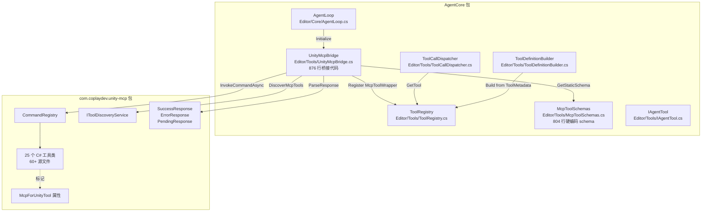
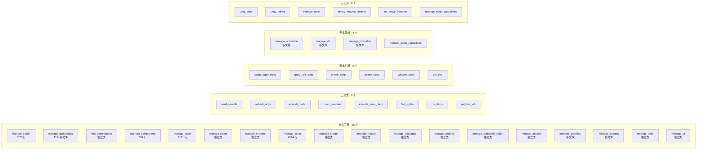
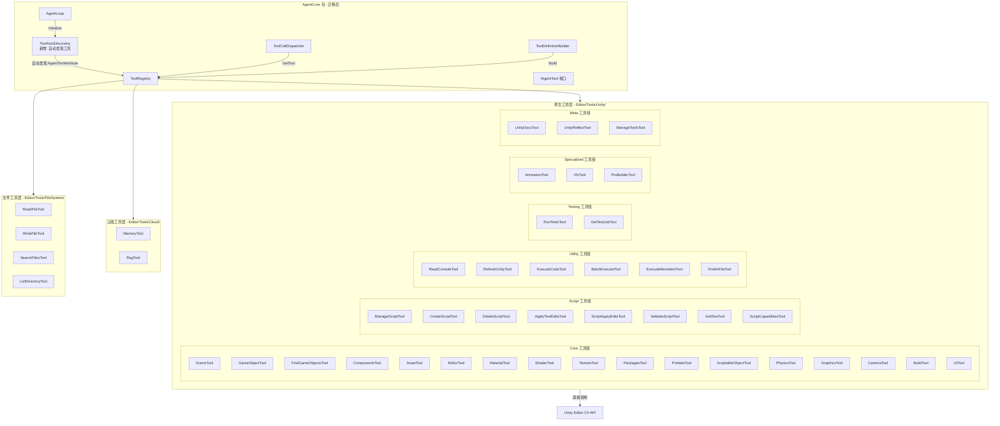
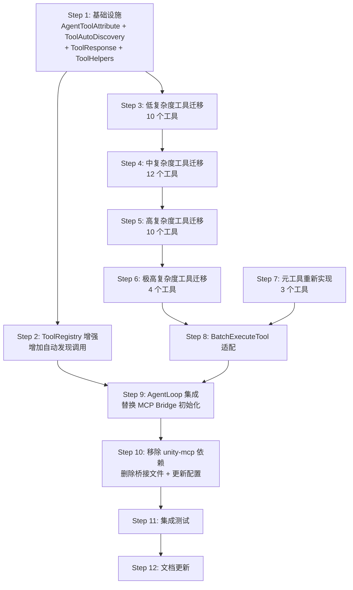

# Phase 2.5 实施计划：原生工具迁移（脱离 unity-mcp 依赖）

> **文档状态（2026-05-12 校准）**: 历史归档。Phase 2.5 原生工具迁移已完成，当前工具清单与 actions 必须以 `Editor/Tools/Native/` 实际源码为准；本文仅作为迁移背景和历史设计参考，不再作为后续工具开发规划依据。

> **目标**：将 AgentCore 的 Unity Editor 工具从依赖 unity-mcp 桥接层迁移为原生 `IAgentTool` 实现，直接调用 Unity Editor C# API，彻底消除对 `com.coplaydev.unity-mcp` 包的依赖。
>
> **前置条件**：Phase 2 已完成（工具调用闭环、自我纠错、编译检查、UI 展示均已工作）。
>
> **架构文档参考**：`plans/ARCHITECTURE.md` §4.3

---

## 一、概述与动机

### 1.1 为什么要脱离 unity-mcp

| 维度 | 当前状态（依赖 unity-mcp） | 目标状态（原生工具） |
|------|---------------------------|---------------------|
| **依赖链** | `package.json` 依赖 `com.coplaydev.unity-mcp@9.5.3`；`asmdef` 引用 `MCPForUnity.Editor` | 零外部依赖，完全自包含 |
| **版本耦合** | unity-mcp 升级可能破坏 `CommandRegistry` API、`Response` 类型、工具签名 | 自主控制所有 API 演进 |
| **Schema 维护** | [`McpToolSchemas.cs`](Editor/Tools/McpToolSchemas.cs) 804 行硬编码 JSON schema，需手动与 unity-mcp 同步 | Schema 内嵌于每个工具类的 `ToolMetadata`，单一事实来源 |
| **间接调用开销** | `McpToolWrapper` → `UnityMcpBridge.ExecuteToolAsync()` → `CommandRegistry.InvokeCommandAsync()` → `HandleCommand()` | `IAgentTool.ExecuteAsync()` → Unity Editor API，减少 2 层间接调用 |
| **调试体验** | 异常堆栈穿越 unity-mcp 内部代码，难以定位 | 堆栈清晰，断点可直接设在工具实现中 |
| **包体积** | 包含 unity-mcp 全部 60+ 源文件（含 MCP 协议层、WebSocket 服务器等 AgentCore 不需要的部分） | 仅包含实际使用的工具代码 |
| **可定制性** | 工具行为由 unity-mcp 决定，无法针对 Agent 场景优化 | 可自由优化返回格式、添加 Agent 友好的元数据 |

### 1.2 迁移策略：复制-适配（Copy-Adapt）

**核心原则**：unity-mcp 的工具实现代码是经过生产验证的，我们不重新发明轮子，而是：

1. **复制**核心业务逻辑（`HandleCommand` 方法体及其辅助方法）
2. **适配**为 `IAgentTool` 接口（替换 `SuccessResponse`/`ErrorResponse` 为 `ToolResult`）
3. **内嵌** JSON Schema 到 `ToolMetadata.ParametersSchema`
4. **移除**对 `MCPForUnity.Editor.*` 命名空间的所有引用

### 1.3 范围界定

| 包含 | 不包含 |
|------|--------|
| 所有 42 个 unity-mcp 工具的原生实现 | MCP 协议层（WebSocket/stdio 服务器） |
| 完整的 JSON Schema 定义 | unity-mcp 的 Resource 系统 |
| 工具分类与分组管理 | Python 端的 MCP 工具包装器 |
| 自动注册机制 | unity-mcp 的 UI 面板 |
| 编译检测集成 | 多实例管理（`set_active_instance`） |

---

## 二、当前架构分析

### 2.1 依赖关系图（当前）



### 2.2 关键文件清单（将被修改或删除）

| 文件 | 行数 | 迁移后处理 |
|------|------|-----------|
| [`UnityMcpBridge.cs`](Editor/Tools/UnityMcpBridge.cs) | 876 | **删除** — 桥接层不再需要 |
| [`McpToolSchemas.cs`](Editor/Tools/McpToolSchemas.cs) | 804 | **删除** — Schema 内嵌到各工具类 |
| [`AgentLoop.cs`](Editor/Core/AgentLoop.cs) | 932 | **修改** — 移除 `UnityMcpBridge.Instance.Initialize()` 调用，替换为原生工具注册 |
| [`ToolRegistry.cs`](Editor/Tools/ToolRegistry.cs) | 319 | **保留** — 核心不变，增加自动发现 |
| [`ToolCallDispatcher.cs`](Editor/Tools/ToolCallDispatcher.cs) | 471 | **保留** — 核心不变 |
| [`ToolDefinitionBuilder.cs`](Editor/Tools/ToolDefinitionBuilder.cs) | 291 | **保留** — 核心不变 |
| [`IAgentTool.cs`](Editor/Tools/IAgentTool.cs) | 194 | **保留** — 核心接口不变 |
| [`AgentCore.Editor.asmdef`](Editor/AgentCore.Editor.asmdef) | — | **修改** — 移除 `MCPForUnity.Editor` 引用 |
| [`package.json`](package.json) | 26 | **修改** — 移除 `com.coplaydev.unity-mcp` 依赖 |

### 2.3 关键文件清单（保持不变）

| 文件 | 说明 |
|------|------|
| [`CompilationWatcher.cs`](Editor/Core/CompilationWatcher.cs) | 编译监控，已是原生实现 |
| [`FallbackRouter.cs`](Editor/Core/FallbackRouter.cs) | LLM 重试路由，与工具层无关 |
| [`ConsoleErrorCapture.cs`](Editor/Core/ConsoleErrorCapture.cs) | Console 错误捕获，已是原生实现 |
| [`ErrorInfoCollector.cs`](Editor/Core/ErrorInfoCollector.cs) | 错误信息收集，已是原生实现 |
| 所有 `Editor/LLM/*` 文件 | LLM 客户端层，与工具层无关 |
| 所有 `Editor/UI/*` 文件 | UI 层，与工具层无关 |
| 所有 `Editor/Config/*` 文件 | 配置层，与工具层无关 |
| 所有 `Editor/Bootstrap/*` 文件 | Bootstrap 层，与工具层无关 |

---

## 三、unity-mcp 工具完整清单与迁移分析

### 3.1 工具分类总览

unity-mcp 通过 `McpToolSchemas.cs` 暴露 **42 个工具名**，对应 **25 个 C# 工具类**（部分工具名是同一个类的不同 action 或 Python 端包装器）。



### 3.2 详细工具清单

#### 3.2.1 核心工具（Core）

| # | 工具名 | unity-mcp 源文件 | 行数 | Actions | 复杂度 | 迁移策略 |
|---|--------|-----------------|------|---------|--------|---------|
| 1 | `manage_scene` | `ManageScene.cs` | 1523 | create, load, save, get_hierarchy, get_active, get_build_settings, scene_view_frame, close_scene, set_active_scene, get_loaded_scenes, move_to_scene, validate | **高** | 复制核心逻辑，拆分为多个辅助方法 |
| 2 | `manage_gameobject` | `GameObjects/ManageGameObject.cs` + 8 个辅助文件 | ~1500 | create, modify, delete, duplicate, move_relative, look_at | **高** | 复制整个 GameObjects 子目录结构 |
| 3 | `find_gameobjects` | `FindGameObjects.cs` | ~300 | by_name, by_tag, by_layer, by_component, by_path, by_id | **中** | 直接复制 |
| 4 | `manage_components` | `ManageComponents.cs` | 392 | add, remove, set_property | **中** | 直接复制，需处理反射逻辑 |
| 5 | `manage_asset` | `ManageAsset.cs` | 1121 | import, create, modify, delete, duplicate, move, rename, search, get_info, create_folder, get_components | **高** | 复制核心逻辑 |
| 6 | `manage_editor` | `ManageEditor.cs` | ~400 | play, pause, stop, set_active_tool, add_tag, remove_tag, add_layer, remove_layer, undo, redo | **中** | 直接复制 |
| 7 | `manage_material` | `ManageMaterial.cs` | ~500 | ping, create, set_material_shader_property, set_material_color, assign_material_to_renderer, set_renderer_color, get_material_info | **中** | 直接复制 |
| 8 | `manage_script` | `ManageScript.cs` | 2824 | create, read, delete + 子工具（apply_text_edits, script_apply_edits, validate_script, get_sha, create_script, delete_script） | **极高** | 最复杂的工具，需仔细拆分 |
| 9 | `manage_shader` | `ManageShader.cs` | ~300 | create, read, update, delete | **低** | 直接复制 |
| 10 | `manage_texture` | `ManageTexture.cs` | ~600 | create, modify, delete, create_sprite, apply_pattern, apply_gradient, apply_noise, set_import_settings | **中** | 直接复制 |
| 11 | `manage_packages` | `ManagePackages.cs` | ~500 | list_packages, search_packages, get_package_info, add_package, remove_package, list_registries, add_registry, remove_registry, embed_package, resolve_packages, ping, status | **中** | 直接复制 |
| 12 | `manage_prefabs` | `Prefabs/ManagePrefabs.cs` | ~800 | create_from_gameobject, get_info, get_hierarchy, modify_contents, open_prefab_stage, save_prefab_stage, close_prefab_stage | **高** | 复制核心逻辑 |
| 13 | `manage_scriptable_object` | `ManageScriptableObject.cs` | ~600 | create, modify | **中** | 直接复制 |
| 14 | `manage_physics` | `ManagePhysics.cs`（推测） | ~800 | ping, get_settings, set_settings, get_collision_matrix, set_collision_matrix, create_physics_material, raycast, overlap, apply_force, validate 等 | **高** | 复制核心逻辑 |
| 15 | `manage_graphics` | `Graphics/ManageGraphics.cs` + 6 个辅助文件 | ~2000 | volume_*, bake_*, stats_*, pipeline_*, feature_*, skybox_* | **极高** | 复制整个 Graphics 子目录 |
| 16 | `manage_camera` | `Cameras/ManageCamera.cs` + 4 个辅助文件 | ~1500 | create_camera, set_target, set_lens, set_body, set_aim, screenshot, list_cameras 等 | **高** | 复制整个 Cameras 子目录 |
| 17 | `manage_build` | `ManageBuild.cs`（推测） | ~500 | build, status, platform, settings, scenes, profiles, batch, cancel | **中** | 直接复制 |
| 18 | `manage_ui` | `ManageUI.cs` | ~800 | create, read, update, delete, attach_ui_document, get_visual_tree, render_ui, link_stylesheet, modify_visual_element 等 | **高** | 复制核心逻辑 |

#### 3.2.2 工具类（Utility）

| # | 工具名 | unity-mcp 源文件 | 行数 | 复杂度 | 迁移策略 |
|---|--------|-----------------|------|--------|---------|
| 19 | `read_console` | `ReadConsole.cs` | ~200 | **低** | 直接复制 |
| 20 | `refresh_unity` | `RefreshUnity.cs` | ~150 | **低** | 直接复制 |
| 21 | `execute_code` | `ExecuteCode.cs`（推测） | ~500 | **中** | 复制，需处理 Roslyn/CodeDom 编译器选择 |
| 22 | `batch_execute` | `BatchExecute.cs` | ~300 | **中** | 复制，需适配为调用原生工具而非 CommandRegistry |
| 23 | `execute_menu_item` | `ExecuteMenuItem.cs` | ~100 | **低** | 直接复制 |
| 24 | `find_in_file` | 可能在 ManageScript 内 | ~200 | **低** | 直接复制 |
| 25 | `run_tests` | `RunTests.cs` | ~300 | **中** | 直接复制 |
| 26 | `get_test_job` | `GetTestJob.cs` | ~200 | **低** | 直接复制 |

#### 3.2.3 脚本扩展工具（Scripting Extension）

这些工具在 unity-mcp 中是 `ManageScript.cs` 的子功能，在 Python MCP 端被暴露为独立工具名。

| # | 工具名 | 来源 | 复杂度 | 迁移策略 |
|---|--------|------|--------|---------|
| 27 | `script_apply_edits` | `ManageScript.cs` 内的结构化编辑 | **高** | 从 ManageScript 中提取为独立工具 |
| 28 | `apply_text_edits` | `ManageScript.cs` 内的文本编辑 | **高** | 从 ManageScript 中提取为独立工具 |
| 29 | `create_script` | `ManageScript.cs` 内的创建功能 | **中** | 从 ManageScript 中提取为独立工具 |
| 30 | `delete_script` | `ManageScript.cs` 内的删除功能 | **低** | 从 ManageScript 中提取为独立工具 |
| 31 | `validate_script` | `ManageScript.cs` 内的验证功能 | **中** | 从 ManageScript 中提取为独立工具 |
| 32 | `get_sha` | `ManageScript.cs` 内的 SHA 计算 | **低** | 从 ManageScript 中提取为独立工具 |
| 33 | `manage_script_capabilities` | `ManageScript.cs` 内的能力查询 | **低** | 从 ManageScript 中提取为独立工具 |

#### 3.2.4 专业领域工具（Specialized）

| # | 工具名 | unity-mcp 源文件 | 行数 | 复杂度 | 迁移策略 |
|---|--------|-----------------|------|--------|---------|
| 34 | `manage_animation` | `Animation/ManageAnimation.cs` + 7 个辅助文件 | ~2000 | **极高** | 复制整个 Animation 子目录 |
| 35 | `manage_vfx` | `Vfx/ManageVFX.cs` + 15 个辅助文件 | ~3000 | **极高** | 复制整个 Vfx 子目录 |
| 36 | `manage_probuilder` | `ProBuilder/ManageProBuilder.cs` + 2 个辅助文件 | ~1500 | **高** | 复制整个 ProBuilder 子目录，需条件编译 |

#### 3.2.5 元工具（Meta）— 需要重新设计

| # | 工具名 | 迁移策略 |
|---|--------|---------|
| 37 | `unity_docs` | **重新实现** — 当前依赖 unity-mcp Python 端的文档抓取，需改为本地实现或 HTTP 调用 |
| 38 | `unity_reflect` | **重新实现** — 反射查询 Unity API，纯 C# 可独立实现 |
| 39 | `manage_tools` | **重新实现** — 工具分组管理，改为操作 `ToolRegistry` |
| 40 | `debug_request_context` | **不迁移** — MCP 协议特有，AgentCore 不需要 |
| 41 | `set_active_instance` | **不迁移** — 多实例管理，AgentCore 不需要 |
| 42 | `batch_execute` | **重新实现** — 改为调用 `ToolRegistry` 中的原生工具 |

### 3.3 复杂度统计

| 复杂度 | 工具数 | 说明 |
|--------|--------|------|
| **低** | 10 | 直接复制，改接口即可 |
| **中** | 12 | 需要适配，但逻辑清晰 |
| **高** | 10 | 多文件、多 action，需仔细拆分 |
| **极高** | 4 | 大型工具（manage_script, manage_graphics, manage_animation, manage_vfx） |
| **不迁移** | 2 | MCP 协议特有工具 |
| **重新实现** | 4 | 需要全新设计 |
| **合计** | **42** | |

---

## 四、原生工具架构设计

### 4.1 目标架构图



### 4.2 目录结构设计

```
Editor/Tools/
├── IAgentTool.cs                    # 保留 — 核心接口
├── ToolRegistry.cs                  # 保留 — 增加自动发现
├── ToolCallDispatcher.cs            # 保留 — 不变
├── ToolDefinitionBuilder.cs         # 保留 — 不变
├── ToolAutoDiscovery.cs             # 新增 — 自动发现 [AgentTool] 标记的工具
├── AgentToolAttribute.cs            # 新增 — 工具标记属性
├── ToolResponse.cs                  # 新增 — 统一响应辅助类
├── ToolHelpers.cs                   # 新增 — 通用辅助方法（参数解析、GameObject 查找等）
│
├── Unity/                           # 新增 — 所有 Unity Editor 原生工具
│   ├── Core/                        # 核心工具组
│   │   ├── SceneTool.cs
│   │   ├── GameObjectTool.cs
│   │   ├── GameObjectHelpers.cs     # 辅助：创建/修改/删除/复制逻辑
│   │   ├── FindGameObjectsTool.cs
│   │   ├── ComponentsTool.cs
│   │   ├── AssetTool.cs
│   │   ├── EditorTool.cs
│   │   ├── MaterialTool.cs
│   │   ├── ShaderTool.cs
│   │   ├── TextureTool.cs
│   │   ├── PackagesTool.cs
│   │   ├── PrefabsTool.cs
│   │   ├── ScriptableObjectTool.cs
│   │   ├── PhysicsTool.cs
│   │   ├── GraphicsTool.cs
│   │   ├── GraphicsHelpers.cs       # 辅助：Volume/Bake/Pipeline/Skybox 操作
│   │   ├── CameraTool.cs
│   │   ├── CameraHelpers.cs         # 辅助：创建/配置/截图逻辑
│   │   ├── BuildTool.cs
│   │   └── UITool.cs
│   │
│   ├── Script/                      # 脚本工具组
│   │   ├── ManageScriptTool.cs      # CRUD 主入口
│   │   ├── CreateScriptTool.cs
│   │   ├── DeleteScriptTool.cs
│   │   ├── ApplyTextEditsTool.cs
│   │   ├── ScriptApplyEditsTool.cs
│   │   ├── ValidateScriptTool.cs
│   │   ├── GetShaTool.cs
│   │   ├── ScriptCapabilitiesTool.cs
│   │   └── ScriptHelpers.cs         # 辅助：路径解析、SHA 计算、验证逻辑
│   │
│   ├── Utility/                     # 工具类
│   │   ├── ReadConsoleTool.cs
│   │   ├── RefreshUnityTool.cs
│   │   ├── ExecuteCodeTool.cs
│   │   ├── BatchExecuteTool.cs
│   │   ├── ExecuteMenuItemTool.cs
│   │   └── FindInFileTool.cs
│   │
│   ├── Testing/                     # 测试工具组
│   │   ├── RunTestsTool.cs
│   │   └── GetTestJobTool.cs
│   │
│   ├── Specialized/                 # 专业领域工具组
│   │   ├── AnimationTool.cs
│   │   ├── AnimationHelpers.cs      # 辅助：Animator/Clip/Controller 操作
│   │   ├── VfxTool.cs
│   │   ├── VfxHelpers.cs            # 辅助：Particle/Line/Trail/VfxGraph 操作
│   │   ├── ProBuilderTool.cs
│   │   └── ProBuilderHelpers.cs     # 辅助：Mesh/UV/Smoothing 操作
│   │
│   └── Meta/                        # 元工具组
│       ├── UnityDocsTool.cs
│       ├── UnityReflectTool.cs
│       └── ManageToolsTool.cs
│
├── Cloud/                           # 云端工具（Phase 3 实现）
│   └── .gitkeep
│
└── FileSystem/                      # 文件系统工具（Phase 3 实现）
    └── .gitkeep
```

### 4.3 核心基础设施设计

#### 4.3.1 `AgentToolAttribute` — 工具标记属性

```csharp
// Editor/Tools/AgentToolAttribute.cs
namespace AgentCore.Editor.Tools
{
    /// <summary>
    /// 标记一个类为 AgentCore 原生工具，支持自动发现和注册。
    /// </summary>
    [AttributeUsage(AttributeTargets.Class, AllowMultiple = false)]
    public class AgentToolAttribute : Attribute
    {
        /// <summary>工具名称（对应 LLM function calling 的 name）</summary>
        public string Name { get; }
        
        /// <summary>工具分类（用于分组管理）</summary>
        public string Category { get; set; } = "core";
        
        /// <summary>是否需要在主线程执行</summary>
        public bool RequiresMainThread { get; set; } = true;
        
        /// <summary>是否自动注册（默认 true）</summary>
        public bool AutoRegister { get; set; } = true;

        public AgentToolAttribute(string name)
        {
            Name = name;
        }
    }
}
```

#### 4.3.2 `ToolAutoDiscovery` — 自动发现机制

```csharp
// Editor/Tools/ToolAutoDiscovery.cs
namespace AgentCore.Editor.Tools
{
    /// <summary>
    /// 通过反射自动发现所有标记了 [AgentTool] 的 IAgentTool 实现类，
    /// 并注册到 ToolRegistry。
    /// </summary>
    public static class ToolAutoDiscovery
    {
        /// <summary>
        /// 扫描所有程序集，发现并注册工具。
        /// </summary>
        public static int DiscoverAndRegister(ToolRegistry registry)
        {
            int count = 0;
            var toolInterface = typeof(IAgentTool);
            
            foreach (var assembly in AppDomain.CurrentDomain.GetAssemblies())
            {
                // 只扫描 AgentCore 相关程序集
                if (!assembly.FullName.StartsWith("AgentCore")) continue;
                
                foreach (var type in assembly.GetTypes())
                {
                    if (!toolInterface.IsAssignableFrom(type)) continue;
                    if (type.IsAbstract || type.IsInterface) continue;
                    
                    var attr = type.GetCustomAttribute<AgentToolAttribute>();
                    if (attr == null || !attr.AutoRegister) continue;
                    
                    try
                    {
                        var tool = (IAgentTool)Activator.CreateInstance(type);
                        registry.Register(tool);
                        count++;
                    }
                    catch (Exception ex)
                    {
                        Debug.LogWarning(
                            $"[AgentCore] Failed to register tool {type.Name}: {ex.Message}");
                    }
                }
            }
            
            return count;
        }
    }
}
```

#### 4.3.3 `ToolResponse` — 统一响应辅助类

替代 unity-mcp 的 `SuccessResponse` / `ErrorResponse` / `PendingResponse`：

```csharp
// Editor/Tools/ToolResponse.cs
namespace AgentCore.Editor.Tools
{
    /// <summary>
    /// 工具响应构建辅助类，提供与 unity-mcp Response 类等价的功能。
    /// 所有原生工具使用此类构建返回值。
    /// </summary>
    public static class ToolResponse
    {
        /// <summary>成功响应，带消息</summary>
        public static ToolResult Success(string message)
            => ToolResult.Ok(JObject.FromObject(new { success = true, message }).ToString());

        /// <summary>成功响应，带数据</summary>
        public static ToolResult Success(string message, object data)
            => ToolResult.Ok(JObject.FromObject(new { success = true, message, data }).ToString());

        /// <summary>成功响应，直接传 JObject data</summary>
        public static ToolResult SuccessData(object data)
            => ToolResult.Ok(JsonConvert.SerializeObject(data));

        /// <summary>错误响应</summary>
        public static ToolResult Error(string error, string code = null)
            => ToolResult.Fail(JObject.FromObject(new { success = false, error, code }).ToString());

        /// <summary>异步待处理响应</summary>
        public static ToolResult Pending(string jobId, string message)
            => ToolResult.Ok(JObject.FromObject(new { 
                success = true, pending = true, jobId, message 
            }).ToString());
    }
}
```

#### 4.3.4 `ToolHelpers` — 通用辅助方法

从 unity-mcp 的 `ParamCoercion`、`GameObjectResolver`、`ComponentResolver` 等提取：

```csharp
// Editor/Tools/ToolHelpers.cs
namespace AgentCore.Editor.Tools
{
    /// <summary>
    /// 工具通用辅助方法：参数解析、GameObject 查找、组件解析等。
    /// 从 unity-mcp 的 Helpers 命名空间迁移而来。
    /// </summary>
    public static class ToolHelpers
    {
        // --- 参数解析 ---
        public static string CoerceString(JToken token, string defaultValue = null);
        public static int? CoerceInt(JToken token);
        public static float? CoerceFloat(JToken token);
        public static bool? CoerceBool(JToken token);
        public static float[] ParseFloatArray(JToken token);
        public static int[] ParseIntArray(JToken token);
        
        // --- GameObject 查找 ---
        public static GameObject FindGameObject(JToken target, string searchMethod);
        public static GameObject FindByInstanceId(int instanceId);
        public static GameObject FindByName(string name);
        public static GameObject FindByPath(string path);
        public static GameObject FindByTag(string tag);
        
        // --- 组件解析 ---
        public static Type ResolveComponentType(string typeName);
        public static Component GetComponentByIndex(GameObject go, Type type, int? index);
        
        // --- 路径工具 ---
        public static string NormalizePath(string path);
        public static bool IsUnderAssets(string path);
        public static string ToAssetsRelativePath(string fullPath);
    }
}
```

### 4.4 原生工具实现模式

每个原生工具遵循统一的实现模式：

```csharp
// 示例：Editor/Tools/Unity/Core/SceneTool.cs
using Newtonsoft.Json.Linq;
using UnityEditor;
using UnityEditor.SceneManagement;
using UnityEngine;
using UnityEngine.SceneManagement;

namespace AgentCore.Editor.Tools.Unity.Core
{
    /// <summary>
    /// 场景管理工具 — 对应 unity-mcp 的 manage_scene。
    /// 支持场景 CRUD、层级查询、截图等操作。
    /// </summary>
    [AgentTool("manage_scene", Category = "core", RequiresMainThread = true)]
    public class SceneTool : IAgentTool
    {
        // Schema 内嵌为静态 JObject，单一事实来源
        private static readonly JObject Schema = JObject.Parse(@"{
            ""type"": ""object"",
            ""properties"": {
                ""action"": {
                    ""type"": ""string"",
                    ""enum"": [""create"", ""load"", ""save"", ""get_hierarchy"", 
                              ""get_active"", ""get_build_settings"", ""scene_view_frame"",
                              ""close_scene"", ""set_active_scene"", ""get_loaded_scenes"",
                              ""move_to_scene"", ""validate""],
                    ""description"": ""Scene operation to perform""
                },
                ""path"": { ""type"": ""string"", ""description"": ""Scene path"" }
                // ... 其他参数
            },
            ""required"": [""action""]
        }");

        public ToolMetadata Metadata => new ToolMetadata(
            name: ""manage_scene"",
            description: ""Performs CRUD operations on Unity scenes..."",
            category: ""core"",
            parametersSchema: Schema,
            requiresMainThread: true
        );

        public Task<ToolResult> ExecuteAsync(JObject parameters, CancellationToken ct = default)
        {
            string action = ToolHelpers.CoerceString(parameters[""action""])?.ToLowerInvariant();
            if (string.IsNullOrEmpty(action))
                return Task.FromResult(ToolResponse.Error(""'action' parameter is required.""));

            try
            {
                return Task.FromResult(action switch
                {
                    ""create"" => CreateScene(parameters),
                    ""load"" => LoadScene(parameters),
                    ""save"" => SaveScene(parameters),
                    ""get_hierarchy"" => GetHierarchy(parameters),
                    ""get_active"" => GetActiveScene(),
                    // ... 其他 action
                    _ => ToolResponse.Error($""Unknown action: '{action}'"")
                });
            }
            catch (Exception ex)
            {
                return Task.FromResult(ToolResponse.Error($""Scene operation failed: {ex.Message}""));
            }
        }

        // --- 私有方法：从 unity-mcp ManageScene.cs 复制并适配 ---
        private ToolResult CreateScene(JObject p) { /* ... */ }
        private ToolResult LoadScene(JObject p) { /* ... */ }
        // ...
    }
}
```

### 4.5 编译检测集成

当前 [`UnityMcpBridge.IsScriptModifyingCommand()`](Editor/Tools/UnityMcpBridge.cs:728) 维护了一个硬编码的脚本修改命令列表。迁移后改为基于属性标记：

```csharp
// 在 AgentToolAttribute 中增加
public class AgentToolAttribute : Attribute
{
    // ... 已有属性 ...
    
    /// <summary>
    /// 此工具是否可能修改脚本文件（触发编译）。
    /// 为 true 时，ToolCallDispatcher 会在执行后自动触发编译检查。
    /// </summary>
    public bool MayModifyScripts { get; set; } = false;
}

// 使用示例
[AgentTool("create_script", Category = "scripting", MayModifyScripts = true)]
public class CreateScriptTool : IAgentTool { /* ... */ }

[AgentTool("manage_scene", Category = "core", MayModifyScripts = false)]
public class SceneTool : IAgentTool { /* ... */ }
```

### 4.6 BatchExecuteTool 特殊处理

`batch_execute` 工具需要能调用其他工具，迁移后改为通过 `ToolRegistry` 查找：

```csharp
[AgentTool("batch_execute", Category = "utility")]
public class BatchExecuteTool : IAgentTool
{
    public async Task<ToolResult> ExecuteAsync(JObject parameters, CancellationToken ct)
    {
        var commands = parameters["commands"] as JArray;
        var results = new List<object>();
        
        foreach (var cmd in commands)
        {
            string toolName = cmd["tool"]?.ToString();
            var toolParams = cmd["params"] as JObject ?? new JObject();
            
            // 通过 ToolRegistry 查找并执行
            var tool = ToolRegistry.Instance.GetTool(toolName);
            if (tool == null)
            {
                results.Add(new { tool = toolName, error = "Tool not found" });
                continue;
            }
            
            var result = await tool.ExecuteAsync(toolParams, ct);
            results.Add(new { tool = toolName, success = result.Success, output = result.Output });
        }
        
        return ToolResponse.SuccessData(results);
    }
}
```

---

## 五、详细迁移步骤

### 5.1 步骤依赖图



### 5.2 Step 1：基础设施搭建

**目标**：创建原生工具系统的基础类。

**新建文件**：

| 文件 | 说明 |
|------|------|
| `Editor/Tools/AgentToolAttribute.cs` | 工具标记属性，含 Name, Category, RequiresMainThread, AutoRegister, MayModifyScripts |
| `Editor/Tools/ToolAutoDiscovery.cs` | 反射扫描 `[AgentTool]` 标记的 `IAgentTool` 实现类，批量注册到 `ToolRegistry` |
| `Editor/Tools/ToolResponse.cs` | 统一响应构建辅助类，替代 unity-mcp 的 `SuccessResponse`/`ErrorResponse`/`PendingResponse` |
| `Editor/Tools/ToolHelpers.cs` | 通用辅助方法：参数解析（`CoerceString`/`CoerceInt`/`CoerceFloat`/`CoerceBool`）、`FindGameObject`、`ResolveComponentType`、路径工具 |

**设计要点**：
- `ToolHelpers` 从 unity-mcp 的 `ParamCoercion`、`GameObjectResolver`、`ComponentResolver`、`AssetPathUtility` 中提取核心逻辑
- `ToolResponse` 的返回格式与 unity-mcp 的 `SuccessResponse`/`ErrorResponse` JSON 结构保持一致，确保 LLM 端无感知
- `ToolAutoDiscovery` 只扫描 `AgentCore` 开头的程序集，避免扫描整个 AppDomain

### 5.3 Step 2：ToolRegistry 增强

**目标**：在 `ToolRegistry` 中增加自动发现入口。

**修改文件**：[`Editor/Tools/ToolRegistry.cs`](Editor/Tools/ToolRegistry.cs)

**变更内容**：
- 增加 `DiscoverAndRegisterAll()` 方法，调用 `ToolAutoDiscovery.DiscoverAndRegister(this)`
- 增加 `GetToolsByAttribute<T>()` 方法，支持按属性查询（如查找所有 `MayModifyScripts=true` 的工具）
- 保持现有 `Register()`/`Unregister()`/`GetTool()` 等 API 不变

### 5.4 Step 3：低复杂度工具迁移（10 个）

**目标**：迁移所有低复杂度工具，验证基础设施可用性。

| 工具名 | 新文件路径 | 来源 |
|--------|-----------|------|
| `read_console` | `Editor/Tools/Unity/Utility/ReadConsoleTool.cs` | `ReadConsole.cs` (~200 行) |
| `refresh_unity` | `Editor/Tools/Unity/Utility/RefreshUnityTool.cs` | `RefreshUnity.cs` (~150 行) |
| `execute_menu_item` | `Editor/Tools/Unity/Utility/ExecuteMenuItemTool.cs` | `ExecuteMenuItem.cs` (~100 行) |
| `manage_shader` | `Editor/Tools/Unity/Core/ShaderTool.cs` | `ManageShader.cs` (~300 行) |
| `delete_script` | `Editor/Tools/Unity/Script/DeleteScriptTool.cs` | `ManageScript.cs` 内提取 |
| `get_sha` | `Editor/Tools/Unity/Script/GetShaTool.cs` | `ManageScript.cs` 内提取 |
| `manage_script_capabilities` | `Editor/Tools/Unity/Script/ScriptCapabilitiesTool.cs` | `ManageScript.cs` 内提取 |
| `get_test_job` | `Editor/Tools/Unity/Testing/GetTestJobTool.cs` | `GetTestJob.cs` (~200 行) |
| `find_in_file` | `Editor/Tools/Unity/Utility/FindInFileTool.cs` | ManageScript 或独立文件 |
| `manage_editor` | `Editor/Tools/Unity/Core/EditorTool.cs` | `ManageEditor.cs` (~400 行，action 简单) |

**每个工具的迁移步骤**：
1. 创建新文件，实现 `IAgentTool` 接口
2. 添加 `[AgentTool]` 属性
3. 从 unity-mcp 源文件复制 `HandleCommand` 方法体
4. 将 `SuccessResponse` → `ToolResponse.Success()`，`ErrorResponse` → `ToolResponse.Error()`
5. 将 `MCPForUnity.Editor.*` 引用替换为 `AgentCore.Editor.Tools` 引用
6. 内嵌 JSON Schema 到 `ToolMetadata.ParametersSchema`
7. 编译验证

### 5.5 Step 4：中复杂度工具迁移（12 个）

| 工具名 | 新文件路径 | 来源 |
|--------|-----------|------|
| `find_gameobjects` | `Editor/Tools/Unity/Core/FindGameObjectsTool.cs` | `FindGameObjects.cs` |
| `manage_components` | `Editor/Tools/Unity/Core/ComponentsTool.cs` | `ManageComponents.cs` (392 行) |
| `manage_material` | `Editor/Tools/Unity/Core/MaterialTool.cs` | `ManageMaterial.cs` |
| `manage_texture` | `Editor/Tools/Unity/Core/TextureTool.cs` | `ManageTexture.cs` |
| `manage_packages` | `Editor/Tools/Unity/Core/PackagesTool.cs` | `ManagePackages.cs` |
| `manage_scriptable_object` | `Editor/Tools/Unity/Core/ScriptableObjectTool.cs` | `ManageScriptableObject.cs` |
| `manage_build` | `Editor/Tools/Unity/Core/BuildTool.cs` | ManageBuild 相关 |
| `execute_code` | `Editor/Tools/Unity/Utility/ExecuteCodeTool.cs` | ExecuteCode 相关 |
| `batch_execute` | `Editor/Tools/Unity/Utility/BatchExecuteTool.cs` | `BatchExecute.cs` |
| `run_tests` | `Editor/Tools/Unity/Testing/RunTestsTool.cs` | `RunTests.cs` |
| `validate_script` | `Editor/Tools/Unity/Script/ValidateScriptTool.cs` | `ManageScript.cs` 内提取 |
| `create_script` | `Editor/Tools/Unity/Script/CreateScriptTool.cs` | `ManageScript.cs` 内提取 |

### 5.6 Step 5：高复杂度工具迁移（10 个）

| 工具名 | 新文件路径 | 来源 | 特殊处理 |
|--------|-----------|------|---------|
| `manage_scene` | `Editor/Tools/Unity/Core/SceneTool.cs` | `ManageScene.cs` (1523 行) | 截图相关逻辑提取到 `SceneScreenshotHelper.cs` |
| `manage_gameobject` | `Editor/Tools/Unity/Core/GameObjectTool.cs` + `GameObjectHelpers.cs` | `GameObjects/` 目录 (8 文件) | 合并辅助文件为 1-2 个 Helper |
| `manage_asset` | `Editor/Tools/Unity/Core/AssetTool.cs` | `ManageAsset.cs` (1121 行) | 搜索/分页逻辑提取到辅助方法 |
| `manage_prefabs` | `Editor/Tools/Unity/Core/PrefabsTool.cs` | `Prefabs/ManagePrefabs.cs` | Prefab Stage 操作需仔细测试 |
| `manage_physics` | `Editor/Tools/Unity/Core/PhysicsTool.cs` | ManagePhysics 相关 | 2D/3D 物理分支处理 |
| `manage_camera` | `Editor/Tools/Unity/Core/CameraTool.cs` + `CameraHelpers.cs` | `Cameras/` 目录 (5 文件) | Cinemachine 条件编译 |
| `manage_ui` | `Editor/Tools/Unity/Core/UITool.cs` | `ManageUI.cs` | UI Toolkit 操作 |
| `manage_probuilder` | `Editor/Tools/Unity/Specialized/ProBuilderTool.cs` + `ProBuilderHelpers.cs` | `ProBuilder/` 目录 (3 文件) | `#if` 条件编译（ProBuilder 可选包） |
| `apply_text_edits` | `Editor/Tools/Unity/Script/ApplyTextEditsTool.cs` | `ManageScript.cs` 内提取 | 精确行列定位逻辑 |
| `script_apply_edits` | `Editor/Tools/Unity/Script/ScriptApplyEditsTool.cs` | `ManageScript.cs` 内提取 | 结构化编辑（方法替换/插入/删除） |

### 5.7 Step 6：极高复杂度工具迁移（4 个）

| 工具名 | 新文件路径 | 来源 | 特殊处理 |
|--------|-----------|------|---------|
| `manage_script` | `Editor/Tools/Unity/Script/ManageScriptTool.cs` + `ScriptHelpers.cs` | `ManageScript.cs` (2824 行) | 最大的单文件工具；CRUD 主入口保留，子功能已在 Step 4-5 中提取为独立工具；`ScriptHelpers.cs` 包含路径解析、安全检查、Roslyn 集成 |
| `manage_graphics` | `Editor/Tools/Unity/Core/GraphicsTool.cs` + `GraphicsHelpers.cs` | `Graphics/` 目录 (7 文件, ~2000 行) | Volume/Bake/Stats/Pipeline/Feature/Skybox 六大子系统；`GraphicsHelpers.cs` 合并所有辅助操作 |
| `manage_animation` | `Editor/Tools/Unity/Specialized/AnimationTool.cs` + `AnimationHelpers.cs` | `Animation/` 目录 (8 文件, ~2000 行) | Animator/Clip/Controller/BlendTree 四大子系统 |
| `manage_vfx` | `Editor/Tools/Unity/Specialized/VfxTool.cs` + `VfxHelpers.cs` | `Vfx/` 目录 (16 文件, ~3000 行) | Particle/Line/Trail/VfxGraph 四大子系统；最大的工具组 |

**迁移策略**：
- 每个工具的主入口文件（`*Tool.cs`）只包含 `IAgentTool` 接口实现和 action 路由
- 所有业务逻辑放在 `*Helpers.cs` 中，保持方法签名与 unity-mcp 一致以便对比验证
- 对于条件编译（如 ProBuilder、Cinemachine），使用 `#if` 预处理指令

### 5.8 Step 7：元工具重新实现（3 个）

| 工具名 | 新文件路径 | 实现方式 |
|--------|-----------|---------|
| `unity_reflect` | `Editor/Tools/Unity/Meta/UnityReflectTool.cs` | 纯 C# 反射实现：`get_type`（列出类成员）、`get_member`（成员详情）、`search`（类型搜索）。从 unity-mcp 的实现中提取反射逻辑。 |
| `unity_docs` | `Editor/Tools/Unity/Meta/UnityDocsTool.cs` | HTTP 请求 `docs.unity3d.com`，解析 HTML 返回文档内容。需要 `HttpClientFactory` 支持。Actions: `get_doc`, `get_manual`, `get_package_doc`, `lookup`。 |
| `manage_tools` | `Editor/Tools/Unity/Meta/ManageToolsTool.cs` | 操作 `ToolRegistry`：`list_groups`（列出工具分组）、`activate`/`deactivate`（启用/禁用工具组）。使用 `AgentToolAttribute.Category` 进行分组。 |

### 5.9 Step 8：BatchExecuteTool 适配

**目标**：`batch_execute` 工具改为通过 `ToolRegistry` 查找并调用原生工具。

**关键变更**：
- 原来：`CommandRegistry.InvokeCommandAsync(toolName, params)`
- 现在：`ToolRegistry.Instance.GetTool(toolName).ExecuteAsync(params, ct)`
- 保持并行/串行执行模式
- 保持 `fail_fast` 和 `max_parallelism` 参数

### 5.10 Step 9：AgentLoop 集成

**目标**：替换 [`AgentLoop.Initialize()`](Editor/Core/AgentLoop.cs:122) 中的 MCP Bridge 初始化。

**修改文件**：[`Editor/Core/AgentLoop.cs`](Editor/Core/AgentLoop.cs)

**变更内容**：

```csharp
// 当前代码（将被替换）：
UnityMcpBridge.Instance.Initialize();
Debug.Log($"[AgentCore] MCP Bridge initialized, {UnityMcpBridge.Instance.ToolCount} tools registered.");

// 替换为：
int toolCount = ToolAutoDiscovery.DiscoverAndRegister(ToolRegistry.Instance);
Debug.Log($"[AgentCore] Native tools initialized, {toolCount} tools registered.");
```

**同时修改**：
- 移除 `using MCPForUnity.Editor.*` 引用
- 移除 `UnityMcpBridge` 相关的所有引用
- 更新 `IsScriptModifyingCommand` 逻辑为基于 `AgentToolAttribute.MayModifyScripts` 查询

### 5.11 Step 10：移除 unity-mcp 依赖

**目标**：彻底移除对 `com.coplaydev.unity-mcp` 的依赖。

**操作清单**：

| 操作 | 文件 | 具体变更 |
|------|------|---------|
| 删除文件 | `Editor/Tools/UnityMcpBridge.cs` | 整个文件删除 |
| 删除文件 | `Editor/Tools/McpToolSchemas.cs` | 整个文件删除 |
| 修改 | [`Editor/AgentCore.Editor.asmdef`](Editor/AgentCore.Editor.asmdef) | 从 `references` 数组中移除 `"MCPForUnity.Editor"` |
| 修改 | [`package.json`](package.json) | 从 `dependencies` 中移除 `"com.coplaydev.unity-mcp": "9.5.3"` |
| 验证 | 全局搜索 | 确认无任何文件引用 `MCPForUnity`、`CommandRegistry`、`McpForUnityTool`、`SuccessResponse`、`ErrorResponse` |

### 5.12 Step 11：集成测试

**目标**：验证所有 42 个工具在原生实现下正常工作。

**测试策略**：

| 测试类型 | 覆盖范围 | 方法 |
|----------|---------|------|
| **编译测试** | 全部 42 个工具 | 确保无编译错误，所有条件编译分支正确 |
| **注册测试** | `ToolAutoDiscovery` | 验证所有 `[AgentTool]` 标记的工具被正确发现和注册 |
| **Schema 测试** | 全部 42 个工具 | 验证每个工具的 `ToolMetadata.ParametersSchema` 是有效的 JSON Schema |
| **冒烟测试** | 核心工具（manage_scene, manage_gameobject, manage_components, manage_asset, manage_script） | 手动执行基本操作，验证返回格式正确 |
| **回归测试** | 全部工具 | 对比 unity-mcp 版本和原生版本的输出格式，确保 LLM 端无感知 |
| **端到端测试** | Agent Loop | 通过 ChatWindow 发送需要工具调用的指令，验证完整闭环 |

**测试文件**：

| 文件 | 说明 |
|------|------|
| `Tests/Editor/ToolAutoDiscoveryTests.cs` | 测试自动发现机制 |
| `Tests/Editor/ToolResponseTests.cs` | 测试响应格式一致性 |
| `Tests/Editor/NativeToolRegistrationTests.cs` | 测试所有工具注册 |
| `Tests/Editor/CoreToolSmokeTests.cs` | 核心工具冒烟测试 |

### 5.13 Step 12：文档更新

**目标**：更新所有相关文档。

| 文件 | 变更 |
|------|------|
| `plans/ARCHITECTURE.md` | 更新 §4.3 工具系统架构图，移除 unity-mcp 桥接层描述 |
| `README.md` | 更新安装说明，移除 unity-mcp 依赖说明 |
| `CHANGELOG.md` | 添加 Phase 2.5 变更记录 |
| `Editor/Bootstrap/Resources/TOOLS.md.template` | 如有需要，更新工具描述模板 |

---

## 六、超越 unity-mcp 的新工具

Phase 2.5 不仅是迁移，还可以添加 unity-mcp 没有的、对 Agent 场景特别有价值的工具：

### 6.1 计划中的新工具

| 工具名 | 分类 | 说明 | 优先级 |
|--------|------|------|--------|
| `get_project_info` | meta | 获取项目信息（Unity 版本、渲染管线、已安装包列表、项目设置摘要） | P0 |
| `get_selection` | core | 获取当前 Editor 选中的 GameObject/Asset 信息 | P1 |
| `search_code` | scripting | 在项目 C# 代码中搜索（正则/语义），比 `find_in_file` 更强大 | P1 |
| `get_compilation_errors` | scripting | 直接获取当前编译错误列表（不需要先 refresh） | P1 |
| `manage_asmdef` | scripting | Assembly Definition 文件管理 | P2 |
| `get_scene_stats` | meta | 场景统计信息（GameObject 数量、组件分布、资产引用） | P2 |
| `manage_layers_tags` | core | 专门的 Layer/Tag 管理工具（比 manage_editor 的子功能更完整） | P2 |

### 6.2 Agent 友好的增强

| 增强 | 说明 |
|------|------|
| **结构化错误信息** | 所有工具的错误返回包含 `errorCode`、`suggestion`（修复建议）、`relatedTools`（相关工具推荐） |
| **操作确认** | 危险操作（删除、覆盖）返回 `requiresConfirmation: true`，让 Agent 可以向用户确认 |
| **执行时间追踪** | 每个 `ToolResult` 自动包含 `executionTimeMs`，帮助 Agent 优化工具选择 |
| **上下文提示** | 工具返回中包含 `hints` 字段，提示 Agent 下一步可能需要的操作 |

---

## 七、风险与缓解

| 风险 | 影响 | 缓解措施 |
|------|------|---------|
| unity-mcp 工具逻辑复制不完整 | 某些边界情况处理缺失 | 逐文件对比，使用 diff 工具验证；保留 unity-mcp 包作为参考直到所有测试通过 |
| 条件编译遗漏 | ProBuilder/Cinemachine 等可选包的 `#if` 分支缺失 | 在有/无可选包的环境中分别编译测试 |
| JSON Schema 不一致 | LLM 调用参数格式变化导致工具执行失败 | 从 `McpToolSchemas.cs` 逐个复制 Schema，不手动重写 |
| 返回格式变化 | LLM 解析工具结果失败 | `ToolResponse` 严格保持与 unity-mcp `SuccessResponse`/`ErrorResponse` 相同的 JSON 结构 |
| 主线程调度问题 | 某些 Unity API 必须在主线程调用 | 保持 `ToolCallDispatcher` 的 `EditorApplication.delayCall` 机制不变 |
| 大量新文件导致编译时间增加 | 开发体验下降 | 使用 asmdef 隔离，考虑将工具分为多个程序集 |

---

## 八、迁移验证清单

每个 Step 完成后，需通过以下验证：

- [ ] 所有新文件编译无错误
- [ ] `ToolAutoDiscovery` 发现的工具数量与预期一致
- [ ] 每个工具的 `ToolMetadata.ParametersSchema` 是有效的 JSON Schema
- [ ] 每个工具的 `ToolMetadata.Name` 与 unity-mcp 中的工具名完全一致
- [ ] 每个工具的返回 JSON 格式与 unity-mcp 版本一致
- [ ] `ToolCallDispatcher` 能正确路由到新工具
- [ ] `ToolDefinitionBuilder` 能正确生成 OpenAI ToolDefinition
- [ ] Agent Loop 端到端测试通过（对话 → 工具调用 → 结果返回 → LLM 继续）
- [ ] 编译检测（`CompilationWatcher`）在脚本修改工具执行后正常触发
- [ ] Console 错误捕获在工具执行后正常工作
- [ ] 无任何代码引用 `MCPForUnity` 命名空间
- [ ] `package.json` 无 `com.coplaydev.unity-mcp` 依赖
- [ ] `asmdef` 无 `MCPForUnity.Editor` 引用

---

## 九、附录

### 9.1 unity-mcp 辅助类映射表

| unity-mcp 类 | AgentCore 替代 | 说明 |
|--------------|---------------|------|
| `SuccessResponse` | `ToolResponse.Success()` | 成功响应 |
| `ErrorResponse` | `ToolResponse.Error()` | 错误响应 |
| `PendingResponse` | `ToolResponse.Pending()` | 异步待处理响应 |
| `ParamCoercion` | `ToolHelpers.CoerceString/Int/Float/Bool()` | 参数类型转换 |
| `GameObjectResolver` | `ToolHelpers.FindGameObject()` | GameObject 查找 |
| `ComponentResolver` | `ToolHelpers.ResolveComponentType()` | 组件类型解析 |
| `AssetPathUtility` | `ToolHelpers.NormalizePath()` | 路径工具 |
| `McpLog` | `Debug.Log/LogWarning/LogError` | 日志（加 `[AgentCore]` 前缀） |
| `CommandRegistry` | `ToolRegistry` | 工具注册表 |
| `McpForUnityToolAttribute` | `AgentToolAttribute` | 工具标记属性 |

### 9.2 工具名到文件的完整映射

| 工具名 | 原生工具文件 |
|--------|------------|
| `manage_scene` | `Editor/Tools/Unity/Core/SceneTool.cs` |
| `manage_gameobject` | `Editor/Tools/Unity/Core/GameObjectTool.cs` |
| `find_gameobjects` | `Editor/Tools/Unity/Core/FindGameObjectsTool.cs` |
| `manage_components` | `Editor/Tools/Unity/Core/ComponentsTool.cs` |
| `manage_asset` | `Editor/Tools/Unity/Core/AssetTool.cs` |
| `manage_editor` | `Editor/Tools/Unity/Core/EditorTool.cs` |
| `manage_material` | `Editor/Tools/Unity/Core/MaterialTool.cs` |
| `manage_shader` | `Editor/Tools/Unity/Core/ShaderTool.cs` |
| `manage_texture` | `Editor/Tools/Unity/Core/TextureTool.cs` |
| `manage_packages` | `Editor/Tools/Unity/Core/PackagesTool.cs` |
| `manage_prefabs` | `Editor/Tools/Unity/Core/PrefabsTool.cs` |
| `manage_scriptable_object` | `Editor/Tools/Unity/Core/ScriptableObjectTool.cs` |
| `manage_physics` | `Editor/Tools/Unity/Core/PhysicsTool.cs` |
| `manage_graphics` | `Editor/Tools/Unity/Core/GraphicsTool.cs` |
| `manage_camera` | `Editor/Tools/Unity/Core/CameraTool.cs` |
| `manage_build` | `Editor/Tools/Unity/Core/BuildTool.cs` |
| `manage_ui` | `Editor/Tools/Unity/Core/UITool.cs` |
| `manage_script` | `Editor/Tools/Unity/Script/ManageScriptTool.cs` |
| `create_script` | `Editor/Tools/Unity/Script/CreateScriptTool.cs` |
| `delete_script` | `Editor/Tools/Unity/Script/DeleteScriptTool.cs` |
| `apply_text_edits` | `Editor/Tools/Unity/Script/ApplyTextEditsTool.cs` |
| `script_apply_edits` | `Editor/Tools/Unity/Script/ScriptApplyEditsTool.cs` |
| `validate_script` | `Editor/Tools/Unity/Script/ValidateScriptTool.cs` |
| `get_sha` | `Editor/Tools/Unity/Script/GetShaTool.cs` |
| `manage_script_capabilities` | `Editor/Tools/Unity/Script/ScriptCapabilitiesTool.cs` |
| `read_console` | `Editor/Tools/Unity/Utility/ReadConsoleTool.cs` |
| `refresh_unity` | `Editor/Tools/Unity/Utility/RefreshUnityTool.cs` |
| `execute_code` | `Editor/Tools/Unity/Utility/ExecuteCodeTool.cs` |
| `batch_execute` | `Editor/Tools/Unity/Utility/BatchExecuteTool.cs` |
| `execute_menu_item` | `Editor/Tools/Unity/Utility/ExecuteMenuItemTool.cs` |
| `find_in_file` | `Editor/Tools/Unity/Utility/FindInFileTool.cs` |
| `run_tests` | `Editor/Tools/Unity/Testing/RunTestsTool.cs` |
| `get_test_job` | `Editor/Tools/Unity/Testing/GetTestJobTool.cs` |
| `manage_animation` | `Editor/Tools/Unity/Specialized/AnimationTool.cs` |
| `manage_vfx` | `Editor/Tools/Unity/Specialized/VfxTool.cs` |
| `manage_probuilder` | `Editor/Tools/Unity/Specialized/ProBuilderTool.cs` |
| `unity_docs` | `Editor/Tools/Unity/Meta/UnityDocsTool.cs` |
| `unity_reflect` | `Editor/Tools/Unity/Meta/UnityReflectTool.cs` |
| `manage_tools` | `Editor/Tools/Unity/Meta/ManageToolsTool.cs` |

### 9.3 不迁移的工具

| 工具名 | 原因 |
|--------|------|
| `debug_request_context` | MCP 协议特有，返回 MCP session/client 信息，AgentCore 不使用 MCP 协议 |
| `set_active_instance` | 多 Unity 实例管理，AgentCore 当前只支持单实例 |
