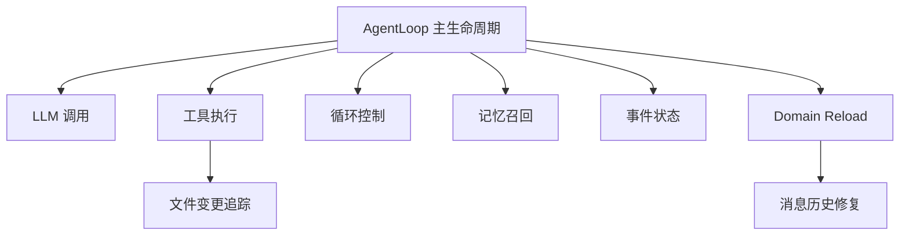

# v0.4.5 AgentLoop partial 拆分实施计划

> 状态：已完成（v0.4.5）。本文为历史设计参考；当前实现以 `Editor/Core/AgentLoop*.cs` 实际源码为准。
> 目标版本：`0.4.5`  
> 主线：只做机械拆分，不改变运行时行为

---

## 1. 背景

`AgentLoop.cs` 当前超过 2000 行，已经承担了对话入口、LLM 调用、工具执行、流式回调、记忆召回、状态事件、Domain Reload 恢复、消息历史修复和资源释放等职责。

`v0.4.3` 已建立测试基线，`v0.4.4` 已补齐工具分发参数预校验。下一步应降低核心文件维护风险，但不应在同一批次引入行为重写。

因此 `v0.4.5` 推荐只做 `partial class` 机械拆分。

---

## 2. 范围边界

### 2.1 本版本做什么

1. 将 `AgentLoop` 声明改为 `public partial class AgentLoop : IDisposable`。
2. 将现有方法按职责移动到多个 `AgentLoop.*.cs` 文件。
3. 保持所有方法签名、访问修饰符、方法体逻辑不变。
4. 同步更新 `package.json`、`CHANGELOG.md`、`plans/ROADMAP.md`。

### 2.2 本版本不做什么

- 不修改 `AgentLoop` 的状态机逻辑。
- 不修改 Domain Reload 恢复逻辑。
- 不修改会话保存与恢复逻辑。
- 不修改工具调用循环行为。
- 不新增功能。
- 不拆分 `ChatWindow.cs`。
- 不重命名公开 API。

---

## 3. 文件拆分方案

### 3.1 保留主文件

```text
Editor/Core/AgentLoop.cs
```

保留内容：

- using 列表。
- namespace。
- XML 类注释。
- `public partial class AgentLoop : IDisposable`。
- 事件。
- 公开属性。
- 字段与常量。
- 构造函数。
- `Initialize()`。
- `SendMessageAsync()`。
- `Cancel()`。
- `ResetConversation()`。
- `LoadSession()`。
- `Dispose()`。

原因：这些是外部生命周期入口，保留在主文件中便于快速理解核心生命周期。

### 3.2 新增文件

```text
Editor/Core/AgentLoop.FileChanges.cs
Editor/Core/AgentLoop.LLM.cs
Editor/Core/AgentLoop.Tools.cs
Editor/Core/AgentLoop.Runner.cs
Editor/Core/AgentLoop.Memory.cs
Editor/Core/AgentLoop.Events.cs
Editor/Core/AgentLoop.DomainReload.cs
Editor/Core/AgentLoop.Sanitization.cs
```

### 3.3 方法归属

| 新文件 | 移入方法 |
|--------|----------|
| `AgentLoop.FileChanges.cs` | `TryRestoreFileChangeTracker()`、`EmitFileChangesUpdatedEvent()` |
| `AgentLoop.LLM.cs` | `CallLLMStreamAsync()`、`OnStreamChunkReceived()` |
| `AgentLoop.Tools.cs` | `BuildToolDefinitions()`、`ExecuteToolCallsAsync()`、`BuildEnhancedToolContent()`、`BuildToolMessagesWithErrors()`、`IsScriptModifyingCommand()`、`ParseToolArguments()` |
| `AgentLoop.Runner.cs` | `RunToolCallLoopAsync()`、`HandleFinalResponse()`、`CheckAllToolCallsFailed()`、`UpdatePerToolFailCounts()` |
| `AgentLoop.Memory.cs` | `RemoveOldMemoryMessages()`、`SearchRelevantMemories()`、`FormatMemoriesAsContext()`、`InjectMemoryContext()` |
| `AgentLoop.Events.cs` | `SetState()`、`EmitEvent()` |
| `AgentLoop.DomainReload.cs` | `OnBeforeAssemblyReload()`、`TryResumeAfterReload()`、`BuildRecoveryMessage()`、`ResumeFromStreaming()`、`ResumeFromExecutingTool()`、`ResumeFromWaitingCompilation()`、`TriggerResumeLLMCall()` |
| `AgentLoop.Sanitization.cs` | `SanitizeMessageHistory()` |

---

## 4. 拆分原则

1. 所有新文件使用同一 namespace：`AgentCore.Editor.Core`。
2. 所有 partial 文件声明统一为 `public partial class AgentLoop`。
3. 不改变任何方法的访问修饰符。
4. 不改变任何方法体逻辑。
5. 不改变字段位置，所有字段继续保留在主文件。
6. 不在本版本新增测试逻辑，只运行已有测试作为回归保护。
7. 如果 Unity 编译提示缺 using，则只在对应 partial 文件补充必要 using，不进行其它调整。

---

## 5. 依赖关系图



---

## 6. 验收标准

1. Unity 编译零错误。
2. `v0.4.3` 和 `v0.4.4` 所有测试继续通过。
3. `AgentLoop.cs` 主文件行数明显下降。
4. Chat 正常发送消息并收到流式响应。
5. 工具调用仍可正常执行。
6. Domain Reload 恢复流程没有编译错误，手动触发后仍能恢复或安全失败。
7. `package.json`、`CHANGELOG.md`、`plans/ROADMAP.md` 同步更新到 `0.4.5`。

---

## 7. 风险点与缓解

| 风险 | 缓解 |
|------|------|
| 拆分时遗漏 using | 编译后按文件补齐 using |
| 方法移动时误删括号或 region | 采用小批次移动，保持每个 partial 文件独立闭合 |
| Domain Reload 方法依赖较多字段 | 字段全部保留在主 partial 文件，访问不变 |
| 行为回归难定位 | 不改逻辑，只做机械移动；通过现有测试和手动 Chat 验证 |

---

## 8. 推荐实施顺序

1. 将 `AgentLoop` 改为 partial。
2. 先拆最独立的 `FileChanges`、`Events`、`Memory`。
3. 再拆 `LLM`、`Tools`、`Runner`。
4. 最后拆风险最高的 `DomainReload`、`Sanitization`。
5. 更新版本文档。

