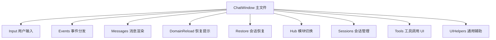

# ChatWindow partial 拆分计划 (v0.4.6)

> 状态：已完成（v0.4.6）。本文为历史设计参考；当前实现以 `Editor/UI/ChatWindow*.cs` 实际源码为准。

> 目标：将当前约 2135 行的 `Editor/UI/ChatWindow.cs` 机械拆分为多个 `partial` 文件，降低单文件维护成本。
> 本计划只做结构拆分，不改变 UXML、USS、菜单入口、窗口生命周期、事件订阅、会话行为、工具调用 UI 行为或 Domain Reload 恢复行为。

---

## 1. 范围

### 1.1 做什么

- 将 `ChatWindow` 改为 `partial class`。
- 保留所有字段、常量、静态缓存、菜单入口、`CreateGUI`、`OnDestroy`、`InitializeAgentLoop` 在主文件中。
- 按现有 `#region` 和方法职责机械移动代码到分区文件。
- 同步更新 `package.json`、`CHANGELOG.md`、`plans/ROADMAP.md` 到 v0.4.6。

### 1.2 不做什么

- 不修改 `ChatWindow.uxml`。
- 不修改 `ChatWindow.uss`。
- 不新增 UI 功能。
- 不重命名现有方法。
- 不改变任何方法体逻辑，除非编译要求补充 `using`。
- 不拆成独立组件类，本轮只做 `partial` 低风险拆分。

---

## 2. 文件边界

| 文件 | 职责 | 主要方法 |
|------|------|----------|
| `Editor/UI/ChatWindow.cs` | 主文件 | 字段、常量、菜单入口、`CreateGUI`、`OnDestroy`、`InitializeAgentLoop` |
| `Editor/UI/ChatWindow.Input.cs` | 用户输入与快捷键 | `OnSendClicked`、`OnCancelClicked`、`OnInputFieldKeyDown`、`OnWindowKeyDown` |
| `Editor/UI/ChatWindow.Events.cs` | Agent 事件分发 | `HandleAgentEvent`、`UpdateUIState` |
| `Editor/UI/ChatWindow.Messages.cs` | 消息渲染与滚动 | `AddUserMessage`、`EnsureAssistantBubbleExists`、`AddAssistantMessageBubble`、`AppendStreamToken`、`FinalizeAssistantMessage`、`ShowError`、`RetryLastMessage`、`ClearMessages`、`RebuildMessageBubbles`、`ScrollToBottom` |
| `Editor/UI/ChatWindow.DomainReload.cs` | Domain Reload 通知 UI | `AddDomainReloadNotification`、`CreateDetailRow`、`UpdateDomainReloadNotificationStatus` |
| `Editor/UI/ChatWindow.Restore.cs` | 会话恢复入口 | `TryRestoreSession`、`EnsureSessionExists` |
| `Editor/UI/ChatWindow.Hub.cs` | Hub 模块切换 | `OnHubModuleChanged`、`SwitchToModule`、`OnKnowledgeAskAgentRequested`、`UpdateContextSidebarVisibility`、`ToggleSidebar` |
| `Editor/UI/ChatWindow.Sessions.cs` | 会话列表与会话操作 | `UpdateCurrentSessionTitle`、`RefreshSessionList`、`CreateSessionItem`、`SwitchToSession`、`OnNewSessionClicked`、`ShowSessionContextMenu`、`BeginRenameSession`、`DeleteSessionWithConfirm`、`FormatRelativeTime`、`ShowExportMenu`、`ExportSession` |
| `Editor/UI/ChatWindow.Tools.cs` | 工具调用 UI | `EnsureToolCallGroup`、`GetToolCallKey`、`FindToolCardKey`、`HandleToolCallStarted`、`HandleToolCallCompleted`、`HandleToolCallFailed`、`HandleLoopRoundStarted` |
| `Editor/UI/ChatWindow.UIHelpers.cs` | 通用 UI helper | `UpdateStatusLabel`、`SetSendEnabled`、`SetCancelVisible` |

---

## 3. Mermaid 结构图

---

## 4. 验收标准

1. Unity 编译零错误。
2. `ChatWindow` 菜单入口仍可打开主窗口。
3. Chat 模块能发送普通消息并显示流式响应。
4. 至少一次工具调用 UI 能显示开始、完成或失败状态。
5. 会话列表可刷新、切换、新建、重命名、删除、导出。
6. Knowledge 和 Memory Hub 切换生命周期不回归。
7. Domain Reload 恢复通知仍可显示并更新恢复状态。

---

## 5. 风险与缓解

| 风险 | 缓解 |
|------|------|
| 缺失 `using` 导致编译错误 | 按编译错误逐个补齐命名空间引用 |
| 移动方法时遗漏字段 | 字段全部保留在主文件，partial 共享私有成员 |
| 生命周期行为改变 | `CreateGUI`、`OnDestroy`、事件订阅保留在主文件，不重排逻辑 |
| Domain Reload 恢复回归 | `TryRestoreSession` 和通知 UI 只移动，不修改逻辑 |

