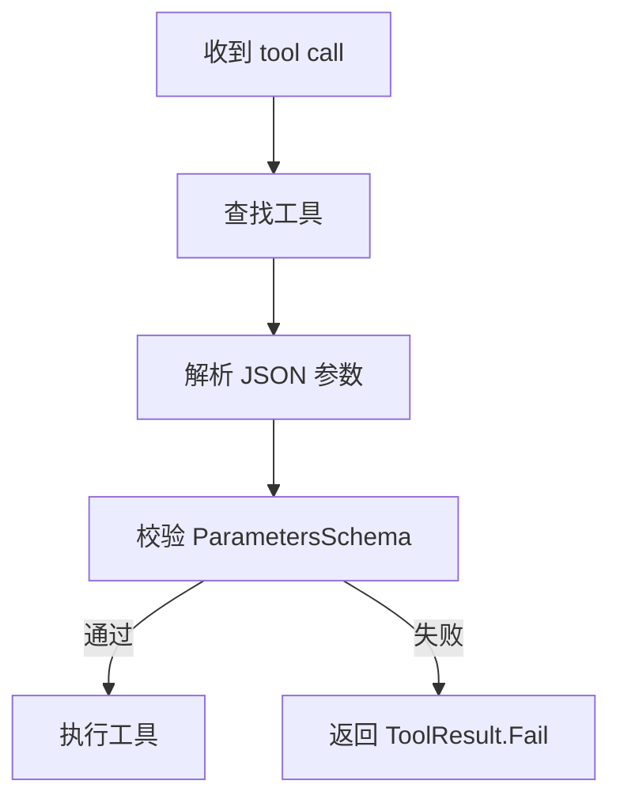

# v0.4.4 JSON Schema 参数预校验实施计划

> 状态：已完成（v0.4.4）。本文为历史设计参考；当前实现以 `Editor/Tools/Infrastructure/ToolParameterValidator.cs`、`Editor/Tools/ToolCallDispatcher.cs` 和相关测试为准。
> 目标版本：`0.4.4`  
> 主线：在工具执行前拦截明显错误参数，降低 LLM 工具调用失败成本

---

## 1. 背景

`v0.4.3` 已建立第一批测试基线。下一步应按稳定性优先路线补齐工具分发层的参数安全检查。

当前 `ToolCallDispatcher` 已处理两类错误：

1. 未知工具名。
2. `function.arguments` 不是合法 JSON 对象。

但它尚未根据工具的 `ToolMetadata.ParametersSchema` 校验参数结构。结果是：

- 缺失 `required` 字段会进入具体工具后才失败。
- 类型错误会进入工具内部，通过 `ToolHelpers` 抛异常或返回失败。
- 不同工具的错误信息风格不一致。

`v0.4.4` 的目标是在不改变工具实现的前提下，在分发层增加轻量 JSON Schema 子集校验。

---

## 2. 范围边界

### 2.1 本版本做什么

1. 新增轻量参数校验器。
2. 在 `ToolCallDispatcher.DispatchAsync` 中加入执行前校验。
3. 新增 `ToolCallDispatcherSchemaValidationTests` 覆盖关键路径。
4. 同步更新 `package.json`、`CHANGELOG.md`、`plans/ROADMAP.md`。

### 2.2 本版本不做什么

- 不引入第三方 JSON Schema 库。
- 不实现完整 JSON Schema 标准。
- 不修改现有工具的业务逻辑。
- 不拆分 `AgentLoop.cs` 或 `ChatWindow.cs`。
- 不改变 LLM tool definition 的输出格式。
- 不修改会话数据结构或 Domain Reload 流程。

---

## 3. 设计方案

### 3.1 新增文件

```text
Editor/Tools/Infrastructure/ToolParameterValidator.cs
Editor/Tests/Tools/ToolCallDispatcherSchemaValidationTests.cs
```

### 3.2 修改文件

```text
Editor/Tools/ToolCallDispatcher.cs
package.json
CHANGELOG.md
plans/ROADMAP.md
```

### 3.3 插入点

在 `ToolCallDispatcher.DispatchAsync` 中保持当前顺序，只在 JSON 解析后、工具执行前新增一步：



### 3.4 校验器 API 草案

```csharp
public static class ToolParameterValidator
{
    public static bool Validate(JObject parameters, JObject schema, out string errorMessage);
}
```

第一版只暴露一个公共入口，降低未来替换完整 schema 引擎的成本。

### 3.5 支持的 JSON Schema 子集

| Schema 字段 | 行为 |
|-------------|------|
| `type: object` | 顶层参数必须是对象；当前解析阶段已保证 `JObject` |
| `required` | 缺失字段直接失败 |
| `properties` | 仅校验已声明字段；未声明额外字段默认允许 |
| `type` | 支持 `string`、`number`、`integer`、`boolean`、`array`、`object` |
| `enum` | 字段值必须在枚举列表内 |

### 3.6 暂不支持的字段

以下字段第一版不校验，避免范围过大：

- `oneOf` / `anyOf` / `allOf`
- `minLength` / `maxLength`
- `minimum` / `maximum`
- `items` 深层数组元素校验
- 嵌套 object 的深层递归校验
- `additionalProperties`

---

## 4. 失败行为

校验失败时：

1. 不调用具体工具的 `ExecuteAsync`。
2. 返回 `ToolResult.Fail`。
3. 错误信息包含：工具名、参数名、失败原因。
4. 保持 `ToolCallResult.ToolName` 和耗时统计正常。

错误信息示例：

```text
Invalid arguments for tool 'test_tool': Missing required parameter 'action'.
Invalid arguments for tool 'test_tool': Parameter 'count' expected integer but got string.
Invalid arguments for tool 'test_tool': Parameter 'mode' expected one of [read, write] but got 'delete'.
```

---

## 5. 测试计划

新增测试文件：

```text
Editor/Tests/Tools/ToolCallDispatcherSchemaValidationTests.cs
```

测试用例：

1. 未知工具仍返回未知工具错误。
2. 非法 JSON 仍返回非法 JSON 错误。
3. 缺失 `required` 字段时不执行工具。
4. `string` 类型错误时不执行工具。
5. `integer` 类型错误时不执行工具。
6. `number` 类型接受整数与浮点数。
7. `boolean` 类型错误时不执行工具。
8. `array` 类型错误时不执行工具。
9. `object` 类型错误时不执行工具。
10. `enum` 值不匹配时不执行工具。
11. 合法参数正常进入工具执行。
12. 空 schema 或无 properties 时保持兼容，允许执行。

---

## 6. 验收标准

1. Unity 编译零错误。
2. `v0.4.3` 已有测试继续全部通过。
3. 新增 `ToolCallDispatcherSchemaValidationTests` 全部通过。
4. schema 校验失败不会调用具体工具。
5. 合法参数路径不改变现有工具执行行为。
6. `package.json`、`CHANGELOG.md`、`plans/ROADMAP.md` 同步更新到 `0.4.4`。

---

## 7. 风险点

| 风险 | 缓解 |
|------|------|
| 某些现有工具 schema 写得不够严格或不完整 | 空 schema 与未知字段保持宽松，不阻断 |
| LLM 传入额外字段被误拦截 | 第一版允许额外字段 |
| 类型判断与 Newtonsoft.Json token 类型不一致 | 单独为 `integer`、`number`、`boolean`、`array`、`object` 写测试 |
| 行为变更影响已有工具链 | 只在参数明显违反 schema 时失败；合法路径不变 |

---

## 8. 推荐实施顺序

1. 新建 `ToolParameterValidator`。
2. 新增校验器单元路径，优先通过纯逻辑测试。
3. 接入 `ToolCallDispatcher.DispatchAsync`。
4. 新增 dispatcher 级测试，验证工具不会被误执行。
5. 更新版本与文档。

