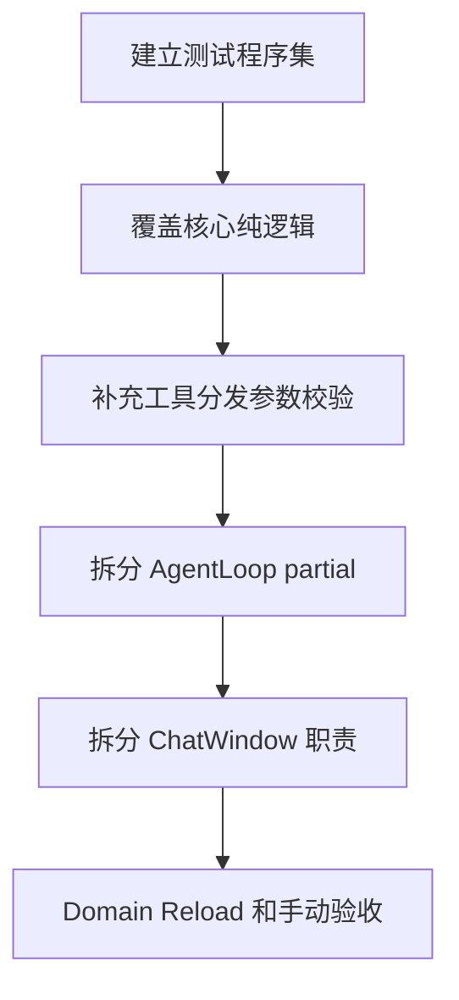

# AgentCore 稳定性优先实施计划

> 状态：已落地/拆分完成（v0.4.3 ~ v0.4.6）。测试框架、Schema 预校验、AgentLoop 拆分、ChatWindow 拆分已分别落地；本文仅作稳定性阶段设计参考。
> 目标版本：`0.4.3` 起分批落地  
> 主线：先建立测试基线，再做行为增强，最后拆分核心大文件

---

## 1. 为什么先做稳定性

当前项目已经完成 Phase 1-4 和 Phase 5.2 RAG 补齐，功能面已经较完整。下一阶段主要风险不在“功能不够”，而在：

- `AgentLoop.cs` 和 `ChatWindow.cs` 都已经超过 1800 行，继续堆功能会提高回归概率。
- 目前没有测试程序集，重构核心逻辑缺少自动化保护。
- 工具系统依赖 LLM 生成 JSON 参数，当前只校验 JSON 是否可解析，缺少 schema 级预校验。

因此稳定性优先路线应遵循：



---

## 2. 推荐范围边界

### 2.0 最佳实施策略

完整稳定性路线方向正确，但不建议在同一个实现批次里同时完成测试框架、参数校验、`AgentLoop` 拆分和 `ChatWindow` 拆分。原因是这会把“新增测试”“行为变更”“核心重构”混在一起，回归面过大。

更稳妥的最佳方案是三段式：

| 批次 | 目标 | 内容 |
|------|------|------|
| `v0.4.3` | 测试基线 | 新增测试程序集，覆盖 `ToolResponse`、`JsonHelper`、`TokenCounter`、`ToolHelpers` |
| `v0.4.4` | 分发安全 | 在测试保护下加入 `ToolCallDispatcher` JSON Schema 参数预校验 |
| `v0.4.5` | 结构重构 | 在已有测试保护下拆分 `AgentLoop` 和 `ChatWindow` |

如果要进一步保守，`v0.4.5` 也可以再拆为：先 `AgentLoop`，再 `ChatWindow`。

---

## 3. v0.4.3 首轮范围边界

### 3.1 本次做什么

1. 新增 `AgentCore.Tests.Editor` 测试程序集。
2. 新增第一批 Editor 测试：
   - `ToolResponse` / `ToolResult`
   - `JsonHelper`
   - `TokenCounter`
   - `ToolHelpers` 的参数解析核心路径
3. 更新 `package.json`、`CHANGELOG.md`、`plans/ROADMAP.md`。

### 3.2 本次不做什么

- 不新增 XR、Cinemachine、Material、UIToolkit 等工具功能。
- 不改变 LLM 请求协议。
- 不改变现有会话文件格式。
- 不重写 UI 架构。
- 不引入新的第三方依赖。
- 不在 `v0.4.3` 中拆分 `AgentLoop.cs` 或 `ChatWindow.cs`。
- 不在 `v0.4.3` 中改变 `ToolCallDispatcher` 的运行时行为。

---

## 4. 涉及文件

### 4.1 v0.4.3 新增文件

```text
Editor/Tests/
Editor/Tests/AgentCore.Tests.Editor.asmdef
Editor/Tests/Infrastructure/ToolResponseTests.cs
Editor/Tests/Utils/JsonHelperTests.cs
Editor/Tests/Core/TokenCounterTests.cs
Editor/Tests/Infrastructure/ToolHelpersTests.cs
```

### 4.2 v0.4.3 修改文件

```text
package.json
CHANGELOG.md
plans/ROADMAP.md
```

### 4.3 后续批次涉及文件

```text
Editor/Tests/Tools/ToolCallDispatcherSchemaValidationTests.cs
Editor/Core/AgentLoop.Runner.cs
Editor/Core/AgentLoop.MemoryRecall.cs
Editor/Core/AgentLoop.LLMCall.cs
Editor/UI/ChatWindow.Events.cs
Editor/UI/ChatWindow.Sessions.cs
Editor/UI/ChatWindow.Rendering.cs
```

---

## 5. 测试程序集设计

### 5.1 asmdef

`AgentCore.Tests.Editor.asmdef`：

- `name`: `AgentCore.Tests.Editor`
- `rootNamespace`: `AgentCore.Tests.Editor`
- `references`:
  - `AgentCore.Editor`
  - `UnityEditor.TestRunner`
  - `UnityEngine.TestRunner`
- `includePlatforms`: `Editor`
- `autoReferenced`: `false`

### 5.2 测试目录职责

| 目录 | 职责 |
|------|------|
| `Editor/Tests/Infrastructure/` | 工具基础设施测试 |
| `Editor/Tests/Utils/` | 通用工具测试 |
| `Editor/Tests/Core/` | 核心纯逻辑测试 |
| `Editor/Tests/Tools/` | 工具分发、schema 校验测试 |

---

## 6. 第一批测试用例

### 6.1 ToolResponse / ToolResult

- `Ok` 应生成成功响应。
- `OkWithData` 应保留对象、字符串和 `JToken` 数据。
- `Fail` 应生成失败响应。
- `ToToolResult` 成功路径应把响应 JSON 放入 `Output`。
- `ToToolResult` 失败路径应把错误放入 `Error`。
- `GetContentForLLM` 失败路径应带 `[Error]` 前缀。

### 6.2 JsonHelper

- 合法对象可序列化。
- 非法 JSON 反序列化返回默认值。
- `ParseObject` 对非法 JSON 返回 `null`。
- `ParseArray` 对非法 JSON 返回 `null`。
- `GetString`、`GetInt`、`GetBool` 在缺失字段时返回默认值。

### 6.3 TokenCounter

- 空字符串返回 `0`。
- 非空英文文本至少返回 `1`。
- CJK 字符按每字符更高权重估算。
- 单条消息包含基础开销。
- tool call 参数会计入消息 token。
- 空对话返回 `0`。

### 6.4 ToolHelpers

- 必需字符串缺失时抛出清晰异常。
- 可选字符串缺失时返回默认值。
- 可选整数、布尔值缺失时返回默认值。
- enum 解析支持合法值。
- enum 解析对非法值返回清晰错误。

### 6.5 ToolCallDispatcher Schema Validation

以下用例属于 `v0.4.4`，不放进 `v0.4.3` 首轮：

- 未知工具仍返回未知工具错误。
- 非法 JSON 仍返回非法 JSON 错误。
- 缺失 required 字段时不执行工具，直接返回参数错误。
- 类型不匹配时不执行工具，直接返回参数错误。
- 合法参数正常进入工具执行。

---

## 7. JSON Schema 参数校验设计

本节属于 `v0.4.4`，需要在 `v0.4.3` 测试基线通过后实施。

### 7.1 插入点

在 `ToolCallDispatcher.DispatchAsync` 中：

1. 查找工具。
2. 解析 JSON arguments。
3. 新增 schema 校验。
4. 校验通过后再调用 `ExecuteAsync`。

### 7.2 支持范围

第一版只实现工具系统最需要的子集：

- `type: object`
- `required`
- `properties`
- 基础类型：`string`、`number`、`integer`、`boolean`、`array`、`object`
- `enum`

### 7.3 失败行为

返回 `ToolResult.Fail`，错误信息应包含：

- 工具名
- 参数名
- 期望类型或枚举
- 实际收到的类型或值

不抛异常，不进入具体工具执行。

---

## 8. AgentLoop 拆分方案

本节属于 `v0.4.5+`，需要在 `v0.4.3` 测试基线与 `v0.4.4` 分发安全通过后实施。

### 8.1 原则

- 使用 `partial class`。
- 不改公开属性、公开方法和事件签名。
- 不改变 Domain Reload 保存与恢复行为。
- 每次移动代码后立即编译验证。

### 8.2 文件职责

| 文件 | 职责 |
|------|------|
| `AgentLoop.cs` | 字段、生命周期、初始化、公共入口、状态机核心 |
| `AgentLoop.Runner.cs` | 工具调用循环、工具执行、工具结果回填 |
| `AgentLoop.MemoryRecall.cs` | 记忆召回、上下文注入、记忆相关辅助方法 |
| `AgentLoop.LLMCall.cs` | LLM 调用、流式响应解析、错误处理 |

### 8.3 验证重点

- 普通对话可完成。
- 工具调用循环可完成。
- 取消操作仍可生效。
- Domain Reload 后能恢复。
- 文件变更追踪仍可更新 UI。

---

## 9. ChatWindow 拆分方案

本节属于 `v0.4.5+`，建议在 `AgentLoop` 拆分完成并验证后再开始。

### 9.1 原则

- 优先移动低风险 UI glue 代码。
- 不改变 UXML/USS 结构。
- 不改变窗口菜单、生命周期和事件订阅行为。

### 9.2 文件职责

| 文件 | 职责 |
|------|------|
| `ChatWindow.cs` | 创建窗口、CreateGUI、字段、主生命周期 |
| `ChatWindow.Events.cs` | AgentEvent 分发与处理 |
| `ChatWindow.Sessions.cs` | 会话恢复、保存、切换、导出 |
| `ChatWindow.Rendering.cs` | 消息气泡、工具卡、滚动与列表刷新 |

---

## 10. v0.4.3 验收标准

1. Unity 编译零错误。
2. 新增 Editor 测试程序集可被 Unity Test Runner 发现。
3. 第一批测试全部通过。
4. 现有 ChatWindow 可打开。
5. 普通对话和至少一个已有 Native 工具调用不回归。
6. `package.json`、`CHANGELOG.md`、`ROADMAP.md` 三处版本状态同步。

---

## 11. 风险点与缓解

| 风险 | 缓解 |
|------|------|
| `AgentLoop` 拆分导致私有方法顺序或区域混乱 | 只移动代码，不改逻辑；使用 `partial` 保留访问权限 |
| Domain Reload 恢复回归 | 拆分后专门手动验证恢复流程 |
| schema 校验过严导致合法工具调用被拒绝 | 第一版只实现基础 JSON Schema 子集，不处理复杂组合规则 |
| 测试引用配置错误 | 测试 asmdef 只引用 Editor 程序集和 Unity Test Runner |
| ChatWindow 拆分影响 UI 生命周期 | 只拆低风险方法，不改 `CreateGUI` 的主流程 |

---

## 12. v0.4.3 CHANGELOG 草稿

```markdown
## [0.4.3] - YYYY-MM-DD

### Added
- 新增 `AgentCore.Tests.Editor` 测试程序集。
- 新增核心基础设施测试：`ToolResponse`、`JsonHelper`、`TokenCounter`、`ToolHelpers`。
```

---

## 13. 推荐实施顺序

### 13.1 v0.4.3

1. 新增测试 asmdef。
2. 编写 `ToolResponse`、`JsonHelper`、`TokenCounter` 测试。
3. 编写 `ToolHelpers` 测试。
4. 更新版本与文档。
5. 执行手动验收。

### 13.2 v0.4.4

1. 编写 `ToolCallDispatcher` schema 校验测试。
2. 实现轻量 schema 校验。
3. 验证现有工具调用不回归。

### 13.3 v0.4.5+

1. 拆分 `AgentLoop`。
2. 验证 Domain Reload。
3. 拆分 `ChatWindow`。
4. 验证 UI 生命周期。
