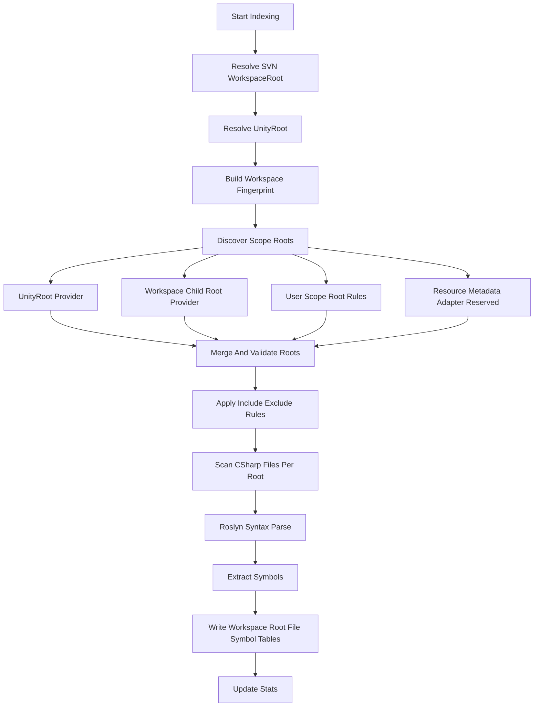

# AgentCore 代码库索引功能 Phase 1 设计文档

> **版本**: v1.4
> **目标版本**: v0.9.1（依赖 v0.9.0 P0 Workspace 基础设施完成）
> **制定日期**: 2026-06-02
> **修订日期**: 2026-06-03
> **状态**: v1.4 已按"完全本地化单层架构、放弃骨架文档"决策校准，待实现
> **对应 ROADMAP**: Phase 6 § 3.2 任务 6.2.1 + 6.2.2
> **上游需求基准**: [`enterprise-unity-workflow-requirements.md`](enterprise-unity-workflow-requirements.md)
> **⚠️ 前置条件**: 本文档所有实现依赖 **v0.9.0 P0 Workspace 基础设施**完成。实现前请先阅读并确认 [`workspace-foundation-v0.9.0-p0-plan.md`](workspace-foundation-v0.9.0-p0-plan.md)。

---

## 0. 修订历史

### v1.4 修订摘要（2026-06-03）

基于用户确认的架构决策，对 v1.3 方案进行以下关键调整：

1. **完全放弃骨架文档（Layer 0）**：`workspace-skeleton.md` 方案废弃，不生成、不注入 Bootstrap。原因：`search_code` 工具按需检索比静态骨架文档更精准、更省 token，骨架文档会随代码变化快速过时。
2. **单层本地架构**：只保留 SQLite 符号索引（Layer 1）一层，去掉 Layer 0 骨架文档层。
3. **Bootstrap 链简化**：Bootstrap 加载顺序从 `SOUL → TOOLS → PROJECT(auto) → PROJECT.md(user) → [SKELETON]` 简化为 `SOUL → TOOLS → PROJECT(auto) → PROJECT.md(user)`，`BootstrapContext.Skeleton` 属性和 `BootstrapLoader.LoadSkeletonFile()` 已从代码中删除。

### v1.3 修订摘要（2026-06-03）

基于用户确认的架构决策，对 v1.2 方案进行以下关键调整：

1. **完全放弃向量数据库**：移除 Phase 2 语义搜索规划，不引入任何向量数据库依赖（包括 LightRAG 代码索引用途）。
2. ~~**两层本地架构**~~：~~只保留 `.md` 骨架文档（Layer 0）+ SQLite 符号索引（Layer 1）两层。~~ → **已被 v1.4 进一步调整为单层架构（仅 Layer 1）**
3. ~~**骨架文档本地化**~~：~~`workspace-skeleton.md` 只在本地 `Library/AgentCore/` 保存，**不提交 VCS**，避免频繁更新和版本冲突。~~ → **已废弃**
4. ~~**骨架生成方式**~~：~~规则扫描自动生成（不调用 LLM），用户可在 Chat 中让 LLM 优化调整内容。~~ → **已废弃**
5. ~~**骨架内容定位**~~：~~高层架构概览（目录结构 + 关键类/模块说明 + Scope 归属），控制在几百行以内，适合注入 System Prompt。~~ → **已废弃**
6. **SQLite 索引本地化**：`codebase.db` 只在本地 `Library/AgentCore/Indexing/` 保存，**不提交 VCS**。

### v1.2 修订摘要（2026-06-02）

v1.1 方案已经从标准 Unity `Assets/` 索引升级为 Workspace-aware 索引，但仍存在一个容易误导实现的表述：把地图/模式资源称为"外部 Root"或"独立资源包工作副本"。根据最新确认，目标项目的基线结构应修正为：

> **AgentCore WorkspaceRoot = SVN 分线工作副本根；UnityRoot = WorkspaceRoot 下的 Unity 工程子目录；地图、模式、工具、资源、插件等目录是 WorkspaceRoot 内的子 Root / Scope Root。**

典型结构：

```text
svn/project/branch/
├── unity/
│   ├── Assets/
│   ├── Packages/
│   └── ProjectSettings/
├── gamemodes/
├── maps/
├── ui/
├── localization/
├── tools/
├── plugins/
└── shared/
```

v1.2 的关键修订：

1. 将 **Workspace** 明确定义为 SVN 工作副本根，而不是 Unity 项目根或任意多外部目录集合。
2. 新增 **UnityRoot** 概念，用于 Unity Editor / AssetDatabase / Scene / Prefab / BuildSettings 能力。
3. 将"外部资源包 Root"统一改为 **Workspace 子 Root / Scope Root**；它们通常位于同一个 SVN WorkspaceRoot 内，只是不在 Unity `Assets/` 内。
4. VCS 设计以识别 SVN WorkspaceRoot 为 P0；多 VCS Root 仅作为未来扩展或例外情况。
5. Workspace Fingerprint 主要由 WorkspaceRoot、SVN URL/revision、UnityRoot 相对路径、启用的 Scope Root 和配置版本决定。
6. 资源包系统 Adapter 的定位调整为提供 Scope/Role/Package 元数据，而不是默认提供任意外部根目录。

---

## 1. 功能定位

### 1.1 目标

实现适合大型商业 Unity 项目的**本地代码库索引与符号检索底座**，让 AI Agent 能够：

- 从 SVN WorkspaceRoot 解析当前工作区和分线。
- 自动或手动发现 WorkspaceRoot 下的代码/资源/工具/插件子 Root。
- 明确区分 WorkspaceRoot 与 UnityRoot。
- 按地图、模式、资源包、插件、引擎、公共模块等 Scope 归类文件。
- 使用 Roslyn 提取 C# 符号信息。
- 使用 SQLite 本地存储索引数据。
- 支持按符号名称、类型、命名空间、Scope、Root、Role 搜索。
- 避免不同 SVN 分线、不同 WorkspaceRoot、不同 Scope 配置之间的索引污染。
- 为后续依赖图、资源引用分析、地图/模式影响范围分析打基础。

### 1.2 本阶段做什么

Phase 1 必做：

- ✅ SVN WorkspaceRoot 解析与 Workspace Fingerprint。
- ✅ UnityRoot 解析与 UnityRoot/WorkspaceRoot 分离。
- ✅ Workspace 子 Root 索引，不再只扫描 Unity `Assets/`。
- ✅ Scope 模型：Project / Map / Mode / Package / Plugin / Engine / Shared / UI / Localization / Tools / Generated / Unknown。
- ✅ Root Provider 模型：SVN WorkspaceRoot Provider、UnityRoot Provider、Workspace Child Root Provider、用户规则 Provider、预留资源包元数据 Adapter。
- ✅ C# 语法级符号索引：类、接口、结构体、枚举、方法、字段、属性、事件。
- ✅ SQLite 本地存储，按 Workspace Fingerprint 隔离数据库。
- ✅ 增量索引，检测文件变更、删除和新增。
- ✅ `search_code` 工具，支持解析 Workspace、索引、搜索、列 Scope、列 Namespace、统计。
- ✅ Settings UI 支持 WorkspaceRoot、UnityRoot、Scope Root、排除规则、Scope 配置。
- ✅ 搜索结果标注 scope、root、branch、role、read_only。

### 1.3 本阶段不做什么

Phase 1 暂不做：

- ❌ **骨架文档 / workspace-skeleton.md（永久废弃）**：不生成骨架文档，不注入 Bootstrap。`search_code` 工具按需检索更优，骨架文档随代码变化快速过时。
- ❌ **向量数据库 / 语义搜索（永久放弃）**：不引入任何向量数据库依赖，不做自然语言代码查询。LightRAG 仅用于文档知识库，不用于代码索引。
- ❌ Roslyn Semantic Model 级别类型引用分析。
- ❌ 完整依赖图构建。
- ❌ Scene / Prefab / Addressables / AssetBundle 深度引用分析。
- ❌ 文案表、配置表、策划表的业务格式解析。
- ❌ 二进制美术资产索引。
- ❌ 资源包插件深度绑定，仅预留 Adapter 接口读取元数据。
- ❌ 自动修改商业插件、引擎代码或 Generated 代码。
- ❌ 默认支持 WorkspaceRoot 外部的任意目录；如有例外必须显式授权。
- ❌ 将 `codebase.db` 提交到 VCS（所有索引文件只在本地 `Library/AgentCore/` 保存）。

### 1.4 核心原则

1. **WorkspaceRoot 是第一边界**：AgentCore 文件、索引、RAG、VCS、规则、记忆的默认项目边界是 SVN 工作副本根。
2. **UnityRoot 是特殊子边界**：Unity Editor 原生能力仍必须以 UnityRoot / `Assets/` / `Packages/` 为边界。
3. **路径不是上下文**：同一个 Workspace 相对路径在不同 SVN 分线可能含义不同，必须结合 workspace/branch。
4. **符号不是业务归属**：找到一个类不够，还要知道它属于地图、模式、公共模块、插件还是引擎。
5. **搜索默认安全保守**：商业插件、引擎、生成代码可以查，但默认降权或只读标记。
6. **不绑死业务插件**：AgentCore 提供 Adapter 接口，项目方可接入资源包系统以补充元数据。
7. **先建拓扑，再扩展**：v0.9.0 重点是 WorkspaceRoot / UnityRoot / Scope / Root 建模，为依赖图、影响范围分析等后续能力打基础。

---

## 2. 面向大型项目的适配模型

### 2.1 Workspace

Workspace 表示当前可索引上下文，基线定义为一个 SVN 分线工作副本根。

Workspace 包含：

- `workspace_root`：SVN 工作副本根本地路径。
- `vcs_type`：当前基线主要为 SVN。
- `vcs_root`：通常等于 `workspace_root`。
- `svn_url` / `repository_root` / `revision` / `branch_id`。
- `unity_root`：Unity 工程目录绝对路径。
- `unity_root_relative_path`：UnityRoot 相对 WorkspaceRoot 的路径，如 `unity/`。
- 当前已启用的 Workspace 子 Root 列表。
- AgentCore 索引配置版本。

Workspace Fingerprint 用于隔离索引数据库。

示例：

```text
{UnityRoot}/Library/AgentCore/Indexing/{workspaceHash}/codebase.db
```

数据库物理位置可先放在 UnityRoot 的 `Library/` 下，便于 Unity Editor 管理；但 `workspaceHash` 必须以 SVN WorkspaceRoot 和 Branch 信息为主，不能只以 UnityRoot 派生。

### 2.2 UnityRoot

UnityRoot 表示 WorkspaceRoot 中包含 Unity 工程的子目录。

UnityRoot 用于：

- 解析 Unity `Assets/`、`Packages/`、`ProjectSettings/`。
- 与 AssetDatabase、Scene、Prefab、BuildSettings 等 Native 工具交互。
- 收集 Unity 版本、Build Scenes、Tags/Layers、Render Pipeline 等 Unity 上下文。

UnityRoot 不是代码索引的唯一根，也不是文件工具和 RAG 的全局安全边界。

### 2.3 Index Scope

Scope 是索引和搜索的业务上下文。

| ScopeType | 含义 | 默认搜索 | 默认可修改建议 |
|---|---|---:|---:|
| Project | Unity 工程主体 | 是 | 是 |
| Map | 地图目录 | 是 | 是 |
| Mode | 玩法模式目录 | 是 | 是 |
| Package | Workspace 内资源包目录 | 是 | 取决于配置 |
| Shared | 公共基础逻辑 | 是 | 谨慎 |
| UI | UI / 美术代码 | 是 | 是 |
| Localization | 文案/本地化相关代码 | 是 | 谨慎 |
| Engine | 自定义引擎或底层扩展 | 是 | 谨慎 |
| Plugin | 商业插件或自制插件 | 可查但降权 | 否 |
| Tools | 内部工具、生成器、构建脚本 | 是 | 需确认 |
| Generated | 生成代码 | 默认排除 | 否 |
| Unknown | 未归类目录 | 可查 | 谨慎 |

### 2.4 Root Provider

AgentCore 不直接假设所有路径都在 Unity `Assets/`。索引根目录由多个 Provider 合并产生。

| Provider | 说明 | v0.9.0 状态 |
|---|---|---|
| VcsWorkspaceRootProvider | 从 UnityRoot 向上识别 SVN WorkspaceRoot，读取 SVN URL/revision/branch | 必做 |
| UnityRootProvider | 在 WorkspaceRoot 内识别 UnityRoot，并发现 `Assets/`、`Packages/`、`ProjectSettings/` 中可索引代码 | 必做 |
| WorkspaceChildRootProvider | 根据默认目录名和 Settings 规则发现 `gamemodes/`、`maps/`、`ui/`、`localization/`、`tools/`、`plugins/`、`shared/` 等子 Root | 必做 |
| UserConfiguredScopeRootProvider | 用户在 Settings 中为 WorkspaceRoot 内目录指定 ScopeType / Role / include/exclude | 必做 |
| ResourcePackageMetadataProvider | 从项目资源包系统读取已同步/启用资源包的 Scope、Role、package_id、read_only 等元数据 | 预留接口 |
| ExtraAuthorizedRootProvider | 对少量 WorkspaceRoot 外部目录进行显式授权 | P2/例外 |

### 2.5 Root 与 Scope 的关系

一个 Root 是一个本地目录，一个 Scope 是业务归属。一个 Root 可以对应一个 Scope，也可以拆分成多个子 Scope。

示例：

```text
D:/svn/project/branches/release-x/                         -> WorkspaceRoot
D:/svn/project/branches/release-x/unity                    -> UnityRoot / Project
D:/svn/project/branches/release-x/unity/Assets/Scripts     -> Project or Shared
D:/svn/project/branches/release-x/gamemodes/Battle         -> Mode:Battle
D:/svn/project/branches/release-x/maps/City01              -> Map:City01
D:/svn/project/branches/release-x/ui/Common                -> UI:UICommon
D:/svn/project/branches/release-x/tools                    -> Tools
D:/svn/project/branches/release-x/plugins/DOTween          -> Plugin:DOTween read_only
```

---

## 3. 技术栈与依赖

### 3.0 单层本地架构（v1.4 核心决策）

AgentCore 代码索引采用**完全本地化的单层架构**，零外部服务依赖：

```
~~Layer 0: workspace-skeleton.md（已废弃）~~
  废弃原因: search_code 工具按需检索比静态骨架文档更精准、更省 token；
            骨架文档随代码变化快速过时，维护成本高；
            Bootstrap 注入静态文档会占用宝贵的 System Prompt token 预算。

Layer 1: codebase.db（SQLite 符号索引）
  存储: {UnityRoot}/Library/AgentCore/Indexing/{workspaceHash}/codebase.db
  生成: Roslyn 语法解析，后台异步执行
  内容: 完整符号表（类、方法、字段、属性、命名空间）+ Scope/Role/Branch 元数据
  用途: search_code 工具精确符号检索，支持多维过滤；Agent 按需查询，不占 System Prompt
  更新: 初始化时全量索引 + 文件变更后增量索引
  VCS:  不提交，只在本地保存
```

> **⚠️ 重要约束**：`Library/AgentCore/` 目录下所有文件均不提交 VCS。
> 需在 `.gitignore` / `.svnignore` / `.p4ignore` 中添加 `Library/AgentCore/` 排除规则。
> Unity 默认已将整个 `Library/` 目录排除在 VCS 之外，通常无需额外配置。

### 3.1 核心技术选型

| 模块 | 技术 | 引入方式 | 备注 |
|---|---|---|---|
| C# 解析 | Microsoft.CodeAnalysis.CSharp | 预编译 DLL 或 Unity 可用 Roslyn | 用于语法级符号提取 |
| 本地数据库 | SQLite | 预编译 DLL 或可替代轻量存储 | 首选 SQLite，实现前需确认 Unity 跨平台兼容 |
| 骨架文档 | System.IO + 规则扫描 | 内置 | 纯文本生成，零依赖 |
| 文件扫描 | System.IO | 内置 | 支持 WorkspaceRoot 下多子 Root 与排除规则 |
| VCS 信息 | 复用/扩展 VCS 组件能力 | 可选组件交互 | 当前 VCS 检测需从 UnityRoot 提升到 SVN WorkspaceRoot |
| 配置 | AgentCoreSettings + JSON 扩展配置 | 内置 | WorkspaceRoot、UnityRoot、Scope Root 规则建议独立 JSON 保存 |
| ~~向量数据库~~ | ~~已放弃~~ | — | **永久放弃，不引入任何向量数据库依赖** |

### 3.2 依赖风险修订

v1.0 直接假设引入 `System.Data.SQLite`。v1.3 修订为：

- SQLite 仍是首选。
- 实现前必须验证 Unity 2021.3+、Windows/macOS 下 DLL 加载方式。
- 如 SQLite 引入风险过高，可先实现 `IIndexStore` 接口，并用 JSONL/NDJSON 临时存储做 MVP，再切 SQLite。
- 设计上保留 SQLite Schema，不把具体数据库 API 泄漏到工具层。

### 3.3 可选组件策略

建议代码索引作为可选组件，但默认启用：

- Define: `AGENTCORE_INDEXING`
- Assembly: `AgentCore.Indexing.Editor`
- Namespace: `AgentCore.Editor.Components.Indexing`
- 默认启用原因：代码索引是 Agent 理解项目的基础能力。
- 可禁用原因：大型项目首次索引可能较重，用户需要控制。

---

## 4. 数据库设计 v1.3

### 4.1 数据库路径

不再使用单一数据库：

```text
{UnityRoot}/Library/AgentCore/Indexing/{workspaceHash}/codebase.db
```

其中 `workspaceHash` 来源于：

- SVN WorkspaceRoot 绝对路径摘要。
- SVN URL / repository root / branch / revision 摘要。
- UnityRoot 相对 WorkspaceRoot 的路径。
- 已启用 Scope Root 列表摘要。
- include/exclude 和 Role 配置摘要。
- 配置 schema version。

### 4.2 Schema

```sql
CREATE TABLE IF NOT EXISTS workspaces (
    id INTEGER PRIMARY KEY AUTOINCREMENT,
    fingerprint TEXT NOT NULL UNIQUE,
    workspace_root TEXT NOT NULL,
    unity_root TEXT,
    unity_root_relative_path TEXT,
    vcs_type TEXT NOT NULL,
    vcs_root TEXT NOT NULL,
    svn_url TEXT,
    repository_root TEXT,
    revision TEXT,
    branch_id TEXT,
    created_at INTEGER NOT NULL,
    updated_at INTEGER NOT NULL
);

CREATE TABLE IF NOT EXISTS index_roots (
    id INTEGER PRIMARY KEY AUTOINCREMENT,
    workspace_id INTEGER NOT NULL,
    root_path TEXT NOT NULL,
    relative_to_workspace TEXT NOT NULL,
    display_name TEXT,
    provider_id TEXT NOT NULL,
    scope_type TEXT NOT NULL,
    scope_name TEXT,
    role TEXT NOT NULL,
    read_only INTEGER NOT NULL DEFAULT 0,
    include_patterns TEXT,
    exclude_patterns TEXT,
    vcs_type TEXT,
    vcs_root TEXT,
    branch_id TEXT,
    package_id TEXT,
    package_version TEXT,
    is_workspace_external INTEGER NOT NULL DEFAULT 0,
    enabled INTEGER NOT NULL DEFAULT 1,
    FOREIGN KEY (workspace_id) REFERENCES workspaces(id) ON DELETE CASCADE
);

CREATE TABLE IF NOT EXISTS indexed_files (
    id INTEGER PRIMARY KEY AUTOINCREMENT,
    workspace_id INTEGER NOT NULL,
    root_id INTEGER NOT NULL,
    relative_path TEXT NOT NULL,
    workspace_relative_path TEXT NOT NULL,
    absolute_path_hash TEXT NOT NULL,
    file_extension TEXT NOT NULL,
    last_modified INTEGER NOT NULL,
    last_indexed INTEGER NOT NULL,
    file_size INTEGER NOT NULL,
    line_count INTEGER NOT NULL,
    content_hash TEXT,
    has_errors INTEGER NOT NULL DEFAULT 0,
    error_message TEXT,
    FOREIGN KEY (workspace_id) REFERENCES workspaces(id) ON DELETE CASCADE,
    FOREIGN KEY (root_id) REFERENCES index_roots(id) ON DELETE CASCADE,
    UNIQUE (workspace_id, root_id, relative_path)
);

CREATE TABLE IF NOT EXISTS symbols (
    id INTEGER PRIMARY KEY AUTOINCREMENT,
    workspace_id INTEGER NOT NULL,
    root_id INTEGER NOT NULL,
    file_id INTEGER NOT NULL,
    symbol_type TEXT NOT NULL,
    name TEXT NOT NULL,
    full_name TEXT NOT NULL,
    namespace TEXT,
    parent_full_name TEXT,
    accessibility TEXT,
    is_static INTEGER NOT NULL DEFAULT 0,
    is_abstract INTEGER NOT NULL DEFAULT 0,
    is_partial INTEGER NOT NULL DEFAULT 0,
    return_type TEXT,
    parameters TEXT,
    generic_parameters TEXT,
    line_number INTEGER NOT NULL,
    column_number INTEGER NOT NULL,
    declaration_snippet TEXT,
    FOREIGN KEY (workspace_id) REFERENCES workspaces(id) ON DELETE CASCADE,
    FOREIGN KEY (root_id) REFERENCES index_roots(id) ON DELETE CASCADE,
    FOREIGN KEY (file_id) REFERENCES indexed_files(id) ON DELETE CASCADE
);

CREATE TABLE IF NOT EXISTS scope_dependencies (
    id INTEGER PRIMARY KEY AUTOINCREMENT,
    workspace_id INTEGER NOT NULL,
    from_root_id INTEGER NOT NULL,
    to_root_id INTEGER NOT NULL,
    dependency_type TEXT NOT NULL,
    confidence TEXT NOT NULL,
    source TEXT NOT NULL,
    FOREIGN KEY (workspace_id) REFERENCES workspaces(id) ON DELETE CASCADE
);

CREATE TABLE IF NOT EXISTS index_metadata (
    key TEXT PRIMARY KEY,
    value TEXT NOT NULL
);

CREATE INDEX IF NOT EXISTS idx_symbols_workspace_name ON symbols(workspace_id, name);
CREATE INDEX IF NOT EXISTS idx_symbols_workspace_full_name ON symbols(workspace_id, full_name);
CREATE INDEX IF NOT EXISTS idx_symbols_workspace_type ON symbols(workspace_id, symbol_type);
CREATE INDEX IF NOT EXISTS idx_symbols_workspace_namespace ON symbols(workspace_id, namespace);
CREATE INDEX IF NOT EXISTS idx_symbols_root ON symbols(root_id);
CREATE INDEX IF NOT EXISTS idx_files_workspace_root_path ON indexed_files(workspace_id, root_id, relative_path);
CREATE INDEX IF NOT EXISTS idx_files_workspace_relative_path ON indexed_files(workspace_id, workspace_relative_path);
CREATE INDEX IF NOT EXISTS idx_roots_workspace_scope ON index_roots(workspace_id, scope_type, scope_name);
```

### 4.3 说明

- `workspace_root` 是 SVN 工作副本根，是索引隔离的第一依据。
- `unity_root` 是 WorkspaceRoot 下的 Unity 工程目录，可为空但正常 Unity 插件场景应存在。
- `root_path` 通常是 WorkspaceRoot 内的子目录，不要求在 UnityRoot 或 Unity `Assets/` 下。
- `is_workspace_external` 仅用于显式授权的 WorkspaceRoot 外部例外目录，默认应为 `0`。
- `role` 用于控制搜索权重和修改建议安全性。
- `read_only` 标记商业插件、引擎代码、生成代码等不应修改的区域。
- `branch_id` 不要求一开始完美获取，可先记录 SVN URL 或本地 root hash。
- `scope_dependencies` 在 Phase 1 只保存人工配置或显式 manifest 信息，不做自动依赖分析。

---

## 5. 核心类设计 v1.3

### 5.1 目录结构

```text
Editor/Indexing/
├── AgentCore.Indexing.Editor.asmdef
├── Core/
│   ├── CodebaseIndexer.cs
│   ├── IndexWorkspaceResolver.cs
│   ├── UnityRootResolver.cs
│   ├── IndexRootResolver.cs
│   ├── RoslynSymbolExtractor.cs
│   ├── IndexingDatabase.cs
│   ├── IndexingProgress.cs
│   └── WorkspaceFingerprintBuilder.cs
├── Roots/
│   ├── IIndexRootProvider.cs
│   ├── VcsWorkspaceRootProvider.cs
│   ├── UnityRootProvider.cs
│   ├── WorkspaceChildRootProvider.cs
│   ├── UserConfiguredScopeRootProvider.cs
│   ├── ResourcePackageMetadataProvider.cs
│   └── ExtraAuthorizedRootProvider.cs
├── Query/
│   ├── SymbolSearcher.cs
│   └── SearchQuery.cs
├── Models/
│   ├── IndexWorkspace.cs
│   ├── IndexRoot.cs
│   ├── IndexScopeType.cs
│   ├── IndexRootRole.cs
│   ├── IndexedFile.cs
│   ├── SymbolInfo.cs
│   └── IndexingStats.cs
├── Tools/
│   └── SearchCodeTool.cs
├── UI/
│   └── IndexingSettingsContribution.cs
└── Config/
    ├── IndexingSettingsData.cs
    └── IndexingComponentDescriptor.cs
```

### 5.2 新增核心接口

```csharp
namespace AgentCore.Editor.Components.Indexing.Roots
{
    public interface IIndexRootProvider
    {
        string ProviderId { get; }
        int Priority { get; }
        IReadOnlyList<IndexRoot> DiscoverRoots(IndexWorkspace workspace);
    }
}
```

```csharp
namespace AgentCore.Editor.Components.Indexing.Models
{
    public sealed class IndexWorkspace
    {
        public string WorkspaceRoot { get; set; }
        public string UnityRoot { get; set; }
        public string UnityRootRelativePath { get; set; }
        public string VcsType { get; set; }
        public string VcsRoot { get; set; }
        public string SvnUrl { get; set; }
        public string RepositoryRoot { get; set; }
        public string Revision { get; set; }
        public string BranchId { get; set; }
        public string Fingerprint { get; set; }
    }
}
```

```csharp
namespace AgentCore.Editor.Components.Indexing.Models
{
    public sealed class IndexRoot
    {
        public string RootPath { get; set; }
        public string RelativeToWorkspace { get; set; }
        public string DisplayName { get; set; }
        public IndexScopeType ScopeType { get; set; }
        public string ScopeName { get; set; }
        public IndexRootRole Role { get; set; }
        public bool ReadOnly { get; set; }
        public string ProviderId { get; set; }
        public string VcsType { get; set; }
        public string VcsRoot { get; set; }
        public string BranchId { get; set; }
        public string PackageId { get; set; }
        public string PackageVersion { get; set; }
        public bool IsWorkspaceExternal { get; set; }
        public IReadOnlyList<string> IncludePatterns { get; set; }
        public IReadOnlyList<string> ExcludePatterns { get; set; }
    }
}
```

```csharp
namespace AgentCore.Editor.Components.Indexing.Models
{
    public enum IndexScopeType
    {
        Project,
        Map,
        Mode,
        Package,
        Shared,
        UI,
        Localization,
        Engine,
        Plugin,
        Tools,
        Generated,
        Unknown
    }
}
```

```csharp
namespace AgentCore.Editor.Components.Indexing.Models
{
    public enum IndexRootRole
    {
        EditableProjectCode,
        SharedCode,
        WorkspacePackage,
        CommercialPlugin,
        CustomPlugin,
        EngineCode,
        ToolingCode,
        GeneratedCode,
        ReadOnlyReference
    }
}
```

### 5.3 CodebaseIndexer 职责修订

`CodebaseIndexer` 不再自己决定扫描哪些目录，而是：

1. 调用 `IndexWorkspaceResolver` 获取当前 WorkspaceRoot、UnityRoot 和 Branch。
2. 调用 `IndexRootResolver` 合并各 Provider 返回的 root。
3. 对每个 enabled root 扫描 C# 文件。
4. 按 root 的 include/exclude 规则过滤。
5. 提取符号并写入对应 workspace/root。
6. 返回按 Scope 汇总的统计信息。

---

## 6. search_code 工具 API v1.3

### 6.1 工具元信息

- Tool Name: `search_code`
- Category: `Indexing`
- RequiresMainThread: `false`
- MayModifyScripts: `false`

### 6.2 Actions

| Action | 说明 |
|---|---|
| `resolve_workspace` | 获取当前 WorkspaceRoot、UnityRoot、fingerprint、VCS、root 摘要 |
| `list_roots` | 列出当前索引根目录和 Scope |
| ~~`generate_skeleton`~~ | ~~规则扫描生成 workspace-skeleton.md，写入本地 Library/AgentCore/（不调用 LLM）~~ **已废弃（v1.4）** |
| ~~`get_skeleton`~~ | ~~读取当前骨架文档内容~~ **已废弃（v1.4）** |
| `index_full` | 全量索引所有 enabled roots |
| `index_scope` | 只索引指定 Scope 或 Root |
| `index_incremental` | 增量索引 |
| `search_symbol` | 按符号搜索，支持 Scope 过滤 |
| `list_namespaces` | 按 Scope 列出命名空间 |
| `get_file_symbols` | 获取某文件内的符号 |
| `get_stats` | 获取索引统计 |
| `clear_index` | 清除当前 Workspace 的索引 |

### 6.3 search_symbol 参数

```json
{
  "action": "search_symbol",
  "query": "PlayerController",
  "symbol_type": "class",
  "scope_type": "Mode",
  "scope_name": "Battle",
  "root_id": null,
  "role": null,
  "include_plugins": false,
  "include_engine": true,
  "include_generated": false,
  "read_only": null,
  "fuzzy": true,
  "regex": false,
  "limit": 50
}
```

### 6.4 搜索结果

```json
{
  "success": true,
  "message": "找到 2 个符号",
  "data": {
    "workspace_fingerprint": "a1b2c3d4",
    "workspace_root": "D:/svn/project/branches/release-x",
    "unity_root": "D:/svn/project/branches/release-x/unity",
    "results": [
      {
        "name": "PlayerController",
        "full_name": "Game.Modes.Battle.PlayerController",
        "symbol_type": "class",
        "namespace": "Game.Modes.Battle",
        "file_path": "Scripts/PlayerController.cs",
        "workspace_relative_path": "gamemodes/Battle/Scripts/PlayerController.cs",
        "root_path": "D:/svn/project/branches/release-x/gamemodes/Battle",
        "scope_type": "Mode",
        "scope_name": "Battle",
        "role": "EditableProjectCode",
        "read_only": false,
        "branch_id": "svn://repo/game/branches/release-x",
        "line_number": 12,
        "accessibility": "public"
      }
    ]
  }
}
```

### 6.5 搜索默认策略

- 默认包含 Project / Map / Mode / Shared / UI / Localization / Tools。
- 默认排除 Generated。
- 默认不包含 Plugin，除非 `include_plugins=true`。
- Engine 默认可查，但结果标记为谨慎修改。
- 搜索结果排序优先级：当前 Scope > Shared > Project > Tools > Engine > Plugin。

---

## 7. Settings 设计 v1.3

### 7.1 基础配置

建议在 Tools & Extensions 页面新增 Code Indexing 卡片，并在未来 Workspace 页面中提供完整配置。

配置项：

- Enable Code Indexing
- Index on Editor Startup
- Current SVN WorkspaceRoot
- UnityRoot Relative Path
- Auto Detect Workspace Child Roots
- Include Unity Packages
- Default Search Scope
- Current Development Scope
- Max File Size
- Max Files Per Root
- Exclude Patterns
- Clear Current Workspace Index

### 7.2 Workspace 子 Root 配置

用户可手动为 WorkspaceRoot 内目录添加或修正 Scope Root：

| 字段 | 说明 |
|---|---|
| Root Path | WorkspaceRoot 内本地路径，默认应为 Workspace 相对路径 |
| Display Name | UI 显示名 |
| Scope Type | Map / Mode / Package / Plugin / Engine / Shared / Tools 等 |
| Scope Name | 如 Battle / City01 / UICommon |
| Role | EditableProjectCode / CommercialPlugin / EngineCode 等 |
| Read Only | 是否只读 |
| Include Patterns | 默认 `*.cs` |
| Exclude Patterns | 如 `bin/`, `obj/`, `Library/`, `Temp/`, `Generated/` |

WorkspaceRoot 外目录默认不允许添加；如未来确需添加，应进入 Extra Authorized Root 流程并显示风险。

### 7.3 资源包系统 Adapter 预留

如果项目内资源包插件未来能提供 API 或 manifest，AgentCore 可通过 `ResourcePackageMetadataProvider` 读取：

- 当前 WorkspaceRoot 下已同步或已启用资源包列表。
- 资源包本地相对路径。
- 资源包类型。
- 所属地图/模式。
- SVN 分线或版本。
- 是否只读。
- 是否允许 Agent 修改建议。

v0.9.0 不强依赖这些信息，先通过 Workspace 子 Root 配置和默认目录规则承接。

---

## 8. 索引流程



---

## 9. 主要隐患与缓解措施

| 隐患 | 影响 | v1.3 缓解 |
|---|---|---|
| 硬编码 `Assets/` 导致漏扫 | WorkspaceRoot 下地图/模式/工具目录不可见 | SVN WorkspaceRoot Provider + Workspace Child Root Provider |
| 把 UnityRoot 误当 WorkspaceRoot | 文件/RAG/VCS 仍只能看到 Unity 工程子目录 | 强制建模 WorkspaceRoot 与 UnityRoot |
| SVN 分线切换后索引污染 | Agent 使用旧分线符号 | Workspace Fingerprint 分库 |
| 插件代码淹没项目代码 | 搜索结果噪音高 | Scope / Role / read_only / 默认排除插件 |
| 地图/模式上下文丢失 | Agent 不知道代码业务归属 | ScopeType + ScopeName |
| 资源包插件暂未公开 API | 无法自动补充资源包元数据 | 先用 Workspace 子 Root 规则，预留 Adapter |
| SQLite DLL 跨平台加载风险 | 编译或运行失败 | `IIndexStore` 抽象，必要时先降级 JSONL MVP |
| 大型项目首次索引过重 | Editor 卡顿或长时间等待 | 后台执行、进度、取消、根级限额、增量索引 |
| Generated/Engine/Plugin 被误改 | 团队协作风险 | 搜索结果标记 read_only，工具只检索不修改 |

---

## 10. v0.9.0 实施边界

### 10.1 MVP 必须完成

1. `IndexWorkspaceResolver` 与 Workspace Fingerprint。
2. `UnityRootResolver`。
3. `IIndexRootProvider` 接口。
4. `VcsWorkspaceRootProvider`。
5. `UnityRootProvider`。
6. `WorkspaceChildRootProvider`。
7. `UserConfiguredScopeRootProvider`。
8. Scope / Role / read_only 模型。
9. SQLite 或 `IIndexStore` 后端。
10. C# 语法级符号提取。
11. `search_code` 工具基础 actions。
12. Settings 支持配置 WorkspaceRoot、UnityRoot、Workspace 子 Root。
13. 搜索结果携带 Scope / Root / Role / Branch 信息。

### 10.2 v0.9.0 不承诺完成

1. 自动识别所有地图/模式目录。
2. 自动接入你们资源包系统。
3. 自动分析资源包依赖关系。
4. Prefab / Scene / Addressables 引用图。
5. 文案表或配置表业务解析。
6. ~~语义搜索（已永久放弃，不引入向量数据库）~~。
7. 自动代码审查或影响范围分析。
8. WorkspaceRoot 外部任意目录支持。

---

## 11. 文件规划

### 11.1 新建文件

```text
Editor/Indexing/AgentCore.Indexing.Editor.asmdef
Editor/Indexing/Core/CodebaseIndexer.cs
Editor/Indexing/Core/IndexWorkspaceResolver.cs
Editor/Indexing/Core/UnityRootResolver.cs
Editor/Indexing/Core/IndexRootResolver.cs
Editor/Indexing/Core/RoslynSymbolExtractor.cs
Editor/Indexing/Core/IIndexStore.cs
Editor/Indexing/Core/SqliteIndexStore.cs
Editor/Indexing/Core/JsonlIndexStore.cs
Editor/Indexing/Core/IndexingDatabase.cs
Editor/Indexing/Core/IndexingProgress.cs
Editor/Indexing/Core/WorkspaceFingerprintBuilder.cs
Editor/Indexing/Roots/IIndexRootProvider.cs
Editor/Indexing/Roots/VcsWorkspaceRootProvider.cs
Editor/Indexing/Roots/UnityRootProvider.cs
Editor/Indexing/Roots/WorkspaceChildRootProvider.cs
Editor/Indexing/Roots/UserConfiguredScopeRootProvider.cs
Editor/Indexing/Roots/ResourcePackageMetadataProvider.cs
Editor/Indexing/Roots/ExtraAuthorizedRootProvider.cs
Editor/Indexing/Query/SymbolSearcher.cs
Editor/Indexing/Query/SearchQuery.cs
Editor/Indexing/Models/IndexWorkspace.cs
Editor/Indexing/Models/IndexRoot.cs
Editor/Indexing/Models/IndexScopeType.cs
Editor/Indexing/Models/IndexRootRole.cs
Editor/Indexing/Models/IndexedFile.cs
Editor/Indexing/Models/SymbolInfo.cs
Editor/Indexing/Models/IndexingStats.cs
Editor/Indexing/Skeleton/SkeletonGenerator.cs
Editor/Indexing/Skeleton/SkeletonSection.cs
Editor/Indexing/Skeleton/SkeletonBootstrapInjector.cs
Editor/Indexing/Tools/SearchCodeTool.cs
Editor/Indexing/UI/IndexingSettingsContribution.cs
Editor/Indexing/Config/IndexingSettingsData.cs
Editor/Indexing/Config/IndexingComponentDescriptor.cs
```

### 11.2 修改文件

```text
Editor/Extensions/OptionalComponentManager.cs
Editor/Config/AgentCoreSettings.cs
Editor/Config/Settings/Pages/ToolsExtensionsSettingsPage.cs
Editor/Bootstrap/Resources/TOOLS.md.template
package.json
CHANGELOG.md
plans/ROADMAP.md
```

### 11.3 注意事项

- 主程序集不得强引用被 define gate 的索引组件类型。
- Settings 卡片如需要进入主页面，优先通过扩展 contribution；若必须修改主 Settings 页面，只增加宿主入口，不写业务逻辑。
- VCS 组件与 Indexing 组件不能互相强依赖。索引组件可通过通用接口或轻量检测读取 VCS 信息。
- WorkspaceRoot/UnityRoot 基础能力若被多个组件共享，应考虑放入主程序集的 Workspace 基础层，而不是只放在 Indexing 组件内。

---

## 12. CHANGELOG 草稿

```markdown
## [0.9.0] - 2026-06-XX

### Added
- **代码库索引功能 Phase 1：SVN WorkspaceRoot 文件级索引 + 符号检索**
  - 新增 `search_code` 工具，支持 WorkspaceRoot 解析、UnityRoot 解析、索引根列表、全量索引、Scope 索引、增量索引、符号搜索、命名空间列表、文件符号列表与索引统计。
  - 新增 Workspace Fingerprint，按 SVN 工作副本根、VCS 分线、UnityRoot 和 Scope Root 配置隔离本地索引数据库。
  - 新增 Index Scope 模型，支持 Project / Map / Mode / Package / Shared / UI / Localization / Engine / Plugin / Tools / Generated / Unknown。
  - 新增 Workspace 子 Root Provider 架构，支持 UnityRoot、Workspace 子目录与用户配置的 Scope Root，并预留资源包系统元数据 Adapter。
  - 使用 Roslyn 提取 C# 类、接口、结构体、枚举、方法、字段、属性和事件符号。
  - 使用 SQLite 或兼容本地索引存储后端保存文件、Root、Scope 和符号信息。
  - 搜索结果标注 Scope、Root、Role、Branch 与 read-only 状态，避免大型项目中插件/引擎/生成代码污染搜索结果。

### Changed
- 代码索引规划从标准 Unity `Assets/` 扫描升级为以 SVN 工作副本根为基础的 Workspace Indexer，适配地图/模式中心制、非 Unity Assets 目录和多 SVN 分线开发。
```

---

## 13. ROADMAP 更新建议

将 Phase 6 § 3.2 从原始任务描述更新为（v1.3 调整后）：

| # | 任务 | 修订说明 | 状态 |
|---|---|---|---|
| 6.2.0 | WorkspaceRoot / UnityRoot / Scope 基础设施 | WorkspaceContext 数据模型 + Resolver + Settings 页面 | [ ] |
| ~~6.2.0.1~~ | ~~项目骨架文档（workspace-skeleton.md）~~ | ~~规则扫描生成，本地保存，Bootstrap 注入，**不提交 VCS**~~ → **已废弃（v1.4）**：骨架文档方案放弃，`search_code` 按需检索更优 | [DEPRECATED] |
| 6.2.1 | 文件级索引 | SVN WorkspaceRoot + UnityRoot 分离 + Workspace 子 Root + Scope 建模 + C# 符号提取 + SQLite 本地存储 | [ ] |
| 6.2.2 | 符号检索 | Scope/Root/Role/Branch 过滤 + 模糊匹配 + 正则搜索 | [ ] |
| ~~6.2.3~~ | ~~语义搜索~~ | **已废弃**：放弃向量数据库，不做代码语义搜索 | [DEPRECATED] |
| 6.2.3（调整后） | 依赖图构建 | 类型引用、asmdef、资源包、地图/模式依赖、Unity 资产引用 | [ ] |

---

## 14. 验收标准 v1.3

### Round 1：UnityRoot Happy Path

- [ ] 能识别当前 SVN WorkspaceRoot。
- [ ] 能识别 UnityRoot 及其 `Assets/`、`Packages/`。
- [ ] 能索引 UnityRoot `Assets/` 下 C# 文件。
- [ ] 能搜索类、方法、字段、属性。
- [ ] 能列出命名空间。
- [ ] 能返回索引统计。

### Round 2：Workspace 子 Root 与 Scope

- [ ] Settings 中添加或自动发现一个 WorkspaceRoot 内的 Mode Root。
- [ ] Settings 中添加或自动发现一个 WorkspaceRoot 内的 Plugin Root 且 read-only。
- [ ] 全量索引后，搜索结果能显示不同 Root 和 Scope。
- [ ] `include_plugins=false` 时默认不返回 Plugin 结果。
- [ ] 指定 `scope_type=Mode` 和 `scope_name` 时只返回对应 Scope。

### Round 3：SVN 分线隔离

- [ ] 当前 workspace fingerprint 能显示 SVN WorkspaceRoot 和 Branch 信息。
- [ ] 切换分线或改变 Scope Root 列表后，workspace fingerprint 改变。
- [ ] 新 fingerprint 不复用旧 workspace 的索引结果。

### Round 4：大型项目保护

- [ ] 单 Root 文件数超过阈值时提示用户确认或跳过。
- [ ] 单文件超过最大大小时跳过并记录。
- [ ] 有语法错误的文件不会中断索引。
- [ ] 取消索引后数据库保持一致。

### Round 5：真实团队场景

- [ ] 地图/模式开发者能只索引当前地图/模式 + Shared。
- [ ] UI/美术代码开发者能配置 UI Scope 并搜索 UI 入口类。
- [ ] 插件代码可查但结果标记 read-only。
- [ ] WorkspaceRoot 内的资源/模式/工具路径即使不在 Unity `Assets/` 下仍可被索引。

---

## 15. 后续阶段

### Phase 1.5：资源包系统 Adapter

- 对接项目现有 Unity 资源包插件。
- 自动获取 WorkspaceRoot 下已同步/启用资源包路径、类型、地图/模式归属、版本和 SVN 信息。
- 根据资源包 manifest 自动补充 Scope 和 Root 元数据。

### ~~Phase 2：语义搜索~~（已废弃）

> **废弃原因（v1.3 决策）**：放弃向量数据库依赖，不引入任何本地或云端向量索引用于代码搜索。
> LightRAG 仅保留用于文档知识库（`manage_knowledge` 工具），不用于代码索引。
> 代码搜索能力由 SQLite 精确符号检索（Layer 1）覆盖，不做自然语言代码查询。

### Phase 2（调整后）：依赖与资源引用

- Roslyn Semantic Model 分析类型引用。
- asmdef 边界分析。
- Scene / Prefab / Addressables 引用图。
- 地图/模式影响范围分析。

---

## ~~16. 骨架文档（Layer 0）详细设计~~（已废弃 — v1.4）

> **⚠️ 本章节已废弃（v1.4 决策）**
>
> 骨架文档（`workspace-skeleton.md`）方案已永久放弃。原因：
> - `search_code` 工具按需检索比静态骨架文档更精准、更省 token
> - 骨架文档随代码变化快速过时，维护成本高
> - 静态注入 Bootstrap 会占用固定 token 预算，即使内容不相关
>
> **替代方案**：Agent 通过 `search_code` 工具的 `search_symbol`、`get_file_symbols`、`list_namespaces` 等 action 按需检索代码符号。
>
> 以下内容仅作历史参考，**不得实现**。

### ~~16.1 生成目标~~

~~`workspace-skeleton.md` 是一份**高层架构概览文档**，面向 LLM 注入 System Prompt。~~

~~设计约束：~~
- ~~总行数控制在 **200–500 行**（超出时按优先级截断）~~
- ~~纯规则扫描生成，**不调用 LLM**~~
- ~~生成耗时目标 < 2 秒（大型项目 < 5 秒）~~
- ~~用户可在 Chat 中让 LLM 优化内容，手动保存覆盖~~

### 16.2 输出文件格式

骨架文档由以下四个 Section 组成：

**Section 1 — 文件头**

```
# 项目骨架文档
> 生成时间: 2026-06-03 10:00:00
> WorkspaceRoot: D:/svn/project/branches/release-x
> UnityRoot: D:/svn/project/branches/release-x/unity
> SVN Branch: svn://repo/game/branches/release-x
> 生成方式: 规则扫描（非 LLM）| 可在 Chat 中让 AI 优化此文件
```

**Section 2 — 工作区目录结构**

```
## 工作区结构

WorkspaceRoot/
├── unity/                    [UnityRoot] Unity 工程主体
│   ├── Assets/Scripts/       [Project] 主项目代码
│   ├── Assets/Plugins/       [Plugin] 第三方插件（只读）
│   └── Packages/             [Package] UPM 包
├── gamemodes/                [Mode] 玩法模式目录
│   ├── Battle/               [Mode:Battle]
│   └── Survival/             [Mode:Survival]
├── maps/                     [Map] 地图目录
│   ├── City01/               [Map:City01]
│   └── Desert02/             [Map:Desert02]
├── ui/                       [UI] UI 代码
├── shared/                   [Shared] 公共基础逻辑
├── tools/                    [Tools] 内部工具
└── plugins/                  [Plugin] 商业插件（只读）
```

**Section 3 — Scope 归属表**

```
## Scope 归属

| Scope | 路径（相对 WorkspaceRoot） | 类型 | 只读 |
|-------|--------------------------|------|------|
| Project | unity/Assets/Scripts | Project | 否 |
| Battle | gamemodes/Battle | Mode | 否 |
| Survival | gamemodes/Survival | Mode | 否 |
| City01 | maps/City01 | Map | 否 |
| UICommon | ui/Common | UI | 否 |
| Shared | shared | Shared | 否 |
| Tools | tools | Tools | 否 |
| DOTween | plugins/DOTween | Plugin | 是 |
```

**Section 4 — 关键模块摘要（按 Scope）**

```
## 关键模块（按 Scope）

### [Project] unity/Assets/Scripts
- `Game.Core` — 游戏核心框架（GameManager, EventBus, ServiceLocator）
- `Game.Network` — 网络层（NetworkManager, RpcDispatcher）
- `Game.UI` — UI 框架基类（UIPanel, UIManager）

### [Mode:Battle] gamemodes/Battle
- `Game.Modes.Battle` — 战斗模式主逻辑（BattleManager, PlayerController）
- `Game.Modes.Battle.AI` — AI 行为树（BehaviorTree, AIAgent）
```

**Section 5 — 命名空间索引表**

```
## 命名空间索引

| 命名空间 | Scope | 文件数 |
|---------|-------|--------|
| Game.Core | Project | 12 |
| Game.Network | Project | 8 |
| Game.Modes.Battle | Mode:Battle | 23 |
| Game.Modes.Survival | Mode:Survival | 15 |
| Game.Maps.City01 | Map:City01 | 7 |
| Game.Shared | Shared | 18 |
```

### 16.3 生成规则（SkeletonGenerator）

#### 阶段 1：工作区结构扫描

```
输入: WorkspaceRoot, 已解析的 IndexRoot 列表
输出: 目录树文本（最多 3 层深度）

规则:
1. 从 WorkspaceRoot 开始，列出第一层子目录
2. 对每个 IndexRoot，标注 [ScopeType:ScopeName] 和只读状态
3. UnityRoot 下展开 Assets/Scripts、Assets/Plugins、Packages 三个子目录
4. 超过 20 个子目录时，只显示有 IndexRoot 的目录 + "... (N 个其他目录)"
5. 不递归展开 Plugin / Generated / Engine 目录内部
```

#### 阶段 2：Scope 归属表

```
输入: IndexRoot 列表（含 ScopeType, ScopeName, RelativeToWorkspace, ReadOnly）
输出: Markdown 表格

规则:
1. 按 ScopeType 排序：Project > Shared > Mode > Map > UI > Localization > Tools > Engine > Plugin > Generated
2. 每行一个 IndexRoot
3. 路径使用相对 WorkspaceRoot 的路径
4. 超过 30 行时截断，附注"（仅显示前 30 个 Scope，完整列表见 search_code list_roots）"
```

#### 阶段 3：关键模块提取

```
输入: 每个 IndexRoot 下的 C# 文件（仅扫描文件名和顶层命名空间，不做完整 Roslyn 解析）
输出: 按 Scope 分组的模块摘要

规则:
1. 扫描每个 Root 下的 .cs 文件，提取文件顶部的 namespace 声明（正则匹配，不用 Roslyn）
2. 按命名空间分组，统计文件数
3. 对每个命名空间，扫描文件名推断关键类（文件名即类名的 C# 惯例）
4. 每个 Scope 最多显示 5 个命名空间，每个命名空间最多列 5 个关键类
5. Plugin / Generated / Engine Scope 默认跳过（只在 Scope 归属表中出现）
6. 文件数 < 3 的命名空间跳过（避免噪音）
```

#### 阶段 4：命名空间索引表

```
输入: 阶段 3 的命名空间统计
输出: 命名空间 → Scope → 文件数 的 Markdown 表格

规则:
1. 按文件数降序排列
2. 最多显示 50 行
3. 超出时附注"（仅显示文件数最多的 50 个命名空间）"
```

#### 截断策略

当总行数超过 500 行时，按以下优先级截断：
1. 保留：工作区结构（必须）
2. 保留：Scope 归属表（必须）
3. 截断：关键模块 — 减少每个 Scope 的命名空间数量（5 → 3 → 1）
4. 截断：命名空间索引表 — 减少行数（50 → 30 → 20）
5. 最后手段：只保留工作区结构 + Scope 归属表

### 16.4 新增文件

```text
Editor/Indexing/Skeleton/
├── SkeletonGenerator.cs          # 骨架文档生成器主类
├── SkeletonSection.cs            # 各 Section 生成逻辑
└── SkeletonBootstrapInjector.cs  # Bootstrap 注入适配器
```

#### `SkeletonGenerator` 接口设计

```csharp
namespace AgentCore.Editor.Components.Indexing.Skeleton
{
    /// <summary>
    /// 规则扫描生成 workspace-skeleton.md，不调用 LLM。
    /// 输出路径: {UnityRoot}/Library/AgentCore/workspace-skeleton.md
    /// </summary>
    public sealed class SkeletonGenerator
    {
        /// <summary>生成骨架文档并写入本地文件。</summary>
        public Task<SkeletonGenerateResult> GenerateAsync(
            IndexWorkspace workspace,
            IReadOnlyList<IndexRoot> roots,
            CancellationToken ct = default);

        /// <summary>读取已生成的骨架文档内容（用于 Bootstrap 注入）。</summary>
        public string ReadSkeletonContent(IndexWorkspace workspace);

        /// <summary>骨架文档是否存在且未过期（超过 maxAgeHours 视为过期）。</summary>
        public bool IsSkeletonFresh(IndexWorkspace workspace, int maxAgeHours = 24);
    }
}
```

#### `SkeletonBootstrapInjector` 接口设计

```csharp
namespace AgentCore.Editor.Components.Indexing.Skeleton
{
    /// <summary>
    /// 将骨架文档内容注入 Bootstrap System Prompt。
    /// 在 BootstrapLoader 的 PROJECT 阶段之后、MEMORY 阶段之前注入。
    /// </summary>
    public sealed class SkeletonBootstrapInjector
    {
        /// <summary>
        /// 返回注入内容。如果骨架文档不存在或已过期，返回简短提示。
        /// </summary>
        public string GetInjectionContent(IndexWorkspace workspace);
    }
}
```

### 16.5 Bootstrap 注入位置

骨架文档在 Bootstrap 加载链中的位置：

```
SOUL → TOOLS → PROJECT → [SKELETON] → MEMORY → USER
```

注入规则：
- 骨架文档存在且新鲜（< 24 小时）：注入完整内容，前缀 `## 项目代码骨架`
- 骨架文档存在但过期：注入内容 + 末尾附注 `> ⚠️ 骨架文档已超过 24 小时，建议在 Chat 中运行 search_code generate_skeleton 更新`
- 骨架文档不存在：注入单行提示 `> 项目骨架文档尚未生成。可运行 search_code generate_skeleton 生成。`

### ~~16.6 `search_code` 新增 Action~~（已废弃）

~~在 §6.2 Actions 表中补充：~~

| ~~Action~~ | ~~说明~~ |
|---|---|
| ~~`generate_skeleton`~~ | ~~规则扫描生成 workspace-skeleton.md，写入本地 Library/AgentCore/~~ **已废弃** |
| ~~`get_skeleton`~~ | ~~读取当前骨架文档内容~~ **已废弃** |

---

## 17. SQLite 索引（Layer 1）详细设计

### 17.1 Roslyn 符号提取规则

#### 提取级别

Phase 1 使用 **Roslyn 语法树（SyntaxTree）**，不使用语义模型（SemanticModel）：

| 符号类型 | 提取方式 | 提取字段 |
|---------|---------|---------|
| `class` | `ClassDeclarationSyntax` | name, namespace, accessibility, is_abstract, is_partial, is_static, base_types（文本）, generic_params |
| `interface` | `InterfaceDeclarationSyntax` | name, namespace, accessibility, is_partial, generic_params |
| `struct` | `StructDeclarationSyntax` | name, namespace, accessibility, is_partial, generic_params |
| `enum` | `EnumDeclarationSyntax` | name, namespace, accessibility |
| `method` | `MethodDeclarationSyntax` | name, return_type（文本）, parameters（文本）, accessibility, is_static, is_abstract, is_virtual, is_override |
| `property` | `PropertyDeclarationSyntax` | name, type（文本）, accessibility, is_static |
| `field` | `FieldDeclarationSyntax` | name, type（文本）, accessibility, is_static, is_readonly, is_const |
| `event` | `EventDeclarationSyntax` / `EventFieldDeclarationSyntax` | name, type（文本）, accessibility |
| `constructor` | `ConstructorDeclarationSyntax` | parameters（文本）, accessibility |
| `delegate` | `DelegateDeclarationSyntax` | name, namespace, return_type（文本）, parameters（文本）, accessibility |

> **不提取**：方法体内的局部变量、lambda、匿名类型、using 指令、attribute 参数值。

#### 命名空间解析规则

```
1. 优先使用 NamespaceDeclarationSyntax / FileScopedNamespaceDeclarationSyntax
2. 嵌套命名空间拼接：外层.内层
3. 无命名空间声明时，namespace 字段记录为 "<global>"
4. partial class 跨文件时，每个文件独立记录（不合并）
```

#### `declaration_snippet` 生成规则

```
1. 取符号声明行 ± 2 行（最多 5 行）
2. 去除方法体（只保留签名行到第一个 { 或 ; ）
3. 保留 XML 文档注释（/// 行）
4. 截断超过 200 字符的行
```

### 17.2 增量索引策略

#### 变更检测

```
触发时机:
  - Editor 启动时（如果 Settings.IndexOnEditorStartup = true）
  - FileSystemWatcher 检测到 .cs 文件变更（防抖 2 秒）
  - 用户手动触发 search_code index_incremental

变更判断（按优先级）:
  1. 文件不存在于 indexed_files 表 → 新增
  2. 文件 last_modified 时间戳变化 → 修改
  3. 文件 content_hash (MD5) 变化 → 修改（时间戳相同但内容变化的情况）
  4. indexed_files 中存在但磁盘上不存在 → 删除
```

#### 增量更新流程

```
1. 扫描所有 enabled roots 的文件列表（只读文件系统元数据，不解析内容）
2. 与 indexed_files 表对比，得到 [新增, 修改, 删除] 三个集合
3. 删除：从 indexed_files 和 symbols 表中删除对应记录（CASCADE）
4. 修改：删除旧 symbols 记录，重新 Roslyn 解析，插入新 symbols
5. 新增：Roslyn 解析，插入 indexed_files 和 symbols
6. 更新 index_metadata 中的 last_incremental_at 和 incremental_stats
7. 全程在后台线程执行，通过 IndexingProgress 上报进度
```

#### 全量索引流程

```
1. 清空当前 workspace 的 indexed_files 和 symbols（保留 workspaces 和 index_roots）
2. 重新扫描所有 enabled roots
3. 按 Root 顺序逐个处理（支持取消）
4. 每处理完一个 Root，提交一次事务（避免长事务锁库）
5. 完成后更新 index_metadata 中的 last_full_index_at 和 full_index_stats
```

### 17.3 并发与线程安全

```
- 所有 SQLite 写操作在单一后台线程（IndexingWorker）上串行执行
- 读操作（search_code）可在任意线程执行，使用独立 SQLite 连接（WAL 模式）
- SQLite 开启 WAL（Write-Ahead Logging）模式，允许读写并发
- 索引进行中时，search_code 仍可正常查询（读取已索引部分）
- 取消令牌（CancellationToken）在每个文件处理后检查
```

### 17.4 错误处理策略

| 错误类型 | 处理方式 |
|---------|---------|
| 单文件 Roslyn 解析失败 | 记录 `has_errors=1, error_message`，跳过该文件，继续索引 |
| 文件超过 MaxFileSize | 跳过，记录警告日志 |
| Root 目录不存在 | 跳过该 Root，记录警告，不中断整体索引 |
| SQLite 写入失败 | 回滚当前事务，记录错误，尝试继续下一个 Root |
| 磁盘空间不足 | 中断索引，通过 IndexingProgress 上报错误 |
| 取消操作 | 提交已完成的事务，保持数据库一致性 |

### 17.5 性能约束

| 指标 | 目标值 | 超出时的降级策略 |
|------|--------|----------------|
| 单文件解析时间 | < 50ms | 超过 200ms 记录慢文件警告 |
| 全量索引（1000 文件） | < 60 秒 | 提供进度条和取消按钮 |
| 增量索引（10 文件变更） | < 5 秒 | 后台静默执行 |
| 数据库文件大小（1000 文件） | < 50MB | 超出时提示用户清理或调整 MaxFilesPerRoot |
| search_code 查询响应 | < 200ms | 超出时记录慢查询日志 |

### 17.6 `IIndexStore` 抽象接口

为应对 SQLite DLL 加载风险，所有数据库操作通过 `IIndexStore` 抽象：

```csharp
namespace AgentCore.Editor.Components.Indexing.Core
{
    /// <summary>
    /// 索引存储后端抽象。默认实现为 SQLite，降级实现为 JSONL。
    /// </summary>
    public interface IIndexStore : IDisposable
    {
        // Workspace
        Task<int> UpsertWorkspaceAsync(IndexWorkspace workspace, CancellationToken ct);
        Task<IndexWorkspace> GetWorkspaceByFingerprintAsync(string fingerprint, CancellationToken ct);

        // Roots
        Task<int> UpsertRootAsync(int workspaceId, IndexRoot root, CancellationToken ct);
        Task<IReadOnlyList<IndexRoot>> GetRootsAsync(int workspaceId, CancellationToken ct);

        // Files
        Task<int> UpsertFileAsync(int workspaceId, int rootId, IndexedFile file, CancellationToken ct);
        Task DeleteFileAsync(int fileId, CancellationToken ct);
        Task<IReadOnlyList<IndexedFile>> GetFilesForRootAsync(int rootId, CancellationToken ct);

        // Symbols
        Task BulkInsertSymbolsAsync(IEnumerable<SymbolInfo> symbols, CancellationToken ct);
        Task DeleteSymbolsByFileAsync(int fileId, CancellationToken ct);
        Task<IReadOnlyList<SymbolInfo>> SearchSymbolsAsync(SearchQuery query, CancellationToken ct);

        // Stats
        Task<IndexingStats> GetStatsAsync(int workspaceId, CancellationToken ct);
        Task ClearWorkspaceIndexAsync(int workspaceId, CancellationToken ct);
    }
}
```

降级策略：
- 启动时尝试加载 SQLite DLL
- 加载失败时自动切换到 `JsonlIndexStore`（JSONL 文件存储）
- `JsonlIndexStore` 功能完整但性能较低，适合小型项目或临时使用
- 用户可在 Settings 中查看当前使用的存储后端

---

## 18. 当前待确认问题

为了进入实现阶段，需要确认：

1. UnityRoot 相对 WorkspaceRoot 的路径是否稳定为 `unity/`，还是需要自动发现或手动配置。
2. 你们项目地图/模式目录是否有稳定命名规则，是否可以用路径规则自动归类。
3. 资源包系统是否有 API 或 manifest 可读取，用于补充 Scope/Role/package 元数据。
4. SVN 分线信息是否可以通过 `svn info` 获取 URL 和 revision。
5. 商业插件、自制插件、引擎代码的只读规则是否可以按 Workspace 相对路径配置。
6. WorkspaceRoot 外是否存在必须纳入索引的特殊目录；如果有，应作为显式授权例外处理。

---

## 17. 推荐决策

建议 v0.9.0 采用以下决策：

- **决策 1**：Phase 1 以 SVN WorkspaceRoot + UnityRoot 分离 + Scope + Workspace Fingerprint 为核心，不再做标准 `Assets/` 索引器。
- **决策 2**：资源包系统先通过 Workspace 子 Root 规则承接，保留 Adapter 用于补充元数据。
- **决策 3**：搜索默认排除 Plugin 和 Generated，Engine 可查但标记谨慎。
- **决策 4**：数据库按 workspace fingerprint 隔离。
- **决策 5**：Phase 1 不深度解析美术资产、文案表和 Unity 资产引用。
- **决策 6**：多 VCS Root 不作为 v0.9.0 默认基线；仅保留 Extra Authorized Root / future extension 设计余量。
- **决策 7（v1.3 新增，v1.4 修订）**：**完全放弃向量数据库**。代码索引只使用单层本地架构：SQLite 符号索引（Layer 1）。~~`.md` 骨架文档（Layer 0）已废弃（v1.4）~~。LightRAG 仅保留用于文档知识库，不用于代码索引。
- **决策 8（v1.3 新增，v1.4 修订）**：**所有索引文件只在本地保存，不提交 VCS**。~~`workspace-skeleton.md` 和~~ `codebase.db` 存储在 `Library/AgentCore/` 下，Unity 默认已将 `Library/` 排除在 VCS 之外。
- ~~**决策 9（v1.3 新增）**：**骨架文档由规则扫描自动生成，不调用 LLM**。用户可在 Chat 中让 LLM 优化调整骨架内容，骨架控制在几百行以内，适合注入 System Prompt。~~ → **已废弃（v1.4）**：骨架文档方案整体放弃，`search_code` 按需检索替代。

---

**文档结束**
