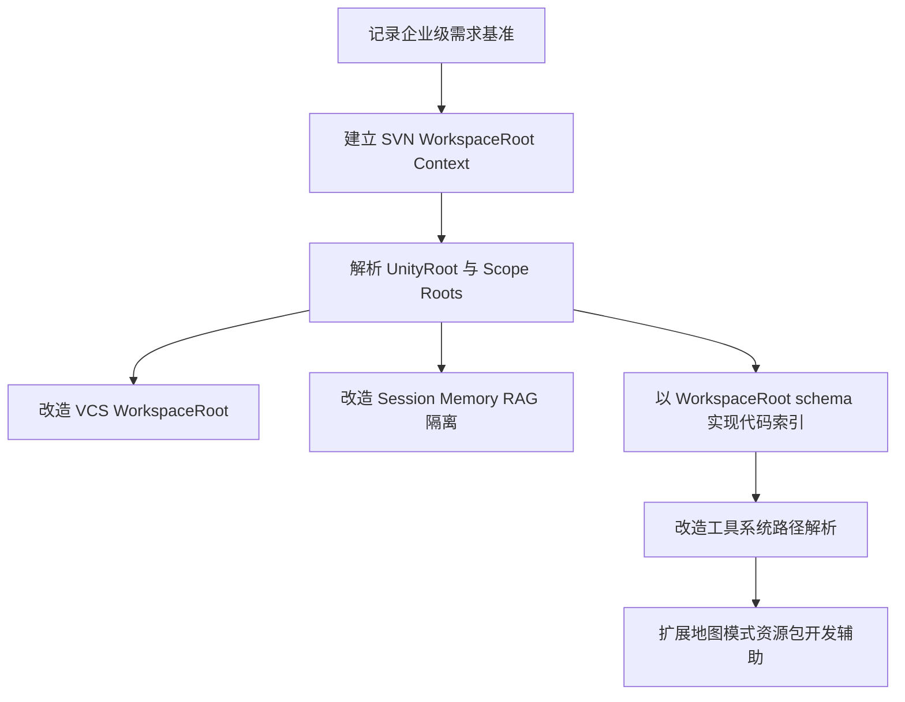

# AgentCore 已实现功能企业级 Unity 项目适配审计

> **审计日期**: 2026-06-02  
> **修订日期**: 2026-06-02  
> **审计目标**: 判断当前已实现 AgentCore 功能是否足以协助大型商业 Unity 项目开发  
> **上游需求基准**: [`enterprise-unity-workflow-requirements.md`](enterprise-unity-workflow-requirements.md)  
> **相关计划**: [`codebase-indexing-phase1-plan.md`](codebase-indexing-phase1-plan.md), [`ROADMAP.md`](ROADMAP.md)  
> **结论状态**: 当前 AgentCore 对标准 Unity 项目已经具备较强辅助能力；但对以 SVN 工作副本根作为 WorkspaceRoot 的大型商业 Unity 项目，仍存在 UnityRoot 边界过窄、Workspace 子 Root 不可见、Scope/Role/Branch 隔离不足等问题。需要先进行 WorkspaceRoot-aware 架构适配，再推进代码索引和更深层的开发辅助。

---

## 1. 总体结论

当前 AgentCore 的已实现功能可以协助开发者完成以下标准 Unity 项目工作：

- 通过 Chat 窗口与 LLM 进行多轮开发对话。
- 调用 Unity Editor 原生工具管理场景、对象、资源、Prefab、脚本等。
- 通过文件系统工具读写、搜索 Unity 项目根目录内文件。
- 通过可选 VCS 组件查看和操作一个工作副本的 Git/SVN/Perforce 状态。
- 通过 Session 系统保存对话历史。
- 通过 Bootstrap 自动收集 Unity 项目上下文。
- 通过 mem0 和 LightRAG 接入记忆与知识库。
- 通过 Settings 页面管理模型、工具、上下文、记忆、知识库和扩展。

但对用户描述的大型商业 Unity 项目，目前不能直接判定为“已满足可稳定协助开发”。主要原因不是单个工具不可用，而是当前架构仍以 Unity 项目根和 Unity `Assets/` 为默认边界；而目标项目的真实边界应是：

> **SVN 工作副本根 = AgentCore WorkspaceRoot；Unity 工程目录 = WorkspaceRoot 下的 UnityRoot 子根；地图、模式、工具、资源、插件等目录 = WorkspaceRoot 下的 Scope Root。**

当前实现的主要缺口：

- 默认把 Unity 项目根当成全局项目边界，而不是从 SVN 工作副本根建立 WorkspaceRoot。
- 默认主要操作 `Assets/` 与 `Packages/` 中的 Unity 可见资源。
- 默认 VCS 检测从 Unity 项目根出发，未明确把 SVN 工作副本根作为 WorkspaceRoot。
- 默认 Session、Memory、RAG、工具调用不携带 WorkspaceRoot/UnityRoot/Scope/Root/Role/Branch 元数据。
- 默认缺少对地图/模式、Workspace 子资源目录、商业插件、自制插件、引擎代码、生成代码、只读引用代码的安全策略。

因此，当前 AgentCore 的定位应视为：

> **标准 Unity 项目的可用开发助手 + 企业级 Unity 项目的基础框架雏形**。

它尚不是：

> **可直接承接大型商业 Unity 项目复杂工作流的 WorkspaceRoot-aware Agent 平台**。

---

## 2. 适配度分级

| 模块 | 当前能力 | 企业级适配度 | 主要问题 |
|---|---|---:|---|
| Chat/AgentLoop | 多轮对话、工具调用、Domain Reload 恢复、上下文裁剪 | 中 | 不感知 WorkspaceRoot/UnityRoot/Scope/Branch，系统提示与工具策略不随工作上下文变化 |
| Bootstrap 项目上下文 | 自动收集 Unity 项目路径、Assets 树、Packages、Build Scenes | 中低 | 只收集 UnityRoot 视角，不识别 SVN WorkspaceRoot 和同级地图/模式/工具目录 |
| Session | 会话保存、恢复、列表、自动保存 | 中低 | 会话不记录 WorkspaceRoot/Scope/Branch，容易跨分线/地图/模式混淆 |
| Memory/mem0 | 自动记忆提取、搜索、增删查 | 中低 | 记忆元数据缺少 WorkspaceRoot/Scope/Root/Branch，存在上下文污染风险 |
| LightRAG/Knowledge | 索引文档、查询知识库、文档列表和删除 | 中低 | 文件索引限制在 Unity 项目根目录，知识库不按 Scope/Branch 隔离 |
| FileSystem 工具 | Unity 项目根内安全读写、搜索、复制、移动、删除 | 中 | 安全边界清晰但过窄，不能覆盖同一 SVN WorkspaceRoot 下 UnityRoot 外目录 |
| Scripting 工具 | 读写/创建/分析 C# 脚本，搜索脚本，查引用 | 中低 | 强依赖 Assets/Packages 路径，缺少 Workspace 子 Root 和 Role 安全策略 |
| Asset/Prefab/Scene 工具 | 使用 AssetDatabase/SceneManager/PrefabUtility 操作 Unity 可见资源 | 中 | 对 Unity 可见资源有效，但不支持 WorkspaceRoot 下非 Unity 导入目录；应明确保持 UnityRoot-only |
| VCS 工具 | Git/SVN/P4 检测、状态、日志、diff、提交、回滚、更新等 | 中 | Adapter 可复用，但 Detector/Tool/UI 尚未明确以 SVN WorkspaceRoot 为根并按 Scope 分组 |
| Settings | 模型、工具、记忆、知识库、扩展配置 | 中 | 缺少 WorkspaceRoot/UnityRoot/Root/Scope/Branch/Role 配置页和策略配置 |
| Optional Components | VCS 可选组件模式已存在 | 高 | 架构上适合承接 Indexing/Workspace 组件，但尚未实现 Workspace 基础层 |

---

## 3. 核心 AgentLoop、上下文与会话审计

### 3.1 当前能力

当前核心循环在 [`Editor/Core/AgentLoop.cs`](../Editor/Core/AgentLoop.cs) 中完成初始化、消息发送、会话加载、对话重置和资源释放。它已经具备较完整的 Agent 基础能力：

- 自动发现并注册工具。
- 加载 Bootstrap System Prompt。
- 支持 LLM 流式响应。
- 支持多轮工具调用。
- 支持取消、重置和会话恢复。
- 支持 Domain Reload 后恢复。
- 支持文件变更记录。

LLM 调用相关逻辑在 [`Editor/Core/AgentLoop.LLM.cs`](../Editor/Core/AgentLoop.LLM.cs)，会基于模型上下文窗口对消息进行裁剪。上下文裁剪实现位于 [`Editor/Core/ContextWindowManager.cs`](../Editor/Core/ContextWindowManager.cs)。

Session 数据模型位于 [`Editor/Session/SessionData.cs`](../Editor/Session/SessionData.cs)，会话管理位于 [`Editor/Session/SessionManager.cs`](../Editor/Session/SessionManager.cs)，存储路径位于 [`Editor/Session/SessionStorage.cs`](../Editor/Session/SessionStorage.cs)。当前会话存储路径是 Unity 项目根下的 `Library/AgentCore/sessions/`。

### 3.2 企业级缺口

当前核心 AgentLoop 缺少以下上下文：

- 当前 SVN WorkspaceRoot。
- 当前 UnityRoot。
- 当前 Workspace Fingerprint。
- 当前地图/模式/包 Scope。
- 当前可编辑 Root。
- 当前只读/商业插件/引擎/生成代码 Role。
- 当前 SVN/Git/P4 Branch。
- 当前工具调用默认 Scope。
- 当前记忆和知识库查询过滤条件。

这会导致：

1. 同一个开发者在不同 SVN 分线工作时，会话和记忆可能混用。
2. 同一个项目中不同地图/模式上下文可能混用。
3. Agent 无法判断某个路径是否属于可编辑项目代码、只读商业插件、引擎代码或生成代码。
4. LLM 在上下文压缩时只按 token 裁剪，不会优先保留当前地图/模式/分线相关内容。

### 3.3 建议

优先引入 Workspace Context 基础层，作为 AgentLoop、Session、Memory、RAG、VCS、FileSystem 和 ToolDispatcher 的共同依赖。

建议新增概念：

- WorkspaceContext：当前工作区快照。
- WorkspaceRoot：SVN 工作副本根。
- UnityRoot：WorkspaceRoot 下的 Unity 工程子目录。
- WorkspaceFingerprint：用于区分不同 SVN 工作副本、分线、UnityRoot 和 Scope Root 配置。
- ActiveScope：当前地图/模式/包/公共模块。
- ActiveRoot：当前默认操作 Root。
- ToolExecutionContext：工具执行时携带 WorkspaceRoot/UnityRoot/Scope/Root/Role/Branch。

---

## 4. Bootstrap 与项目上下文审计

### 4.1 当前能力

[`Editor/Bootstrap/BootstrapLoader.cs`](../Editor/Bootstrap/BootstrapLoader.cs) 按 SOUL、TOOLS、PROJECT、MEMORY、USER 顺序加载系统提示词组件。

[`Editor/Bootstrap/ProjectContextCollector.cs`](../Editor/Bootstrap/ProjectContextCollector.cs) 会收集：

- Unity 项目路径。
- Unity 版本。
- Render Pipeline。
- 当前目标平台。
- Assets 目录树摘要。
- 已安装 Packages。
- Build Scenes。
- 项目统计。
- 命名空间分布。
- Tags/Layers。
- 关键 ProjectSettings。

### 4.2 企业级缺口

当前 Bootstrap 上下文对大型商业 Unity 项目的关键结构不可见：

- SVN WorkspaceRoot 不可见。
- UnityRoot 与 WorkspaceRoot 的层级关系不可见。
- WorkspaceRoot 下与 UnityRoot 平级的地图/模式目录不可见。
- WorkspaceRoot 下的工具、文案、共享模块、插件目录不可见。
- 资源包 Unity 插件管理系统不可见。
- Workspace 子 Root 的 Branch/Scope/Role 不可见。
- 插件/引擎/生成代码的 Role 不可见。

这意味着 Agent 在对话开始时无法知道：

- 用户当前正在开发哪个地图或模式。
- 哪些资源/模式目录已经同步或启用。
- 哪些目录是只读引用。
- 哪些路径属于当前 SVN 分线。
- 哪些代码可以修改，哪些只能参考。

### 4.3 建议

Bootstrap 的 PROJECT 部分应从单一 ProjectContextCollector 演进为 WorkspaceContextCollector，至少输出：

- 当前 SVN WorkspaceRoot。
- 当前 UnityRoot。
- 已发现或已配置的 Workspace 子 Root。
- 每个 Root 的 ScopeType、ScopeName、Role、VcsType、BranchId。
- 当前 ActiveScope 和 ActiveRoot。
- 资源包插件提供的包清单摘要。
- 高风险只读区域提示。

---

## 5. 工具系统与文件/脚本/资源工具审计

### 5.1 当前能力

工具系统整体基础较强：

- [`Editor/Tools/IAgentTool.cs`](../Editor/Tools/IAgentTool.cs) 定义工具接口与元数据。
- [`Editor/Tools/ToolCallDispatcher.cs`](../Editor/Tools/ToolCallDispatcher.cs) 负责工具查找、参数解析、Schema 校验、主线程调度和结果回传。
- [`Editor/Tools/ToolRegistry.cs`](../Editor/Tools/ToolRegistry.cs) 负责工具注册与查询。
- [`Editor/Tools/Infrastructure/ToolHelpers.cs`](../Editor/Tools/Infrastructure/ToolHelpers.cs) 提供参数解析、Unity 对象查找、Asset 路径标准化等辅助方法。

文件系统工具 [`Editor/Tools/FileSystem/ManageFileTool.cs`](../Editor/Tools/FileSystem/ManageFileTool.cs) 已经实现读写、目录列表、内容搜索、文件信息、删除、复制、移动、创建目录等能力，并且通过项目根限制防止路径穿越。

脚本工具 [`Editor/Tools/Native/Scripting/ManageScriptTool.cs`](../Editor/Tools/Native/Scripting/ManageScriptTool.cs) 已支持脚本读写、创建、删除、列表、信息、分析、引用查找、添加方法、添加字段、搜索等能力。

资源、Prefab、场景工具分别位于：

- [`Editor/Tools/Native/Utility/ManageAssetTool.cs`](../Editor/Tools/Native/Utility/ManageAssetTool.cs)
- [`Editor/Tools/Native/Scripting/ManagePrefabTool.cs`](../Editor/Tools/Native/Scripting/ManagePrefabTool.cs)
- [`Editor/Tools/Native/Core/ManageSceneTool.cs`](../Editor/Tools/Native/Core/ManageSceneTool.cs)

它们对标准 Unity 资源操作有效。

### 5.2 企业级缺口

当前工具系统最大的问题是：工具调用没有统一的 WorkspaceRoot/Root/Role 安全策略。

典型路径假设包括：

- [`Editor/Tools/FileSystem/ManageFileTool.cs`](../Editor/Tools/FileSystem/ManageFileTool.cs) 固定以 Unity 项目根作为安全边界。
- [`Editor/Tools/Infrastructure/ToolHelpers.cs`](../Editor/Tools/Infrastructure/ToolHelpers.cs) 中 Asset 路径标准化会把非 `Assets/`、非 `Packages/` 路径自动归入 `Assets/`。
- [`Editor/Tools/Native/Scripting/ManageScriptTool.cs`](../Editor/Tools/Native/Scripting/ManageScriptTool.cs) 参数说明和默认目录强依赖 `Assets/`。
- [`Editor/Tools/Native/Utility/ManageAssetTool.cs`](../Editor/Tools/Native/Utility/ManageAssetTool.cs) 默认搜索和创建目录在 `Assets/`。
- [`Editor/Tools/Native/Scripting/ManagePrefabTool.cs`](../Editor/Tools/Native/Scripting/ManagePrefabTool.cs) 使用 Unity AssetDatabase 路径。
- [`Editor/Tools/Native/Core/ManageSceneTool.cs`](../Editor/Tools/Native/Core/ManageSceneTool.cs) Scene 路径标准化仍基于 Unity Asset 路径。

这对企业项目意味着：

1. 同一 SVN WorkspaceRoot 下、但位于 UnityRoot 外的地图/模式/工具目录无法被文件工具访问。
2. Agent 可能把用户给出的 Workspace 相对路径错误解释到 Unity `Assets/` 下。
3. 插件、引擎、生成代码没有 Role 约束，工具无法自动阻止危险修改。
4. Unity AssetDatabase 工具只适合 Unity 已导入/可见资源，不适合未挂载或未导入的 Workspace 子目录。

### 5.3 建议

应先建立 WorkspaceRootRegistry 与 Tool Safety Policy，再改造具体工具。

建议的工具改造方向：

- 文件工具增加 Root ID 或 Workspace-relative path 参数，而不是只接受 Unity 项目根相对路径。
- 脚本工具区分 Unity AssetDatabase 脚本和 WorkspaceRoot 下普通 C# 文件。
- Asset/Prefab/Scene 工具明确只操作 UnityRoot/AssetDatabase 可见资源，不负责 Workspace 子目录文件系统操作。
- ToolDispatcher 执行前进行统一策略检查：Root 是否存在、Role 是否允许修改、Branch 是否匹配、Scope 是否激活。
- ToolResult 中回传 root_id、scope、role、branch，方便 Agent 后续推理。

---

## 6. VCS 组件审计

### 6.1 当前能力

VCS 是当前最接近企业工作流需求的模块之一。可选组件程序集 [`Editor/VCS/AgentCore.VCS.Editor.asmdef`](../Editor/VCS/AgentCore.VCS.Editor.asmdef) 通过 `AGENTCORE_VCS` 控制启用，符合可选组件架构。

[`Editor/VCS/Tools/VersionControlTool.cs`](../Editor/VCS/Tools/VersionControlTool.cs) 支持丰富的 VCS 操作：

- detect_vcs。
- get_status。
- get_branch。
- get_log。
- get_diff。
- get_remote。
- get_blame。
- get_sync_status。
- cleanup。
- stage/unstage/commit/revert/sync/update。
- SVN 专用 commit_svn/revert_svn/add_files。

[`Editor/VCS/Tools/SvnAdapter.cs`](../Editor/VCS/Tools/SvnAdapter.cs) 本身以 workingDirectory 构造，理论上可以复用于任意 SVN 工作副本。

[`Editor/VCS/UI/VersionControlPanel.cs`](../Editor/VCS/UI/VersionControlPanel.cs) 提供状态列表、提交历史、diff、revert、ignore、cleanup、外部工具调用等 UI 能力。

### 6.2 企业级缺口

虽然 Adapter 层可复用，但当前上层仍以 Unity 项目根作为推导起点：

- [`Editor/VCS/Tools/VcsDetector.cs`](../Editor/VCS/Tools/VcsDetector.cs) 从 `Application.dataPath` 推导一个 Unity 项目根，并缓存一个 VCS 类型和 Root。
- [`Editor/VCS/Tools/VersionControlTool.cs`](../Editor/VCS/Tools/VersionControlTool.cs) 通过 VcsDetector 获取 Root，工具参数没有 workspace_root、scope 或 root_id。
- [`Editor/VCS/UI/VersionControlPanel.cs`](../Editor/VCS/UI/VersionControlPanel.cs) 面板只有一个 Adapter、一个当前 VCS 类型、一个 Root。
- 文件路径描述是相对单一项目根，而不是相对 SVN WorkspaceRoot。

对已确认的 SVN WorkspaceRoot 模型，这会产生以下不足：

1. 如果 UnityRoot 位于 `svn/project/branch/unity/`，当前 VCS 语义可能停留在 UnityRoot，而不是上层 `svn/project/branch/` WorkspaceRoot。
2. 无法按 Workspace 子 Root 显示地图/模式、工具、插件、共享模块的 VCS 状态。
3. 无法把 VCS 状态作为代码索引和知识检索的 Branch/Scope 过滤条件。
4. 无法阻止 Agent 对错误 Scope 执行提交、回滚、清理等操作。

### 6.3 建议

VCS 组件应从“Unity 项目根 VCS 面板”演进为“SVN WorkspaceRoot VCS 面板”：

- VcsDetector 从 UnityRoot 向上识别 SVN WorkspaceRoot。
- VCS Tool 所有路径默认解释为 WorkspaceRoot 相对路径。
- VersionControlTool 增加 scope/root 过滤参数，而不是首先追求多独立 VCS Root。
- UI 顶部显示 WorkspaceRoot、Branch、Revision、UnityRoot。
- 状态列表按 Workspace 子 Root / Scope 分组或以标签展示。
- commit/revert/update/sync 等危险操作必须显示 WorkspaceRoot、Branch、Scope、Role 确认信息。
- 多 VCS Root 支持保留为 P2 兼容项，仅用于未来确实存在额外独立工作副本的场景。

---

## 7. Memory、RAG 与 Knowledge UI 审计

### 7.1 当前能力

当前 AgentCore 已经具备外部记忆和知识库接入：

- [`Editor/Session/AutoMemoryStrategy.cs`](../Editor/Session/AutoMemoryStrategy.cs) 可在会话结束/切换时提取长期记忆。
- [`Editor/Tools/Cloud/Mem0Tool.cs`](../Editor/Tools/Cloud/Mem0Tool.cs) 支持 add/search/list/delete。
- [`Editor/Tools/Cloud/LightRAGTool.cs`](../Editor/Tools/Cloud/LightRAGTool.cs) 支持 query/index_text/index_file/index_folder/list/delete/status/index_project_docs。
- [`Editor/UI/Components/KnowledgeBasePanel.cs`](../Editor/UI/Components/KnowledgeBasePanel.cs) 提供 LightRAG 状态、连接测试、文档上传索引、文档列表、删除等 UI。

### 7.2 企业级缺口

当前记忆与知识库最大问题是隔离维度不足。

mem0 自动记忆元数据目前主要包含 source、session_id、session_title，没有 WorkspaceRoot/Scope/Root/Branch。LightRAG 文件索引在工具和 UI 中均限制在 Unity 项目根目录内，并且 KnowledgeBasePanel 的文件选择默认从 Unity 项目根开始。

这会带来：

1. 不同 SVN 分线的技术决策可能混在同一记忆空间。
2. 不同地图/模式的上下文可能互相污染。
3. WorkspaceRoot 下但 UnityRoot 外的文档、配置、代码无法直接索引。
4. 查询知识库时无法限定当前地图/模式或当前分线。
5. 删除文档时无法明确它属于哪个 Workspace/Scope。

### 7.3 建议

Memory 与 RAG 必须引入元数据与过滤：

- workspace_root。
- workspace_fingerprint。
- unity_root。
- project_id。
- scope_type。
- scope_name。
- root_id。
- branch_id。
- role。
- package_id。

同时应在 Settings 中提供策略：

- 是否允许跨 Scope 查询。
- 是否允许跨 Branch 查询。
- 是否允许引用商业插件/引擎代码知识。
- 默认查询范围：当前 Scope、当前 Workspace、全项目、全组织知识。

---

## 8. Settings 与 UI 审计

### 8.1 当前能力

[`Editor/Config/AgentCoreSettings.cs`](../Editor/Config/AgentCoreSettings.cs) 当前覆盖模型、Agent 行为、Bootstrap、mem0、LightRAG、用户 ID、工具管理、压缩和 UI 偏好。

[`Editor/Config/Settings/Pages/ContextMemorySettingsPage.cs`](../Editor/Config/Settings/Pages/ContextMemorySettingsPage.cs) 提供 Bootstrap、自动项目上下文、MEMORY.md、USER.md、mem0、LightRAG 等设置。

[`Editor/Config/Settings/Pages/ToolsExtensionsSettingsPage.cs`](../Editor/Config/Settings/Pages/ToolsExtensionsSettingsPage.cs) 提供工具可见性、工具预设、可选组件、VCS 和扩展设置入口。

### 8.2 企业级缺口

目前 Settings 中没有以下配置：

- WorkspaceRoot 定义。
- UnityRoot 相对路径。
- Workspace 子 Root 列表。
- Root Provider 配置。
- 地图/模式 Scope 识别规则。
- Root Role 和安全策略。
- Branch 隔离策略。
- Resource Package 插件适配器配置。
- Memory/RAG 查询范围策略。
- 工具按 Root/Role/Scope 的启用禁用策略。
- 少量 WorkspaceRoot 外部授权目录策略。

这使得大型项目中最关键的开发上下文无法被 AgentCore 显式表达。

### 8.3 建议

Settings 应新增 Workspace & Scope 页面，建议包括：

- Workspace Overview：展示当前 WorkspaceRoot、UnityRoot、fingerprint、active scope、active branch。
- Roots：展示所有已配置/已发现 Workspace 子 Root。
- Scope Rules：地图/模式路径识别规则。
- Role Policies：可编辑/只读/插件/引擎/生成代码策略。
- VCS：显示 SVN WorkspaceRoot、Branch、Revision，并按 Scope 分组状态。
- Resource Package Providers：资源包插件元数据适配器。
- Context Isolation：Memory/RAG/Session 隔离策略。
- Extra Authorized Roots：仅用于 WorkspaceRoot 外部例外目录。

---

## 9. 当前功能对大型项目仍然有价值的部分

虽然当前实现尚未企业级适配，但已有模块不是无效的。它们可以作为后续改造的基础：

1. AgentLoop 已经形成稳定的多轮工具调用框架。
2. ToolAutoDiscovery 与 IAgentTool 模式适合继续扩展 Workspace-aware 工具。
3. Optional Component 机制适合承接 Indexing、Workspace、ResourcePackage 等新组件。
4. VCS Adapter 层尤其是 SVN Adapter 可在 SVN WorkspaceRoot 体系下复用。
5. FileSystem 工具已经具备安全路径意识，只需从 Unity 项目根扩展为授权 WorkspaceRoot。
6. Session/Memory/RAG 都已有可用框架，只需要补足元数据隔离和过滤。
7. Settings Shell/Pages 架构可以承载新的 Workspace 设置页。
8. KnowledgeBasePanel 已具备知识库 UI 交互基础，可改造成 Scope-aware Knowledge 面板。

---

## 10. 高风险问题清单

| 风险 | 严重度 | 说明 | 优先建议 |
|---|---:|---|---|
| UnityRoot 被误当 WorkspaceRoot | 高 | 文件、RAG、Session、Bootstrap、VCS 多处从 Application.dataPath 推导 Unity 项目根 | P0 建立 WorkspaceRootResolver |
| Assets/Packages 路径假设 | 高 | Native 工具对 Workspace 子目录不可见，且可能误归一化路径 | P0 改造路径解析策略 |
| VCS Root 边界错误 | 高 | 当前检测从 UnityRoot 出发，未明确上探到 SVN WorkspaceRoot | P0 改造 VCS WorkspaceRoot 模型 |
| 缺少 Role 安全策略 | 高 | Agent 无法区分可编辑代码、插件、引擎、生成代码 | P0 增加 RolePolicy |
| 记忆跨分线污染 | 高 | mem0 自动记忆缺少 Branch/Scope 元数据 | P0 增加 Memory metadata/filter |
| RAG 跨分线污染 | 高 | LightRAG 知识库无 Workspace/Scope/Branch 隔离 | P0 增加 Knowledge metadata/filter |
| Bootstrap 上下文不完整 | 中高 | Agent 开局不知道 WorkspaceRoot、地图/模式、分线 | P0 改造 ProjectContextCollector |
| 工具执行无统一策略层 | 中高 | 每个工具各自解析路径，缺少统一审批和限制 | P1 引入 ToolExecutionContext |
| VCS UI 无 Scope 分组 | 中 | 用户无法在面板中按地图/模式/工具目录管理状态 | P1 改造 VCS Panel |
| 代码索引若直接实现会返工 | 高 | 若先做 UnityRoot-only SQLite 索引，后续 WorkspaceRoot 迁移成本高 | P0 先落 WorkspaceRoot/Root schema |

---

## 11. 推荐调整路线

### 11.1 P0：企业级基础上下文层

目标：先让 AgentCore 知道“当前 SVN WorkspaceRoot 是什么、UnityRoot 在哪里、有哪些 Workspace 子 Root、每个 Root 属于什么 Scope/Role/Branch”。

建议任务：

- 新增 WorkspaceContext 数据模型。
- 新增 WorkspaceRootResolver。
- 新增 UnityRootResolver。
- 新增 WorkspaceRootRegistry。
- 新增 Index/Workspace Root Provider 接口。
- 新增 Root Role 与安全策略。
- 新增 Workspace Fingerprint。
- Settings 新增 Workspace 页面。
- Bootstrap 输出 Workspace 摘要。

### 11.2 P0：VCS WorkspaceRoot 适配

目标：承接 SVN 分线工作副本根，并将状态按 Workspace 子 Root / Scope 分组。

建议任务：

- VcsDetector 从 UnityRoot 上探到 SVN WorkspaceRoot。
- VersionControlTool 路径语义改为 WorkspaceRoot-relative。
- VersionControlTool 增加 scope/root 过滤参数。
- VersionControlPanel 支持 Scope 分组展示。
- 危险 VCS 操作显示 WorkspaceRoot/Branch/Scope 确认。

### 11.3 P0：Session/Memory/RAG 隔离

目标：避免跨地图/模式/分线污染。

建议任务：

- SessionData 增加 workspace_root、workspace_fingerprint、unity_root、active_scope、branch_id。
- AutoMemoryStrategy 写入 Workspace/Scope/Branch metadata。
- Mem0Tool 支持 metadata filter。
- LightRAGTool 支持 Root/Scope/Branch metadata。
- KnowledgeBasePanel 支持按 Scope/Root 上传和过滤。

### 11.4 P0：代码索引 Phase 1 以 WorkspaceRoot 为前提

目标：避免 v0.9.0 的代码索引从一开始就绑定 UnityRoot 或 `Assets/`。

建议任务：

- SQLite schema 使用 workspace、index_roots、indexed_files、symbols。
- 文件索引必须绑定 root_id 和 workspace_relative_path。
- symbol 查询支持 root_id、scope_type、scope_name、role、branch_id 过滤。
- 索引结果返回 Workspace 相对路径和 Root 相对路径，不直接依赖 Unity Asset 路径。

### 11.5 P1：工具路径和安全策略改造

目标：让现有工具在 WorkspaceRoot-aware 模式下安全可用。

建议任务：

- ManageFileTool 支持授权 WorkspaceRoot。
- ManageScriptTool 支持 Root-aware 脚本路径。
- ToolHelpers 拆分 AssetDatabase Path 和 Workspace File Path。
- ToolCallDispatcher 增加统一策略检查。
- ToolResponse 增加 Root/Scope/Role/Branch 回传。

---

## 12. 针对用户问题的直接回答

用户问题是：现在已经实现的功能是否都满足能够协助这样的项目？

结论：

> **不完全满足。**

更准确地说：

1. **可以协助标准 Unity 项目开发。**  
   当前功能已经能做很多常规 Unity Editor 辅助工作，包括脚本、场景、资源、Prefab、VCS、会话、知识库和记忆。

2. **可以作为大型商业 Unity 项目 Agent 平台的基础。**  
   Tool、AgentLoop、VCS Adapter、Settings Shell、Optional Component、Session、RAG 等模块都有继续扩展的价值。

3. **不能直接承接用户描述的企业级工作流。**  
   当前实现缺少 WorkspaceRoot/UnityRoot/Scope/Root/Role/Branch 这一层核心抽象，无法可靠处理 SVN 工作副本根、UnityRoot 外的地图/模式目录、插件/引擎/生成代码安全边界和上下文隔离。

4. **不建议直接在现有 UnityRoot-only 假设上实现代码索引。**  
   代码索引应以 SVN WorkspaceRoot、多 Scope、多 Branch schema 作为起点，否则后续迁移成本较高。

5. **建议先把 AgentCore 从“Unity 项目助手”升级为“WorkspaceRoot-aware Unity Agent”。**  
   然后再推进代码索引、RAG、VCS、工具系统和资源包适配。

---

## 13. 建议进入下一阶段前的确认清单

在进入实现前，建议先确认：

- WorkspaceRoot 下 UnityRoot 的相对路径是否稳定为 `unity/`。
- 企业项目中地图/模式目录的命名规则。
- 资源包 Unity 插件是否能提供包清单 API 或 manifest。
- 资源包目录是否都位于同一 SVN WorkspaceRoot 内；若存在例外，例外目录如何授权。
- 商业插件、自制插件、引擎代码、生成代码的目录规则。
- 开发者是否需要在同一 Unity Editor 会话中同时操作多个地图/模式 Scope。
- Memory/RAG 是否允许跨 Branch 查询，默认是否禁止。
- Agent 是否允许修改 Workspace 子资源目录中的代码，还是默认只读。

---

## 14. 最终建议

当前最优开发顺序不是直接实现代码索引，而是：

这一路线可以最大限度减少返工，并让 AgentCore 逐步适配用户描述的大型商业 Unity 开发模式。
