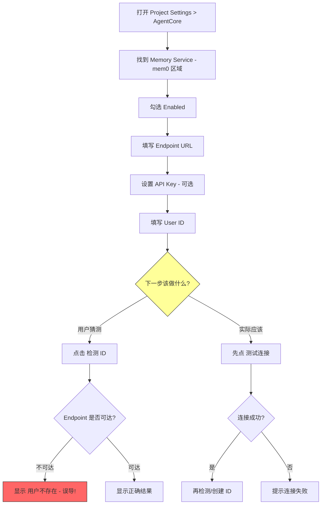
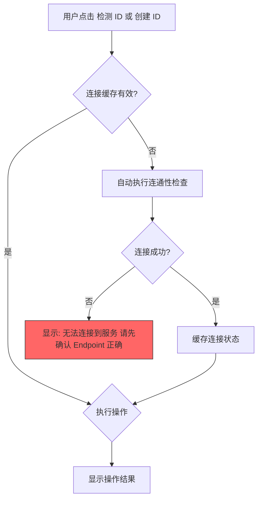

# Memory Service - mem0 设置界面与代码架构优化方案

## 一、问题全景分析

### 1.1 用户体验流程还原

用户从零配置 mem0 的完整流程：



### 1.2 发现的问题清单（按严重程度排序）

---

## 二、严重问题（P0 - 必须修复）

### 问题 1：已序列化的 Settings 资产不会自动更新默认值

**文件**: [`AgentCoreSettings.cs`](Editor/Config/AgentCoreSettings.cs:68)

**现象**: 代码中 `mem0Endpoint` 默认值已改为 `"http://localhost:8765"`，但用户的 Settings 资产在首次创建时序列化了旧值 `"http://localhost:18910"`，之后修改代码中的默认值不会影响已存在的资产。

**根因**: `ScriptableSingleton` 的序列化机制 — 字段值在首次 `Save()` 时写入磁盘，后续读取时从磁盘加载，不再使用代码中的默认值。

**修复方案**: 在 `AgentCoreSettings` 中添加版本迁移逻辑：

```csharp
// AgentCoreSettings.cs
[SerializeField] private int settingsVersion = 0;
private const int CurrentVersion = 1;

private void OnEnable()
{
    if (settingsVersion < CurrentVersion)
    {
        MigrateSettings();
    }
}

private void MigrateSettings()
{
    // v0 -> v1: 修正 mem0 默认端点
    if (settingsVersion < 1)
    {
        if (mem0Endpoint == "http://localhost:18910")
        {
            mem0Endpoint = "http://localhost:8765";
        }
    }
    
    settingsVersion = CurrentVersion;
    Save(true);
}
```

---

### 问题 2：检测 ID 和创建 ID 不区分"网络不通"与"用户不存在"

**文件**: [`Mem0Client.cs`](Editor/Tools/Cloud/Mem0Client.cs:384) 的 `CheckUserExistsAsync()`

**现象**: 当 Endpoint 不可达时（如指向 `localhost:18910`），`HttpClient.SendAsync()` 抛出 `HttpRequestException`（连接被拒绝），被 catch 捕获后返回 `(false, "查询失败: ...")`。但在 UI 中，这个错误信息的颜色判断逻辑（[第339行](Editor/Config/AgentCoreSettingsProvider.cs:339)）会将其显示为红色，用户无法区分是"网络问题"还是"用户确实不存在"。

**修复方案**: 在 `CheckUserExistsAsync()` 中细分错误类型：

```csharp
public async Task<(bool exists, string message, ConnectionStatus status)> CheckUserExistsAsync(...)
{
    try
    {
        // ... 发送请求 ...
    }
    catch (HttpRequestException ex) when (ex.InnerException is System.Net.Sockets.SocketException)
    {
        return (false, "无法连接到服务器，请检查 Endpoint URL 是否正确", ConnectionStatus.Unreachable);
    }
    catch (TaskCanceledException)
    {
        return (false, "连接超时，请检查服务是否运行", ConnectionStatus.Timeout);
    }
    catch (Exception ex)
    {
        return (false, $"查询失败: {ex.Message}", ConnectionStatus.Error);
    }
}

public enum ConnectionStatus
{
    Connected,
    Unreachable,
    Timeout,
    Error,
    UserNotFound
}
```

---

### 问题 3：检测 ID / 创建 ID 没有前置连通性检查

**文件**: [`AgentCoreSettingsProvider.cs`](Editor/Config/AgentCoreSettingsProvider.cs:547) 的 `CheckUserIdExists()` 和 [`CreateUserId()`](Editor/Config/AgentCoreSettingsProvider.cs:581)

**现象**: 用户点击"检测 ID"或"创建 ID"时，直接发起 API 请求，没有先验证 Endpoint 是否可达。如果 Endpoint 不通，用户需要等待 30 秒超时才能看到错误。

**修复方案**: 在 `CheckUserIdExists()` 和 `CreateUserId()` 中添加前置连通性检查：

```csharp
private async Task<bool> EnsureConnectionAsync(Mem0Client client)
{
    var connected = await client.TestConnectionAsync();
    if (!connected)
    {
        AsyncHelper.RunOnMainThread(() =>
        {
            _userIdCheckResult = "⚠ 无法连接到 mem0 服务，请先点击「测试连接」确认服务可用";
        });
        return false;
    }
    return true;
}
```

---

## 三、重要问题（P1 - 应该修复）

### 问题 4：UI 布局不符合操作直觉 — 测试连接按钮位置不合理

**文件**: [`AgentCoreSettingsProvider.cs`](Editor/Config/AgentCoreSettingsProvider.cs:270) 的 `DrawMemoryServiceSection()`

**现象**: 当前 UI 布局：
```
[x] Enabled
Endpoint URL: [________________]
API Key: ••••••••••••  [Set] [Clear]
User ID: [________________]
              [检测 ID] [创建 ID]
              检测结果消息...
Auto Memory
[x] Auto Memory
Min Turns: [3]
              [测试连接]
              连接结果消息...
```

问题：
1. **"测试连接"按钮在最底部**，但它应该是用户配置完 Endpoint 后的第一个操作
2. **"检测 ID"和"创建 ID"在"测试连接"之前**，违反了操作顺序
3. **两组状态消息分散在不同位置**，用户需要上下滚动查看

**修复方案 — 新 UI 布局**:

```
Memory Service - mem0
├── [x] Enabled
├── Endpoint URL: [________________]
├── API Key: ••••••••••••  [Set] [Clear]
├── [测试连接]  ✅ 连接成功 / ❌ 连接失败: xxx
├── ─── User ID 管理 ───
├── User ID: [________________]
├── [检测 ID] [创建 ID]  结果消息...
├── ─── Auto Memory ───
├── [x] Auto Memory
└── Min Turns: [3]
```

关键改动：
- **"测试连接"紧跟在 Endpoint + API Key 之后**
- **User ID 相关操作放在连接验证之后**
- **Auto Memory 设置放在最后**（属于高级配置）

---

### 问题 5：`FromSettings()` 工厂方法缺少空值防护

**文件**: [`Mem0Client.cs`](Editor/Tools/Cloud/Mem0Client.cs:157) 的 `FromSettings()`

**现象**: 当 `mem0Endpoint` 为空字符串时，`new Mem0Client(settings.mem0Endpoint, ...)` 不会抛出 `ArgumentNullException`（因为空字符串不是 null），但后续所有 API 调用都会失败。

**修复方案**:

```csharp
public static Mem0Client FromSettings()
{
    var settings = AgentCoreSettings.instance;
    
    if (string.IsNullOrWhiteSpace(settings.mem0Endpoint))
    {
        throw new InvalidOperationException(
            "mem0 Endpoint URL 未配置，请在 Project Settings > AgentCore 中设置");
    }
    
    return new Mem0Client(
        settings.mem0Endpoint,
        SecureKeyStorage.GetMem0ApiKey(),
        settings.userId
    );
}
```

---

### 问题 6：`Mem0Client` 构造函数中 `_baseUrl` 的 null 检查不够严格

**文件**: [`Mem0Client.cs`](Editor/Tools/Cloud/Mem0Client.cs:146)

**现象**: 构造函数只检查 `baseUrl` 是否为 `null`，不检查空字符串或空白字符串。

```csharp
_baseUrl = baseUrl?.TrimEnd('/')
    ?? throw new ArgumentNullException(nameof(baseUrl));
```

如果传入 `""`，`TrimEnd('/')` 返回 `""`，不会抛异常，但后续拼接 URL 会产生无效地址如 `/api/v1/memories/`。

**修复方案**:

```csharp
public Mem0Client(string baseUrl, string apiKey, string userId)
{
    if (string.IsNullOrWhiteSpace(baseUrl))
        throw new ArgumentException("baseUrl cannot be null or empty", nameof(baseUrl));
    
    _baseUrl = baseUrl.TrimEnd('/');
    _apiKey = apiKey;
    _userId = !string.IsNullOrEmpty(userId) ? userId : "unity-agent";
}
```

---

### 问题 7：`TestConnectionAsync()` 使用 `/api/v1/config/` 端点可能不兼容

**文件**: [`Mem0Client.cs`](Editor/Tools/Cloud/Mem0Client.cs:355)

**现象**: `TestConnectionAsync()` 使用 `GET /api/v1/config/` 来检测连通性。这个端点在 OpenMemory 中存在，但：
1. 如果用户部署的是标准 mem0 而非 OpenMemory，这个端点可能不存在
2. 没有返回详细的服务信息（版本、状态等）

**修复方案**: 增加多端点探测和详细返回信息：

```csharp
public async Task<(bool success, string message)> TestConnectionDetailedAsync(CancellationToken ct = default)
{
    // 尝试多个端点
    var endpoints = new[]
    {
        ($"{_baseUrl}{ApiPrefix}/config/", "OpenMemory"),
        ($"{_baseUrl}/health", "mem0 Standard"),
    };
    
    foreach (var (url, serverType) in endpoints)
    {
        try
        {
            var client = HttpClientFactory.GetClient();
            using var request = HttpClientFactory.CreateRequest(HttpMethod.Get, url, _apiKey);
            using var cts = CancellationTokenSource.CreateLinkedTokenSource(ct);
            cts.CancelAfter(TimeSpan.FromSeconds(10));
            
            var response = await client.SendAsync(request, cts.Token);
            if (response.IsSuccessStatusCode)
            {
                return (true, $"连接成功（{serverType}）");
            }
        }
        catch { /* 尝试下一个端点 */ }
    }
    
    return (false, "无法连接到 mem0 服务");
}
```

---

### 问题 8：`Mem0Tool.ExecuteAsync()` 只检查 `mem0Endpoint` 非空，不检查 `mem0Enabled`

**文件**: [`Mem0Tool.cs`](Editor/Tools/Cloud/Mem0Tool.cs:64)

**现象**: 工具执行时只检查 `settings.mem0Endpoint` 是否为空，但不检查 `settings.mem0Enabled` 是否为 true。如果用户禁用了 mem0 但 Endpoint 仍有值，LLM 仍然可以调用此工具。

**修复方案**:

```csharp
if (!settings.mem0Enabled)
{
    response = ToolResponse.Fail("mem0 服务未启用，请在 AgentCore Settings 中开启");
    sw.Stop();
    return response.ToToolResult(sw.Elapsed.TotalMilliseconds);
}

if (string.IsNullOrEmpty(settings.mem0Endpoint))
{
    response = ToolResponse.Fail("mem0 服务未配置 Endpoint URL");
    sw.Stop();
    return response.ToToolResult(sw.Elapsed.TotalMilliseconds);
}
```

---

## 四、改进建议（P2 - 建议优化）

### 问题 9：`CreateUserViaMcpAsync()` 的 MCP SSE 流程可靠性不足

**文件**: [`Mem0Client.cs`](Editor/Tools/Cloud/Mem0Client.cs:442)

**分析**:
1. **硬编码的 `Task.Delay(500)` 和 `Task.Delay(3000)`** — 依赖固定延时等待服务器处理，在网络慢或服务器负载高时可能不够
2. **SSE 连接在 `using` 块中被提前释放** — `ConnectSseAndGetSessionIdAsync` 中的 `response` 和 `stream` 在方法返回后就被释放了，但 MCP 协议要求 SSE 连接保持活跃
3. **没有读取 MCP 响应** — 发送 `initialize` 和 `tools/call` 后没有等待和验证服务器的 JSON-RPC 响应

**修复方案**: 重构为更可靠的 MCP 客户端流程，或者改用 REST API 直接创建用户（如果 OpenMemory 支持）。考虑到复杂度，建议：

```csharp
// 方案 A: 简化 — 直接通过 REST API 添加一条记忆来隐式创建用户
public async Task<(bool success, string message)> CreateUserViaRestAsync(CancellationToken ct = default)
{
    try
    {
        var result = await AddMemoryAsync(
            $"User {_userId} registered via AgentCore Unity plugin.",
            _userId,
            ct: ct);
        
        if (result.Success)
        {
            return (true, "用户创建成功（通过添加初始记忆）");
        }
        return (false, $"创建失败: {result.Message}");
    }
    catch (Exception ex)
    {
        return (false, $"创建失败: {ex.Message}");
    }
}
```

> **注意**: 需要验证 OpenMemory 是否支持对不存在的 user_id 直接 POST 记忆来隐式创建用户。如果支持，可以完全移除 MCP SSE 流程。

---

### 问题 10：`Mem0Client` 职责过重

**文件**: [`Mem0Client.cs`](Editor/Tools/Cloud/Mem0Client.cs:128)

**分析**: `Mem0Client` 同时包含：
- REST API 调用（CRUD 操作）— 约 250 行
- MCP SSE 连接管理 — 约 150 行
- HTTP 辅助方法 — 约 100 行

**修复方案**: 如果保留 MCP SSE 功能，建议拆分：

```
Mem0Client.cs          → REST API 操作 + 连接测试
Mem0McpClient.cs       → MCP SSE 连接和用户创建（如果需要保留）
```

但如果问题 9 的方案 A 可行（直接用 REST 创建用户），则可以完全移除 MCP SSE 代码，`Mem0Client` 的职责就变得合理了。

---

### 问题 11：缺少连接状态缓存

**文件**: [`AgentCoreSettingsProvider.cs`](Editor/Config/AgentCoreSettingsProvider.cs:270)

**分析**: 每次点击"检测 ID"或"创建 ID"都会重新创建 `Mem0Client` 实例并发起网络请求。没有缓存上次连接测试的结果。

**修复方案**: 添加连接状态缓存：

```csharp
private bool? _mem0ConnectionValid = null;
private DateTime _lastConnectionTest = DateTime.MinValue;
private const int ConnectionCacheSeconds = 60;

private bool IsConnectionCacheValid()
{
    return _mem0ConnectionValid.HasValue 
        && (DateTime.Now - _lastConnectionTest).TotalSeconds < ConnectionCacheSeconds;
}
```

---

### 问题 12：UI 状态消息颜色判断逻辑脆弱

**文件**: [`AgentCoreSettingsProvider.cs`](Editor/Config/AgentCoreSettingsProvider.cs:339)

**现象**: 使用字符串包含检查来决定颜色：

```csharp
style.normal.textColor = _userIdCheckResult.Contains("存在") || _userIdCheckResult.Contains("成功")
    ? new Color(0.2f, 0.8f, 0.2f)
    : _userIdCheckResult.Contains("不存在")
        ? new Color(1f, 0.6f, 0f)
        : Color.red;
```

这种方式很脆弱 — 如果消息文本变化，颜色判断就会出错。

**修复方案**: 使用枚举状态而非字符串匹配：

```csharp
private enum StatusLevel { None, Success, Warning, Error }
private StatusLevel _userIdCheckStatus = StatusLevel.None;

// 在回调中设置
_userIdCheckStatus = exists ? StatusLevel.Success : StatusLevel.Warning;
_userIdCheckResult = message;

// 在绘制时使用
private Color GetStatusColor(StatusLevel level) => level switch
{
    StatusLevel.Success => new Color(0.2f, 0.8f, 0.2f),
    StatusLevel.Warning => new Color(1f, 0.6f, 0f),
    StatusLevel.Error   => Color.red,
    _                   => EditorStyles.label.normal.textColor
};
```

---

### 问题 13：`AutoMemoryStrategy` 中 `Mem0Client.FromSettings()` 可能在 mem0 未配置时抛异常

**文件**: [`AutoMemoryStrategy.cs`](Editor/Session/AutoMemoryStrategy.cs:103)

**分析**: `ShouldTrigger()` 检查了 `mem0Enabled` 和 `autoMemoryEnabled`，但没有检查 `mem0Endpoint` 是否有效。如果 `mem0Enabled = true` 但 `mem0Endpoint` 为空，`Mem0Client.FromSettings()` 会创建一个无效的客户端。

**修复方案**: 在 `ShouldTrigger()` 中增加 Endpoint 检查：

```csharp
// 条件 5: mem0 Endpoint 必须已配置
if (string.IsNullOrWhiteSpace(settings.mem0Endpoint))
{
    return false;
}
```

---

## 五、新 UI 布局设计

### 5.1 优化后的 Memory Service 区域

```
╔══════════════════════════════════════════════════════╗
║  Memory Service - mem0                               ║
╠══════════════════════════════════════════════════════╣
║                                                      ║
║  [x] Enabled                                         ║
║                                                      ║
║  ── 服务连接 ──────────────────────────────────────  ║
║  Endpoint URL: [http://172.16.249.22:8765_________]  ║
║  API Key:      ••••••••••••  [Set] [Clear]           ║
║                [测试连接]  ✅ 连接成功（OpenMemory）  ║
║                                                      ║
║  ── 用户管理 ──────────────────────────────────────  ║
║  User ID:      [akari______________________________] ║
║                [检测 ID] [创建 ID]                    ║
║                ✅ 用户存在（共 42 条记忆）            ║
║                                                      ║
║  ── 自动记忆 ──────────────────────────────────────  ║
║  [x] Auto Memory                                     ║
║  Min Turns:    [===3==========]                       ║
║                                                      ║
╚══════════════════════════════════════════════════════╝
```

### 5.2 按钮交互逻辑



### 5.3 状态指示器设计

| 状态 | 图标 | 颜色 | 示例消息 |
|------|------|------|----------|
| 成功 | ✅ | 绿色 `#33CC33` | 连接成功（OpenMemory） |
| 警告 | ⚠ | 橙色 `#FF9900` | 用户不存在，可点击「创建 ID」 |
| 错误 | ❌ | 红色 `#FF0000` | 无法连接到服务器 |
| 加载中 | ⏳ | 灰色 | 测试中... |

---

## 六、代码执行流程优化总结

### 6.1 `TestConnectionAsync` 改进

| 维度 | 当前 | 优化后 |
|------|------|--------|
| 端点 | 仅 `/api/v1/config/` | 多端点探测 |
| 返回值 | `bool` | `(bool, string)` 含详细信息 |
| 超时 | 30秒 | 10秒（连接测试不需要太长） |
| 兼容性 | 仅 OpenMemory | 兼容标准 mem0 |

### 6.2 `CheckUserExistsAsync` 改进

| 维度 | 当前 | 优化后 |
|------|------|--------|
| 前置检查 | 无 | 先检查连通性 |
| 错误分类 | 统一 catch | 区分网络/超时/业务错误 |
| 返回值 | `(bool, string)` | `(bool, string, ConnectionStatus)` |

### 6.3 `CreateUserViaMcpAsync` 改进

| 维度 | 当前 | 优化后 |
|------|------|--------|
| 方式 | MCP SSE 复杂流程 | REST API 直接添加记忆 |
| 可靠性 | 依赖固定延时 | 直接等待 HTTP 响应 |
| 代码量 | ~100行 | ~20行 |

---

## 七、实施优先级和任务清单

### Phase A: 紧急修复（解决用户当前痛点）

1. **Settings 版本迁移** — 修复旧默认值问题
2. **错误信息细分** — 区分网络不通 vs 用户不存在
3. **前置连通性检查** — 检测/创建 ID 前先验证连接
4. **UI 布局重排** — 测试连接按钮上移

### Phase B: 代码质量改进

5. **`FromSettings()` 空值防护** — 防止无效客户端创建
6. **`Mem0Tool` 增加 `mem0Enabled` 检查**
7. **状态消息使用枚举** — 替代字符串匹配
8. **`AutoMemoryStrategy` 增加 Endpoint 检查**

### Phase C: 架构优化

9. **简化用户创建流程** — REST 替代 MCP SSE
10. **移除 MCP SSE 代码**（如果 REST 方案可行）
11. **添加连接状态缓存**
12. **`TestConnectionAsync` 多端点探测**

---

## 八、涉及修改的文件清单

| 文件 | 修改内容 | Phase |
|------|----------|-------|
| [`AgentCoreSettings.cs`](Editor/Config/AgentCoreSettings.cs) | 添加版本迁移逻辑 | A |
| [`Mem0Client.cs`](Editor/Tools/Cloud/Mem0Client.cs) | 错误分类、空值防护、简化创建流程、多端点探测 | A+B+C |
| [`AgentCoreSettingsProvider.cs`](Editor/Config/AgentCoreSettingsProvider.cs) | UI 重排、前置检查、状态枚举、连接缓存 | A+B+C |
| [`Mem0Tool.cs`](Editor/Tools/Cloud/Mem0Tool.cs) | 增加 `mem0Enabled` 检查 | B |
| [`AutoMemoryStrategy.cs`](Editor/Session/AutoMemoryStrategy.cs) | 增加 Endpoint 有效性检查 | B |
