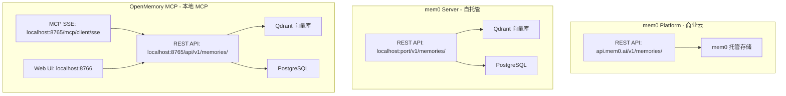
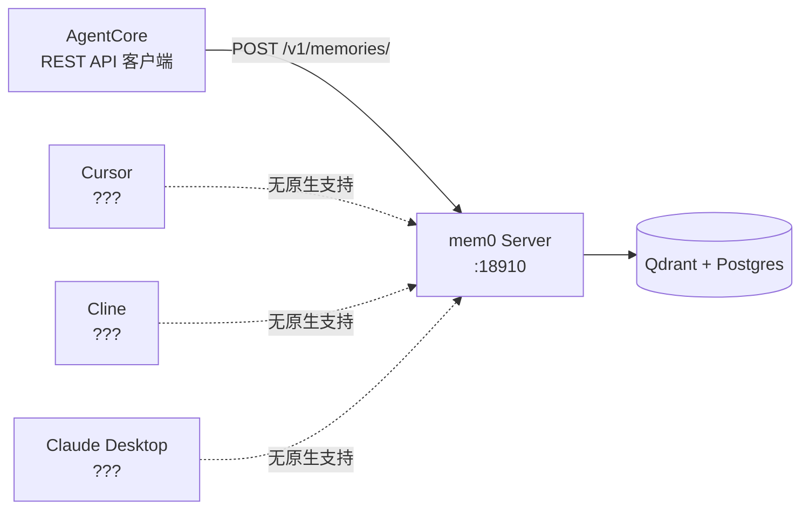
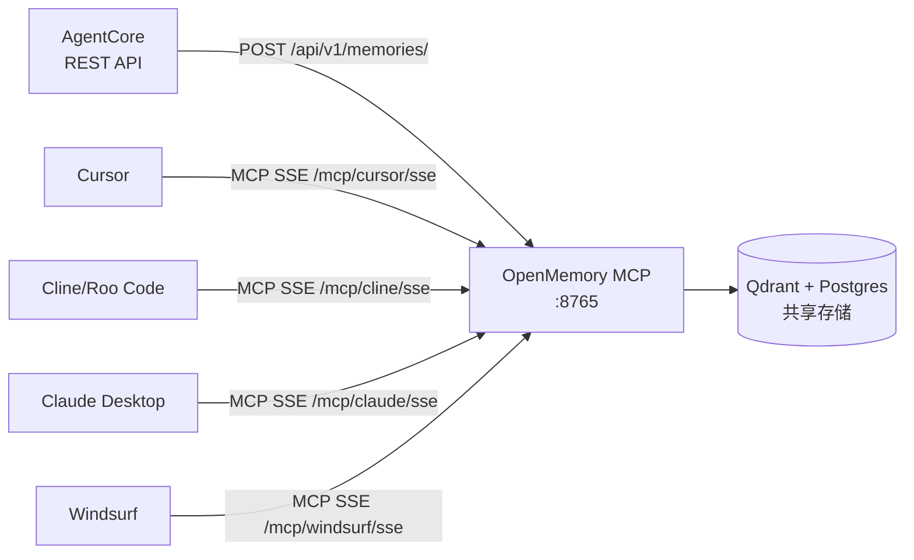
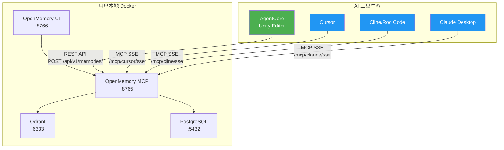

# mem0 Server vs OpenMemory MCP 部署选择分析

> **版本**: 1.0  
> **日期**: 2026-04-22  
> **适用项目**: AgentCore（Unity Editor AI Agent 插件）

---

## 🎯 结论先行

**推荐方案：双协议并行 — 保留 REST API + 部署 OpenMemory MCP**

| 维度 | mem0 Server (REST API) | OpenMemory MCP |
|------|----------------------|----------------|
| AgentCore 接入 | ✅ 已实现，零改动 | ❌ 需新增 MCP SSE 客户端 |
| 跨客户端共享 | ⚠️ 可行但需各客户端自行配置 REST | ✅ 原生支持，开箱即用 |
| IDE 生态兼容 | ❌ Cursor/Cline 不原生支持 REST 记忆 | ✅ Cursor/Cline/Claude Desktop 原生 MCP |
| 数据存储 | Qdrant + Postgres | Qdrant + Postgres（同一套） |
| 稳定性 | ✅ 成熟稳定 | ⚠️ 较新，偶有 unhealthy |

**核心结论**：OpenMemory MCP 容器**本身就包含 REST API 端点**，它是 mem0 Server 的超集。部署 OpenMemory MCP 后，AgentCore 可以继续用现有的 REST API 代码连接，同时 Cursor/Cline 等 IDE 通过 MCP 协议连接同一个记忆存储。**不需要二选一，而是一石二鸟。**

---

## 1. 架构对比

### 1.1 三种部署形态的本质



### 1.2 关键架构差异

| 特性 | mem0 Server | OpenMemory MCP |
|------|------------|----------------|
| **核心进程** | FastAPI 服务 | FastAPI 服务 + MCP SSE 适配层 |
| **协议** | 仅 REST API | REST API + MCP SSE 双协议 |
| **存储层** | Qdrant + Postgres | Qdrant + Postgres（完全相同） |
| **客户端追踪** | 无（仅 user_id 区分） | 有（按 client 名称追踪访问日志） |
| **Web UI** | 无 | 有（端口 8766，可视化管理） |
| **访问控制** | 基于 API Key | 基于 client 名称 + 访问日志审计 |
| **记忆状态管理** | 无 | 有（MemoryStatusHistory 表） |

### 1.3 存储层是否相同？

**是的，完全相同。** OpenMemory MCP 底层使用的就是 mem0 的核心库（`from mem0 import Memory`），存储层都是：
- **Qdrant**：向量存储，用于语义搜索
- **PostgreSQL**：关系型存储，用于记忆元数据、访问日志、状态历史

这意味着：如果你部署了 OpenMemory MCP，它的 REST API 端点（`/api/v1/memories/`）和 mem0 Server 的 REST API 是**API 兼容的**，因为底层调用的是同一个 mem0 Python 库。

### 1.4 能否同时部署两者共享存储？

**可以但不推荐。** 因为 OpenMemory MCP 已经同时暴露了两种协议：
- REST API（供 AgentCore 等 HTTP 客户端使用）
- MCP SSE（供 Cursor/Cline 等 MCP 客户端使用）

没有必要再单独部署一个 mem0 Server。

---

## 2. 跨客户端记忆共享分析

### 2.1 mem0 Server 的跨客户端共享



**问题**：
- mem0 Server 只提供 REST API
- Cursor、Cline、Claude Desktop **不原生支持**连接任意 REST API 作为记忆服务
- 这些 IDE 的记忆功能是通过 **MCP 协议** 实现的
- 要让 Cursor 连接 mem0 Server，需要写一个 MCP 适配器（这正是 OpenMemory MCP 做的事情）

**结论**：mem0 Server 理论上可以跨客户端共享（所有客户端都调同一个 REST API），但实际上主流 AI IDE 不支持直接连接 REST 记忆服务。

### 2.2 OpenMemory MCP 的跨客户端共享



**机制解析**：
- 每个客户端有独立的 MCP 端点（`/mcp/{client}/sse`），但这只是**访问入口不同**
- **记忆数据是共享的** — 所有客户端读写的是同一个 Qdrant + Postgres 存储
- `{client}` 参数的作用是**访问日志追踪**，记录哪个客户端在什么时候访问了哪条记忆
- 通过 `user_id` 实现用户级别的记忆隔离

**结论**：OpenMemory MCP 的跨客户端共享是**真正的共享** — 在 AgentCore 中存入的记忆，Cursor 和 Cline 可以立即检索到。

### 2.3 共享方案对比

| 维度 | mem0 Server | OpenMemory MCP |
|------|------------|----------------|
| 数据共享 | ✅ 同一存储 | ✅ 同一存储 |
| IDE 原生支持 | ❌ 需自行适配 | ✅ 开箱即用 |
| 访问追踪 | ❌ 无 | ✅ 按客户端追踪 |
| 配置复杂度 | 高（每个 IDE 需自定义） | 低（标准 MCP 配置） |
| 记忆可视化 | ❌ 无 | ✅ Web UI |

---

## 3. 生态兼容性

### 3.1 主流 AI IDE 的协议支持

| IDE/工具 | MCP 协议 | REST API 记忆 | OpenMemory 官方支持 |
|----------|---------|--------------|-------------------|
| **Cursor** | ✅ 原生 | ❌ | ✅ 官方配置 |
| **Claude Desktop** | ✅ 原生 | ❌ | ✅ 官方配置 |
| **Cline** | ✅ 原生 | ❌ | ✅ 官方配置 |
| **Roo Code** | ✅ 原生 | ❌ | ✅ 官方配置 |
| **Windsurf** | ✅ 原生 | ❌ | ✅ 官方配置 |
| **Witsy** | ✅ 原生 | ❌ | ✅ 官方配置 |
| **AgentCore** | ❌ 未实现 | ✅ 已实现 | ❌ 需适配 |

### 3.2 AgentCore 的特殊性

AgentCore 是 Unity Editor 插件，运行在 C# / .NET 环境中。与上述 IDE 不同：
- 上述 IDE 都是 **Node.js/Electron** 应用，MCP SDK 有成熟的 TypeScript/Python 实现
- AgentCore 是 **C# Unity Editor** 环境，没有官方 MCP C# SDK
- AgentCore 当前的 [`Mem0Client`](Editor/Tools/Cloud/Mem0Client.cs:95) 基于标准 HTTP REST API，实现简洁可靠

### 3.3 如果用 mem0 Server，IDE 能否直接连接？

**不能。** Cursor/Cline 等 IDE 的记忆功能是通过 MCP 协议实现的，它们不支持直接连接任意 REST API 端点。要让这些 IDE 使用 mem0 Server 的记忆，你需要：
1. 在 mem0 Server 前面加一个 MCP 适配层（这就是 OpenMemory MCP 做的事）
2. 或者为每个 IDE 写自定义插件（不现实）

### 3.4 如果用 OpenMemory MCP，AgentCore 需要什么？

**关键发现：什么都不需要改。**

OpenMemory MCP 容器同时暴露了 REST API 端点。AgentCore 只需要将 [`mem0Endpoint`](Editor/Config/AgentCoreSettings.cs:68) 配置指向 OpenMemory MCP 的 REST API 地址即可：

```
# 当前配置（指向独立 mem0 Server）
mem0Endpoint = http://localhost:18910

# 改为指向 OpenMemory MCP 的 REST API
mem0Endpoint = http://localhost:8765
```

现有的 [`Mem0Client.cs`](Editor/Tools/Cloud/Mem0Client.cs:95) 代码**完全不需要修改**，因为 OpenMemory MCP 的 REST API 与 mem0 Server 的 REST API 是兼容的。

---

## 4. 运维和稳定性

### 4.1 成熟度对比

| 维度 | mem0 Server | OpenMemory MCP |
|------|------------|----------------|
| **发布时间** | 2024 年初 | 2025 年 5 月 |
| **GitHub Stars** | mem0ai/mem0 ~25k+ | 同一仓库的子项目 |
| **Docker 镜像** | 成熟 | 较新，偶有 unhealthy |
| **社区活跃度** | 高 | 中等（快速增长中） |
| **文档质量** | 好 | 中等 |
| **生产就绪** | ✅ | ⚠️ 建议关注容器健康 |

### 4.2 已知问题

用户当前部署中 OpenMemory MCP 容器状态为 **unhealthy**，这是一个已知的常见问题：
- 通常是因为健康检查端点超时或依赖服务（Qdrant/Postgres）未就绪
- 解决方案：调整 `docker-compose.yml` 中的 `healthcheck` 配置，增加 `start_period` 和 `timeout`
- 这不影响实际功能，只是 Docker 的健康检查报告

### 4.3 运维建议

```yaml
# docker-compose.yml 健康检查优化建议
services:
  openmemory-mcp:
    healthcheck:
      test: ["CMD", "curl", "-f", "http://localhost:8765/health"]
      interval: 30s
      timeout: 10s
      retries: 5
      start_period: 60s  # 给足启动时间
```

---

## 5. 推荐方案

### 5.1 最终推荐：部署 OpenMemory MCP，AgentCore 继续用 REST API



### 5.2 为什么这是最优方案

1. **零代码改动**：AgentCore 现有的 [`Mem0Client.cs`](Editor/Tools/Cloud/Mem0Client.cs:95) 和 [`Mem0Tool.cs`](Editor/Tools/Cloud/Mem0Tool.cs:22) 完全不需要修改
2. **跨客户端共享**：Cursor/Cline/Claude Desktop 通过 MCP 协议原生连接，与 AgentCore 共享同一个记忆存储
3. **可视化管理**：OpenMemory UI（端口 8766）提供记忆的可视化查看、搜索、删除
4. **访问审计**：可以看到哪个客户端在什么时候访问了哪条记忆
5. **单一部署**：一个 `docker-compose up` 搞定所有服务

### 5.3 AgentCore 需要的改动

| 改动项 | 范围 | 说明 |
|--------|------|------|
| 配置端点 URL | 仅配置 | 将 `mem0Endpoint` 从 `http://localhost:18910` 改为 `http://localhost:8765` |
| API 路径适配 | 可能需要 | 验证 OpenMemory REST API 路径是否为 `/api/v1/memories/` 还是 `/v1/memories/`，如有差异需微调 [`Mem0Client.cs`](Editor/Tools/Cloud/Mem0Client.cs:172) 中的路径 |
| 代码改动 | 无或极少 | 如果 API 路径完全兼容，则零改动 |

### 5.4 各 IDE 的 MCP 配置示例

Cursor（`~/.cursor/mcp.json`）：
```json
{
  "mcpServers": {
    "openmemory": {
      "url": "http://localhost:8765/mcp/cursor/sse"
    }
  }
}
```

Cline/Roo Code（VS Code settings）：
```json
{
  "mcpServers": {
    "openmemory": {
      "url": "http://localhost:8765/mcp/cline/sse"
    }
  }
}
```

Claude Desktop（`claude_desktop_config.json`）：
```json
{
  "mcpServers": {
    "openmemory": {
      "url": "http://localhost:8765/mcp/claude/sse"
    }
  }
}
```

### 5.5 未来可选增强（非必须）

如果未来想让 AgentCore 也通过 MCP 协议连接（而非 REST API），需要：

| 工作项 | 复杂度 | 说明 |
|--------|--------|------|
| C# MCP SSE 客户端 | 中 | 实现 SSE 连接、JSON-RPC 2.0 消息解析 |
| MCP Tool 调用适配 | 低 | 将 memory_add/search/list/delete 映射为 MCP tool calls |
| 双协议切换 | 低 | Settings 中增加协议选择（REST/MCP） |

**但这不是必须的**，因为 REST API 已经能完美工作。只有在以下场景才值得考虑：
- 想要统一所有客户端的协议栈
- 想要利用 MCP 的客户端追踪功能（记录 AgentCore 的访问日志）

---

## 6. 回答用户的核心问题

### Q1: 部署 mem0 Server 还是 OpenMemory MCP 更好？

**OpenMemory MCP 更好。** 它是 mem0 Server 的超集：
- 包含 mem0 Server 的所有 REST API 功能
- 额外提供 MCP SSE 协议支持
- 额外提供 Web UI 管理界面
- 额外提供访问日志审计

### Q2: 跨客户端记忆共享是不是只有 OpenMemory MCP 能实现？

**从实际可行性来说，是的。** 虽然理论上 mem0 Server 也能实现（所有客户端都调同一个 REST API），但：
- Cursor/Cline/Claude Desktop 不原生支持连接 REST 记忆服务
- 这些 IDE 只支持 MCP 协议
- 所以实际上只有 OpenMemory MCP 能让这些 IDE 原生共享记忆

而 AgentCore 的特殊之处在于它是 C# 应用，可以直接调 REST API，所以它可以通过 OpenMemory MCP 的 REST API 端点接入，**不需要实现 MCP 客户端**。

---

## 7. 行动计划

### 立即执行（零代码改动）

- [ ] 修复 OpenMemory MCP 容器的 unhealthy 状态
- [ ] 验证 OpenMemory MCP 的 REST API 端点路径（`/v1/memories/` vs `/api/v1/memories/`）
- [ ] 将 AgentCore 的 `mem0Endpoint` 配置指向 OpenMemory MCP（`http://localhost:8765`）
- [ ] 测试 AgentCore 的 memory_add/search/list/delete 功能
- [ ] 配置 Cursor/Cline 的 MCP 连接
- [ ] 验证跨客户端记忆共享（AgentCore 存入 → Cursor 检索到）

### 可选优化（如 API 路径不兼容）

- [ ] 微调 `Mem0Client.cs` 中的 API 路径前缀
- [ ] 在 `AgentCoreSettings.cs` 中增加 API 路径前缀配置项

### 远期增强（非必须）

- [ ] 实现 C# MCP SSE 客户端（如果需要统一协议栈）
- [ ] 在 Settings 面板增加协议选择（REST/MCP）
