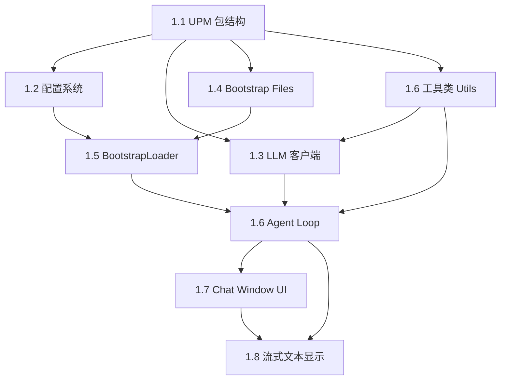

# Phase 1 实施计划：能对话

> **验收目标**：打开 Unity Editor → 菜单打开 AgentCore Chat Window → 输入"你好，介绍一下你自己" → 看到 LLM 流式回复 → 回复内容体现 SOUL.md 中定义的角色人设

## 任务依赖关系



## 执行顺序（按依赖拓扑排序）

### Step 1: UPM 包结构搭建（任务 1.1）

创建完整的 UPM 包骨架，所有后续文件都在此结构内。

**产出文件**：

| 文件 | 说明 |
|------|------|
| `Packages/com.agentcore.unity/package.json` | UPM 包描述，声明 unity-mcp 依赖 |
| `Packages/com.agentcore.unity/CHANGELOG.md` | 变更日志 |
| `Packages/com.agentcore.unity/LICENSE.md` | MIT 许可证 |
| `Packages/com.agentcore.unity/README.md` | 包说明 |
| `Packages/com.agentcore.unity/Editor/AgentCore.Editor.asmdef` | Editor 程序集定义，引用 unity-mcp asmdef |
| `Packages/com.agentcore.unity/Editor/Core/` | 空目录占位 |
| `Packages/com.agentcore.unity/Editor/LLM/` | 空目录占位 |
| `Packages/com.agentcore.unity/Editor/Config/` | 空目录占位 |
| `Packages/com.agentcore.unity/Editor/Bootstrap/` | 空目录占位 |
| `Packages/com.agentcore.unity/Editor/UI/` | 空目录占位 |
| `Packages/com.agentcore.unity/Editor/Utils/` | 空目录占位 |

**关键决策**：
- 包路径使用 `Packages/com.agentcore.unity/`（本地开发模式，直接在项目 Packages 目录下）
- `asmdef` 需要引用 unity-mcp 的 `MCPForUnity.Editor` 程序集（Phase 1 暂不直接调用，但提前配好引用避免后续改动）
- `package.json` 中 `dependencies` 声明 `com.coplaydev.unity-mcp` 和 `com.unity.nuget.newtonsoft-json`

---

### Step 2: 工具类（任务 1.1 补充）

基础工具类，被 LLM 客户端和 Agent Loop 依赖。

**产出文件**：

| 文件 | 说明 |
|------|------|
| `Editor/Utils/AsyncHelper.cs` | 异步→主线程桥接，`RunOnMainThread()`, `RunAsync()` |
| `Editor/Utils/JsonHelper.cs` | JSON 序列化工具，封装 Newtonsoft.Json 常用操作 |
| `Editor/Utils/HttpClientFactory.cs` | 单例 HttpClient 工厂，避免 socket 泄漏 |

**设计要点**：
- `AsyncHelper.RunOnMainThread()` 使用 `EditorApplication.delayCall`
- `HttpClientFactory` 返回共享的 `HttpClient` 实例，配置默认超时
- `JsonHelper` 封装 `JObject` 解析、序列化，统一错误处理

---

### Step 3: 配置系统（任务 1.2）

Settings Provider + ScriptableObject，Phase 1 只需 LLM 相关配置。

**产出文件**：

| 文件 | 说明 |
|------|------|
| `Editor/Config/AgentCoreSettings.cs` | `ScriptableSingleton<AgentCoreSettings>`，Phase 1 配置项 |
| `Editor/Config/SecureKeyStorage.cs` | API Key 安全存储（EditorPrefs） |
| `Editor/Config/AgentCoreSettingsProvider.cs` | Project Settings UI 面板 |

**Phase 1 配置项**（仅 LLM + Agent 行为 + Bootstrap + UI 偏好）：
- `llmEndpoint` — LLM API 地址
- `llmModel` — 模型名称
- `temperature` — 温度
- `maxTokens` — 最大 token 数
- `maxToolCallRounds` — 最大工具调用轮次（Phase 1 不用但预留）
- `bootstrapEnabled` — 是否启用 Bootstrap Files
- `streamingEnabled` — 是否启用流式输出
- `showToolCallDetails` — 是否显示工具调用详情（Phase 1 不用但预留）

**Settings UI**：Phase 1 只显示 LLM Configuration 分组 + Test Connection 按钮

---

### Step 4: LLM 客户端（任务 1.3）

OpenAI 兼容 API 客户端，支持流式和非流式两种模式。

**产出文件**：

| 文件 | 说明 |
|------|------|
| `Editor/LLM/ChatCompletionModels.cs` | 请求/响应数据模型（ChatMessage, ChatCompletionRequest, ChatCompletionResponse, ChatCompletionChunk, ToolCall 等） |
| `Editor/LLM/ILLMClient.cs` | LLM 客户端接口 |
| `Editor/LLM/StreamingResponseParser.cs` | SSE 流式解析器 |
| `Editor/LLM/OpenAICompatibleClient.cs` | OpenAI 兼容 API 实现 |

**设计要点**：
- `ILLMClient` 接口定义 `ChatCompletionAsync()` 和 `ChatCompletionStreamAsync()`
- `StreamingResponseParser` 解析 SSE `data:` 行，处理 `[DONE]` 信号
- 流式模式使用 `IAsyncEnumerable<StreamChunk>` 或回调模式（考虑 Unity 2021 兼容性，可能需要回调模式）
- `ChatCompletionModels` 包含完整的 OpenAI API 数据模型，包括 `tool_calls`（Phase 1 不解析但数据模型要完整）
- 支持 `CancellationToken` 取消

**Unity 2021 兼容性注意**：
- `IAsyncEnumerable` 需要 C# 8.0+，Unity 2021.3 支持
- 但需要 `System.Runtime.CompilerServices.AsyncIteratorMethodBuilder`，可能需要 polyfill
- **备选方案**：使用回调模式 `Action<StreamChunk>` 替代 `IAsyncEnumerable`

---

### Step 5: Bootstrap Files 系统（任务 1.4 + 1.5）

内置 Bootstrap 文件 + 加载器。

**产出文件**：

| 文件 | 说明 |
|------|------|
| `Editor/Bootstrap/Resources/SOUL.md` | 角色定义与核心原则（内置） |
| `Editor/Bootstrap/Resources/TOOLS.md.template` | 工具指南模板（Phase 1 简化版） |
| `Editor/Bootstrap/BootstrapContext.cs` | Bootstrap 上下文数据模型 |
| `Editor/Bootstrap/BootstrapLoader.cs` | Bootstrap 文件加载与编译 |
| `Editor/Bootstrap/ProjectContextCollector.cs` | 自动收集项目信息（Unity 版本、渲染管线等） |

**Phase 1 加载顺序**：
1. `SOUL.md` — 内置角色定义
2. `TOOLS.md` — 内置工具指南（Phase 1 简化版，无实际工具列表）
3. `PROJECT.md` — 自动生成的项目上下文
4. `MEMORY.md` — 用户本地知识文件（如果存在）
5. `USER.md` — 用户偏好文件（如果存在）

**BootstrapLoader 逻辑**：
- 读取内置资源文件（`TextAsset` 或直接文件读取）
- 调用 `ProjectContextCollector` 生成 PROJECT.md 内容
- 检查 `<ProjectRoot>/AgentCore/MEMORY.md` 和 `USER.md` 是否存在
- 拼接所有内容为完整的 System Prompt 字符串

---

### Step 6: Agent Loop 基础版（任务 1.6）

Phase 1 的 Agent Loop 是简化版：单轮对话，无工具调用，仅支持流式文本输出。

**产出文件**：

| 文件 | 说明 |
|------|------|
| `Editor/Core/MessageTypes.cs` | 消息数据模型（ChatMessage, ToolCallInfo, ToolCallResult, AgentError） |
| `Editor/Core/AgentLoop.cs` | Agent 循环调度器（Phase 1 简化版） |

**Phase 1 简化逻辑**：
```
用户发送消息
  → 如果是首轮，加载 Bootstrap Files 作为 system prompt
  → 追加 user message 到 messages 列表
  → 调用 LLM（流式模式）
  → 逐 token 触发 OnTokenReceived 事件
  → 完成后触发 OnMessageComplete 事件
  → 无 tool_calls 解析（Phase 2 实现）
```

**接口设计**：
- 实现 `IAgentLoop` 接口（架构文档 §4.1 定义）
- Phase 1 的 `RunAsync()` 不进入工具循环，直接返回 LLM 回复
- 保留 `OnToolCallStart` / `OnToolCallEnd` 事件定义但不触发

---

### Step 7: Chat Window 基础 UI（任务 1.7 + 1.8）

单会话对话窗口，使用 UI Toolkit。

**产出文件**：

| 文件 | 说明 |
|------|------|
| `Editor/UI/ChatWindow.cs` | 主对话窗口 EditorWindow |
| `Editor/UI/ChatWindow.uxml` | 窗口布局 |
| `Editor/UI/ChatWindow.uss` | 窗口样式 |
| `Editor/UI/Components/MessageBubble.cs` | 消息气泡组件 |
| `Editor/UI/Components/MessageBubble.uxml` | 消息气泡布局 |
| `Editor/UI/Components/MessageBubble.uss` | 消息气泡样式 |
| `Editor/UI/Components/StreamingTextElement.cs` | 流式文本显示组件 |

**UI 结构**（Phase 1 简化版）：
```
ChatWindow (EditorWindow)
├── 标题栏：AgentCore + 设置按钮
├── 消息列表区域（ScrollView）
│   ├── MessageBubble (user)
│   ├── MessageBubble (assistant) — 含 StreamingTextElement
│   └── ...
└── 输入区域
    ├── 文本输入框（TextField，多行）
    ├── 发送按钮
    └── 取消按钮（流式回复时显示）
```

**关键交互**：
- 菜单入口：`Window > AgentCore > Chat`（或 `Tools > AgentCore > Chat`）
- 发送消息：点击发送按钮或 Enter 键
- 取消回复：点击取消按钮，触发 `CancellationToken` 取消
- 流式显示：`StreamingTextElement` 接收 `OnTokenReceived` 事件，逐字追加文本
- 自动滚动：新消息或流式文本更新时自动滚动到底部
- 消息气泡区分 user/assistant 角色，不同背景色和对齐方式

**样式要点**：
- 深色主题适配 Unity Editor
- user 消息右对齐，assistant 消息左对齐
- 流式输出时显示闪烁光标效果（可选）

---

## 完整文件清单（Phase 1 共 22 个文件）

```text
Packages/com.agentcore.unity/
├── package.json
├── CHANGELOG.md
├── LICENSE.md
├── README.md
│
└── Editor/
    ├── AgentCore.Editor.asmdef
    │
    ├── Utils/
    │   ├── AsyncHelper.cs
    │   ├── JsonHelper.cs
    │   └── HttpClientFactory.cs
    │
    ├── Config/
    │   ├── AgentCoreSettings.cs
    │   ├── SecureKeyStorage.cs
    │   └── AgentCoreSettingsProvider.cs
    │
    ├── LLM/
    │   ├── ChatCompletionModels.cs
    │   ├── ILLMClient.cs
    │   ├── StreamingResponseParser.cs
    │   └── OpenAICompatibleClient.cs
    │
    ├── Bootstrap/
    │   ├── Resources/
    │   │   ├── SOUL.md
    │   │   └── TOOLS.md.template
    │   ├── BootstrapContext.cs
    │   ├── BootstrapLoader.cs
    │   └── ProjectContextCollector.cs
    │
    ├── Core/
    │   ├── MessageTypes.cs
    │   └── AgentLoop.cs
    │
    └── UI/
        ├── ChatWindow.cs
        ├── ChatWindow.uxml
        ├── ChatWindow.uss
        └── Components/
            ├── MessageBubble.cs
            ├── MessageBubble.uxml
            ├── MessageBubble.uss
            └── StreamingTextElement.cs
```

## 实施注意事项

### 1. Unity 版本兼容性
- 目标：Unity 2021.3+
- C# 版本：9.0（Unity 2021.3 默认）
- UI Toolkit：Unity 2021.3 内置，但部分 API 可能与 2022+ 不同
- `IAsyncEnumerable`：需要确认 Unity 2021.3 是否原生支持，否则用回调模式

### 2. asmdef 引用
- `AgentCore.Editor.asmdef` 需要引用：
  - `MCPForUnity.Editor`（unity-mcp 的 Editor 程序集）
  - `com.unity.nuget.newtonsoft-json`（Newtonsoft.Json）
- 需要确认 unity-mcp 的 asmdef 确切名称（从已安装包中查看）

### 3. 本地开发模式
- 包放在 `Packages/com.agentcore.unity/` 目录下
- Unity 会自动识别为本地包（embedded package）
- 不需要修改 `manifest.json`

### 4. 流式解析的 Unity 兼容性
- `HttpClient.SendAsync(HttpCompletionOption.ResponseHeadersRead)` 获取流
- `StreamReader.ReadLineAsync()` 逐行读取 SSE
- 需要在后台线程读取，通过 `EditorApplication.delayCall` 回调主线程更新 UI

### 5. Phase 1 不实现的功能（Phase 2+）
- 工具调用解析和执行
- 多会话标签页
- 会话持久化
- Markdown 渲染（Phase 1 纯文本显示）
- 工具调用卡片 UI
- 记忆服务集成
