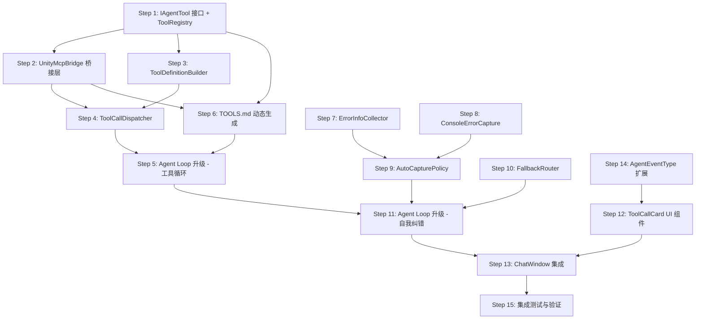
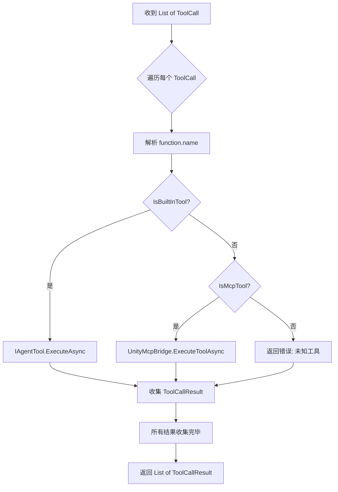
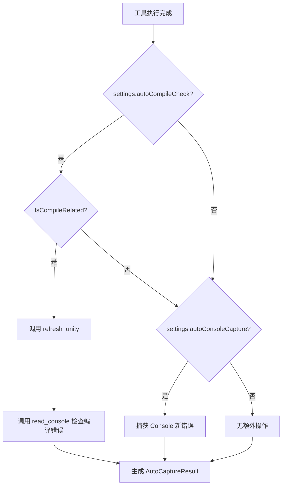

# Phase 2 实施计划：能做事（Tool Calling）

> **文档状态（2026-05-12 校准）**: 历史归档。Phase 2 Tool Calling 已完成并已在 Phase 2.5 迁移为原生工具；本文涉及 unity-mcp 的旧设计仅作历史参考，当前工具系统以 `Editor/Tools/` 实际源码为准。

> **目标**：让 Agent 能够调用 unity-mcp 工具操作 Unity Editor，实现"对话→思考→执行→反馈"的完整闭环。
>
> **前置条件**：Phase 1 已完成（LLM 对话、流式输出、Bootstrap 上下文、基础 UI）。
>
> **架构文档参考**：`plans/ARCHITECTURE.md` §4.1–§4.7

---

## 一、Phase 2 范围与目标

### 1.1 核心能力

| 能力 | 说明 |
|------|------|
| **工具注册与发现** | 从 unity-mcp `ToolDiscoveryService` 获取可用工具列表，转换为 OpenAI function calling 的 `ToolDefinition` 格式 |
| **Agent Loop 升级** | 从单轮对话升级为"循环直到最终回答"：`tool_calls → 执行 → tool message → 再次调用 LLM` |
| **工具执行** | 通过 `CommandRegistry.InvokeCommandAsync(commandName, params)` 调用 unity-mcp 工具 |
| **自我纠错（B1）** | 工具执行失败时，将错误信息作为 tool result 反馈给 LLM，让其自行修正 |
| **自动编译检查（B4）** | 脚本修改后自动触发 `refresh_unity` + `read_console` 检查编译错误 |
| **Console 错误捕获（B7）** | 每轮工具执行后自动捕获 Unity Console 错误 |
| **回退路由（B6）** | 配置驱动的恢复策略表，根据错误类型自动选择恢复动作 |
| **UI 扩展** | ToolCallCard 组件展示工具调用过程 |
| **TOOLS.md 动态生成** | 用实际可用工具列表填充 `{{ACTIVE_TOOLS_LIST}}` 占位符 |

### 1.2 不在 Phase 2 范围内

- 自建工具（IAgentTool）的完整实现（仅预留接口）
- 多 Agent 协作
- 会话持久化
- 高级 Memory / RAG 集成

---

## 二、Phase 1 已有基础设施分析

通过代码审查，Phase 1 已经预埋了大量 Phase 2 基础设施：

| 已有能力 | 所在文件 | 关键代码 |
|----------|----------|----------|
| `ToolDefinition` / `ToolCall` 数据模型 | [`ChatCompletionModels.cs`](Editor/LLM/ChatCompletionModels.cs) | `ToolDefinition`, `FunctionDefinition`, `ToolCall`, `FunctionCall` 类已完整定义 |
| LLM 客户端已支持 tools 参数 | [`ILLMClient.cs`](Editor/LLM/ILLMClient.cs:22) | `ChatCompletionAsync` 和 `ChatCompletionStreamAsync` 均接受 `List<ToolDefinition> tools` |
| 流式 tool_calls 累积 | [`OpenAICompatibleClient.cs`](Editor/LLM/OpenAICompatibleClient.cs:171) | `AccumulateToolCallDelta()` + `ToolCallBuilder` 已实现增量拼装 |
| StreamChunkType.ToolCallDelta | [`StreamingResponseParser.cs`](Editor/LLM/StreamingResponseParser.cs:90) | `ParseChunkJson()` 已处理 tool_call delta |
| AgentState.ExecutingTool | [`MessageTypes.cs`](Editor/Core/MessageTypes.cs:11) | 枚举值已定义 |
| ChatMessage.Tool() 工厂方法 | [`ChatCompletionModels.cs`](Editor/LLM/ChatCompletionModels.cs:139) | `Tool(toolCallId, content)` 已可用 |
| Phase 2 配置项预定义 | [`AgentCoreSettings.cs`](Editor/Config/AgentCoreSettings.cs) | `maxToolCallRounds=25`, `autoCompileCheck`, `autoConsoleCapture`, `fallbackRoutingEnabled`, `maxConsecutiveErrors=5`, `showToolCallDetails` |
| TOOLS.md 模板占位符 | [`TOOLS.md.template`](Editor/Bootstrap/Resources/TOOLS.md.template) | `{{ACTIVE_TOOLS_LIST}}` 已预留 |
| asmdef 已引用 unity-mcp | [`AgentCore.Editor.asmdef`](Editor/AgentCore.Editor.asmdef) | `"references": ["MCPForUnity.Editor"]` |

### unity-mcp 关键 API

| API | 签名 | 说明 |
|-----|------|------|
| 工具发现 | [`IToolDiscoveryService.DiscoverAllTools()`](../../Library/PackageCache/com.coplaydev.unity-mcp@a7c715fb1f/Editor/Services/IToolDiscoveryService.cs:44) | 返回 `List<ToolMetadata>`，含 Name, Description, Parameters |
| 工具调用 | [`CommandRegistry.InvokeCommandAsync(commandName, JObject)`](../../Library/PackageCache/com.coplaydev.unity-mcp@a7c715fb1f/Editor/Tools/CommandRegistry.cs:245) | 返回 `Task<object>`，支持同步/异步 handler |
| 响应格式 | [`SuccessResponse`](../../Library/PackageCache/com.coplaydev.unity-mcp@a7c715fb1f/Editor/Helpers/Response.cs:11) / [`ErrorResponse`](../../Library/PackageCache/com.coplaydev.unity-mcp@a7c715fb1f/Editor/Helpers/Response.cs:35) | `{success, message, data}` 或 `{success:false, error, code}` |
| 服务定位 | `MCPServiceLocator` | 获取 `IToolDiscoveryService` 实例 |

---

## 三、步骤拆分与依赖图

### 3.1 依赖关系图



### 3.2 步骤总览

| Step | 名称 | 新建/修改文件 | 依赖 |
|------|------|--------------|------|
| 1 | IAgentTool 接口 + ToolRegistry | 新建 2 文件 | 无 |
| 2 | UnityMcpBridge 桥接层 | 新建 1 文件 | Step 1 |
| 3 | ToolDefinitionBuilder | 新建 1 文件 | Step 1 |
| 4 | ToolCallDispatcher | 新建 1 文件 | Step 2, 3 |
| 5 | Agent Loop 升级 - 工具循环 | 修改 1 文件 | Step 4 |
| 6 | TOOLS.md 动态生成 | 修改 1 文件 | Step 1, 2 |
| 7 | ErrorInfoCollector | 新建 1 文件 | 无 |
| 8 | ConsoleErrorCapture | 新建 1 文件 | 无 |
| 9 | AutoCapturePolicy | 新建 1 文件 | Step 7, 8 |
| 10 | FallbackRouter | 新建 1 文件 | 无 |
| 11 | Agent Loop 升级 - 自我纠错 | 修改 1 文件 | Step 5, 9, 10 |
| 12 | ToolCallCard UI 组件 | 新建 3 文件 | Step 14 |
| 13 | ChatWindow 集成 | 修改 1 文件 | Step 11, 12 |
| 14 | AgentEventType 扩展 | 修改 1 文件 | 无 |
| 15 | 集成测试与验证 | 新建 1 文件 | 全部 |

---

## 四、各步骤详细设计

### Step 1：IAgentTool 接口 + ToolRegistry

**目标**：定义自建工具的统一接口和工具注册中心，作为双层工具架构的基础。

#### 文件清单

| 文件 | 操作 | 说明 |
|------|------|------|
| `Editor/Tools/IAgentTool.cs` | 新建 | 自建工具接口定义 |
| `Editor/Tools/ToolRegistry.cs` | 新建 | 工具注册中心，管理所有可用工具 |

#### 设计要点

**`IAgentTool.cs`**：

```
namespace AgentCore.Editor.Tools
{
    // 工具执行结果
    public class ToolResult
    {
        public bool Success { get; set; }
        public string Content { get; set; }      // 返回给 LLM 的文本
        public string ErrorMessage { get; set; }  // 错误信息
        public bool IsCompileRelated { get; set; } // 是否涉及脚本编译
    }

    // 自建工具接口 - Phase 2 仅预留，不实现具体工具
    public interface IAgentTool
    {
        string Name { get; }
        string Description { get; }
        JObject ParameterSchema { get; }  // JSON Schema
        Task<ToolResult> ExecuteAsync(JObject parameters, CancellationToken ct);
    }
}
```

**`ToolRegistry.cs`**：

```
public class ToolRegistry
{
    Dictionary<string, IAgentTool> _builtInTools;  // 自建工具
    List<ToolMetadata> _mcpTools;                   // unity-mcp 工具元数据缓存
    
    // 注册自建工具
    void RegisterTool(IAgentTool tool);
    
    // 刷新 unity-mcp 工具列表
    void RefreshMcpTools();
    
    // 获取所有可用工具名称
    List<string> GetAllToolNames();
    
    // 判断工具来源
    bool IsBuiltInTool(string name);
    bool IsMcpTool(string name);
    
    // 获取 unity-mcp 工具元数据
    ToolMetadata GetMcpToolMetadata(string name);
}
```

#### 关键决策

- `ToolRegistry` 是单例，在 [`AgentLoop.Initialize()`](Editor/Core/AgentLoop.cs:98) 中初始化
- unity-mcp 工具通过 `IToolDiscoveryService.DiscoverAllTools()` 获取，缓存在 `_mcpTools`
- 自建工具通过 `RegisterTool()` 手动注册（Phase 2 暂无具体实现）
- 工具名称全局唯一，自建工具优先级高于同名 mcp 工具

---

### Step 2：UnityMcpBridge 桥接层

**目标**：封装对 unity-mcp `CommandRegistry` 的调用，提供统一的异步执行接口和结果解析。

#### 文件清单

| 文件 | 操作 | 说明 |
|------|------|------|
| `Editor/Tools/UnityMcpBridge.cs` | 新建 | unity-mcp 工具调用桥接 |

#### 设计要点

```
public class UnityMcpBridge
{
    // 确保 CommandRegistry 已初始化
    void EnsureInitialized();
    
    // 调用 unity-mcp 工具，返回统一的 ToolResult
    async Task<ToolResult> ExecuteToolAsync(
        string commandName, 
        JObject parameters, 
        CancellationToken ct
    );
    
    // 解析 unity-mcp 响应为 ToolResult
    // 处理 SuccessResponse / ErrorResponse / PendingResponse / 原始 object
    ToolResult ParseResponse(object rawResult, string commandName);
    
    // 判断命令是否涉及脚本修改
    // 匹配: manage_script, create_script, execute_code 等
    bool IsScriptModifyingCommand(string commandName);
}
```

#### 关键实现细节

1. **调用路径**：`UnityMcpBridge.ExecuteToolAsync()` → `CommandRegistry.InvokeCommandAsync(commandName, params)`
2. **响应解析**：
   - `rawResult` 可能是 `SuccessResponse`（`success=true, message, data`）
   - 可能是 `ErrorResponse`（`success=false, error`）
   - 可能是 `PendingResponse`（异步轮询场景，Phase 2 暂不处理轮询）
   - 可能是原始 `object`（直接序列化为 JSON 字符串）
3. **异常处理**：`CommandRegistry` 抛出 `InvalidOperationException`（未知命令）需捕获并转为 `ToolResult.Success=false`
4. **脚本修改检测**：维护一个命令名白名单 `{"manage_script", "create_script", "delete_script", "execute_code", "script_apply_edits", "apply_text_edits"}`，匹配时设置 `ToolResult.IsCompileRelated = true`

---

### Step 3：ToolDefinitionBuilder

**目标**：将 `ToolMetadata`（unity-mcp 格式）和 `IAgentTool`（自建格式）统一转换为 OpenAI function calling 的 `ToolDefinition` 格式。

#### 文件清单

| 文件 | 操作 | 说明 |
|------|------|------|
| `Editor/Tools/ToolDefinitionBuilder.cs` | 新建 | 工具定义构建器 |

#### 设计要点

```
public static class ToolDefinitionBuilder
{
    // 从 ToolRegistry 构建所有工具的 ToolDefinition 列表
    static List<ToolDefinition> BuildAll(ToolRegistry registry);
    
    // 从 unity-mcp ToolMetadata 构建单个 ToolDefinition
    static ToolDefinition FromMcpMetadata(ToolMetadata metadata);
    
    // 从 IAgentTool 构建单个 ToolDefinition
    static ToolDefinition FromAgentTool(IAgentTool tool);
    
    // 将 ParameterMetadata 列表转换为 JSON Schema JObject
    // 生成 {type: object, properties: {...}, required: [...]}
    static JObject BuildParameterSchema(List<ParameterMetadata> parameters);
    
    // 类型映射: ParameterMetadata.Type -> JSON Schema type
    static string MapParameterType(string mcpType);
}
```

#### 类型映射表

| ParameterMetadata.Type | JSON Schema type |
|----------------------|------------------|
| `"string"` | `"string"` |
| `"integer"` | `"integer"` |
| `"number"` / `"float"` / `"double"` | `"number"` |
| `"boolean"` / `"bool"` | `"boolean"` |
| `"object"` / `"json"` | `"object"` |
| `"array"` | `"array"` |

#### 关键决策

- `ToolDefinition.Function.Parameters` 使用 `JObject` 类型（已在 [`ChatCompletionModels.cs`](Editor/LLM/ChatCompletionModels.cs:86) 中定义）
- 对于没有 Parameters 嵌套类的 unity-mcp 工具，生成空 schema `{type: "object", properties: {}}`
- Description 截断到 1024 字符以符合 OpenAI API 限制

---

### Step 4：ToolCallDispatcher

**目标**：接收 LLM 返回的 `ToolCall` 列表，分发到正确的执行路径（自建工具 or unity-mcp 桥接），收集结果。

#### 文件清单

| 文件 | 操作 | 说明 |
|------|------|------|
| `Editor/Tools/ToolCallDispatcher.cs` | 新建 | 工具调用分发器 |

#### 设计要点

```
public class ToolCallDispatcher
{
    ToolRegistry _registry;
    UnityMcpBridge _mcpBridge;
    
    // 执行一批 tool_calls，返回对应的 ChatMessage 列表
    async Task<List<ToolCallResult>> DispatchAsync(
        List<ToolCall> toolCalls, 
        CancellationToken ct
    );
    
    // 执行单个 tool_call
    async Task<ToolCallResult> ExecuteSingleAsync(
        ToolCall toolCall, 
        CancellationToken ct
    );
}

// 单个工具调用的结果
public class ToolCallResult
{
    public string ToolCallId { get; set; }
    public string ToolName { get; set; }
    public ToolResult Result { get; set; }
    
    // 转换为 ChatMessage.Tool() 格式
    public ChatMessage ToChatMessage();
}
```

#### 执行流程



#### 关键决策

- 工具调用**串行执行**（Unity Editor 不支持并行操作场景对象）
- 每个 `ToolCall.Function.Arguments` 是 JSON 字符串，需 `JObject.Parse()` 解析
- 解析失败时返回 `ToolResult{Success=false, ErrorMessage="Invalid JSON arguments"}`
- `ToolCallResult.ToChatMessage()` 调用 `ChatMessage.Tool(toolCallId, result.Content)`

---

### Step 5：Agent Loop 升级 - 工具循环

**目标**：将 [`AgentLoop.SendMessageAsync()`](Editor/Core/AgentLoop.cs:153) 从单轮对话升级为支持工具调用的多轮循环。

#### 文件清单

| 文件 | 操作 | 说明 |
|------|------|------|
| `Editor/Core/AgentLoop.cs` | 修改 | 核心循环升级 |

#### 当前代码结构（Phase 1）

```
SendMessageAsync(userMessage):
    1. 添加 user message
    2. 调用 LLM（流式）
    3. 返回 assistant message
```

#### 升级后结构

```
SendMessageAsync(userMessage):
    1. 添加 user message
    2. toolRound = 0
    3. LOOP:
       a. 调用 LLM（流式），传入 tools 列表
       b. 获取 assistant message
       c. IF assistant.ToolCalls 为空 → 最终回答，退出循环
       d. IF toolRound >= maxToolCallRounds → 强制退出，提示超限
       e. 添加 assistant message 到历史
       f. SetState(ExecutingTool)
       g. EmitEvent(ToolCallsReceived)
       h. 遍历 tool_calls:
          - EmitEvent(ToolExecutionStarted)
          - dispatcher.ExecuteSingleAsync(toolCall)
          - EmitEvent(ToolExecutionCompleted)
          - 添加 tool message 到历史
       i. toolRound++
       j. GOTO 3a
    4. 添加最终 assistant message
```

#### 关键修改点

1. **构造函数注入**：新增 `ToolCallDispatcher` 和 `ToolRegistry` 依赖
2. **`Initialize()` 扩展**：初始化 `ToolRegistry`，调用 `RefreshMcpTools()`
3. **tools 参数传递**：`_llmClient.ChatCompletionStreamAsync()` 调用时传入 `ToolDefinitionBuilder.BuildAll(_registry)`
4. **`OnStreamChunkReceived` 修改**：移除 Phase 1 的 "不处理" 注释，改为通过事件通知 UI 显示 tool_call 进度
5. **循环退出条件**：
   - `assistant.ToolCalls == null || assistant.ToolCalls.Count == 0` → 正常退出
   - `toolRound >= settings.maxToolCallRounds` → 超限退出
   - `CancellationToken.IsCancellationRequested` → 用户取消

#### 伪代码

```csharp
public async Task SendMessageAsync(string userMessage)
{
    // ... 前置检查、添加 user message ...
    
    var tools = ToolDefinitionBuilder.BuildAll(_registry);
    int toolRound = 0;
    
    while (true)
    {
        ct.ThrowIfCancellationRequested();
        SetState(AgentState.Thinking);
        
        var assistantMsg = await _llmClient.ChatCompletionStreamAsync(
            _messages, onChunk, ct, tools);
        
        // 无 tool_calls → 最终回答
        if (!assistantMsg.HasToolCalls())
        {
            FinalizeResponse(assistantMsg);
            break;
        }
        
        // 超限检查
        if (++toolRound > _settings.maxToolCallRounds)
        {
            EmitEvent(AgentEvent.ErrorEvent("工具调用轮次超限"));
            break;
        }
        
        // 执行工具
        _messages.Add(assistantMsg);
        SetState(AgentState.ExecutingTool);
        
        var results = await _dispatcher.DispatchAsync(
            assistantMsg.ToolCalls, ct);
        
        foreach (var result in results)
        {
            _messages.Add(result.ToChatMessage());
            EmitEvent(AgentEvent.ToolExecutionCompleted(...));
        }
    }
}
```

---

### Step 6：TOOLS.md 动态生成

**目标**：在 Bootstrap 阶段用实际可用工具列表替换 [`TOOLS.md.template`](Editor/Bootstrap/Resources/TOOLS.md.template) 中的 `{{ACTIVE_TOOLS_LIST}}` 占位符。

#### 文件清单

| 文件 | 操作 | 说明 |
|------|------|------|
| `Editor/Bootstrap/BootstrapLoader.cs` | 修改 | 扩展模板渲染逻辑 |

#### 设计要点

```
// 在 BootstrapLoader 中新增方法
string RenderToolsList(ToolRegistry registry)
{
    var sb = new StringBuilder();
    
    // unity-mcp 工具
    foreach (var name in registry.GetAllToolNames())
    {
        if (registry.IsMcpTool(name))
        {
            var meta = registry.GetMcpToolMetadata(name);
            sb.AppendLine($"- **{name}**: {meta.Description}");
        }
    }
    
    // 自建工具（Phase 2 暂无）
    // ...
    
    return sb.ToString();
}
```

#### 关键决策

- 工具列表按分组排列（core, animation, vfx, ui 等）
- 每个工具显示名称和简短描述
- 模板渲染在 `AgentLoop.Initialize()` 中调用，确保 `ToolRegistry` 已就绪
- 工具列表变化时（如用户在 unity-mcp 中启用/禁用工具），需重新渲染

---

### Step 7：ErrorInfoCollector

**目标**：收集工具执行过程中的错误信息，为自我纠错提供结构化数据。

#### 文件清单

| 文件 | 操作 | 说明 |
|------|------|------|
| `Editor/Core/ErrorInfoCollector.cs` | 新建 | 错误信息收集器 |

#### 设计要点

```
public class ErrorInfoCollector
{
    // 错误记录
    public class ErrorRecord
    {
        public string ToolName { get; set; }
        public string ToolCallId { get; set; }
        public string ErrorMessage { get; set; }
        public string ErrorCategory { get; set; }  // compile, runtime, not_found, timeout, unknown
        public DateTime Timestamp { get; set; }
        public int RoundNumber { get; set; }
    }
    
    List<ErrorRecord> _errors;
    
    // 记录错误
    void RecordError(ToolCallResult result, int roundNumber);
    
    // 获取连续错误计数（同一类别）
    int GetConsecutiveErrorCount(string category);
    
    // 获取当前轮次的所有错误
    List<ErrorRecord> GetCurrentRoundErrors(int roundNumber);
    
    // 判断是否应触发回退
    bool ShouldTriggerFallback(AgentCoreSettings settings);
    
    // 重置（新对话时）
    void Reset();
}
```

#### 错误分类规则

| 类别 | 匹配条件 |
|------|----------|
| `compile` | `ToolResult.IsCompileRelated && !Success` 或 Console 中有 `CompilerError` |
| `runtime` | 工具执行抛出异常 |
| `not_found` | `CommandRegistry` 抛出 `InvalidOperationException`（未知命令） |
| `timeout` | `OperationCanceledException` 且非用户取消 |
| `unknown` | 其他所有错误 |

---

### Step 8：ConsoleErrorCapture

**目标**：在每轮工具执行后自动捕获 Unity Console 中的错误和警告。

#### 文件清单

| 文件 | 操作 | 说明 |
|------|------|------|
| `Editor/Core/ConsoleErrorCapture.cs` | 新建 | Console 错误捕获 |

#### 设计要点

```
public class ConsoleErrorCapture
{
    // 捕获自上次检查以来的新错误
    // 使用 unity-mcp 的 read_console 工具
    async Task<List<ConsoleEntry>> CaptureNewErrorsAsync(CancellationToken ct);
    
    // 格式化为 LLM 可读的文本
    string FormatForLLM(List<ConsoleEntry> entries);
    
    // 标记当前时间点（用于增量捕获）
    void MarkCheckpoint();
}

public class ConsoleEntry
{
    public string Type { get; set; }     // error, warning, log
    public string Message { get; set; }
    public string StackTrace { get; set; }
}
```

#### 实现方式

- 通过 `CommandRegistry.InvokeCommandAsync("read_console", params)` 调用 unity-mcp 的 read_console 工具
- 参数：`{types: ["error", "warning"], count: 20}`
- 使用时间戳过滤，只返回上次检查点之后的新条目
- 格式化输出示例：
  ```
  [Unity Console Errors Detected]
  - ERROR: Assets/Scripts/Player.cs(42,13): CS1002; expected
  - WARNING: Shader 'Custom/MyShader' has errors
  ```

---

### Step 9：AutoCapturePolicy

**目标**：定义自动捕获策略，决定何时触发编译检查和 Console 错误捕获。

#### 文件清单

| 文件 | 操作 | 说明 |
|------|------|------|
| `Editor/Core/AutoCapturePolicy.cs` | 新建 | 自动捕获策略 |

#### 设计要点

```
public class AutoCapturePolicy
{
    ErrorInfoCollector _errorCollector;
    ConsoleErrorCapture _consoleCapture;
    AgentCoreSettings _settings;
    
    // 在工具执行后调用，决定是否需要额外操作
    async Task<AutoCaptureResult> EvaluateAfterToolExecution(
        ToolCallResult result,
        CancellationToken ct
    );
}

public class AutoCaptureResult
{
    // 是否需要自动编译检查
    public bool NeedsCompileCheck { get; set; }
    
    // 编译检查结果（如果执行了）
    public ToolResult CompileCheckResult { get; set; }
    
    // 捕获到的 Console 错误
    public List<ConsoleEntry> ConsoleErrors { get; set; }
    
    // 需要追加到对话的额外 tool messages
    public List<ChatMessage> AdditionalMessages { get; set; }
}
```

#### 策略规则



#### 关键决策

- 自动编译检查通过 `UnityMcpBridge` 调用 `refresh_unity` 命令（`{compile: "request", wait_for_ready: true}`）
- 编译检查后等待 Unity 编译完成再读取 Console
- Console 错误作为额外的 system/tool message 追加到对话历史
- 如果编译成功且无错误，不追加任何消息（避免噪音）

---

### Step 10：FallbackRouter

**目标**：根据错误类型和连续错误次数，自动选择恢复策略。

#### 文件清单

| 文件 | 操作 | 说明 |
|------|------|------|
| `Editor/Core/FallbackRouter.cs` | 新建 | 回退路由器 |

#### 设计要点

```
public class FallbackRouter
{
    // 回退策略
    public enum FallbackAction
    {
        Continue,           // 继续正常流程（错误已作为 tool result 反馈）
        InjectHint,         // 注入提示消息引导 LLM
        ForceStop,          // 强制停止循环
        ResetAndRetry       // 重置上下文并重试（Phase 3）
    }
    
    public class FallbackDecision
    {
        public FallbackAction Action { get; set; }
        public string HintMessage { get; set; }  // InjectHint 时的提示内容
        public string Reason { get; set; }
    }
    
    // 根据错误信息决定回退策略
    FallbackDecision Evaluate(
        ErrorInfoCollector collector,
        AgentCoreSettings settings
    );
}
```

#### 策略表

| 错误类别 | 连续次数 | 动作 | 提示内容 |
|----------|----------|------|----------|
| `compile` | 1-2 | Continue | — |
| `compile` | 3+ | InjectHint | "编译错误已连续出现 N 次，请仔细检查语法和引用" |
| `compile` | 5+ | ForceStop | "编译错误无法自动修复，请人工介入" |
| `runtime` | 1-2 | Continue | — |
| `runtime` | 3+ | InjectHint | "运行时错误反复出现，请尝试不同的方法" |
| `not_found` | 1 | InjectHint | "工具 X 不存在，请使用可用工具列表中的工具" |
| `not_found` | 2+ | ForceStop | "多次调用不存在的工具" |
| `timeout` | 1 | Continue | — |
| `timeout` | 2+ | ForceStop | "操作超时" |
| 任意 | >= maxConsecutiveErrors | ForceStop | "连续错误次数超限" |

---

### Step 11：Agent Loop 升级 - 自我纠错

**目标**：在 Step 5 的工具循环基础上，集成错误收集、自动捕获和回退路由。

#### 文件清单

| 文件 | 操作 | 说明 |
|------|------|------|
| `Editor/Core/AgentLoop.cs` | 修改 | 集成自我纠错机制 |

#### 在 Step 5 循环中的插入点

```
LOOP 每轮工具执行后:
    1. 执行 tool_calls → 获取 results
    2. [NEW] 遍历 results:
       a. 如果 result.Success == false:
          - errorCollector.RecordError(result, roundNumber)
       b. autoCapture.EvaluateAfterToolExecution(result)
          - 如果有额外 messages → 追加到 _messages
    3. [NEW] fallbackRouter.Evaluate(errorCollector, settings):
       a. Continue → 正常继续
       b. InjectHint → 追加 system message 到 _messages
       c. ForceStop → 退出循环，通知用户
    4. 添加 tool messages 到 _messages
    5. 继续下一轮 LLM 调用
```

#### 关键决策

- 错误信息始终作为 `ChatMessage.Tool()` 返回给 LLM（B1 自我纠错核心）
- `InjectHint` 使用 `ChatMessage.System()` 或 `ChatMessage.User()` 注入（取决于模型支持）
- `ForceStop` 时生成一条最终的 assistant message 说明原因
- `ErrorInfoCollector` 在 `ResetConversation()` 时重置

---

### Step 14：AgentEventType 扩展

**目标**：扩展事件系统以支持工具调用相关的 UI 通知。

> **注意**：此步骤编号为 14 但应在 Step 12 之前实现，因为 ToolCallCard 依赖这些事件类型。

#### 文件清单

| 文件 | 操作 | 说明 |
|------|------|------|
| `Editor/Core/MessageTypes.cs` | 修改 | 扩展事件类型 |

#### 新增事件类型

```csharp
public enum AgentEventType
{
    // ... 已有 ...
    StateChanged,
    StreamToken,
    AssistantMessage,
    Error,
    ConversationReset,
    
    // Phase 2 新增
    ToolCallsReceived,        // LLM 返回了 tool_calls
    ToolExecutionStarted,     // 单个工具开始执行
    ToolExecutionCompleted,   // 单个工具执行完成
    ToolRoundCompleted,       // 一轮工具调用全部完成
    AutoCaptureResult,        // 自动捕获结果
}
```

#### 新增 AgentEvent 工厂方法

```csharp
public class AgentEvent
{
    // ... 已有字段 ...
    
    // Phase 2 新增字段
    public List<ToolCall> ToolCalls { get; set; }
    public ToolCallResult ToolCallResult { get; set; }
    public int ToolRound { get; set; }
    
    // 工厂方法
    public static AgentEvent ToolCallsReceived(List<ToolCall> calls, int round);
    public static AgentEvent ToolExecutionStarted(string toolName, string toolCallId);
    public static AgentEvent ToolExecutionCompleted(ToolCallResult result);
    public static AgentEvent ToolRoundCompleted(int round, int totalCalls);
}
```

---

### Step 12：ToolCallCard UI 组件

**目标**：创建可折叠的工具调用卡片组件，展示工具名称、参数、执行状态和结果。

#### 文件清单

| 文件 | 操作 | 说明 |
|------|------|------|
| `Editor/UI/Components/ToolCallCard.cs` | 新建 | 工具调用卡片逻辑 |
| `Editor/UI/Components/ToolCallCard.uxml` | 新建 | 卡片布局 |
| `Editor/UI/Components/ToolCallCard.uss` | 新建 | 卡片样式 |

#### 设计要点

**视觉结构**：

```
┌─────────────────────────────────────┐
│ 🔧 manage_gameobject          ▼ ⏳  │  ← 标题栏（可折叠）
├─────────────────────────────────────┤
│ Parameters:                         │  ← 折叠区域
│   action: "create"                  │
│   name: "Player"                    │
│   position: [0, 1, 0]              │
├─────────────────────────────────────┤
│ Result: ✅ Success                  │
│   Created GameObject 'Player'       │
│   at position (0, 1, 0)            │
└─────────────────────────────────────┘
```

**`ToolCallCard.cs`**：

```
public class ToolCallCard : VisualElement
{
    // 状态
    enum CardState { Pending, Executing, Success, Failed }
    
    // 设置工具调用信息
    void SetToolCall(string toolName, string arguments);
    
    // 更新执行状态
    void SetExecuting();
    void SetCompleted(ToolCallResult result);
    
    // 折叠/展开
    void ToggleDetails();
    
    // 是否显示详情（受 settings.showToolCallDetails 控制）
    bool ShowDetails { get; set; }
}
```

#### 样式要点

- 使用 Unity Editor 风格的颜色方案
- 成功：绿色边框/图标，失败：红色边框/图标
- 执行中：旋转动画或脉冲效果
- 默认折叠参数和结果详情，点击展开
- 参数和结果使用等宽字体显示 JSON

---

### Step 13：ChatWindow 集成

**目标**：将工具调用 UI 集成到 [`ChatWindow`](Editor/UI/ChatWindow.cs:23)，处理新的事件类型。

#### 文件清单

| 文件 | 操作 | 说明 |
|------|------|------|
| `Editor/UI/ChatWindow.cs` | 修改 | 集成工具调用 UI |

#### 修改要点

1. **`InitializeAgentLoop()` 修改**：
   - 创建 `ToolRegistry`、`UnityMcpBridge`、`ToolCallDispatcher`
   - 注入到 `AgentLoop` 构造函数

2. **`HandleAgentEvent()` 扩展**：
   ```
   case ToolCallsReceived:
       // 在当前 assistant bubble 下方插入 ToolCallCard 容器
       CreateToolCallCards(evt.ToolCalls);
       break;
       
   case ToolExecutionStarted:
       // 更新对应 ToolCallCard 状态为 Executing
       UpdateToolCallCard(evt.ToolCallId, CardState.Executing);
       break;
       
   case ToolExecutionCompleted:
       // 更新对应 ToolCallCard 状态为 Success/Failed
       UpdateToolCallCard(evt.ToolCallResult);
       break;
       
   case ToolRoundCompleted:
       // 可选：显示轮次分隔线
       break;
   ```

3. **`UpdateUIState()` 扩展**：
   - `ExecutingTool` 状态：显示 "执行工具中..." + 当前工具名称
   - 状态栏显示当前轮次信息："工具调用 第 2/25 轮"

4. **ToolCallCard 容器管理**：
   - 使用 `Dictionary<string, ToolCallCard> _toolCallCards` 按 toolCallId 索引
   - 每轮工具调用创建新的卡片组
   - 卡片插入到消息流中 assistant bubble 和下一条消息之间

---

### Step 15：集成测试与验证

**目标**：创建端到端验证清单和测试辅助脚本。

#### 文件清单

| 文件 | 操作 | 说明 |
|------|------|------|
| `Editor/Tests/Phase2ValidationHelper.cs` | 新建 | 验证辅助工具 |

#### 验证场景

| # | 场景 | 验证点 |
|---|------|--------|
| V1 | 基础工具调用 | 发送 "创建一个名为 TestCube 的立方体"，验证 Agent 调用 `manage_gameobject` 并成功创建 |
| V2 | 多轮工具调用 | 发送 "创建一个红色球体并放在 (0,3,0)"，验证 Agent 依次调用 create + set_material |
| V3 | 工具调用失败自我纠错 | 发送 "删除名为 NonExistent 的对象"，验证 Agent 收到错误后给出合理回复 |
| V4 | 编译错误自动检测 | 发送 "创建一个有语法错误的脚本"，验证自动编译检查和错误反馈 |
| V5 | 超限保护 | 设置 maxToolCallRounds=2，发送复杂任务，验证超限后正确停止 |
| V6 | 取消操作 | 工具执行中点击取消，验证正确中断 |
| V7 | UI 显示 | 验证 ToolCallCard 正确显示工具名、参数、状态、结果 |
| V8 | Console 错误捕获 | 手动在 Console 制造错误，验证 Agent 能感知 |
| V9 | 回退路由 | 连续触发同类错误，验证 InjectHint 和 ForceStop 行为 |
| V10 | TOOLS.md 生成 | 验证 Bootstrap 上下文中包含实际工具列表 |

---

## 五、完整文件清单

### 新建文件（11 个）

| 文件路径 | 说明 | Step |
|----------|------|------|
| `Editor/Tools/IAgentTool.cs` | 自建工具接口 + ToolResult | 1 |
| `Editor/Tools/ToolRegistry.cs` | 工具注册中心 | 1 |
| `Editor/Tools/UnityMcpBridge.cs` | unity-mcp 桥接层 | 2 |
| `Editor/Tools/ToolDefinitionBuilder.cs` | 工具定义构建器 | 3 |
| `Editor/Tools/ToolCallDispatcher.cs` | 工具调用分发器 | 4 |
| `Editor/Core/ErrorInfoCollector.cs` | 错误信息收集器 | 7 |
| `Editor/Core/ConsoleErrorCapture.cs` | Console 错误捕获 | 8 |
| `Editor/Core/AutoCapturePolicy.cs` | 自动捕获策略 | 9 |
| `Editor/Core/FallbackRouter.cs` | 回退路由器 | 10 |
| `Editor/UI/Components/ToolCallCard.cs` | 工具调用卡片 | 12 |
| `Editor/UI/Components/ToolCallCard.uxml` | 卡片布局 | 12 |

### 新建文件（续）

| 文件路径 | 说明 | Step |
|----------|------|------|
| `Editor/UI/Components/ToolCallCard.uss` | 卡片样式 | 12 |
| `Editor/Tests/Phase2ValidationHelper.cs` | 验证辅助 | 15 |

### 修改文件（4 个）

| 文件路径 | 修改内容 | Step |
|----------|----------|------|
| `Editor/Core/AgentLoop.cs` | 工具循环 + 自我纠错 | 5, 11 |
| `Editor/Core/MessageTypes.cs` | 新增事件类型 | 14 |
| `Editor/Bootstrap/BootstrapLoader.cs` | TOOLS.md 动态生成 | 6 |
| `Editor/UI/ChatWindow.cs` | 工具调用 UI 集成 | 13 |

---

## 六、实施顺序建议

基于依赖关系，推荐以下实施顺序（可并行的步骤用 `||` 标记）：

```
第一批（基础层，无依赖）：
  Step 1  → IAgentTool + ToolRegistry
  Step 14 → AgentEventType 扩展
  Step 7  → ErrorInfoCollector          ← 可与 Step 1 并行
  Step 8  → ConsoleErrorCapture         ← 可与 Step 1 并行
  Step 10 → FallbackRouter              ← 可与 Step 1 并行

第二批（桥接层，依赖 Step 1）：
  Step 2  → UnityMcpBridge
  Step 3  → ToolDefinitionBuilder

第三批（调度层，依赖 Step 2+3）：
  Step 4  → ToolCallDispatcher
  Step 6  → TOOLS.md 动态生成

第四批（核心循环，依赖 Step 4）：
  Step 5  → Agent Loop 工具循环

第五批（纠错层，依赖 Step 5+7+8+10）：
  Step 9  → AutoCapturePolicy
  Step 11 → Agent Loop 自我纠错

第六批（UI 层，依赖 Step 14）：
  Step 12 → ToolCallCard UI 组件

第七批（集成层，依赖 Step 11+12）：
  Step 13 → ChatWindow 集成

第八批（验证）：
  Step 15 → 集成测试与验证
```

---

## 七、关键技术挑战与解决方案

### 7.1 unity-mcp 工具发现时机

**挑战**：`ToolDiscoveryService` 依赖 `MCPServiceLocator`，需要确保 unity-mcp 已完成初始化。

**方案**：
- 在 `ToolRegistry.RefreshMcpTools()` 中使用 `try-catch` 包裹
- 如果 `MCPServiceLocator` 未就绪，记录警告并返回空列表
- 提供 `RefreshMcpTools()` 方法供后续重试
- 在 `AgentLoop.Initialize()` 中调用，此时 Editor 通常已完成初始化

### 7.2 工具参数 Schema 完整性

**挑战**：unity-mcp 的 `ToolMetadata.Parameters` 可能不完整（部分工具没有 Parameters 嵌套类）。

**方案**：
- 对于无参数信息的工具，生成 `{type: "object", properties: {}, additionalProperties: true}` 的宽松 schema
- LLM 仍可根据工具描述推断参数
- 长期方案：在 TOOLS.md 中补充关键工具的参数说明

### 7.3 工具执行的线程安全

**挑战**：Unity Editor API 必须在主线程调用，但 `AgentLoop` 的异步流程可能在非主线程。

**方案**：
- `UnityMcpBridge.ExecuteToolAsync()` 内部使用 `EditorApplication.delayCall` 或 `SynchronizationContext` 确保回到主线程
- `CommandRegistry.InvokeCommandAsync()` 内部已使用 `ConfigureAwait(true)` 回到调用线程
- 关键：确保 `AgentLoop` 的 `async` 方法始终在 Unity 主线程 `SynchronizationContext` 上启动

### 7.4 流式 tool_calls 的 UI 更新

**挑战**：tool_calls 在流式响应中增量到达，需要在完整拼装前就开始显示。

**方案**：
- Phase 2 简化处理：等待流式响应完成后再创建 ToolCallCard
- `OpenAICompatibleClient` 已在内部完成 tool_calls 累积，返回完整的 `ChatMessage`
- 未来优化：可在 `OnStreamChunkReceived` 的 `ToolCallDelta` 分支中实时更新 UI

### 7.5 大量工具的 token 消耗

**挑战**：unity-mcp 有 40+ 工具，全部传入 tools 参数会消耗大量 token。

**方案**：
- Phase 2 先传入全部工具（简单可靠）
- 在 TOOLS.md 中提供工具分类和使用指南，帮助 LLM 选择
- 未来优化：基于用户意图的工具子集选择（Phase 3+）

### 7.6 PendingResponse 处理

**挑战**：部分 unity-mcp 工具返回 `PendingResponse`，需要轮询等待完成。

**方案**：
- Phase 2 暂不实现轮询机制
- `UnityMcpBridge.ParseResponse()` 遇到 `PendingResponse` 时返回 `ToolResult{Success=true, Content="操作已提交，正在后台执行"}`
- 未来优化：实现轮询等待机制

---

## 八、与架构文档的对应关系

| 架构文档任务编号 | 任务名称 | 对应 Step |
|-----------------|----------|-----------|
| 2.1 | IAgentTool 接口 | Step 1 |
| 2.2 | ToolRegistry | Step 1 |
| 2.3 | UnityMcpBridge | Step 2 |
| 2.4 | ToolDefinitionBuilder | Step 3 |
| 2.5 | ToolCallDispatcher | Step 4 |
| 2.6 | Agent Loop 升级 | Step 5, 11 |
| 2.7 | TOOLS.md 动态生成 | Step 6 |
| 2.8 | ErrorInfoCollector | Step 7 |
| 2.9 | ConsoleErrorCapture | Step 8 |
| 2.10 | AutoCapturePolicy | Step 9 |
| 2.11 | FallbackRouter | Step 10 |
| 2.12 | ToolCallCard UI | Step 12 |
| 2.13 | ChatWindow 集成 | Step 13 |
| 2.14 | AgentEventType 扩展 | Step 14 |
| 2.15-2.16 | 测试与验证 | Step 15 |

---

## 九、验证标准

### 功能验证

- [ ] Agent 能正确发现并列出所有 unity-mcp 工具
- [ ] Agent 能根据用户指令选择正确的工具并执行
- [ ] 工具执行结果正确反馈给 LLM 并继续对话
- [ ] 多轮工具调用能正确串联（如创建对象→设置材质→调整位置）
- [ ] 工具执行失败时 LLM 能自我纠错
- [ ] 编译错误能被自动检测并反馈
- [ ] Console 错误能被自动捕获
- [ ] 连续错误触发回退路由
- [ ] 超限保护正常工作
- [ ] 用户取消能正确中断工具执行

### UI 验证

- [ ] ToolCallCard 正确显示工具名称和状态
- [ ] 执行中状态有视觉反馈
- [ ] 成功/失败有不同的视觉样式
- [ ] 参数和结果可折叠展开
- [ ] 状态栏显示当前工具执行信息

### 性能验证

- [ ] 工具发现不阻塞 Editor 启动
- [ ] 单个工具调用响应时间 < 5s（不含 LLM 延迟）
- [ ] 25 轮工具调用不导致内存泄漏
- [ ] UI 更新不卡顿
