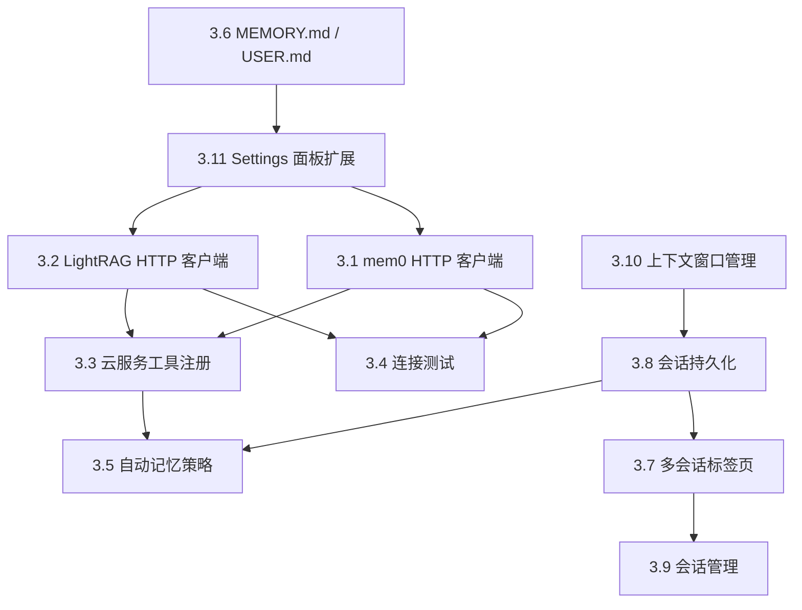
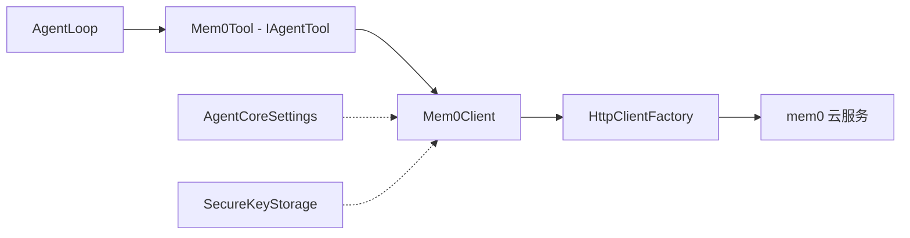
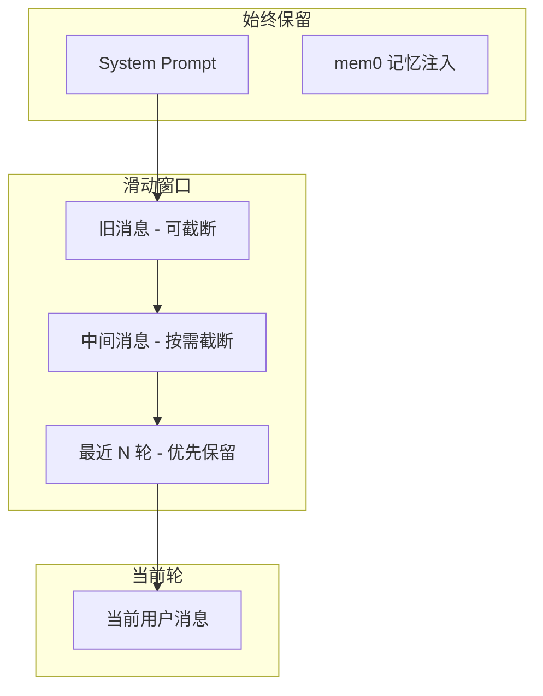

# Phase 3 — 能记忆（Memory & Session）详细实施计划

> **版本**: 1.0  
> **对应架构文档**: [ARCHITECTURE.md](./ARCHITECTURE.md) §4.4, §4.5, §5.4, §8  
> **前置依赖**: Phase 2.5（原生工具迁移）已完成  
> **核心目标**: 让 Agent 具备跨会话记忆能力、知识库检索能力、多会话管理和上下文窗口智能管理

---

## 1. 概述

### 1.1 Phase 3 定位

Phase 3 是 AgentCore 插件从"无状态对话工具"向"有记忆的智能助手"的关键跃迁。完成后，Agent 将具备：

- **跨会话记忆**：通过 mem0 云服务记住用户偏好、项目约定和历史决策
- **知识库检索**：通过 LightRAG 云服务对项目文档进行 RAG 检索
- **会话持久化**：对话历史保存到本地磁盘，重启 Unity 后可恢复
- **多会话管理**：支持多个独立会话标签页，可切换、重命名、删除
- **上下文窗口管理**：智能截断历史消息，确保不超出 LLM token 限制
- **自动记忆策略**：会话结束时自动提取关键信息存入长期记忆

### 1.2 关键约束

> **⚠️ 重要：mem0 和 LightRAG 是云端部署的容器服务。**
> 
> AgentCore 插件**仅通过 HTTP REST API** 连接这些服务，不负责本地部署容器。
> 用户只需在 Settings 面板配置：
> - 云服务 URL 端点（如 `https://mem0.example.com`）
> - API Key（通过 EditorPrefs 安全存储）
> 
> 连接测试按钮验证的是到云服务的网络连通性。

### 1.3 任务总览

| 任务编号 | 任务名称 | 描述 |
|---------|---------|------|
| 3.1 | mem0 HTTP 客户端 | 封装 mem0 云服务 REST API 调用 |
| 3.2 | LightRAG HTTP 客户端 | 封装 LightRAG 云服务 REST API 调用 |
| 3.3 | 云服务工具注册 | 将 mem0/LightRAG 封装为 IAgentTool 供 LLM 调用 |
| 3.4 | 连接测试 | Settings 面板中的云服务连通性验证 |
| 3.5 | 自动记忆策略 | 会话结束时自动提取摘要存入 mem0 |
| 3.6 | MEMORY.md / USER.md | Bootstrap 加载本地知识文件 |
| 3.7 | 多会话标签页 | ChatWindow 支持多个独立会话 Tab |
| 3.8 | 会话持久化 | 会话数据 JSON 序列化到本地磁盘 |
| 3.9 | 会话管理 | 重命名、删除、归档会话 |
| 3.10 | 上下文窗口管理 | Token 计数与滑动窗口截断 |
| 3.11 | Settings 面板扩展 | 激活 mem0/LightRAG 配置区域 |

### 1.4 任务依赖关系



---

## 2. 验收标准

### 2.1 功能验收

| # | 验收项 | 验证方法 |
|---|-------|---------|
| AC-1 | mem0 云服务连接成功，memory_add/memory_search/memory_list 工具可用 | Settings 面板 Test Connection 显示 OK；LLM 可调用 memory_add 存储记忆 |
| AC-2 | LightRAG 云服务连接成功，rag_query/rag_index_text 工具可用 | Settings 面板 Test Connection 显示 OK；LLM 可调用 rag_query 检索知识 |
| AC-3 | 会话数据持久化到 Library/AgentCore/sessions/ | 关闭 Unity 后重新打开，历史对话完整恢复 |
| AC-4 | 多会话标签页可切换 | 点击不同 Tab 切换会话，各会话独立互不干扰 |
| AC-5 | 会话可重命名、删除 | 右键菜单操作后 UI 和磁盘文件同步更新 |
| AC-6 | 上下文窗口不超限 | 长对话场景下 LLM 请求的 token 数不超过 contextWindowTokens 设置值 |
| AC-7 | 自动记忆策略生效 | 会话结束后，关键信息自动存入 mem0；新会话可检索到历史记忆 |
| AC-8 | MEMORY.md / USER.md 内容注入 System Prompt | 在项目根目录 AgentCore/ 下创建文件后，Agent 行为符合文件中的指示 |
| AC-9 | 云服务不可用时优雅降级 | mem0/LightRAG 关闭时，Agent 仍可正常对话，仅记忆/检索功能不可用 |

### 2.2 非功能验收

| # | 验收项 | 指标 |
|---|-------|------|
| NF-1 | 会话切换延迟 | < 200ms |
| NF-2 | 会话持久化写入 | < 500ms（50 轮对话） |
| NF-3 | mem0 API 调用超时 | 可配置，默认 10s |
| NF-4 | 上下文截断不丢失关键信息 | System Prompt 始终保留；最近 N 轮对话保留 |
| NF-5 | API Key 不泄露 | 不出现在日志、序列化文件或版本控制中 |

---

## 3. 技术设计

### 3.1 会话数据模型（SessionData）

会话是 Phase 3 的核心数据结构，承载对话历史、元数据和持久化状态。

#### 3.1.1 类设计

```csharp
// Editor/Session/SessionData.cs
namespace AgentCore.Editor.Session
{
    /// <summary>
    /// 会话数据模型 — 一个完整对话会话的所有状态。
    /// 可序列化为 JSON 持久化到磁盘。
    /// </summary>
    [Serializable]
    public class SessionData
    {
        /// <summary>会话唯一标识（GUID）</summary>
        public string Id { get; set; }

        /// <summary>会话显示名称（用户可修改）</summary>
        public string Name { get; set; }

        /// <summary>创建时间（UTC ISO 8601）</summary>
        public string CreatedAt { get; set; }

        /// <summary>最后活跃时间（UTC ISO 8601）</summary>
        public string LastActiveAt { get; set; }

        /// <summary>LLM 消息历史（system/user/assistant/tool）</summary>
        public List<SerializableChatMessage> Messages { get; set; }

        /// <summary>UI 对话轮次（供显示用）</summary>
        public List<SerializableConversationTurn> Turns { get; set; }

        /// <summary>会话状态：active / archived</summary>
        public string Status { get; set; }

        /// <summary>会话摘要（自动记忆策略生成）</summary>
        public string Summary { get; set; }

        /// <summary>消息总数（快速统计用）</summary>
        public int MessageCount { get; set; }
    }
}
```

#### 3.1.2 可序列化消息类型

```csharp
// Editor/Session/SerializableTypes.cs
namespace AgentCore.Editor.Session
{
    /// <summary>
    /// 可序列化的 ChatMessage — 用于 JSON 持久化。
    /// 与 LLM.ChatMessage 的转换通过 ToLLMMessage() / FromLLMMessage() 实现。
    /// </summary>
    [Serializable]
    public class SerializableChatMessage
    {
        public string role;       // system / user / assistant / tool
        public string content;
        public string tool_call_id;  // role=tool 时的 tool_call_id
        public List<SerializableToolCall> tool_calls;  // role=assistant 时的工具调用
    }

    [Serializable]
    public class SerializableToolCall
    {
        public string id;
        public string type;  // "function"
        public SerializableFunctionCall function;
    }

    [Serializable]
    public class SerializableFunctionCall
    {
        public string name;
        public string arguments;  // JSON string
    }

    [Serializable]
    public class SerializableConversationTurn
    {
        public string id;
        public string role;
        public string content;
        public string timestamp;
        public List<SerializableToolCallInfo> toolCalls;
    }

    [Serializable]
    public class SerializableToolCallInfo
    {
        public string id;
        public string toolName;
        public string arguments;
        public string result;
        public bool success;
        public double executionTimeMs;
    }
}
```

#### 3.1.3 JSON 持久化格式

会话文件存储在 `Library/AgentCore/sessions/` 目录下，文件名为 `{sessionId}.json`：

```json
{
  "id": "a1b2c3d4-e5f6-7890-abcd-ef1234567890",
  "name": "场景搭建助手",
  "createdAt": "2025-01-15T08:30:00Z",
  "lastActiveAt": "2025-01-15T09:45:00Z",
  "status": "active",
  "summary": null,
  "messageCount": 12,
  "messages": [
    { "role": "system", "content": "你是一个 Unity 开发助手..." },
    { "role": "user", "content": "帮我创建一个 3D 平台跳跃关卡" },
    {
      "role": "assistant",
      "content": "好的，我来帮你搭建...",
      "tool_calls": [
        {
          "id": "call_abc123",
          "type": "function",
          "function": {
            "name": "manage_gameobject",
            "arguments": "{\"action\":\"create\",\"name\":\"Platform1\"}"
          }
        }
      ]
    },
    { "role": "tool", "tool_call_id": "call_abc123", "content": "{\"success\":true}" }
  ],
  "turns": [
    { "id": "turn-001", "role": "user", "content": "帮我创建一个 3D 平台跳跃关卡", "timestamp": "2025-01-15T08:31:00Z" },
    { "id": "turn-002", "role": "assistant", "content": "好的，我来帮你搭建...", "timestamp": "2025-01-15T08:31:05Z" }
  ]
}
```

### 3.2 会话管理器（SessionManager）

```csharp
// Editor/Session/SessionManager.cs
namespace AgentCore.Editor.Session
{
    /// <summary>
    /// 会话管理器 — 管理所有会话的生命周期。
    /// 单例模式，负责会话的创建、加载、保存、切换和删除。
    /// </summary>
    public class SessionManager
    {
        /// <summary>会话存储目录</summary>
        private static readonly string SessionsDir = Path.Combine(
            "Library", "AgentCore", "sessions");

        /// <summary>会话索引文件（快速加载会话列表）</summary>
        private static readonly string IndexFile = Path.Combine(
            SessionsDir, "_index.json");

        /// <summary>已加载的会话缓存</summary>
        private readonly Dictionary<string, SessionData> _sessions;

        /// <summary>当前活跃会话 ID</summary>
        public string ActiveSessionId { get; private set; }

        /// <summary>会话变更事件</summary>
        public event Action<SessionEvent> OnSessionEvent;

        // --- 核心 API ---
        public SessionData CreateSession(string name = null);
        public SessionData GetSession(string sessionId);
        public void SwitchSession(string sessionId);
        public void SaveSession(string sessionId);
        public void DeleteSession(string sessionId);
        public void RenameSession(string sessionId, string newName);
        public void ArchiveSession(string sessionId);
        public List<SessionSummary> ListSessions();
        public void SaveAll();
    }
}
```

#### 3.2.1 会话索引文件

为避免每次启动都解析所有会话 JSON 文件，使用轻量级索引文件 `_index.json`：

```json
{
  "version": 1,
  "lastActiveSessionId": "a1b2c3d4-...",
  "sessions": [
    {
      "id": "a1b2c3d4-...",
      "name": "场景搭建助手",
      "createdAt": "2025-01-15T08:30:00Z",
      "lastActiveAt": "2025-01-15T09:45:00Z",
      "status": "active",
      "messageCount": 12
    }
  ]
}
```

#### 3.2.2 会话事件

```csharp
// Editor/Session/SessionEvent.cs
public enum SessionEventType
{
    Created,        // 新会话创建
    Switched,       // 切换到另一个会话
    Saved,          // 会话已保存
    Deleted,        // 会话已删除
    Renamed,        // 会话已重命名
    Archived,       // 会话已归档
    Restored        // 会话从磁盘恢复
}

public class SessionEvent
{
    public SessionEventType Type { get; }
    public string SessionId { get; }
    public string SessionName { get; }
    // 静态工厂方法...
}
```

### 3.3 mem0 HTTP 客户端

#### 3.3.1 架构定位

mem0 是云端部署的记忆服务，AgentCore 通过 HTTP REST API 与之交互。客户端封装所有 HTTP 调用细节，对上层提供简洁的 C# 异步 API。



#### 3.3.2 客户端实现

```csharp
// Editor/Cloud/Mem0Client.cs
namespace AgentCore.Editor.Cloud
{
    /// <summary>
    /// mem0 云服务 HTTP 客户端。
    /// 封装 mem0 REST API 调用，提供记忆的增删查操作。
    /// </summary>
    public class Mem0Client
    {
        private readonly string _baseUrl;
        private readonly string _apiKey;
        private readonly string _userId;

        public Mem0Client(string baseUrl, string apiKey, string userId)
        {
            _baseUrl = baseUrl?.TrimEnd('/') 
                ?? throw new ArgumentNullException(nameof(baseUrl));
            _apiKey = apiKey;
            _userId = userId;
        }

        /// <summary>从 AgentCoreSettings 创建客户端实例</summary>
        public static Mem0Client FromSettings()
        {
            var settings = AgentCoreSettings.instance;
            return new Mem0Client(
                settings.mem0Endpoint,
                SecureKeyStorage.GetMem0ApiKey(),
                settings.userId
            );
        }

        /// <summary>添加记忆</summary>
        public async Task<Mem0AddResponse> AddMemoryAsync(
            string content,
            Dictionary<string, string> metadata = null,
            CancellationToken ct = default)
        {
            var payload = new
            {
                messages = new[] { new { role = "user", content } },
                user_id = _userId,
                metadata
            };
            return await PostAsync<Mem0AddResponse>("/v1/memories/", payload, ct);
        }

        /// <summary>搜索记忆</summary>
        public async Task<Mem0SearchResponse> SearchMemoryAsync(
            string query,
            int limit = 10,
            CancellationToken ct = default)
        {
            var payload = new
            {
                query,
                user_id = _userId,
                limit
            };
            return await PostAsync<Mem0SearchResponse>("/v1/memories/search/", payload, ct);
        }

        /// <summary>列出所有记忆</summary>
        public async Task<Mem0ListResponse> ListMemoriesAsync(
            int limit = 50,
            CancellationToken ct = default)
        {
            var url = $"{_baseUrl}/v1/memories/?user_id={_userId}&limit={limit}";
            return await GetAsync<Mem0ListResponse>(url, ct);
        }

        /// <summary>删除记忆</summary>
        public async Task DeleteMemoryAsync(
            string memoryId,
            CancellationToken ct = default)
        {
            var url = $"{_baseUrl}/v1/memories/{memoryId}/";
            await DeleteAsync(url, ct);
        }

        /// <summary>测试连接</summary>
        public async Task<bool> TestConnectionAsync(CancellationToken ct = default)
        {
            try
            {
                var url = $"{_baseUrl}/v1/memories/?user_id={_userId}&limit=1";
                var client = HttpClientFactory.GetClient();
                using var request = HttpClientFactory.CreateRequest(
                    HttpMethod.Get, url, _apiKey);
                var response = await client.SendAsync(request, ct);
                return response.IsSuccessStatusCode;
            }
            catch
            {
                return false;
            }
        }

        // --- 内部 HTTP 辅助方法 ---
        private async Task<T> PostAsync<T>(string path, object payload, CancellationToken ct);
        private async Task<T> GetAsync<T>(string url, CancellationToken ct);
        private async Task DeleteAsync(string url, CancellationToken ct);
    }
}
```

#### 3.3.3 响应模型

```csharp
// Editor/Cloud/Mem0Models.cs
namespace AgentCore.Editor.Cloud
{
    [Serializable]
    public class Mem0AddResponse
    {
        public List<Mem0Memory> results;
    }

    [Serializable]
    public class Mem0SearchResponse
    {
        public List<Mem0Memory> results;
    }

    [Serializable]
    public class Mem0ListResponse
    {
        public List<Mem0Memory> results;
        public int count;
    }

    [Serializable]
    public class Mem0Memory
    {
        public string id;
        public string memory;
        public string user_id;
        public Dictionary<string, string> metadata;
        public string created_at;
        public string updated_at;
        public float? score;  // 搜索时的相关性分数
    }
}
```

### 3.4 LightRAG HTTP 客户端

#### 3.4.1 客户端实现

```csharp
// Editor/Cloud/LightRAGClient.cs
namespace AgentCore.Editor.Cloud
{
    /// <summary>
    /// LightRAG 云服务 HTTP 客户端。
    /// 封装 LightRAG REST API 调用，提供知识库的索引和查询操作。
    /// </summary>
    public class LightRAGClient
    {
        private readonly string _baseUrl;
        private readonly string _apiKey;

        public LightRAGClient(string baseUrl, string apiKey)
        {
            _baseUrl = baseUrl?.TrimEnd('/') 
                ?? throw new ArgumentNullException(nameof(baseUrl));
            _apiKey = apiKey;
        }

        /// <summary>从 AgentCoreSettings 创建客户端实例</summary>
        public static LightRAGClient FromSettings()
        {
            var settings = AgentCoreSettings.instance;
            return new LightRAGClient(
                settings.lightragEndpoint,
                SecureKeyStorage.GetLightRAGApiKey()
            );
        }

        /// <summary>查询知识库</summary>
        public async Task<RAGQueryResponse> QueryAsync(
            string query,
            string mode = "hybrid",
            int topK = 5,
            CancellationToken ct = default)
        {
            var payload = new
            {
                query,
                mode,    // naive / local / global / hybrid
                top_k = topK
            };
            return await PostAsync<RAGQueryResponse>("/query", payload, ct);
        }

        /// <summary>索引文本到知识库</summary>
        public async Task<RAGIndexResponse> IndexTextAsync(
            string text,
            string description = null,
            CancellationToken ct = default)
        {
            var payload = new
            {
                text,
                description
            };
            return await PostAsync<RAGIndexResponse>("/documents/text", payload, ct);
        }

        /// <summary>列出已索引文档</summary>
        public async Task<RAGDocListResponse> ListDocumentsAsync(
            CancellationToken ct = default)
        {
            return await GetAsync<RAGDocListResponse>($"{_baseUrl}/documents", ct);
        }

        /// <summary>测试连接</summary>
        public async Task<bool> TestConnectionAsync(CancellationToken ct = default)
        {
            try
            {
                var url = $"{_baseUrl}/health";
                var client = HttpClientFactory.GetClient();
                using var request = HttpClientFactory.CreateRequest(
                    HttpMethod.Get, url, _apiKey);
                var response = await client.SendAsync(request, ct);
                return response.IsSuccessStatusCode;
            }
            catch
            {
                return false;
            }
        }

        // --- 内部 HTTP 辅助方法 ---
        private async Task<T> PostAsync<T>(string path, object payload, CancellationToken ct);
        private async Task<T> GetAsync<T>(string url, CancellationToken ct);
    }
}
```

#### 3.4.2 响应模型

```csharp
// Editor/Cloud/LightRAGModels.cs
namespace AgentCore.Editor.Cloud
{
    [Serializable]
    public class RAGQueryResponse
    {
        public string response;
        public List<RAGSource> sources;
    }

    [Serializable]
    public class RAGSource
    {
        public string content;
        public string source;
        public float score;
    }

    [Serializable]
    public class RAGIndexResponse
    {
        public string status;
        public string document_id;
    }

    [Serializable]
    public class RAGDocListResponse
    {
        public List<RAGDocument> documents;
    }

    [Serializable]
    public class RAGDocument
    {
        public string id;
        public string description;
        public string created_at;
        public int chunk_count;
    }
}
```

### 3.5 云服务工具注册

将 mem0 和 LightRAG 客户端封装为 `IAgentTool`，通过 `[AgentTool]` 属性自动注册到 `ToolRegistry`，使 LLM 可以直接调用。

#### 3.5.1 mem0 工具

```csharp
// Editor/Tools/Cloud/MemoryTool.cs
namespace AgentCore.Editor.Tools.Cloud
{
    [AgentTool("memory",
        Description = "管理跨会话记忆。支持 add/search/list/delete 操作。" +
                      "add: 存储重要信息到长期记忆；" +
                      "search: 按语义搜索相关记忆；" +
                      "list: 列出所有记忆；" +
                      "delete: 删除指定记忆。",
        Category = "Cloud",
        RequiresMainThread = false)]
    public class MemoryTool : IAgentTool
    {
        public ToolMetadata Metadata => BuildMetadata();

        public async Task<ToolResult> ExecuteAsync(
            JObject parameters, CancellationToken ct = default)
        {
            // 检查 mem0 是否启用
            if (!AgentCoreSettings.instance.mem0Enabled)
                return ToolResult.Fail("mem0 记忆服务未启用。请在 Project Settings > AgentCore 中启用。");

            var action = parameters["action"]?.ToString();
            var client = Mem0Client.FromSettings();

            return action switch
            {
                "add" => await HandleAdd(client, parameters, ct),
                "search" => await HandleSearch(client, parameters, ct),
                "list" => await HandleList(client, parameters, ct),
                "delete" => await HandleDelete(client, parameters, ct),
                _ => ToolResult.Fail($"未知的 memory action: {action}")
            };
        }

        private ToolMetadata BuildMetadata()
        {
            var schema = JObject.Parse(@"{
                ""type"": ""object"",
                ""properties"": {
                    ""action"": {
                        ""type"": ""string"",
                        ""enum"": [""add"", ""search"", ""list"", ""delete""],
                        ""description"": ""操作类型""
                    },
                    ""content"": {
                        ""type"": ""string"",
                        ""description"": ""记忆内容 - add 时必填，search 时作为查询文本""
                    },
                    ""memory_id"": {
                        ""type"": ""string"",
                        ""description"": ""记忆 ID - delete 时必填""
                    },
                    ""limit"": {
                        ""type"": ""integer"",
                        ""description"": ""返回结果数量上限，默认 10""
                    }
                },
                ""required"": [""action""]
            }");

            return new ToolMetadata(
                "memory",
                "管理跨会话记忆（add/search/list/delete）",
                "Cloud",
                schema,
                requiresMainThread: false
            );
        }
    }
}
```

#### 3.5.2 LightRAG 工具

```csharp
// Editor/Tools/Cloud/KnowledgeTool.cs
namespace AgentCore.Editor.Tools.Cloud
{
    [AgentTool("knowledge",
        Description = "查询和管理项目知识库。支持 query/index/list 操作。" +
                      "query: 使用 RAG 检索相关知识；" +
                      "index: 将文本索引到知识库；" +
                      "list: 列出已索引的文档。",
        Category = "Cloud",
        RequiresMainThread = false)]
    public class KnowledgeTool : IAgentTool
    {
        public ToolMetadata Metadata => BuildMetadata();

        public async Task<ToolResult> ExecuteAsync(
            JObject parameters, CancellationToken ct = default)
        {
            if (!AgentCoreSettings.instance.lightragEnabled)
                return ToolResult.Fail("LightRAG 知识库未启用。请在 Project Settings > AgentCore 中启用。");

            var action = parameters["action"]?.ToString();
            var client = LightRAGClient.FromSettings();

            return action switch
            {
                "query" => await HandleQuery(client, parameters, ct),
                "index" => await HandleIndex(client, parameters, ct),
                "list" => await HandleList(client, parameters, ct),
                _ => ToolResult.Fail($"未知的 knowledge action: {action}")
            };
        }

        private ToolMetadata BuildMetadata()
        {
            var schema = JObject.Parse(@"{
                ""type"": ""object"",
                ""properties"": {
                    ""action"": {
                        ""type"": ""string"",
                        ""enum"": [""query"", ""index"", ""list""],
                        ""description"": ""操作类型""
                    },
                    ""query"": {
                        ""type"": ""string"",
                        ""description"": ""查询文本 - query 时必填""
                    },
                    ""text"": {
                        ""type"": ""string"",
                        ""description"": ""要索引的文本内容 - index 时必填""
                    },
                    ""mode"": {
                        ""type"": ""string"",
                        ""enum"": [""naive"", ""local"", ""global"", ""hybrid""],
                        ""description"": ""检索模式，默认 hybrid""
                    },
                    ""description"": {
                        ""type"": ""string"",
                        ""description"": ""文档描述 - index 时可选""
                    }
                },
                ""required"": [""action""]
            }");

            return new ToolMetadata(
                "knowledge",
                "查询和管理项目知识库（query/index/list）",
                "Cloud",
                schema,
                requiresMainThread: false
            );
        }
    }
}
```

### 3.6 上下文窗口管理

#### 3.6.1 设计思路

上下文窗口管理确保发送给 LLM 的消息总 token 数不超过 `contextWindowTokens` 设置值。采用**滑动窗口 + 优先级保留**策略：



#### 3.6.2 Token 计数器

```csharp
// Editor/Core/TokenCounter.cs
namespace AgentCore.Editor.Core
{
    /// <summary>
    /// Token 计数器 — 估算消息列表的 token 数量。
    /// 使用近似算法，无需依赖外部 tokenizer 库。
    /// </summary>
    public static class TokenCounter
    {
        /// <summary>
        /// 估算单条消息的 token 数。
        /// 规则：
        /// - 每条消息固定开销 4 tokens（role + 分隔符）
        /// - 中文字符：每字符约 1.5 tokens
        /// - 英文/数字：每 4 字符约 1 token
        /// - JSON/代码：每 3 字符约 1 token
        /// </summary>
        public static int EstimateTokens(string text)
        {
            if (string.IsNullOrEmpty(text)) return 0;

            int chineseChars = 0;
            int otherChars = 0;

            foreach (char c in text)
            {
                if (c >= 0x4E00 && c <= 0x9FFF) // CJK 统一汉字
                    chineseChars++;
                else
                    otherChars++;
            }

            return (int)(chineseChars * 1.5 + otherChars * 0.25) + 4;
        }

        /// <summary>
        /// 估算消息列表的总 token 数。
        /// </summary>
        public static int EstimateTotal(IReadOnlyList<ChatMessage> messages)
        {
            int total = 3; // 消息列表固定开销
            foreach (var msg in messages)
            {
                total += EstimateTokens(msg.Content);
                if (msg.ToolCalls != null)
                {
                    foreach (var tc in msg.ToolCalls)
                    {
                        total += EstimateTokens(tc.Function?.Name) + 
                                 EstimateTokens(tc.Function?.Arguments);
                    }
                }
            }
            return total;
        }
    }
}
```

#### 3.6.3 上下文窗口截断器

```csharp
// Editor/Core/ContextWindowManager.cs
namespace AgentCore.Editor.Core
{
    /// <summary>
    /// 上下文窗口管理器 — 在发送 LLM 请求前截断消息历史。
    /// 
    /// 截断策略（优先级从高到低）：
    /// 1. System Prompt — 始终保留（不可截断）
    /// 2. 最近 N 轮对话 — 优先保留（N 可配置，默认保留最近 3 轮）
    /// 3. 中间消息 — 从最旧的开始移除
    /// 4. 工具调用对 — tool_calls + tool response 必须成对移除
    /// </summary>
    public class ContextWindowManager
    {
        /// <summary>最少保留的最近对话轮次数</summary>
        public int MinRecentTurns { get; set; } = 3;

        /// <summary>预留给 LLM 输出的 token 数</summary>
        public int ReservedOutputTokens { get; set; } = 1024;

        /// <summary>
        /// 截断消息列表使其不超过 token 上限。
        /// </summary>
        /// <param name="messages">原始消息列表</param>
        /// <param name="maxTokens">token 上限（来自 AgentCoreSettings）</param>
        /// <returns>截断后的消息列表（新列表，不修改原始数据）</returns>
        public List<ChatMessage> TruncateToFit(
            List<ChatMessage> messages, int maxTokens)
        {
            int budget = maxTokens - ReservedOutputTokens;
            if (budget <= 0) budget = maxTokens / 2;

            // 1. 分离 System Prompt 和对话消息
            var systemMessages = new List<ChatMessage>();
            var conversationMessages = new List<ChatMessage>();

            foreach (var msg in messages)
            {
                if (msg.Role == "system")
                    systemMessages.Add(msg);
                else
                    conversationMessages.Add(msg);
            }

            // 2. 计算 System Prompt 占用的 token
            int systemTokens = TokenCounter.EstimateTotal(systemMessages);
            int remainingBudget = budget - systemTokens;

            if (remainingBudget <= 0)
            {
                // System Prompt 已超限，只保留 System Prompt
                return new List<ChatMessage>(systemMessages);
            }

            // 3. 从最旧的消息开始移除，直到总 token 数在预算内
            var result = TrimOldMessages(conversationMessages, remainingBudget);

            // 4. 合并 System Prompt + 截断后的对话
            var final = new List<ChatMessage>(systemMessages);
            final.AddRange(result);

            return final;
        }

        /// <summary>
        /// 从最旧的消息开始移除，保留最近的消息。
        /// 确保 tool_calls 和 tool response 成对移除。
        /// </summary>
        private List<ChatMessage> TrimOldMessages(
            List<ChatMessage> messages, int tokenBudget)
        {
            // 从后往前累加 token，找到可以保留的起始位置
            int totalTokens = 0;
            int keepFromIndex = messages.Count;

            for (int i = messages.Count - 1; i >= 0; i--)
            {
                int msgTokens = TokenCounter.EstimateTokens(messages[i].Content);
                if (totalTokens + msgTokens > tokenBudget)
                    break;
                totalTokens += msgTokens;
                keepFromIndex = i;
            }

            // 确保不会在 tool_calls 对中间截断
            keepFromIndex = AdjustForToolCallPairs(messages, keepFromIndex);

            // 构建结果
            var result = new List<ChatMessage>();
            if (keepFromIndex > 0)
            {
                // 添加截断提示
                result.Add(ChatMessage.System(
                    "[CONTEXT] 之前的对话历史已被截断以适应上下文窗口限制。" +
                    $"已移除 {keepFromIndex} 条较早的消息。"));
            }

            for (int i = keepFromIndex; i < messages.Count; i++)
            {
                result.Add(messages[i]);
            }

            return result;
        }

        /// <summary>
        /// 调整截断位置，确保不在 tool_calls 对中间截断。
        /// assistant(tool_calls) 和对应的 tool(response) 必须成对保留或移除。
        /// </summary>
        private int AdjustForToolCallPairs(List<ChatMessage> messages, int index)
        {
            if (index >= messages.Count) return index;

            // 如果截断位置落在 tool response 上，向前移动到对应的 assistant message
            while (index < messages.Count && messages[index].Role == "tool")
            {
                index--;
                if (index < 0) { index = 0; break; }
            }

            return Math.Max(0, index);
        }
    }
}
```

#### 3.6.4 集成到 AgentLoop

在 [`AgentLoop.CallLLMStreamAsync()`](Editor/Core/AgentLoop.cs:496) 中，发送消息前调用截断：

```csharp
// AgentLoop.cs — CallLLMStreamAsync 修改
private async Task<ChatMessage> CallLLMStreamAsync(
    ConversationTurn assistantTurn,
    List<ToolDefinition> tools,
    CancellationToken ct)
{
    // Phase 3: 上下文窗口截断
    var contextManager = new ContextWindowManager();
    var settings = AgentCoreSettings.instance;
    var truncatedMessages = contextManager.TruncateToFit(
        _messages, settings.contextWindowTokens);

    // 使用截断后的消息发送给 LLM
    SetState(AgentState.Streaming);
    var effectiveTools = (tools != null && tools.Count > 0) ? tools : null;

    var assistantMessage = await _fallbackRouter.ExecuteStreamWithRetryAsync(
        _llmClient,
        truncatedMessages,  // 使用截断后的消息
        chunk => OnStreamChunkReceived(chunk, assistantTurn, ct),
        tools: effectiveTools,
        ct: ct,
        onStatusUpdate: status => EmitEvent(AgentEvent.ErrorEvent($"[Retry] {status}"))
    );

    return assistantMessage;
}
```

### 3.7 自动记忆策略

#### 3.7.1 触发时机

自动记忆在以下场景触发：

1. **会话结束时**：用户关闭会话或切换到新会话
2. **达到轮次阈值时**：对话超过 N 轮（可配置，默认 10 轮）
3. **手动触发**：用户通过 UI 按钮手动保存记忆

#### 3.7.2 实现设计

```csharp
// Editor/Session/AutoMemoryStrategy.cs
namespace AgentCore.Editor.Session
{
    /// <summary>
    /// 自动记忆策略 — 会话结束时提取关键信息存入 mem0。
    /// </summary>
    public class AutoMemoryStrategy
    {
        /// <summary>触发自动记忆的最小对话轮次</summary>
        public int MinTurnsForAutoMemory { get; set; } = 3;

        /// <summary>
        /// 从会话中提取摘要并存入 mem0。
        /// 使用 LLM 生成摘要，然后通过 Mem0Client 存储。
        /// </summary>
        public async Task ExtractAndStoreAsync(
            SessionData session,
            ILLMClient llmClient,
            CancellationToken ct = default)
        {
            // 1. 检查是否满足触发条件
            if (!ShouldTrigger(session)) return;

            // 2. 检查 mem0 是否可用
            if (!AgentCoreSettings.instance.mem0Enabled) return;

            // 3. 构建摘要提取 prompt
            var summaryPrompt = BuildSummaryPrompt(session);

            // 4. 调用 LLM 生成摘要
            var summary = await GenerateSummaryAsync(llmClient, summaryPrompt, ct);
            if (string.IsNullOrEmpty(summary)) return;

            // 5. 存入 mem0
            var mem0Client = Mem0Client.FromSettings();
            await mem0Client.AddMemoryAsync(summary, new Dictionary<string, string>
            {
                ["source"] = "auto_memory",
                ["session_id"] = session.Id,
                ["session_name"] = session.Name
            }, ct);

            // 6. 更新会话摘要
            session.Summary = summary;

            Debug.Log($"[AgentCore] Auto-memory stored for session '{session.Name}'");
        }

        private bool ShouldTrigger(SessionData session)
        {
            // 对话轮次太少，不值得提取记忆
            var userTurns = session.Turns?.Count(t => t.role == "user") ?? 0;
            return userTurns >= MinTurnsForAutoMemory;
        }

        private string BuildSummaryPrompt(SessionData session)
        {
            var sb = new StringBuilder();
            sb.AppendLine("请从以下对话中提取关键信息，生成简洁的摘要。");
            sb.AppendLine("重点关注：用户偏好、项目约定、重要决策、技术方案。");
            sb.AppendLine("输出格式：每条信息一行，以 '- ' 开头。");
            sb.AppendLine("只输出摘要，不要其他内容。");
            sb.AppendLine();
            sb.AppendLine("--- 对话内容 ---");

            // 只取用户和助手的对话内容（跳过 system 和 tool）
            foreach (var turn in session.Turns ?? Enumerable.Empty<SerializableConversationTurn>())
            {
                if (turn.role == "user" || turn.role == "assistant")
                {
                    var content = turn.content?.Length > 500
                        ? turn.content.Substring(0, 500) + "..."
                        : turn.content;
                    sb.AppendLine($"[{turn.role}]: {content}");
                }
            }

            return sb.ToString();
        }
    }
}
```

### 3.8 MEMORY.md / USER.md 支持

当前 [`BootstrapLoader`](Editor/Bootstrap/BootstrapLoader.cs:23) 已实现 MEMORY.md 和 USER.md 的加载逻辑（见 `LoadUserFile()` 方法）。Phase 3 需要增强：

1. **首次运行自动创建模板文件**：在 `AgentCore/` 目录下创建带注释的模板
2. **文件变更监听**：使用 `FileSystemWatcher` 监听文件变更，自动重新加载
3. **Settings 面板中显示文件路径和状态**

#### 3.8.1 模板文件内容

```markdown
<!-- AgentCore/MEMORY.md -->
# 项目知识

> 在此文件中记录项目相关的知识和约定，Agent 会在每次对话开始时读取。
> 删除此注释块后开始编写你的内容。

<!-- 示例：
## 项目架构
- 使用 MVC 架构模式
- 所有脚本放在 Assets/Scripts/ 目录下

## 编码规范
- 使用 PascalCase 命名公共方法
- 所有 MonoBehaviour 脚本需要添加 XML 注释
-->
```

```markdown
<!-- AgentCore/USER.md -->
# 用户偏好

> 在此文件中记录你的个人偏好，Agent 会据此调整行为。
> 删除此注释块后开始编写你的内容。

<!-- 示例：
## 语言偏好
- 请用中文回复
- 代码注释使用英文

## 工作习惯
- 我偏好简洁的代码风格
- 修改代码前先解释方案
-->
```

#### 3.8.2 BootstrapLoader 增强

```csharp
// BootstrapLoader.cs 新增方法
/// <summary>
/// 确保用户文件目录和模板文件存在。
/// 首次运行时自动创建 AgentCore/ 目录和模板文件。
/// </summary>
public void EnsureUserFilesExist()
{
    var projectRoot = Directory.GetParent(Application.dataPath)?.FullName;
    if (projectRoot == null) return;

    var agentCoreDir = Path.Combine(projectRoot, "AgentCore");
    if (!Directory.Exists(agentCoreDir))
    {
        Directory.CreateDirectory(agentCoreDir);
    }

    EnsureTemplateFile(agentCoreDir, "MEMORY.md", MemoryTemplate);
    EnsureTemplateFile(agentCoreDir, "USER.md", UserTemplate);
}
```

### 3.9 多会话标签页 UI

#### 3.9.1 SessionTabBar 组件

```csharp
// Editor/UI/Components/SessionTabBar.cs
namespace AgentCore.Editor.UI.Components
{
    /// <summary>
    /// 会话标签栏 — 显示在 ChatWindow 顶部，支持多会话切换。
    /// </summary>
    public class SessionTabBar : VisualElement
    {
        /// <summary>标签页点击事件</summary>
        public event Action<string> OnTabSelected;

        /// <summary>新建会话按钮点击事件</summary>
        public event Action OnNewSessionRequested;

        /// <summary>标签页右键菜单事件</summary>
        public event Action<string, Vector2> OnTabContextMenu;

        private readonly ScrollView _tabContainer;
        private readonly Button _newTabButton;
        private string _activeTabId;

        public SessionTabBar()
        {
            // 构建 UI 结构
            style.flexDirection = FlexDirection.Row;
            style.height = 32;
            style.backgroundColor = new Color(0.18f, 0.18f, 0.18f);

            _tabContainer = new ScrollView(ScrollViewMode.Horizontal);
            _tabContainer.style.flexGrow = 1;
            Add(_tabContainer);

            _newTabButton = new Button(() => OnNewSessionRequested?.Invoke());
            _newTabButton.text = "+";
            _newTabButton.tooltip = "新建会话";
            Add(_newTabButton);
        }

        public void AddTab(string sessionId, string name, bool isActive = false);
        public void RemoveTab(string sessionId);
        public void SetActiveTab(string sessionId);
        public void RenameTab(string sessionId, string newName);
        public void RefreshTabs(List<SessionSummary> sessions, string activeId);
    }
}
```

#### 3.9.2 ChatWindow 集成

```csharp
// ChatWindow.cs 修改 — 添加 SessionTabBar
private SessionTabBar _sessionTabBar;
private SessionManager _sessionManager;

private void CreateGUI()
{
    // ... 现有代码 ...

    // Phase 3: 添加会话标签栏
    _sessionManager = new SessionManager();
    _sessionTabBar = new SessionTabBar();
    _sessionTabBar.OnTabSelected += OnSessionTabSelected;
    _sessionTabBar.OnNewSessionRequested += OnNewSessionRequested;
    _sessionTabBar.OnTabContextMenu += OnSessionTabContextMenu;

    // 插入到消息区域上方
    rootVisualElement.Insert(0, _sessionTabBar);

    // 加载会话列表
    RefreshSessionTabs();
}

private void OnSessionTabSelected(string sessionId)
{
    // 保存当前会话
    SaveCurrentSession();

    // 切换到目标会话
    _sessionManager.SwitchSession(sessionId);
    LoadSessionIntoUI(sessionId);
}

private void OnNewSessionRequested()
{
    SaveCurrentSession();
    var session = _sessionManager.CreateSession();
    _sessionManager.SwitchSession(session.Id);
    ResetAgentLoopForSession(session);
    RefreshSessionTabs();
}
```

#### 3.9.3 右键菜单

```csharp
private void OnSessionTabContextMenu(string sessionId, Vector2 position)
{
    var menu = new GenericMenu();
    menu.AddItem(new GUIContent("重命名"), false, () => ShowRenameDialog(sessionId));
    menu.AddSeparator("");
    menu.AddItem(new GUIContent("归档"), false, () => ArchiveSession(sessionId));
    menu.AddItem(new GUIContent("删除"), false, () => DeleteSessionWithConfirm(sessionId));
    menu.ShowAsContext();
}
```

### 3.10 Settings 面板扩展

#### 3.10.1 激活 mem0 / LightRAG 配置区域

当前 [`AgentCoreSettingsProvider`](Editor/Config/AgentCoreSettingsProvider.cs:14) 中 mem0 和 LightRAG 区域是禁用状态（`GUI.enabled = false`）。Phase 3 需要：

1. 移除 `GUI.enabled = false` 限制
2. 添加 API Key 设置（复用 LLM API Key 的 Set/Clear 模式）
3. 添加 Test Connection 按钮
4. 添加 User ID 配置

#### 3.10.2 修改后的 DrawMemoryServiceSection

```csharp
private string _mem0ApiKeyDisplay = "";
private string _mem0TestResult = "";
private bool _isMem0Testing = false;

private void DrawMemoryServiceSection()
{
    EditorGUILayout.LabelField("Memory Service - mem0", EditorStyles.boldLabel);

    EditorGUI.indentLevel++;
    EditorGUI.BeginChangeCheck();

    _settings.mem0Enabled = EditorGUILayout.Toggle(
        new GUIContent("Enabled", "启用 mem0 记忆服务"),
        _settings.mem0Enabled);

    GUI.enabled = _settings.mem0Enabled;

    _settings.mem0Endpoint = EditorGUILayout.TextField(
        new GUIContent("Endpoint", "mem0 云服务端点 URL"),
        _settings.mem0Endpoint);

    // API Key
    EditorGUILayout.BeginHorizontal();
    EditorGUILayout.PrefixLabel(new GUIContent("API Key", "mem0 服务的 API Key"));
    EditorGUILayout.LabelField(_mem0ApiKeyDisplay, GUILayout.Width(120));
    if (GUILayout.Button("Set", GUILayout.Width(40)))
    {
        var newKey = EditorInputDialog.Show("Set mem0 API Key", "Enter your mem0 API Key:", "");
        if (newKey != null)
        {
            SecureKeyStorage.SetMem0ApiKey(newKey);
            _mem0ApiKeyDisplay = string.IsNullOrEmpty(newKey) ? "(not set)" : "••••••••••••";
        }
    }
    if (GUILayout.Button("Clear", GUILayout.Width(50)))
    {
        SecureKeyStorage.SetMem0ApiKey("");
        _mem0ApiKeyDisplay = "(not set)";
    }
    EditorGUILayout.EndHorizontal();

    _settings.userId = EditorGUILayout.TextField(
        new GUIContent("User ID", "用户标识（用于记忆隔离）"),
        _settings.userId);

    // Test Connection
    EditorGUILayout.Space(5);
    EditorGUILayout.BeginHorizontal();
    GUILayout.Space(EditorGUI.indentLevel * 15);
    GUI.enabled = _settings.mem0Enabled && !_isMem0Testing;
    if (GUILayout.Button(_isMem0Testing ? "Testing..." : "Test Connection", GUILayout.Width(120)))
    {
        TestMem0Connection();
    }
    GUI.enabled = true;
    if (!string.IsNullOrEmpty(_mem0TestResult))
    {
        var style = new GUIStyle(EditorStyles.label);
        style.normal.textColor = _mem0TestResult.StartsWith("[OK]")
            ? new Color(0.2f, 0.8f, 0.2f) : Color.red;
        EditorGUILayout.LabelField(_mem0TestResult, style);
    }
    EditorGUILayout.EndHorizontal();

    GUI.enabled = true;

    if (EditorGUI.EndChangeCheck())
    {
        _settings.SaveSettings();
    }

    EditorGUI.indentLevel--;
}
```

#### 3.10.3 AgentCoreSettings 新增字段

```csharp
// AgentCoreSettings.cs 新增
// --- 会话配置 ---
[Header("Session")]
[Tooltip("启用会话持久化")]
public bool sessionPersistenceEnabled = true;

[Tooltip("自动记忆策略")]
public bool autoMemoryEnabled = true;

[Tooltip("触发自动记忆的最小对话轮次")]
public int autoMemoryMinTurns = 3;

// --- 上下文窗口 ---
[Tooltip("最少保留的最近对话轮次")]
public int minRecentTurns = 3;

[Tooltip("预留给 LLM 输出的 token 数")]
public int reservedOutputTokens = 1024;
```

---

## 4. Sprint 分解

### Sprint 3.A — 基础设施层（MEMORY.md + Settings + 云客户端）

| 步骤 | 任务 | 产出文件 | 依赖 |
|------|------|---------|------|
| 3.A.1 | MEMORY.md / USER.md 模板创建与 BootstrapLoader 增强 | `BootstrapLoader.cs`（修改） | 无 |
| 3.A.2 | AgentCoreSettings 新增字段 | `AgentCoreSettings.cs`（修改） | 无 |
| 3.A.3 | Settings 面板激活 mem0/LightRAG 区域 | `AgentCoreSettingsProvider.cs`（修改） | 3.A.2 |
| 3.A.4 | mem0 HTTP 客户端 + 响应模型 | `Mem0Client.cs`, `Mem0Models.cs` | 3.A.2 |
| 3.A.5 | LightRAG HTTP 客户端 + 响应模型 | `LightRAGClient.cs`, `LightRAGModels.cs` | 3.A.2 |
| 3.A.6 | 连接测试集成到 Settings 面板 | `AgentCoreSettingsProvider.cs`（修改） | 3.A.3, 3.A.4, 3.A.5 |

### Sprint 3.B — 云服务工具 + 上下文管理

| 步骤 | 任务 | 产出文件 | 依赖 |
|------|------|---------|------|
| 3.B.1 | MemoryTool（IAgentTool） | `MemoryTool.cs` | 3.A.4 |
| 3.B.2 | KnowledgeTool（IAgentTool） | `KnowledgeTool.cs` | 3.A.5 |
| 3.B.3 | BootstrapLoader 分类名更新 | `BootstrapLoader.cs`（修改） | 3.B.1, 3.B.2 |
| 3.B.4 | TokenCounter 实现 | `TokenCounter.cs` | 无 |
| 3.B.5 | ContextWindowManager 实现 | `ContextWindowManager.cs` | 3.B.4 |
| 3.B.6 | AgentLoop 集成上下文截断 | `AgentLoop.cs`（修改） | 3.B.5 |

### Sprint 3.C — 会话持久化 + 多会话 UI

| 步骤 | 任务 | 产出文件 | 依赖 |
|------|------|---------|------|
| 3.C.1 | SessionData + 可序列化类型 | `SessionData.cs`, `SerializableTypes.cs` | 无 |
| 3.C.2 | SessionManager 核心实现 | `SessionManager.cs` | 3.C.1 |
| 3.C.3 | SessionEvent 事件系统 | `SessionEvent.cs` | 3.C.1 |
| 3.C.4 | AgentLoop 会话集成（保存/恢复消息历史） | `AgentLoop.cs`（修改） | 3.C.2 |
| 3.C.5 | SessionTabBar UI 组件 | `SessionTabBar.cs`, `SessionTabBar.uss` | 3.C.2 |
| 3.C.6 | ChatWindow 多会话集成 | `ChatWindow.cs`（修改）, `ChatWindow.uxml`（修改） | 3.C.4, 3.C.5 |
| 3.C.7 | 会话管理（重命名/删除/归档） | `SessionManager.cs`（增强） | 3.C.6 |

### Sprint 3.D — 自动记忆 + 集成测试

| 步骤 | 任务 | 产出文件 | 依赖 |
|------|------|---------|------|
| 3.D.1 | AutoMemoryStrategy 实现 | `AutoMemoryStrategy.cs` | 3.B.1, 3.C.2 |
| 3.D.2 | 会话结束时触发自动记忆 | `SessionManager.cs`（修改）, `ChatWindow.cs`（修改） | 3.D.1 |
| 3.D.3 | 新会话启动时注入历史记忆 | `AgentLoop.cs`（修改） | 3.D.1 |
| 3.D.4 | 端到端集成测试 | 测试脚本 | 全部 |
| 3.D.5 | 优雅降级验证（云服务不可用） | 测试脚本 | 全部 |

---

## 5. Settings 面板扩展详细设计

### 5.1 面板布局

```
┌─────────────────────────────────────────────┐
│ AgentCore Settings                          │
├─────────────────────────────────────────────┤
│ LLM Configuration                           │
│   API Endpoint: [http://localhost:4000/v1 ] │
│   API Key: ••••••••••••  [Set] [Clear]      │
│   Model: [deepseek-chat                   ] │
│   Temperature: [====●=====] 0.7             │
│   Max Tokens: [4096                       ] │
│   [Test Connection]  [OK] Connected         │
├─────────────────────────────────────────────┤
│ Agent Behavior                              │
│   Max Tool Rounds: [====●=====] 50          │
│   Context Window: [8000                   ] │
│   Min Recent Turns: [3                    ] │  ← 新增
│   Reserved Output Tokens: [1024           ] │  ← 新增
│   ☑ Auto Compile Check                      │
│   ☑ Auto Console Capture                    │
│   ☑ Fallback Routing                        │
│   Max Consecutive Errors: [===●======] 5    │
├─────────────────────────────────────────────┤
│ Session                                     │  ← 新增区域
│   ☑ Session Persistence                     │
│   ☑ Auto Memory                             │
│   Auto Memory Min Turns: [3              ]  │
├─────────────────────────────────────────────┤
│ Bootstrap Files                             │
│   ☑ Enabled                                 │
│   ☑ Auto Project Context                    │
│   MEMORY.md: ✓ Found (AgentCore/MEMORY.md)  │  ← 新增状态显示
│   USER.md: ✗ Not found                      │  ← 新增状态显示
│   [Create Template Files]                   │  ← 新增按钮
├─────────────────────────────────────────────┤
│ Memory Service - mem0                       │  ← 激活
│   ☑ Enabled                                 │
│   Endpoint: [https://mem0.example.com     ] │
│   API Key: ••••••••••••  [Set] [Clear]      │
│   User ID: [default-user                  ] │
│   [Test Connection]  [OK] Connected         │
├─────────────────────────────────────────────┤
│ Knowledge Base - LightRAG                   │  ← 激活
│   ☑ Enabled                                 │
│   Endpoint: [https://rag.example.com      ] │
│   API Key: ••••••••••••  [Set] [Clear]      │
│   [Test Connection]  [OK] Connected         │
├─────────────────────────────────────────────┤
│ UI Preferences                              │
│   ☑ Streaming                               │
│   ☑ Show Tool Details                       │
├─────────────────────────────────────────────┤
│ About                                       │
│   Version: 0.3.0 (Phase 3)                  │
└─────────────────────────────────────────────┘
```

### 5.2 连接测试实现

```csharp
private void TestMem0Connection()
{
    _isMem0Testing = true;
    _mem0TestResult = "";

    AsyncHelper.RunAsync(async () =>
    {
        try
        {
            var client = Mem0Client.FromSettings();
            var success = await client.TestConnectionAsync();

            AsyncHelper.RunOnMainThread(() =>
            {
                _mem0TestResult = success
                    ? "[OK] Connected"
                    : "[FAIL] Service unreachable";
                _isMem0Testing = false;
            });
        }
        catch (Exception ex)
        {
            AsyncHelper.RunOnMainThread(() =>
            {
                _mem0TestResult = $"[FAIL] {ex.Message}";
                _isMem0Testing = false;
            });
        }
    });
}
```

---

## 6. 新增文件清单

| 文件路径 | 用途 | 所属 Sprint |
|---------|------|------------|
| `Editor/Cloud/Mem0Client.cs` | mem0 云服务 HTTP 客户端 | 3.A |
| `Editor/Cloud/Mem0Models.cs` | mem0 API 响应模型 | 3.A |
| `Editor/Cloud/LightRAGClient.cs` | LightRAG 云服务 HTTP 客户端 | 3.A |
| `Editor/Cloud/LightRAGModels.cs` | LightRAG API 响应模型 | 3.A |
| `Editor/Tools/Cloud/MemoryTool.cs` | mem0 记忆工具（IAgentTool） | 3.B |
| `Editor/Tools/Cloud/KnowledgeTool.cs` | LightRAG 知识库工具（IAgentTool） | 3.B |
| `Editor/Core/TokenCounter.cs` | Token 计数器 | 3.B |
| `Editor/Core/ContextWindowManager.cs` | 上下文窗口截断管理器 | 3.B |
| `Editor/Session/SessionData.cs` | 会话数据模型 | 3.C |
| `Editor/Session/SerializableTypes.cs` | 可序列化消息类型 | 3.C |
| `Editor/Session/SessionManager.cs` | 会话管理器 | 3.C |
| `Editor/Session/SessionEvent.cs` | 会话事件类型 | 3.C |
| `Editor/Session/AutoMemoryStrategy.cs` | 自动记忆策略 | 3.D |
| `Editor/UI/Components/SessionTabBar.cs` | 会话标签栏 UI 组件 | 3.C |
| `Editor/UI/Components/SessionTabBar.uss` | 会话标签栏样式 | 3.C |

**共 15 个新文件**

---

## 7. 修改文件清单

| 文件路径 | 修改内容 | 所属 Sprint |
|---------|---------|------------|
| [`Editor/Config/AgentCoreSettings.cs`](Editor/Config/AgentCoreSettings.cs) | 新增 session/autoMemory/contextWindow 配置字段 | 3.A |
| [`Editor/Config/AgentCoreSettingsProvider.cs`](Editor/Config/AgentCoreSettingsProvider.cs) | 激活 mem0/LightRAG 区域，添加 Session 区域，连接测试 | 3.A |
| [`Editor/Bootstrap/BootstrapLoader.cs`](Editor/Bootstrap/BootstrapLoader.cs) | 模板文件创建，Cloud 分类名，文件监听 | 3.A, 3.B |
| [`Editor/Bootstrap/BootstrapContext.cs`](Editor/Bootstrap/BootstrapContext.cs) | 无需修改（已支持 Memory/User 字段） | — |
| [`Editor/Core/AgentLoop.cs`](Editor/Core/AgentLoop.cs) | 集成 ContextWindowManager，会话保存/恢复，记忆注入 | 3.B, 3.C, 3.D |
| [`Editor/Core/MessageTypes.cs`](Editor/Core/MessageTypes.cs) | 新增 SessionChanged 等事件类型（可选） | 3.C |
| [`Editor/UI/ChatWindow.cs`](Editor/UI/ChatWindow.cs) | 集成 SessionTabBar，多会话切换，右键菜单 | 3.C |
| [`Editor/UI/ChatWindow.uxml`](Editor/UI/ChatWindow.uxml) | 添加 SessionTabBar 容器位置 | 3.C |
| [`Editor/UI/ChatWindow.uss`](Editor/UI/ChatWindow.uss) | 添加 SessionTabBar 相关样式 | 3.C |
| [`Editor/Tools/Cloud/.gitkeep`](Editor/Tools/Cloud/.gitkeep) | 删除（被实际文件替代） | 3.B |
| [`Editor/Session/.gitkeep`](Editor/Session/.gitkeep) | 删除（被实际文件替代） | 3.C |

**共 11 个修改文件**（含 2 个删除的 .gitkeep）

---

## 8. 测试计划

### 8.1 单元测试

| 测试项 | 测试内容 | 验证方法 |
|-------|---------|---------|
| UT-1 | TokenCounter 中英文混合估算 | 输入已知文本，验证 token 数在合理范围 |
| UT-2 | ContextWindowManager 截断逻辑 | 构造超限消息列表，验证截断后 token 数在预算内 |
| UT-3 | ContextWindowManager tool_calls 成对保留 | 构造含 tool_calls 的消息，验证不会在对中间截断 |
| UT-4 | SessionData JSON 序列化/反序列化 | 创建 SessionData，序列化后反序列化，验证数据一致 |
| UT-5 | SerializableChatMessage 与 ChatMessage 互转 | 双向转换验证数据不丢失 |
| UT-6 | SessionManager 创建/删除/重命名 | 调用 API 后验证内存和磁盘状态 |
| UT-7 | Mem0Client 请求构建 | Mock HTTP，验证请求 URL、Header、Body 正确 |
| UT-8 | LightRAGClient 请求构建 | Mock HTTP，验证请求 URL、Header、Body 正确 |
| UT-9 | AutoMemoryStrategy 触发条件 | 验证轮次不足时不触发，满足条件时触发 |
| UT-10 | BootstrapLoader 模板文件创建 | 验证首次运行创建模板，二次运行不覆盖 |

### 8.2 集成测试

| 测试项 | 测试内容 | 验证方法 |
|-------|---------|---------|
| IT-1 | mem0 端到端：add → search → delete | 配置真实 mem0 端点，执行完整 CRUD 流程 |
| IT-2 | LightRAG 端到端：index → query | 配置真实 LightRAG 端点，索引文本后查询 |
| IT-3 | 会话持久化：创建 → 关闭 Unity → 重新打开 → 恢复 | 验证对话历史完整恢复 |
| IT-4 | 多会话切换：创建 A → 对话 → 创建 B → 对话 → 切回 A | 验证各会话独立，切换后历史正确 |
| IT-5 | 上下文截断：50 轮长对话 | 验证 LLM 请求不超限，最近消息保留 |
| IT-6 | 自动记忆：对话 10 轮 → 关闭会话 → 新会话检索 | 验证记忆自动存储并可检索 |

### 8.3 降级测试

| 测试项 | 测试内容 | 预期行为 |
|-------|---------|---------|
| DG-1 | mem0 服务不可用 | Agent 正常对话，memory 工具返回友好错误 |
| DG-2 | LightRAG 服务不可用 | Agent 正常对话，knowledge 工具返回友好错误 |
| DG-3 | mem0 API Key 未设置 | Settings 面板提示，工具调用返回配置错误 |
| DG-4 | 会话文件损坏 | 跳过损坏文件，创建新会话，日志警告 |
| DG-5 | Library/AgentCore/ 目录不存在 | 自动创建目录 |
| DG-6 | 磁盘空间不足 | 保存失败时日志警告，不影响当前对话 |

---

## 9. 风险与缓解

| # | 风险 | 影响 | 概率 | 缓解措施 |
|---|------|------|------|---------|
| R-1 | mem0/LightRAG API 格式变更 | 客户端调用失败 | 低 | 响应模型使用宽松反序列化；版本号检查 |
| R-2 | 云服务网络延迟高 | 工具调用超时 | 中 | 可配置超时时间；异步非阻塞调用；超时后优雅降级 |
| R-3 | 会话文件过大（长对话） | 保存/加载缓慢 | 中 | 限制单会话最大消息数；归档旧消息；增量保存 |
| R-4 | Token 估算不准确 | 上下文超限或浪费 | 中 | 预留 10% 安全边际；支持用户手动调整 |
| R-5 | 多会话并发操作 | 数据竞争 | 低 | SessionManager 使用锁保护；UI 操作串行化 |
| R-6 | API Key 泄露 | 安全风险 | 低 | EditorPrefs 存储；日志中脱敏；不序列化到文件 |
| R-7 | 自动记忆摘要质量差 | 无用记忆堆积 | 中 | 精心设计摘要 prompt；用户可手动删除记忆 |
| R-8 | Unity 域重载导致状态丢失 | 会话数据丢失 | 中 | 关键操作后立即持久化；域重载后从磁盘恢复 |
| R-9 | BootstrapLoader 与 ToolAutoDiscovery 初始化顺序 | Cloud 工具未注册 | 低 | ToolAutoDiscovery 在 Initialize 中调用，确保 Cloud 工具已注册 |

---

## 附录 A：架构对应表

| Phase 3 任务 | ARCHITECTURE.md 章节 | 现有代码基础 |
|-------------|---------------------|-------------|
| 3.1 mem0 客户端 | §4.4.2 mem0 集成 | `HttpClientFactory.cs`, `SecureKeyStorage.cs` |
| 3.2 LightRAG 客户端 | §4.4.2 LightRAG 集成 | `HttpClientFactory.cs`, `SecureKeyStorage.cs` |
| 3.3 云服务工具 | §5.3 工具系统 | `IAgentTool.cs`, `AgentToolAttribute.cs`, `ToolAutoDiscovery.cs` |
| 3.4 连接测试 | §4.5 Settings | `AgentCoreSettingsProvider.cs` TestLLMConnection 模式 |
| 3.5 自动记忆 | §4.4.3 自动记忆策略 | 新增 |
| 3.6 MEMORY.md/USER.md | §5.4 Bootstrap Files | `BootstrapLoader.cs` LoadUserFile 已实现基础加载 |
| 3.7 多会话标签页 | §4.4.1 会话管理 | `ChatWindow.cs` 单会话 UI |
| 3.8 会话持久化 | §4.4.1 会话存储 | `Editor/Session/` 目录已预留 |
| 3.9 会话管理 | §4.4.1 会话生命周期 | 新增 |
| 3.10 上下文窗口 | §4.4.3 上下文窗口管理 | `AgentCoreSettings.contextWindowTokens` 已预留 |
| 3.11 Settings 扩展 | §4.5 Settings Schema | `AgentCoreSettings.cs` mem0/LightRAG 字段已预留 |

## 附录 B：目录结构变更

```
Editor/
├── Bootstrap/
│   ├── BootstrapContext.cs
│   ├── BootstrapLoader.cs          ← 修改：模板创建、文件监听
│   └── Resources/
│       ├── SOUL.md
│       └── TOOLS.md.template
├── Cloud/                           ← 新增目录
│   ├── Mem0Client.cs               ← 新增
│   ├── Mem0Models.cs               ← 新增
│   ├── LightRAGClient.cs           ← 新增
│   └── LightRAGModels.cs           ← 新增
├── Config/
│   ├── AgentCoreSettings.cs        ← 修改：新增字段
│   ├── AgentCoreSettingsProvider.cs ← 修改：激活区域
│   └── SecureKeyStorage.cs
├── Core/
│   ├── AgentLoop.cs                ← 修改：上下文截断、会话集成
│   ├── ContextWindowManager.cs     ← 新增
│   ├── MessageTypes.cs             ← 修改：新增事件类型
│   └── TokenCounter.cs             ← 新增
├── Session/
│   ├── AutoMemoryStrategy.cs       ← 新增
│   ├── SerializableTypes.cs        ← 新增
│   ├── SessionData.cs              ← 新增
│   ├── SessionEvent.cs             ← 新增
│   └── SessionManager.cs           ← 新增
├── Tools/
│   ├── Cloud/
│   │   ├── MemoryTool.cs           ← 新增
│   │   └── KnowledgeTool.cs        ← 新增
│   └── ...
└── UI/
    ├── ChatWindow.cs               ← 修改：多会话集成
    ├── ChatWindow.uxml             ← 修改：TabBar 容器
    ├── ChatWindow.uss              ← 修改：TabBar 样式
    └── Components/
        ├── SessionTabBar.cs        ← 新增
        └── SessionTabBar.uss       ← 新增
```
