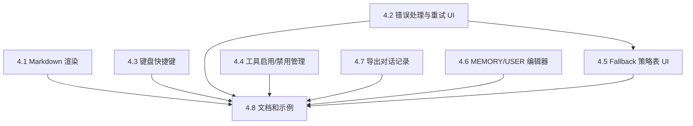

# Phase 4 — 更好用（UX Polish & Extensibility）详细实施计划

> **版本**: 2.0 | **完成日期**: 2026-05-07
> **对应架构文档**: [ARCHITECTURE.md](./ARCHITECTURE.md) §8 Phase 4
> **状态**: ✅ **已完成**（4.1 Markdown 渲染已决定不实现，当前段落可视化方案满足需求）
> **核心目标**: 打磨用户体验，提升专业度和可扩展性

---

## 1. 概述

### 1.1 Phase 4 定位

Phase 4 是 AgentCore 从"功能可用"到"体验优秀"的关键跃迁。完成后，用户将获得：

- **专业的 Markdown 渲染**：代码块语法高亮、列表、表格、链接可点击
- **清晰的错误反馈**：纠错过程可视化，手动重试按钮
- **高效的键盘操作**：Ctrl+Enter 发送、Esc 取消、Ctrl+N 新会话
- **灵活的工具管理**：按分类启用/禁用工具，减少 token 消耗
- **可视化策略配置**：Fallback 策略表 UI 编辑器
- **便捷的知识编辑**：MEMORY.md / USER.md 在 Settings 面板中直接编辑
- **对话导出**：导出为 Markdown / JSON 格式
- **完善的文档**：用户指南、API 文档

### 1.2 任务总览与优先级

| 优先级 | 任务编号 | 任务名称 | 复杂度 | 状态 |
|--------|---------|---------|--------|------|
| ~~P0~~ | ~~4.1~~ | ~~Markdown 渲染~~ | ~~高~~ | ❌ 已决定不实现（当前段落可视化满足需求） |
| P0 | 4.3 | 键盘快捷键完善 | 低 | ✅ 已完成 |
| P1 | 4.2 | 错误处理与重试 UI | 中 | ✅ 已完成 |
| P1 | 4.4 | 工具启用/禁用管理 | 中 | ✅ 已完成 |
| P1 | 4.7 | 导出对话记录 | 低 | ✅ 已完成 |
| P2 | 4.6 | MEMORY.md / USER.md 编辑器集成 | 低 | ✅ 已完成 |
| P2 | 4.5 | Fallback 策略表 UI 编辑器 | 中 | ✅ 已完成（FallbackRouter 实现） |
| P3 | 4.8 | 完善文档和示例 | 低 | ✅ 已完成（TOOLS.md.template 更新） |

### 1.3 任务依赖关系



### 1.4 建议实施顺序

**批次 A（基础体验）**: 4.3 键盘快捷键 → 4.7 导出对话 → 4.6 MEMORY/USER 编辑器  
**批次 B（核心渲染）**: 4.1 Markdown 渲染  
**批次 C（高级功能）**: 4.2 错误处理与重试 UI → 4.4 工具启用/禁用 → 4.5 Fallback 策略表  
**批次 D（收尾）**: 4.8 文档和示例

---

## 2. 验收标准

### 2.1 功能验收

| # | 验收项 | 验证方法 |
|---|-------|---------|
| AC-1 | 代码块有语法高亮 | Agent 回复包含 C# 代码块时，关键字/字符串/注释有不同颜色 |
| AC-2 | 表格正确渲染 | Agent 回复包含 Markdown 表格时，以表格形式显示而非纯文本 |
| AC-3 | 列表正确渲染 | 有序/无序列表有正确的缩进和标记 |
| AC-4 | 链接可点击 | URL 链接可点击在浏览器中打开 |
| AC-5 | 纠错过程有视觉反馈 | 工具失败 → 重试 → 成功的过程在 UI 中清晰可见 |
| AC-6 | 手动重试按钮可用 | 错误消息旁有重试按钮，点击后重新发送最后一条消息 |
| AC-7 | Ctrl+N 创建新会话 | 在 ChatWindow 聚焦时按 Ctrl+N 创建新会话 |
| AC-8 | 工具管理面板可用 | Settings 面板中可按分类启用/禁用工具组 |
| AC-9 | 禁用的工具不发送给 LLM | 禁用工具后，LLM 请求中不包含该工具的 function definition |
| AC-10 | Fallback 策略表可编辑 | Settings 面板中可查看和编辑 Fallback 策略 |
| AC-11 | MEMORY.md 可在 Settings 中编辑 | Settings 面板中有文本编辑区域，保存后文件更新 |
| AC-12 | 对话可导出为 Markdown | 右键菜单或按钮可导出当前会话为 .md 文件 |
| AC-13 | 对话可导出为 JSON | 右键菜单或按钮可导出当前会话为 .json 文件 |
| AC-14 | 用户文档完整 | README 或 Documentation~ 目录包含安装、配置、使用指南 |

---

## 3. 任务详细设计

### 3.1 Task 4.1 — Markdown 渲染

**目标**: 在 MessageBubble 中将 LLM 返回的 Markdown 文本渲染为富文本

**当前状态分析**:
- `MessageBubble.cs` 使用 `Label.text` 显示纯文本
- `StreamingTextElement.cs` 也是纯 `Label.text`
- Unity UI Toolkit 的 `Label` 支持 Rich Text（Unity 的子集 HTML 标签）
- Unity 2022.3 的 UI Toolkit **不支持**完整 HTML/CSS，只支持 `<b>`, `<i>`, `<color>`, `<size>` 等基础标签

**技术方案**:

由于 Unity UI Toolkit 不支持完整 HTML，需要自建 Markdown → VisualElement 转换器：

```
Markdown 文本
  → MarkdownParser（正则解析为 AST 节点列表）
    → MarkdownRenderer（AST 节点 → VisualElement 树）
      → 代码块 → CodeBlockElement（带语法高亮 + 复制按钮）
      → 表格 → TableElement（Grid 布局）
      → 列表 → ListElement（缩进 + 标记）
      → 段落 → Label（支持内联 bold/italic/code/link）
      → 链接 → Clickable Label（点击打开浏览器）
```

**新增文件**:
- `Editor/UI/Components/Markdown/MarkdownParser.cs` — Markdown → AST
- `Editor/UI/Components/Markdown/MarkdownRenderer.cs` — AST → VisualElement
- `Editor/UI/Components/Markdown/CodeBlockElement.cs` — 代码块组件（语法高亮）
- `Editor/UI/Components/Markdown/CSharpSyntaxHighlighter.cs` — C# 语法高亮
- `Editor/UI/Components/Markdown/TableElement.cs` — 表格组件
- `Editor/UI/Components/Markdown/Markdown.uss` — Markdown 样式

**修改文件**:
- `Editor/UI/Components/MessageBubble.cs` — 最终化时用 MarkdownRenderer 替代纯文本
- `Editor/UI/Components/StreamingTextElement.cs` — 流式输出完成后触发 Markdown 渲染

**Markdown 支持范围**（按优先级）:
1. **代码块** (\`\`\`language ... \`\`\`) — 最重要，C# 语法高亮
2. **内联代码** (\`code\`) — 等宽字体 + 背景色
3. **粗体/斜体** (**bold**, *italic*)
4. **标题** (## H2, ### H3)
5. **无序列表** (- item)
6. **有序列表** (1. item)
7. **链接** ([text](url))
8. **表格** (| col1 | col2 |)
9. **引用块** (> quote)

**流式渲染策略**:
- 流式输出期间：继续使用纯文本 Label（性能优先）
- 流式完成后（`FinalizeContent`）：将纯文本替换为 Markdown 渲染的 VisualElement 树
- 这样避免了流式过程中频繁重建 DOM 的性能问题

**C# 语法高亮方案**:
- 基于正则的轻量级高亮器（不需要完整的 Roslyn 解析）
- 高亮类别：关键字、字符串、注释、数字、类型名
- 使用 `<color=#xxx>` Rich Text 标签在 Label 中实现

---

### 3.2 Task 4.2 — 错误处理与重试 UI

**目标**: 让用户清晰看到错误和纠错过程，并提供手动重试能力

**当前状态分析**:
- `FallbackRouter.cs` 已有自动重试逻辑（最多 2 次）
- `ToolCallCard.cs` 已有 Failed 状态显示
- `ChatWindow.cs` 的 `ShowError()` 只是添加一个错误消息气泡
- 没有手动重试按钮
- 没有纠错过程的可视化（如"正在重试 1/3..."）

**技术方案**:

1. **错误消息增强**:
   - 错误气泡增加"重试"按钮
   - 点击重试按钮重新发送最后一条用户消息
   - 区分可重试错误（网络超时）和不可重试错误（API Key 无效）

2. **重试状态可视化**:
   - `FallbackRouter` 的 `onStatusUpdate` 回调已有，需要在 UI 中显示
   - 在 status-label 中显示"重试中 (1/3)..."
   - 重试成功后自动清除重试提示

3. **纠错循环可视化**:
   - 工具失败 → 显示失败原因 → LLM 自动修复 → 显示修复尝试
   - 在 ToolCallGroup 中添加"纠错轮次"指示器

**修改文件**:
- `Editor/UI/Components/MessageBubble.cs` — 错误气泡增加重试按钮
- `Editor/UI/ChatWindow.cs` — 处理重试按钮点击，显示重试状态
- `Editor/UI/Components/ToolCallGroup.cs` — 纠错轮次指示
- `Editor/Core/AgentLoop.cs` — 暴露重试状态事件

---

### 3.3 Task 4.3 — 键盘快捷键完善

**目标**: 补充缺失的键盘快捷键

**当前状态分析**:
- ✅ Enter 发送消息（已实现）
- ✅ Shift+Enter 换行（已实现）
- ✅ Escape 取消操作（已实现）
- ❌ Ctrl+N 新会话（未实现）
- ❌ Ctrl+Enter 发送（ARCHITECTURE.md 提到，但当前 Enter 就能发送）

**技术方案**:

在 `ChatWindow.cs` 的 `OnInputFieldKeyDown` 中添加：

```csharp
case KeyCode.N when evt.ctrlKey:
    evt.PreventDefault();
    evt.StopPropagation();
    OnNewSessionClicked();
    break;
```

同时考虑添加：
- `Ctrl+L` — 清空当前对话（等同于 ResetConversation）
- `Ctrl+Shift+S` — 导出对话（配合 4.7）

**修改文件**:
- `Editor/UI/ChatWindow.cs` — `OnInputFieldKeyDown()` 方法

---

### 3.4 Task 4.4 — 工具启用/禁用管理

**目标**: 用户可按分类控制哪些工具对 LLM 可见，减少 token 消耗

**当前状态分析**:
- `ToolRegistry.cs` 有 `GetToolsByCategory()` 方法
- `ToolDefinitionBuilder.cs` 有 `BuildByCategories()` 方法
- `AgentLoop.cs` 的 `BuildToolDefinitions()` 构建所有工具定义
- 没有持久化的启用/禁用状态
- 没有 UI 管理面板

**技术方案**:

1. **数据模型**:
   - 在 `AgentCoreSettings` 中添加 `disabledToolCategories` (List<string>)
   - 在 `AgentCoreSettings` 中添加 `disabledTools` (List<string>) — 单个工具级别

2. **过滤逻辑**:
   - `AgentLoop.BuildToolDefinitions()` 中过滤掉禁用的分类和工具
   - `BootstrapLoader.GenerateActiveToolsList()` 中同步过滤

3. **Settings UI**:
   - 在 `AgentCoreSettingsProvider` 中添加"工具管理"区域
   - 按分类分组显示，每个分类有 Toggle
   - 展开分类可看到单个工具的 Toggle
   - 显示每个分类的工具数量和预估 token 消耗

**新增/修改文件**:
- `Editor/Config/AgentCoreSettings.cs` — 添加禁用列表字段
- `Editor/Config/AgentCoreSettingsProvider.cs` — 添加工具管理 UI
- `Editor/Core/AgentLoop.cs` — `BuildToolDefinitions()` 过滤逻辑
- `Editor/Bootstrap/BootstrapLoader.cs` — `GenerateActiveToolsList()` 过滤逻辑

---

### 3.5 Task 4.5 — Fallback 策略表 UI 编辑器

**目标**: 可视化配置工具失败时的恢复策略

**当前状态分析**:
- `FallbackRouter.cs` 当前只是简单的重试逻辑
- 没有策略表数据结构
- ARCHITECTURE.md 中提到的 Fallback 策略表概念需要先实现数据层

**技术方案**:

1. **数据模型**:
   ```
   FallbackStrategy:
     - errorPattern: string (正则匹配错误消息)
     - toolName: string (可选，匹配特定工具)
     - action: enum (Retry / SuggestAlternative / AskUser / Skip)
     - hint: string (给 LLM 的恢复建议)
     - maxRetries: int
   ```

2. **内置策略**:
   - 编译错误 → 提示 LLM 读取 console 错误并修复
   - GameObject 未找到 → 提示 LLM 先用 find_gameobjects 搜索
   - 权限错误 → 提示用户手动处理
   - 网络超时 → 自动重试

3. **Settings UI**:
   - 表格形式显示所有策略
   - 支持添加/编辑/删除自定义策略
   - 内置策略标记为"默认"，不可删除但可禁用

**新增/修改文件**:
- `Editor/Core/FallbackStrategy.cs` — 策略数据模型
- `Editor/Core/FallbackRouter.cs` — 重构为基于策略表的路由
- `Editor/Config/AgentCoreSettings.cs` — 添加策略列表字段
- `Editor/Config/AgentCoreSettingsProvider.cs` — 策略表 UI

---

### 3.6 Task 4.6 — MEMORY.md / USER.md 编辑器集成

**目标**: 在 Settings 面板中直接编辑 MEMORY.md 和 USER.md

**当前状态分析**:
- `BootstrapLoader.cs` 的 `LoadUserFile()` 已支持从项目根目录或 AgentCore/ 子目录加载
- 用户目前需要手动创建和编辑这些文件
- Settings 面板没有编辑入口

**技术方案**:

1. **Settings UI**:
   - 在 Bootstrap 区域添加 MEMORY.md 和 USER.md 编辑区
   - 使用 `EditorGUILayout.TextArea` 多行文本编辑
   - "打开文件"按钮 — 在外部编辑器中打开
   - "创建模板"按钮 — 如果文件不存在，创建带注释的模板
   - "保存"按钮 — 将编辑内容写入文件
   - 显示文件路径和加载状态

2. **文件操作**:
   - 读取：复用 `BootstrapLoader.LoadUserFile()` 的路径查找逻辑
   - 写入：写入到项目根目录的 `AgentCore/` 子目录
   - 模板：提供带注释的默认模板内容

**修改文件**:
- `Editor/Config/AgentCoreSettingsProvider.cs` — 添加编辑 UI
- `Editor/Bootstrap/BootstrapLoader.cs` — 暴露文件路径查找方法为 public

---

### 3.7 Task 4.7 — 导出对话记录

**目标**: 将当前会话导出为 Markdown 或 JSON 文件

**当前状态分析**:
- `SessionData.cs` 有完整的数据模型（消息、工具调用、时间戳）
- `SessionStorage.cs` 已有 JSON 序列化
- 没有导出功能和 UI 入口

**技术方案**:

1. **导出格式**:
   - **Markdown**: 人类可读格式，包含角色标签、时间戳、工具调用摘要
   - **JSON**: 完整数据格式，可用于导入或分析

2. **UI 入口**:
   - 会话侧边栏右键菜单添加"导出"选项
   - 导出时弹出 SaveFilePanel 选择保存位置
   - 支持选择格式（Markdown / JSON）

3. **Markdown 导出格式**:
   ```markdown
   # AgentCore 对话记录
   
   **会话**: {title}
   **时间**: {createdAt} ~ {updatedAt}
   **消息数**: {messageCount}
   
   ---
   
   ## 用户 (14:30)
   在场景中创建一个红色立方体
   
   ## 助手 (14:30)
   好的，我来创建一个红色立方体。
   
   > **工具调用**: manage_gameobject (create) — 成功 (120ms)
   > **工具调用**: manage_material (create) — 成功 (85ms)
   
   红色立方体已创建在场景中。
   ```

**新增/修改文件**:
- `Editor/Session/SessionExporter.cs` — 导出逻辑
- `Editor/UI/ChatWindow.cs` — 右键菜单添加导出选项

---

### 3.8 Task 4.8 — 完善文档和示例

**目标**: 提供完整的用户文档，让新用户可独立上手

**文档结构**:
```
Documentation~/
  ├── README.md              # 快速开始指南
  ├── installation.md        # 安装配置
  ├── user-guide.md          # 使用指南
  ├── tool-reference.md      # 工具参考手册
  ├── memory-system.md       # 记忆系统说明
  ├── troubleshooting.md     # 常见问题
  └── changelog.md           # 变更日志（链接到 CHANGELOG.md）
```

**新增文件**:
- `Documentation~/` 目录下的所有文档文件
- 更新 `package.json` 的 `documentationUrl` 字段

---

## 4. 技术风险与缓解

| 风险 | 影响 | 缓解措施 |
|------|------|----------|
| Unity UI Toolkit 不支持完整 HTML | Markdown 渲染受限 | 自建 VisualElement 组件，不依赖 HTML |
| 代码块语法高亮性能 | 大代码块渲染卡顿 | 限制高亮行数（如 200 行），超出部分纯文本 |
| 流式输出期间 Markdown 渲染 | 频繁 DOM 重建导致卡顿 | 流式期间纯文本，完成后一次性渲染 |
| 工具禁用后 LLM 行为变化 | Agent 能力下降 | 禁用时显示警告，说明可能影响的功能 |
| Fallback 策略误配置 | 恢复建议不当 | 内置策略不可删除，自定义策略有验证 |
| MEMORY.md 编辑冲突 | 外部编辑器和 Settings 同时编辑 | 每次打开时重新读取，保存前检查文件修改时间 |

---

## 5. 实施批次详细计划

### 批次 A: 基础体验（低复杂度快速交付）

**4.3 键盘快捷键**
- 修改 `ChatWindow.OnInputFieldKeyDown()` 添加 Ctrl+N
- 添加全局快捷键注册（可选）

**4.7 导出对话记录**
- 新建 `SessionExporter.cs`
- 实现 Markdown 和 JSON 两种导出格式
- 在 ChatWindow 侧边栏右键菜单添加导出入口

**4.6 MEMORY.md / USER.md 编辑器**
- 在 `AgentCoreSettingsProvider` 的 Bootstrap 区域添加编辑 UI
- 实现文件读取/写入/模板创建

### 批次 B: 核心渲染（高复杂度核心功能）

**4.1 Markdown 渲染**
- 阶段 1: MarkdownParser — 正则解析为 AST 节点
- 阶段 2: 基础渲染 — 段落、粗体、斜体、内联代码
- 阶段 3: 代码块 — CodeBlockElement + C# 语法高亮
- 阶段 4: 列表和表格 — ListElement + TableElement
- 阶段 5: 链接和引用 — 可点击链接 + 引用块样式
- 阶段 6: 集成到 MessageBubble — 替换纯文本显示

### 批次 C: 高级功能

**4.2 错误处理与重试 UI**
- 错误气泡添加重试按钮
- 重试状态可视化
- 纠错循环指示器

**4.4 工具启用/禁用管理**
- Settings 数据模型扩展
- 过滤逻辑实现
- Settings UI 面板

**4.5 Fallback 策略表 UI**
- 策略数据模型
- 内置默认策略
- Settings UI 编辑器

### 批次 D: 收尾

**4.8 文档和示例**
- Documentation~ 目录结构
- 各文档内容编写
- package.json 更新
