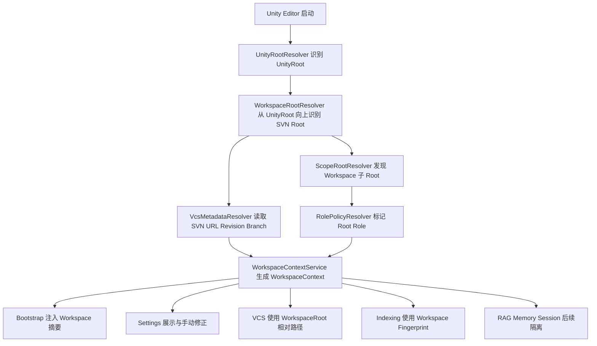

# AgentCore v0.9.0 P0 — Workspace 基础设施实施计划

> **目标版本**: v0.9.0
> **制定日期**: 2026-06-02
> **状态**: 设计草案，待用户确认
> **上游依据**: `enterprise-unity-workflow-requirements.md`, `codebase-indexing-phase1-plan.md`, `enterprise-agentcore-implementation-audit.md`, `ROADMAP.md`

---

## 1. 结论摘要

v0.9.0 不应先直接实现代码索引器。正确顺序是先实现 P0 Workspace 基础设施，使 AgentCore 能稳定回答并使用以下问题：

1. 当前 AgentCore WorkspaceRoot 是哪个 SVN 工作副本根？
2. 当前 UnityRoot 在 WorkspaceRoot 下哪个相对路径？
3. WorkspaceRoot 下有哪些默认 Scope Root？
4. 每个 Root 属于哪个 Scope 与 Role？
5. 当前 Branch / Revision / SVN URL 是什么？
6. 后续 VCS、RAG、Memory、FileSystem、Indexing、Bootstrap 是否都能拿到统一 WorkspaceContext？

只有这层基础完成后，v0.9.0 的文件级索引和符号检索才不会落入 UnityRoot-only 或 Assets-only 的旧假设。

---

## 2. 本阶段范围

### 2.1 本阶段要做

- 新增 Workspace 数据模型。
- 新增 WorkspaceRootResolver，从 UnityRoot 向上识别 SVN 工作副本根。
- 新增 UnityRootResolver，识别 Unity 工程根并输出相对 WorkspaceRoot 路径。
- 新增 ScopeRootResolver，发现 WorkspaceRoot 下的默认业务子 Root。
- 新增 WorkspaceContextService，提供统一 WorkspaceContext 快照。
- 新增 WorkspaceFingerprint，用于 Session、Memory、RAG、Indexing 后续隔离。
- 新增 Workspace Settings 页面或设置区，展示检测结果并允许用户手动修正 Scope Root。
- 改造 ProjectContextCollector，让 Bootstrap 能注入 WorkspaceRoot / UnityRoot / Scope Root 摘要。
- 改造 VcsDetector 的设计方向，使其后续可返回 WorkspaceRoot-relative 语义。
- 为后续 6.2.1 文件级索引与 6.2.2 符号检索提供稳定输入。

### 2.2 本阶段不做

- 不实现 SQLite 文件级索引。
- 不实现 Roslyn 符号抽取。
- 不深度改造所有 Native 工具。
- 不改造所有 RAG / Memory 元数据存储。
- 不实现资源包插件 Adapter 的实际接入。
- 不支持默认多独立 VCS Root。
- 不允许 WorkspaceRoot 外部任意目录默认进入 AgentCore 边界。

---

## 3. 当前代码事实

### 3.1 VCS 检测现状

当前 `VcsDetector` 从 `Application.dataPath` 推导 Unity 项目根：

```csharp
private static string GetProjectRootPath()
{
    // Unity 项目根目录（包含 Assets 文件夹的目录）
    var dataPath = Application.dataPath;
    return Directory.GetParent(dataPath)?.FullName ?? dataPath;
}
```

问题：如果真实结构是 `svn/project/branch/unity/Assets`，当前检测起点是 `svn/project/branch/unity`，不会明确建立上层 `svn/project/branch` 作为 WorkspaceRoot。

### 3.2 ProjectContextCollector 现状

当前 Bootstrap 项目上下文只输出 Unity 项目路径，并只展示 `Assets` 目录树：

```csharp
sb.AppendLine($"- **项目路径**: `{GetProjectPath()}`");
sb.AppendLine(GetDirectoryTree("Assets", 2));
```

问题：Agent 开局不知道 WorkspaceRoot、同级 `gamemodes/`、`tools/`、`plugins/`、`shared/` 等目录。

### 3.3 Settings 现状

`AgentCoreSettings` 当前没有 WorkspaceRoot / UnityRoot / Scope Root / Role / Branch 配置字段。

Settings UI 当前是 top-tab page 架构：

```csharp
_pages = new IAgentCoreSettingsPage[]
{
    new DashboardSettingsPage(),
    new ModelAgentSettingsPage(),
    new ContextMemorySettingsPage(),
    new ToolsExtensionsSettingsPage(),
    new UiDiagnosticsSettingsPage(),
};
```

建议新增 `WorkspaceSettingsPage`，不要把 Workspace 设置塞进现有 Provider 的业务逻辑里。

### 3.4 路径边界现状

当前多处仍是 UnityRoot-only：

- `ManageFileTool` 固定 ProjectRoot 为 `Application.dataPath/..`。
- `LightRAGTool` 文件索引限制在 Unity 项目根。
- `KnowledgeBasePanel` 文件选择限制在 Unity 项目根。
- `ToolHelpers.NormalizeAssetPath` 会把非 `Assets/` / `Packages/` 路径归入 `Assets/`。

本阶段只建立统一 Workspace 基础设施，不立即全量改造所有调用方。

---

## 4. 目标架构



---

## 5. 数据模型设计

### 5.1 WorkspaceContext

建议放置在主程序集：`Editor/Workspace/WorkspaceContext.cs`。

```csharp
namespace AgentCore.Editor.Workspace
{
    [Serializable]
    public sealed class WorkspaceContext
    {
        public string WorkspaceRoot { get; set; }
        public string UnityRoot { get; set; }
        public string UnityRootRelativePath { get; set; }
        public string Fingerprint { get; set; }
        public WorkspaceVcsInfo Vcs { get; set; }
        public List<WorkspaceRootInfo> Roots { get; set; } = new List<WorkspaceRootInfo>();
        public WorkspaceResolutionStatus Status { get; set; }
        public string ErrorMessage { get; set; }
    }
}
```

### 5.2 WorkspaceVcsInfo

```csharp
[Serializable]
public sealed class WorkspaceVcsInfo
{
    public WorkspaceVcsType Type { get; set; }
    public string RootPath { get; set; }
    public string Url { get; set; }
    public string RepositoryRoot { get; set; }
    public string BranchId { get; set; }
    public string Revision { get; set; }
    public bool IsWorkingCopy { get; set; }
}
```

说明：这里建议新建主程序集内的轻量 `WorkspaceVcsType`，避免主程序集依赖可选 VCS 组件程序集。

### 5.3 WorkspaceRootInfo

```csharp
[Serializable]
public sealed class WorkspaceRootInfo
{
    public string Id { get; set; }
    public string DisplayName { get; set; }
    public string AbsolutePath { get; set; }
    public string RelativePath { get; set; }
    public WorkspaceScopeType ScopeType { get; set; }
    public string ScopeName { get; set; }
    public WorkspaceRootRole Role { get; set; }
    public bool IsReadOnly { get; set; }
    public bool IsGenerated { get; set; }
    public bool IsEnabled { get; set; }
    public bool IsDetected { get; set; }
    public string Source { get; set; }
}
```

### 5.4 WorkspaceScopeType

```csharp
public enum WorkspaceScopeType
{
    Project,
    Map,
    Mode,
    Package,
    Shared,
    UI,
    Localization,
    Engine,
    Plugin,
    Tools,
    Generated,
    Unknown
}
```

### 5.5 WorkspaceRootRole

```csharp
public enum WorkspaceRootRole
{
    EditableProjectCode,
    SharedCode,
    WorkspacePackage,
    CommercialPlugin,
    CustomPlugin,
    EngineCode,
    ToolingCode,
    GeneratedCode,
    ReadOnlyReference
}
```

---

## 6. Resolver 设计

### 6.1 UnityRootResolver

职责：识别当前 Unity 工程根。

输入：`Application.dataPath`。

输出：

- `UnityRoot = Directory.GetParent(Application.dataPath)`。
- 校验存在 `Assets/`。
- 可选校验存在 `ProjectSettings/` 或 `Packages/manifest.json`。

### 6.2 WorkspaceRootResolver

职责：从 UnityRoot 向上识别 AgentCore WorkspaceRoot。

优先级：

1. 用户 Settings 显式配置的 WorkspaceRoot。
2. 从 UnityRoot 向上查找 SVN 工作副本根。
3. 若找不到 SVN，则回退到 UnityRoot，并标记 `Status = FallbackToUnityRoot`。

SVN 根识别策略：

- 优先使用 `svn info --xml` 或 `svn info` 解析 `Working Copy Root Path`。
- 如果命令不可用，再使用 `.svn` 目录向上探测。
- 注意 SVN 1.7+ 通常只有 working copy root 有 `.svn`，因此向上探测可作为 fallback。

### 6.3 VcsMetadataResolver

职责：读取轻量 VCS 元数据，供 WorkspaceFingerprint 使用。

SVN 元数据：

- Working Copy Root Path。
- URL。
- Repository Root。
- Revision。
- BranchId。

BranchId 建议先从 URL 提取：

- 若 URL 包含 `/branches/<name>`，BranchId = `branches/<name>`。
- 若 URL 包含 `/trunk`，BranchId = `trunk`。
- 若无法识别，BranchId = URL hash 或空。

### 6.4 ScopeRootResolver

职责：发现 WorkspaceRoot 下业务子 Root。

默认目录候选：

| 相对路径 | 默认 Scope | 默认 Role |
|---|---|---|
| `unity` | Project | EditableProjectCode |
| `unity/Assets` | Project | EditableProjectCode |
| `gamemodes` | Mode | WorkspacePackage |
| `maps` | Map | WorkspacePackage |
| `ui` | UI | EditableProjectCode |
| `localization` | Localization | ReadOnlyReference |
| `tools` | Tools | ToolingCode |
| `plugins` | Plugin | CommercialPlugin |
| `shared` | Shared | SharedCode |
| `engine` | Engine | EngineCode |
| `generated` | Generated | GeneratedCode |

规则：

- 只自动发现 WorkspaceRoot 内目录。
- 不递归扫描巨大资源目录，只记录顶层 Root 摘要。
- 用户可在 Settings 中启用、禁用、重命名、改 Scope、改 Role。
- WorkspaceRoot 外目录默认不允许，需要后续 ExtraAuthorizedRoot 机制。

### 6.5 WorkspaceFingerprintBuilder

Fingerprint 输入：

- WorkspaceRoot 绝对路径规范化结果。
- SVN URL。
- Repository Root。
- BranchId。
- Revision 或 Revision 策略。
- UnityRootRelativePath。
- 已启用 Scope Root 列表。
- Scope/Role 配置版本。

输出：短 hash，例如 SHA256 前 16 位。

用途：

- 未来本地索引数据库分库。
- 未来 Session/Memory/RAG metadata 隔离。
- UI 显示当前上下文是否变化。

---

## 7. Settings 设计

### 7.1 新增 WorkspaceSettingsPage

建议新增文件：`Editor/Config/Settings/Pages/WorkspaceSettingsPage.cs`。

加入 Settings Provider 页签：

```csharp
new WorkspaceSettingsPage(),
```

建议位置：Dashboard 之后、ModelAgent 之前。

### 7.2 页面内容

Workspace 页面分为以下卡片：

1. Workspace Overview
   - WorkspaceRoot。
   - UnityRoot。
   - UnityRootRelativePath。
   - VCS Type。
   - BranchId。
   - Revision。
   - Fingerprint。
   - Status。

2. Detection Actions
   - Refresh Workspace。
   - Clear Manual Override。
   - Open WorkspaceRoot。
   - Copy Workspace Summary。

3. Scope Roots
   - Root 列表。
   - Enabled toggle。
   - ScopeType dropdown。
   - Role dropdown。
   - ReadOnly 标记。
   - Source 标记。

4. Manual Overrides
   - 手动指定 WorkspaceRoot。
   - 手动指定 UnityRootRelativePath。
   - 添加 WorkspaceRoot 内的 Scope Root。
   - 删除用户手动添加的 Scope Root。

5. Safety Notes
   - 插件/引擎/Generated 默认只读或高风险。
   - WorkspaceRoot 外部目录暂不支持或需显式授权。

### 7.3 Settings 数据存放

建议两层存储：

1. `AgentCoreSettings` 仅存少量全局字段：
   - `workspaceAutoDetectEnabled`。
   - `workspaceRootOverride`。
   - `unityRootRelativePathOverride`。
   - `workspaceConfigVersion`。

2. `.agentcore/workspace.json` 存项目级规则：
   - Scope Root 配置。
   - Role 策略。
   - include/exclude。
   - resource package metadata adapter 占位。

说明：因为 `AgentCoreSettings` 位于用户 Preferences，不适合承载大量项目级 Root 规则；项目级规则应在 WorkspaceRoot 下，便于团队共享或按需版本化。

---

## 8. Bootstrap 改造设计

### 8.1 ProjectContextCollector 新增 Workspace 摘要

当前只收集 Unity 项目路径和 `Assets` 树。P0 应新增：

```markdown
### AgentCore Workspace
- WorkspaceRoot: `.../svn/project/branch`
- UnityRoot: `.../svn/project/branch/unity`
- UnityRoot Relative: `unity`
- VCS: SVN
- Branch: `branches/release-x`
- Revision: `123456`
- Fingerprint: `abc123...`

### Workspace Scope Roots
| Scope | Role | Relative Path | ReadOnly |
|---|---|---|---|
| Project | EditableProjectCode | unity/Assets | false |
| Mode | WorkspacePackage | gamemodes | false |
| Tools | ToolingCode | tools | false |
| Plugin | CommercialPlugin | plugins | true |
```

### 8.2 Token 控制

- Bootstrap 不打印巨大目录树。
- Scope Root 只列摘要。
- 目录树仍限制深度和数量。
- 对 `gamemodes/`、`maps/` 只显示顶层若干项和总数。

---

## 9. VCS 改造衔接设计

P0 Workspace 基础设施不要求立即完成完整 VCS UI 改造，但要提供接口让 VCS 后续接入。

### 9.1 VcsDetector 改造方向

当前 VCS 可选组件中的 `VcsDetector` 不应继续只持有 Unity 项目根。建议下一步改为：

- 主程序集 Workspace 层提供 `WorkspaceContextService.Current`。
- VCS 组件优先使用 `WorkspaceContext.WorkspaceRoot` 创建 Adapter。
- `GetVcsRootPath()` 返回 WorkspaceRoot，而不是 UnityRoot。
- 若 WorkspaceContext fallback 到 UnityRoot，则明确提示。

### 9.2 路径语义

- VCS Adapter 输入输出统一 WorkspaceRoot-relative。
- UI 展示 Scope Root 分组。
- 右键操作、diff、commit、revert 的确认文案包含 WorkspaceRoot、Branch、Scope、Role。

---

## 10. FileSystem / RAG / Memory / Indexing 衔接

本阶段只做基础输入，不全量改造所有调用方，但应定义后续接口：

### 10.1 WorkspacePathService

职责：统一路径解析。

核心方法：

```csharp
ResolveWorkspacePath(string workspaceRelativePath)
ResolveUnityAssetPath(string assetPath)
TryGetRootInfo(string workspaceRelativePath)
IsInsideWorkspace(string absolutePath)
IsInsideUnityRoot(string absolutePath)
GetRelativeToWorkspace(string absolutePath)
GetRelativeToUnityRoot(string absolutePath)
```

### 10.2 Tool Safety Policy

P0 可以先定义数据模型，后续逐步执行。

策略：

- EditableProjectCode 可读写。
- SharedCode 可读写但提示影响范围。
- WorkspacePackage 可读，写入需 Scope 明确。
- CommercialPlugin 默认只读。
- EngineCode 默认只读或强确认。
- ToolingCode 可读写但需提示构建影响。
- GeneratedCode 默认禁止写。
- ReadOnlyReference 禁止写。

### 10.3 Indexing 输入

索引器后续不再自行猜根目录，而是直接消费：

```csharp
WorkspaceContext context = WorkspaceContextService.GetCurrent();
IReadOnlyList<WorkspaceRootInfo> roots = context.Roots.Where(r => r.IsEnabled);
```

---

## 11. 建议文件清单

### 11.1 新增目录

```text
Editor/Workspace/
Editor/Workspace/Resolution/
Editor/Workspace/Config/
Editor/Workspace/Safety/
```

### 11.2 新增核心文件

```text
Editor/Workspace/WorkspaceContext.cs
Editor/Workspace/WorkspaceVcsInfo.cs
Editor/Workspace/WorkspaceRootInfo.cs
Editor/Workspace/WorkspaceScopeType.cs
Editor/Workspace/WorkspaceRootRole.cs
Editor/Workspace/WorkspaceResolutionStatus.cs
Editor/Workspace/WorkspaceContextService.cs
Editor/Workspace/WorkspaceFingerprintBuilder.cs
Editor/Workspace/WorkspacePathService.cs
```

### 11.3 新增 Resolver 文件

```text
Editor/Workspace/Resolution/UnityRootResolver.cs
Editor/Workspace/Resolution/WorkspaceRootResolver.cs
Editor/Workspace/Resolution/SvnWorkspaceInfoResolver.cs
Editor/Workspace/Resolution/ScopeRootResolver.cs
Editor/Workspace/Resolution/WorkspaceRootRoleResolver.cs
```

### 11.4 新增 Config 文件

```text
Editor/Workspace/Config/WorkspaceConfig.cs
Editor/Workspace/Config/WorkspaceConfigStorage.cs
Editor/Workspace/Config/WorkspaceRootOverride.cs
```

### 11.5 新增 Safety 文件

```text
Editor/Workspace/Safety/WorkspacePathPolicy.cs
Editor/Workspace/Safety/WorkspaceOperationRisk.cs
```

### 11.6 Settings UI 文件

```text
Editor/Config/Settings/Pages/WorkspaceSettingsPage.cs
```

### 11.7 修改文件

```text
Editor/Config/AgentCoreSettings.cs
Editor/Config/AgentCoreSettingsProvider.cs
Editor/Bootstrap/ProjectContextCollector.cs
Editor/VCS/Tools/VcsDetector.cs
Editor/VCS/Tools/VersionControlTool.cs
Editor/VCS/UI/VersionControlPanel.cs
```

说明：VCS 三个文件在 P0 可先做轻量接入或仅为后续改造预留接口；具体深度取决于用户确认的实现范围。

---

## 12. 实施步骤

### Step 1：建立 Workspace 数据模型

- 新增 WorkspaceContext。
- 新增 WorkspaceVcsInfo。
- 新增 WorkspaceRootInfo。
- 新增 Scope / Role / Status enum。
- 保持主程序集内零外部依赖。

验收：能在 Editor 测试代码中构建完整 WorkspaceContext 对象。

### Step 2：实现 UnityRootResolver

- 从 `Application.dataPath` 获取 UnityRoot。
- 校验 `Assets/` 存在。
- 校验 `ProjectSettings/` 或 `Packages/manifest.json`。
- 输出规范化正斜杠路径。

验收：在标准 Unity 项目中能返回正确 UnityRoot。

### Step 3：实现 WorkspaceRootResolver

- 从 UnityRoot 向上调用 SVN 信息解析。
- 优先解析 `svn info` 的 Working Copy Root Path。
- fallback 为 `.svn` 目录探测。
- fallback 为 UnityRoot 并标记状态。

验收：在 `svn/project/branch/unity/Assets` 结构下能返回 `svn/project/branch`。

### Step 4：实现 SVN 元数据解析

- 读取 URL。
- 读取 Repository Root。
- 读取 Revision。
- 提取 BranchId。
- 命令失败时返回降级状态，不阻塞 Unity Editor。

验收：能生成可显示的 SVN metadata；命令不可用时不会抛出未捕获异常。

### Step 5：实现 ScopeRootResolver

- 自动发现默认目录。
- 生成 Root ID。
- 标记 ScopeType / Role。
- 支持 Settings / workspace.json 覆盖。

验收：在包含 `unity/`、`gamemodes/`、`tools/` 的 WorkspaceRoot 中能列出对应 Root。

### Step 6：实现 WorkspaceFingerprintBuilder

- 输入 WorkspaceRoot、SVN metadata、UnityRootRelativePath、Scope Root 配置。
- 生成稳定短 hash。
- 配置变化时 hash 变化。

验收：切换 WorkspaceRoot 或 BranchId 后 fingerprint 变化。

### Step 7：实现 WorkspaceContextService

- 提供 `GetCurrent()`。
- 提供 `Refresh()`。
- 提供简单缓存。
- 提供错误状态。
- Domain Reload 后可重新解析，不依赖静态持久状态。

验收：Editor 任意模块可调用并得到同一份上下文快照。

### Step 8：实现 WorkspaceConfigStorage

- 支持读取 WorkspaceRoot 下 `.agentcore/workspace.json`。
- 文件不存在时使用默认自动发现配置。
- 支持保存用户修改。
- 不读取 WorkspaceRoot 外路径。

验收：Settings 修改 Scope Root 后可持久化并影响下一次解析。

### Step 9：新增 WorkspaceSettingsPage

- 加入 Settings 页签。
- 展示 Workspace Overview。
- 展示 Scope Root 列表。
- 支持刷新与复制摘要。
- 支持手动覆盖 WorkspaceRoot / UnityRootRelativePath。

验收：用户能在 Project Settings > AgentCore 中看到当前 WorkspaceRoot、UnityRoot、Branch、Scope Roots。

### Step 10：改造 ProjectContextCollector

- 注入 Workspace 摘要。
- 保留 Unity 项目信息。
- 不再只展示 `Assets` 作为唯一项目结构。
- 控制目录输出大小。

验收：Agent 启动时系统上下文包含 WorkspaceRoot 与 Scope Root 摘要。

### Step 11：VCS 轻量接入

- `VcsDetector` 优先从 WorkspaceContext 获取 WorkspaceRoot。
- 若 WorkspaceContext 不可用，保持旧逻辑 fallback。
- 后续完整 UI 改造仍单独计划。

验收：VCS root path 在 SVN 工作副本结构中指向 WorkspaceRoot。

### Step 12：验收与文档同步

- 更新 CHANGELOG 草稿。
- 更新 ROADMAP 任务状态草案。
- 记录已知限制。
- 形成进入 6.2.1 文件级索引的前置条件清单。

验收：用户确认 P0 Workspace 基础设施完成后，可以进入代码索引 Phase 1 实现。

---

## 13. 验收标准

### Round 1：标准 Unity 项目 fallback

- 无 SVN 工作副本时，WorkspaceRoot fallback 到 UnityRoot。
- 状态明确显示 fallback。
- 不影响现有 Chat、Settings、工具初始化。

### Round 2：SVN WorkspaceRoot 识别

- 在 `svn/project/branch/unity/Assets` 结构中打开 Unity。
- WorkspaceRoot 识别为 `svn/project/branch`。
- UnityRoot 识别为 `svn/project/branch/unity`。
- UnityRootRelativePath 显示为 `unity`。

### Round 3：Scope Root 自动发现

- `gamemodes/`、`maps/`、`tools/`、`plugins/`、`shared/` 等存在时被发现。
- 每个 Root 有 ScopeType、Role、RelativePath。
- Plugin / Generated 默认只读或高风险。

### Round 4：Settings 可视化与修正

- Project Settings 显示 Workspace Overview。
- 用户可刷新 WorkspaceContext。
- 用户可禁用某个 Root。
- 用户可修改 ScopeType / Role 并保存。

### Round 5：Bootstrap 注入

- 新建会话时 Agent 能看到 WorkspaceRoot、UnityRoot、Branch 和 Scope Root 摘要。
- 目录摘要不会输出巨大文件树。
- `Assets/` 不再被表达为全局边界。

### Round 6：VCS 轻量接入

- VCS 检测返回 WorkspaceRoot。
- VCS 状态路径语义为 WorkspaceRoot-relative 的后续改造提供输入。
- 旧标准项目仍可正常 fallback。

---

## 14. 风险与缓解

| 风险 | 影响 | 缓解 |
|---|---|---|
| SVN 命令不可用 | 无法读取 Working Copy Root Path 和 Revision | `.svn` 探测 fallback；状态显示命令不可用 |
| UnityRoot 相对路径不固定 | 自动发现可能不符合项目实际结构 | Settings 提供手动覆盖 |
| Scope Root 数量很大 | Bootstrap token 爆炸，Settings 卡顿 | 只列摘要，限制显示数量，延迟展开 |
| WorkspaceRoot 外目录被误纳入 | 安全风险 | 默认禁止，只允许后续显式授权 |
| VCS 可选组件与主程序集依赖倒置 | asmdef 破坏 | 主程序集只定义轻量 Workspace VCS info；VCS 组件单向依赖主程序集 |
| Settings 数据过多 | Preferences 污染，团队规则无法共享 | 大规则写入 `.agentcore/workspace.json` |
| 过早改造所有工具 | 范围失控 | P0 只建立基础设施和少量接入点 |

---

## 15. 后续衔接

P0 完成后，后续顺序建议：

1. **v0.9.0 P1 — 项目骨架文档**（WorkspaceSkeleton）：规则扫描生成 `.agentcore/workspace-skeleton.md`，通过 SVN 同步给团队，Bootstrap 注入骨架摘要，实现多人 LLM 项目认知一致。
2. **v0.9.1 — 6.2.1 文件级索引**：直接消费 WorkspaceContext 和 Scope Roots。
3. **v0.9.2 — 6.2.2 符号检索**：搜索结果标注 Scope / Root / Role / Branch。
4. VCS TreeView：WorkspaceRoot-relative 路径 + Scope 分组。
5. FileSystem 工具：从 UnityRoot-only 扩展为 WorkspaceRoot-aware。
6. RAG / Memory / Session：增加 WorkspaceFingerprint / Scope / Branch metadata。
7. Tool Safety Policy：根据 Role 执行只读、强确认、禁止写入策略。

---

## 15.1 v0.9.0 P1 — 项目骨架文档（WorkspaceSkeleton）设计说明

> **决策记录（2026-06-02）**: 采用「L1 规则骨架 + 人工补充说明」方案，不做预先 LLM 分析。
> 理由：LLM 仅凭目录名推断用途准确率有限，且生成内容可能不符合团队实际认知；规则分析是客观事实，人工补充的描述比 LLM 猜测更准确、更符合团队语言。

### 核心目标

解决多人协作中 LLM 项目认知不一致问题：每个开发者的 AgentCore 实例独立，但通过 VCS 共享的骨架文档，使所有人的 LLM 具备相同的项目结构认知基线。

### 机制设计

```
首次启动 AgentCore
  → 检测 .agentcore/workspace-skeleton.md 是否存在
  → 不存在：提示用户执行"生成项目骨架"
    → WorkspaceSkeletonAnalyzer 扫描 WorkspaceRoot 一级/二级目录
    → 按 ScopeRootResolver 规则标注 Scope / Role
    → 生成 workspace-skeleton.md（含空白"说明"列，供人工填写）
    → 提示用户：编辑说明列后通过 SVN commit 同步给团队
  → 存在：读取 workspace-skeleton.md
    → Bootstrap 注入 WORKSPACE_SKELETON 步骤（PROJECT 之后，MEMORY 之前）
    → LLM 具备项目骨架认知
```

### 骨架文档格式

```markdown
# Workspace 项目骨架

> **生成时间**: 2026-06-02
> **SVN Revision**: r12345
> **WorkspaceRoot**: /svn/project/branch-feature-x
> **版本**: 1

## Workspace 结构

| 目录 | Scope | Role | 说明（人工填写）|
|------|-------|------|----------------|
| unity/ | Project | EditableProjectCode | |
| gamemodes/ | Mode | WorkspacePackage | |
| maps/ | Map | WorkspacePackage | |
| shared/ | Shared | SharedCode | |
| tools/ | Tools | ToolingCode | |
| plugins/ | Plugin | CommercialPlugin | |
| engine/ | Engine | EngineCode | |
| generated/ | Generated | GeneratedCode | |

## 开发规范（人工填写）

<!-- 在此填写团队开发规范、命名约定、禁止操作等 -->

## 注意事项（人工填写）

<!-- 在此填写特殊规则、已知问题、新人须知等 -->
```

### 新增组件（P1 阶段）

| 组件 | 位置 | 职责 |
|------|------|------|
| `WorkspaceSkeletonAnalyzer` | `Editor/Workspace/Skeleton/` | 扫描 WorkspaceRoot，生成骨架数据 |
| `WorkspaceSkeletonDocument` | `Editor/Workspace/Skeleton/` | 骨架文档数据模型 |
| `WorkspaceSkeletonStorage` | `Editor/Workspace/Skeleton/` | 读写 `.agentcore/workspace-skeleton.md` |
| Bootstrap `WORKSPACE_SKELETON` 步骤 | `Editor/Bootstrap/BootstrapLoader.cs` | 加载骨架文档并注入 System Prompt |

### 与 P0 的关系

- P1 依赖 P0 的 `WorkspaceContextService` 和 `ScopeRootResolver` 提供 Scope/Role 标注
- P0 的 `WorkspaceSettingsPage` 预留"项目骨架"卡片入口（显示骨架状态、提供生成按钮）
- P0 的 `.agentcore/workspace.json` 与 P1 的 `.agentcore/workspace-skeleton.md` 共存于同一目录，均通过 SVN 同步

### 更新触发时机

| 触发方式 | 说明 |
|---------|------|
| 首次启动 | 检测到骨架文档不存在时提示 |
| 手动触发 | Settings 页面"重新生成骨架"按钮 |
| SVN 更新后 | 检测到 WorkspaceRoot 一级目录变化时提示（不自动，只提示） |

---

## 16. 推荐本次确认项

请重点确认以下设计点：

1. P0 是否只做 Workspace 基础设施，不直接做 SQLite 索引。
2. WorkspaceRootResolver 是否以 SVN Working Copy Root Path 为最高优先级。
3. UnityRoot 是否允许通过 Settings 手动覆盖相对路径。
4. 默认 Scope Root 列表是否符合目标项目目录习惯。
5. Role 默认策略是否足够保守。
6. `.agentcore/workspace.json` 是否可以作为项目级 Workspace 配置文件。
7. VCS 是否在 P0 只做轻量接入，完整 TreeView 改造后置。

---

## 17. 建议 CHANGELOG 草稿

```markdown
## [0.9.0] - 2026-06-02

### Added
- 新增 Workspace 基础设施，支持以 SVN 工作副本根作为 AgentCore WorkspaceRoot。
- 新增 UnityRoot / Scope Root / Role / Branch / WorkspaceFingerprint 数据模型。
- 新增 Workspace Settings 页面，展示当前 WorkspaceRoot、UnityRoot、VCS 信息和 Scope Roots。
- 新增 WorkspaceContextService，为代码索引、VCS、RAG、Memory 和工具系统提供统一上下文。

### Changed
- Bootstrap 项目上下文从 UnityRoot-only 摘要升级为 WorkspaceRoot-aware 摘要。
- VCS 检测规划从 Unity 项目根升级为 SVN WorkspaceRoot。
```

---

## 18. 文档结束
